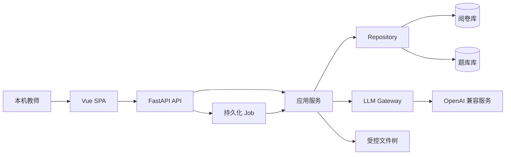

# 前后端现代化与功能演进总体方案（精简版）

> **文档性质：** 本文只保存长期产品方向、稳定技术选择和阶段顺序，不保存当前任务、测试数字或实现流水。
>
> 当前实现事实见 `ARCHITECTURE.md`；当前阶段与下一动作见 `docs/superpowers/packages/EXECUTION_INDEX.md`。

## 1. 已完成的现代化结果

Phase 0—3 已进入主线，当前共同基线包括：

- Windows 本机单用户应用，FastAPI 仅监听 loopback，并同源托管 Vue 3 SPA。
- 日常入口为 `运行.bat`；旧 Streamlit 日常 UI 和旧 CLI 已退役。
- 后端具有类型化 API、持久化 Job、统一模型调用边界和 Repository/迁移版本门。
- 两个 SQLite 数据库和 `user_data/` 文件树仍是业务数据边界。
- 题库、组卷、训练推荐、复核、报告、运维和只读知识图谱已进入 Vue 生产界面。
- 历史实现、迁移、测试、复审和验收过程由 Git/PR 历史保存；当前事实、长期决定和用户未结事项已迁入各自权威入口。

## 2. 当前优先级：P3.5 人机共创改进

当前不推进 Phase 4，先让用户基于真实使用继续改进现有应用。

P3.5 的目标是：

1. 用户逐批提出实际界面、流程和功能改进。
2. Codex 直接修改真实应用，不制作样板页，不拆执行包。
3. 可以按需启动或构建给用户查看，用户反馈后继续调整。
4. 本阶段不设置自动测试、代码复审或 integration 门槛。
5. 用户整体满意后冻结，只统一精简一次。
6. 用户最终人工确认后，才 push、创建 PR、合并并同步 `main`。

P3.5 使用长期分支 `codex/p3.5-interactive-refinement`。它不会自动改变评分规则、数据语义、安全边界、费用或真实数据授权。

## 3. 稳定技术与产品决定

- 前端：Vue 3 + TypeScript + Vite + Element Plus + Pinia + ECharts。
- 后端：FastAPI + Uvicorn，单进程、loopback、本机同源托管。
- 发布：工作机不要求 Node；发布包携带已构建的 `frontend/dist`。
- 数据：维持阅卷库、题库库和受控文件树；迁移是 Schema 变更的唯一入口。
- 模型：统一经过现有模型 Gateway；模型、费用、超时和重试语义不得因界面调整被隐式改变。
- 活动知识语义：继续以题库当前精确 `knowledge_point` 标签为主，不恢复已退役的旧技能/概念体系。
- 视觉：`docs/ui/STYLE.md` 只定义视觉和可访问性，不替代业务来源。
- 用户体验：允许重组导航、页面、布局和操作步骤，但必须保留业务结果、数据语义、安全、失败恢复、幂等和审计边界。

## 4. 后续路线

### Phase 4 — 知识图谱 2.0 与训练闭环

**当前状态：`paused`。**

如果用户以后明确恢复，长期方向仍包括：

- 在精确标签之上建立教师确认的关系层。
- 提供层级/先修关系、班级与学生视图及证据下钻。
- 在保持旧口径可对照的前提下评估时间衰减和样本置信度。
- 把真实训练结果回流到掌握度和下一次推荐。

暂停期间不得创建 Phase 4 Schema、执行模型建议、写入真实关系数据或实现训练回流。

### Phase 5 — 教师命题训练

方向是支持教师从构思、编辑、AI 辅助评审到题库发布的训练流程。正式开发前仍需先做工作流确认、编辑器和评估实验；是否启动由用户在前置阶段完成后决定。

### Phase 6 — 班主任学生画像

继续延后。该方向涉及未成年人敏感信息，只有用户重新启动并明确数据治理、合规、删除、导出和 AI 内容边界后才允许设计或实现。

## 5. 目标架构

架构继续遵循：

- UI 不直接访问数据库或内部文件路径。
- API/router 保持薄，业务规则留在服务/领域模块。
- Repository 负责连接、事务和映射，migration 负责 Schema。
- 长任务通过 Job 暴露进度、取消、失败和恢复。
- 模型调用集中管理超时、重试、节流、用量和脱敏诊断。

## 6. 安全与授权

以下内容在所有阶段都需要逐次明确授权：

- 读取、复制、修改、迁移或删除真实 `user_data/`。
- 真实模型调用、密钥使用、费用额度和失败重试。
- 数据库迁移、批量覆盖、永久删除和其他不可逆操作。
- push、PR、合并、同步主线或丢弃未合并历史。

真实数据不得进入 Git、stash、文档、日志或公开 API 响应。任何获准的数据写入或不可逆操作都要先明确目标、备份和回退。

## 7. 阶段恢复

P3.5 完成并进入主线后，由用户决定继续改进、恢复 Phase 4，或调整长期路线。恢复正式 Phase 时必须基于当时源码重新冻结范围和验收，不复用已经退休的历史即时计划。
