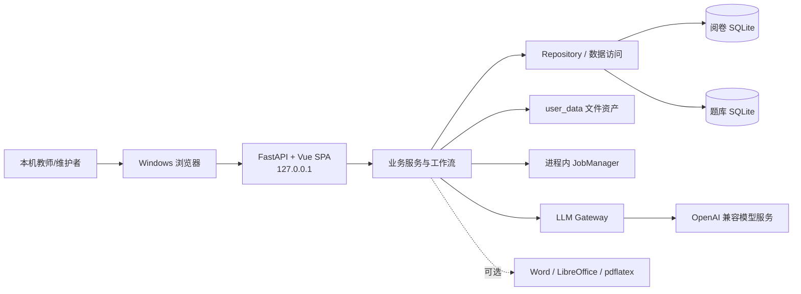

# AI 阅卷系统当前架构

> 本文只记录当前系统事实、长期业务不变量和已知限制。动态执行包状态以
> `docs/superpowers/packages/EXECUTION_INDEX.md` 为准；历史设计、逐包实施过程和测试数字不在本文重复。

## 1. 当前边界

- 当前版本以根目录 `VERSION` 为准，产品是运行在受信任 Windows 工作机上的本机单用户应用。
- 唯一日常入口是 `运行.bat`。它检查已构建的 `frontend/dist`，应用待重启的受保护运维操作，再启动
  `backend.api.launcher`。
- FastAPI 默认监听 `127.0.0.1:8000`，同源托管 Vue 3 SPA 和全部业务 API。浏览器不直接访问数据库、
  任意本机路径或模型供应商。
- 在 linked worktree 中复用主项目便携 Python 时，`运行.bat` 必须通过项目引导器显式加载当前工作树代码；
  验收工作树默认使用 `8035` 和自身数据、运维状态及模型配置，不能回落到主项目页面或数据。
- 旧 Streamlit 日常 UI、旧桌面启动器和旧 CLI 批改入口已经退役。历史正式验收工具仍可在不含真实数据的
  隔离副本中启动 Streamlit，因此相关测试依赖在该工具退役前保留。
- 当前没有应用级账号、角色或权限系统；安全边界依赖 Windows 账户、受信任工作机和 loopback 监听。
  改为局域网、公网、多用户或多机共享前，必须重新设计认证、授权、CSRF、审计和数据隔离。
- Phase 3、P3.5、F0 和 P4 已完成并进入主线；P4 已交付知识关系、掌握度 v2、联合题目分析、
  判定点版本审核、个性化推荐、冻结训练卷、扫描归卷、独立整卷训练判定、教师复核、训练证据回流、
  个人反馈和下一轮草稿。班主任工作台 B01—B11 已在独立 B 工作树通过自动测试、正式复审和
  16 步隔离合成页面验收；用户已于 2026-07-31 明确确认 B 验收通过并授权完整集成发布流程；包含
  P4 的最新 `main` 已合入，P4/B 组合后端 341 项和前端完整验证通过；B 已通过 PR #112 合入云端
  `main`，合入提交为 `52fbde5c`，本地 `main` 也已安全快进到该提交。P4 与 B 继续保持本文记录的
  双库、文件、模型和普通考试语义；尚未接触真实学生数据或真实模型。
- A 备课工作台 A01—A11 已在独立 A 工作树通过自动化、正式双复审、真实资料/WPS R4 代表课件
  验收和 A11-R2 隔离页面人工验收；用户已授权合入本地与云端 `main`。源课件未覆盖；本次发布只包含
  代码、测试、迁移和文档，不包含任何真实资料、数据库、模型调用、WPS 执行或验收产物。

## 2. 系统上下文

系统主要提供：

1. 考试草稿、试卷来源解析、评分依据生成与人工编辑；
2. 样卷、答题区、答卷上传、扫描预检、学生匹配和批改运行；
3. 按题批量复核、单份证据深查、教师调分、批注和报告导出；
4. 学生名单、题库、组卷、精确标签诊断、知识图谱和训练任务；
5. 自检、备份、恢复、迁移、数据包导入导出和受控文件下载。

## 3. 模块与依赖

| 边界 | 当前职责 | 长期约束 |
|---|---|---|
| `frontend/` | Vue 页面、Pinia 状态、统一 API Client、设计 Token 和浏览器验证 | 页面只调用同源 `/api/`；复杂业务规则不在浏览器重写 |
| `backend/api/` | 路由、公开 Schema、统一错误、静态托管、应用生命周期和依赖组装 | 公开数据使用允许列表；错误不回显路径、密钥、正文或原始异常 |
| 业务服务 | 配置、模板、扫描、批改、复核、报告、题库、训练、图谱和运维编排 | 服务不依赖 Vue/DOM；跨资源操作显式处理冲突、部分成功和恢复 |
| `backend/repositories/` | 阅卷库连接所有权、事务和命名仓储 | 正式调用方经 `GradingRepositoryAccess` 使用仓储；事务边界不可散落回页面 |
| `db_manager.py` | 兼容门面、备份、非 DDL 维护、跨域兼容编排和少量尚未抽取的聚合 SQL | 只由单一兼容组装点创建；不得重新成为所有新功能的万能入口 |
| `question_bank/` | 题库连接、标签、题目、频次、预览、组卷和训练数据访问 | 题库服务仍拥有自己的数据访问边界；不与阅卷库建立跨库外键 |
| Job 子系统 | 持久 Job 状态、进程内线程池、进度、取消、重试和受控产物发布 | 没有独立 Worker；进程退出后任务不续跑；取消必须在安全边界确认 |
| `backend/workspaces/ai_tasks/` | 教师工作台 AI Task、Handoff、发送证据、重启恢复和逐项采用协调 | 共同库只保存安全元数据；A/B 正文、prompt、模型原文和正式对象仍归领域库；一个 operation 最多保留一次发送尝试 |
| `backend/llm/` | 传输、超时、错误分类、有限重试、节流、请求标识和脱敏用量 | 正式模型调用必须经过 Gateway 或其兼容门面；不得新增无超时或无限重试直连 |
| `PathManager` 和文件服务 | 持久目录解析、旧路径兼容、受控根和文件发布 | 新持久路径只经 `PathManager`；客户端永不提交服务器绝对路径 |
| 工作台注册器 | A/B 的前端 manifest、后端 feature、路由、迁移、Job 和模型安全插槽 | A 默认关闭；B 入口已启用。任一模块禁用时不显示入口、不注册 API/Job、不创建目录或数据库；只有教师显式初始化才创建受保护目录和数据库 |
| `backend/teaching_prep/` | A 备课工作台的领域模型、应用服务、只读证据适配、WPS 隔离执行、上课包和独立 API | 默认关闭；只写 A 独立数据库和受控目录，不覆盖源 PPTX，不读取 B，不写入 P4 |

当前仍存在的兼容现实：

- 两个 SQLite 数据库之间只有应用层 ID 和快照关联，没有跨库事务或外键。
- 题库部分服务直接执行 SQL；它不是阅卷库 Repository 的子模块。
- `DBManager`、配置生成和若干扫描/批改模块仍较大，但 P3.5 不做一次性重写。
- 题目服务与频次服务仍有由延迟导入维持的循环耦合，应在独立任务中通过窄接口拆解。
- A 使用独立 `teaching_prep.db`、顺序迁移和受控工作区目录；只读适配器可读取获教师选择的题库和匿名
  学情证据，但不写入 P4，不读取 B，也不覆盖源 PPTX。
- B 当前按用户授权运行明文调试模式：服务构造和状态查询仍无文件副作用，首次学生数据操作才创建
  `student_affairs.db` 并按顺序迁移；对象正文以 UTF-8 JSON 明文写入兼容表。PIN、密码、自动锁定和敏感挂载门
  当前停用，班主任工作区进入普通备份。历史加密实现保留为兼容代码，但不是当前生产 feature 的运行模式；检测到旧加密库时返回待迁移状态并停止学生数据读写，禁止混写。

## 4. 数据、Schema 与文件

### 4.1 双库边界

- 阅卷库保存学生、考试会话、答卷、运行账本、评分结果与明细、教师最终分锁、模板、答题区、批注索引、Job 和应用设置。
- 题库保存试卷、题目、`question_tags`、预览/频次、评分来源链接、组卷与训练任务。
- 跨库写入必须使用幂等键、状态重算或补偿收敛；不得声称具有单事务原子性。

### 4.2 Schema 唯一权威

- `migrations/` 下的顺序 SQL 是两个数据库 Schema 的唯一权威来源。
- 启动与迁移工具核对连续版本、checksum、未来版本和历史缺口；不兼容时在服务开放前失败关闭。
- 后续 Schema 变化只能新增 forward migration，不能修改已登记历史迁移，也不能恢复运行时建表、补列或删表。
- 破坏性迁移只允许精确迁移名和表白名单，并在隔离副本预演、迁移前整库备份和事务完整性检查后执行。
- 核心持久状态同时受共享应用契约和数据库 `CHECK` 约束；新增状态必须同步领域决定、应用契约和新迁移。
- `session_details.knowledge_ids` 是活动知识点列表真值；接口需要兼容单值时只能从列表派生。
- 题库同步状态四列继续归属 `grading_sessions`，理由见
  `docs/adr/0001-keep-question-bank-sync-state-on-grading-session.md`。
- P3.5 工作树的 `migrations/grading/009_add_teacher_score_locks.sql` 已于 2026-07-26 经用户授权应用到工作机真实阅卷库；
  执行前副本预演与整库备份、执行后完整性、外键、业务表行数和题库未变核对均通过。该 Schema 已启用，但批改流程仍等待用户实际操作验收。
- A/B 后续数据库位于 `user_data/workspaces/<validated-workspace-id>/`。F0 的路径查询默认不建目录，
  只有模块启用、前置 Gate 通过且迁移实际开始后才允许创建；模块迁移使用独立目标、独立迁移目录和独立备份目录。
- A 候选使用独立 `teaching_prep.db`，Schema 由 `migrations/teaching_prep/000—013` 唯一管理。
  数据包括学期计划与进度、课时树、资料角色和解析/映射状态、资料不可变版本、页/幻灯片定位、
  题目与答案区域、资源包、课堂草稿、逐页计划、
  PPTX 执行版本、个人备课偏好、班级变体、上课包选择历史和课后复盘；未授权时不会对真实工作区
  执行这些迁移。
- A-I1 在同一独立库中增加参考范围草稿/不可变快照、一次性题目候选 operation、候选审核版本、
  课时当前可信 PPTX 指针和恢复历史；跨课时准备度由单个只读聚合查询返回。AI 只能读取教师冻结的
  参考快照，候选答案只可进入 `candidate`，不能自动成为 `teacher_verified`。
- 阅卷运行库通过 `migrations/grading/010_workspace_ai_tasks.sql` 保存工作台 AI Task 与 Handoff 的安全元数据。
  Job payload 只携带 `task_id`；资料正文、教师原话、完整 prompt、模型原文和领域 proposal 不进入共同表。
  领域采用使用稳定 `adoption_id`，A/B 必须把正式对象与 Adoption Receipt 放在自己的同一事务内；共同库更新
  丢失时先查询领域 Receipt，再收敛 Handoff，不能重复创建正式对象。

### 4.3 真实数据红线

- `user_data/databases/grading_system.db`、`user_data/databases/question_bank.db` 和整个 `user_data/` 文件树都是真实业务数据。
- 未获得用户对本次具体操作的明确授权时，不得修改、删除、迁移、暂存、提交或 stash 真实 `user_data/`。
- 测试、截图、性能实验、冒烟和迁移演练只使用临时数据、匿名合成数据或隔离副本；真实两库只做只读指纹核对。
- 数据库变更必须先有 forward migration、隔离副本预演、自动备份和专项验证；真实库迁移仍需单独授权。
- 文档、普通运行日志、API 和 Git 提交不得包含真实业务正文、内部绝对路径、数据库内容或密钥。
  用户在 P3.5 明确要求的本机 AI 调用诊断日志是唯一正文例外，只能保存模型实际收到和返回的文本，
  并继续禁止密钥、完整服务 URL、本机绝对路径、数据库内容和图片正文；其具体边界见第 9 节。

### 4.4 文件资产

`user_data/` 同时保存原始答卷、配置来源、模板、题框草稿/快照、批注、报告、题库原卷和备份。
原件、人工确认结果与灾难恢复备份不可按普通缓存处理；裁剪图、部分预览和其他派生产物可以按已定义规则重建。

A 启用后只在 `user_data/workspaces/teaching-prep/` 内使用 `temp`、`staging`、`outputs`、`previews` 和
`exports`。源教材、教辅和 PPTX 只按登记位置读取；WPS 只处理受控 staging 内的隔离副本。PPTX 和上课包
在验证后以唯一文件名原子发布，历史版本不覆盖；普通数据包和普通运维写入继续排除整个 A 工作区。

- A11 收口候选将“教材版本 + 学期状态库”作为一个 SQLite 即时事务建立，按学年、学期、年级和册别恢复同一
  学期库，避免刷新或响应丢失留下孤立教材。课时目录模型的确定失败允许教师显式换用新 operation ID；
  网络结果不确定时浏览器持久保存旧 ID，服务端再按同一资料快照进行事务内兜底去重，阻止重复物理模型请求。
  PPTX 候选验证在独立子进程执行，父进程按剩余 300 秒预算终止它；发布截止时刻随验证报告保存，文件移动前后、
  原子发布和重启恢复都会阻止或撤回逾时文件。真实资料、真实模型和真实 WPS 验收仍需要逐次授权。
- A-I1 的 `/teaching-prep` 保持一个全局入口，A 模块内部使用查询参数恢复四个工作区与五段流程；
  映射建议必须逐条接受、修改或拒绝后才能一次应用。WPS 执行先持久化 operation，再异步经历创建副本、
  执行、验证、发布四个阶段；只有验证通过的副本进入可信 PPTX 列表。恢复 PPTX 只更新带 revision 的当前
  指针，不覆盖文件、不删除新版本，也不自动切换上课包。
- A-I1-R2 把资料解析改为 `teaching_prep.material_parse` 后台 Job：PDF 先逐页生成可立即复用的原页预览，
  再在本机执行 OCR，最后核对连续页数和来源哈希后发布。每页预览和 OCR 结果独立提交；取消、进程退出或
  重启不会改动源文件，重新提交同一资料只补缺失页或缺失 OCR。资料只有在页数完整且检查状态为
  `ready/scanned_no_text` 后才可标成学期已解析资料；浏览器通过受控 Job 状态显示排队、预览、OCR、发布、
  完成、失败和取消，不接收本机路径。
- A-I1-R3 在资料版本上保存预计页数、预览/OCR 检查点，并增加可恢复资料归档和 A/B 作业教辅分册字段；
  答案与参考 PPT 变为可选证据，动态上课包只输出实际存在的练习与教师答案文件。
- 资料目录建议使用专用 `teaching_prep.semester_mapping` 持久后台 Job。提交接口只登记当前学期、当前一份
  资料和来源状态指纹并立即返回；浏览器按 Job 阶段恢复进度，刷新、双击、响应丢失或多页面并发都按同一
  快照去重。模型请求开始后若结果无法确认，持久操作保留为 `interrupted` 并阻止新 operation 绕过；请求前
  中止仍可安全重新发起。终态 Job 只有在读回同一资料、operation 和来源指纹的持久建议后才算同步完成；
  建议列表短暂落后时只补做有界读取，不追加模型调用。通用 Job 提交接口不能绕过专用预检，公开任务结果
  不包含本机路径或模型正文。
- A-I1-R7 默认进入 C 型备课首页，即使尚无活动课时也先显示近期课时空态与建库下一动作。公共顶部栏只保留
  “备课首页／资料库”；单课时以 `view=lesson&lesson=<id>&stage=<stage>` 恢复核资料、定方案、审课件和
  上课包四个内部阶段。课时页使用左侧阶段、中央原页/幻灯片主画布和右侧准备摘要；窄屏把阶段收为横向页签。
- 课件审阅以源幻灯片为画布，通过归一化 target 绘制修改定位框；每项建议分别接受、拒绝或标为
  `manual_only`，保存审核不等于 WPS 已执行，后续仍只允许创建隔离副本，不覆盖源 PPTX。

## 5. API 与前端长期契约

### 5.1 请求与状态

- 前端 Client 只接受同源 `/api/` 路径。
- GET 的临时网络/服务失败可以有界重试；POST、PUT、PATCH、DELETE 默认不自动重放。
- 写响应丢失时，页面必须先通过服务器请求令牌、Job、revision 或资源读取确认事实，不能直接再次提交。
- 服务器持久状态是真相；浏览器本地状态只保存最小引用和无敏感草稿，不得把缓存候选当作已完成事实。
- 切换考试、题目、学生、图谱范围或页面后，旧请求必须被取消或按 generation 丢弃，不能覆盖新上下文。
- 422、409、取消、超时和普通服务器失败必须分开表达；错误说明应包含“发生了什么、数据是否保留、下一步”。

### 5.2 草稿、冲突与部分成功

- 长流程允许保存可恢复草稿，但草稿不能冒充正式配置、正式题框或已确认结果。
- 影响持久结果的编辑使用不透明 revision、模板/来源指纹、请求令牌或锁。409 时保留本地输入，不自动合并或覆盖。
- 正式文件先写入受控 staging，验证后原子发布；发布失败不能替换当前可用版本。
- 跨数据库、数据库与文件系统、评分与批注等两阶段操作可能产生“主要结果已保存、派生产物待补写”的部分成功。
  页面必须如实显示并提供限定重试，不能把主要成功误报为整体失败，也不能重复主要写入。
- 班主任工作台 B02 只在目标写入并成功读回完整列表后把快照同步给 B10；B10 的关注卡决定采用单次提交门，
  写入成功后先原位标记已处置并触发 B02 刷新，再读回支持区。后续读回失败或保险箱锁定不能掩盖已经保存的处置和行动。
- 离开、刷新、网络失败和进程重启后，应从服务器恢复已持久事实；未保存浏览器草稿需要明确提醒。

### 5.3 用户可见数据

- 未知、尚未计算、无数据和真实数值 `0` 是四种不同事实；分析和工作台不能把缺失值自动显示为 0。
- 图表必须同时提供文字名称、样本量、口径和可读明细或下钻；颜色不能成为唯一状态编码。
- 会话 `completed` 只表示本次批改运行结束，允许仍有失败答卷。所有完成提示必须同时展示成功、失败、跳过和冲突统计。

## 6. Job、并发、取消与恢复

- JobManager 是 FastAPI 进程拥有的线程池；JobStore 持久化公开状态、进度和安全结果，但没有独立后台 Worker。
- A/B Job 只能通过模块注册器写入各自 `teaching_prep.*`、`class_teacher.*` 前缀；任何重复 Job 类型在启动时明确失败，
  不再静默覆盖已有 handler。禁用模块不注册 Job。
- 教师工作台 AI Task 复用中性 `workspace_ai.run` Job。第一次 dispatch 在同一阅卷库事务内创建 Job 并绑定 Task，
  多窗口只允许一个活动 Job；进入外部发送边界前，Task 原子写入 `send_attempt_count=1` 与
  `dispatch_evidence=may_have_started`。此后崩溃只进入 `result_unknown`，不会自动或沿用同一 operation 重发。
  通用 Job API 对 `workspace_ai.*` 使用最小允许列表，不回落返回原始 payload/result/detail/error。
- A Adapter 注册学期目录、课堂方案、候选练习和课件修改四类 task kind。模型调用通过公共 Task Gateway 在物理
  请求前强制 metadata-only 诊断、零自动重试和单 operation 单请求；A 库的
  `teaching_prep_ai_task_results` 只保存领域 proposal/Handoff 引用，重启只读回该引用补做本地交接。
- 姓名识别、评分依据生成、试卷批改和题库标注共用当前模型配置的一套请求速度方案，不再各自维护隐藏
  Worker/RPM 上限。自动模式从 6 个同时请求起步、最多恢复到 20 个；保守模式固定为 1 个；自定义模式允许
  1–100 个同时请求及 1–10000 RPM。RPM 只限制一分钟内启动多少请求，不能替代同时请求数。
- 同一模型配置的物理请求在 FastAPI 进程内统一排队。供应商返回限流、拥堵或临时服务错误时，共享控制器会
  降低当前同时请求数并遵守 `Retry-After`；连续成功后逐步恢复，但不会因此自动重试失败请求或制造额外费用。
  设置页显示正在请求、排队、当前有效上限、峰值和物理请求数；保存后的新方案从下一次任务开始使用。
- `queued` 可在未开始时取消；`running` 取消只是请求，handler 只有在未跨过不可逆发布边界时才能确认 `cancelled`。
- 已跨过安全发布边界的正常完成可以在取消竞态中胜出；前端不得提前显示“已取消”。
- 进程退出不会让线程任务在后台续跑。下一次启动把遗留 `queued/running` Job 收口为失败或领域定义的可恢复状态，
  不能伪装成安全取消。
- 批改另有 `grading_runs/grading_run_items` 账本。安全暂停停止派发新答卷、保存在途结果，未开始项保留待恢复；
  继续、补批和失败重试必须核对 run ID、模式、状态和配置指纹。
- 批改请求失败后不自动产生新的模型请求；受影响评分项进入人工队列。教师明确选择重新请求时，仍须重新核对
  run ID、扫描批次、配置指纹和教师最终分锁。
- 取消批改保留已经发布的结果，未完成项不能算业务失败；已确认取消的 run 不应重新开放继续或失败重试。
- 同一考试的互斥写入、配置生成、模板上传、预检和运行控制必须由锁、revision 或单赢家规则串行化。

## 7. 核心业务不变量

### 7.1 配置、模板与扫描

- 正式批改前必须有完整评分依据、已确认样卷和正式答题区；题库入库不是批改前置条件。
- 配置来源由服务器托管，浏览器只提交语义 ID 和有限教师修改；完整题干、答案、图片和服务器路径不进入本地持久缓存。
- 本地拆题只负责题目边界、文字/公式/图片预览和异常排除，不把章节标题、空线或短答案固化为题型、
  小问结构或作答方式，也不要求教师逐题确认答案；这些语义由后续联合题目分析结合整题内容判断。
  本地识别到的答案片段只作为预览事实，弱证据或不完整多问答案不冒充教师确认答案。
- DOCX 拆题保留题干、短答案、解析和受控富内容；完整答案由答案与解析按原顺序合并并去重。
  行内图片按 Word 逻辑位置自动归题；位于相邻题号之间、仅凭版面无法可靠归属的浮动图片从题目中分离，
  作为受控候选让教师绑定到前/后题的题目或答案，或明确忽略。候选未处理时只暂停相邻两题；
  同一道题允许保留多张题目图和答案图，联合分析会按角色发送全部受控图片。
  拆题核对始终以题目、完整答案各占一半的等高双卡展示，不因题目通过而折叠；疑难图片留在相邻题之间，
  教师以拖放改变归属。图片上的半透明叉号只切换“忽略/恢复”，忽略态显示红叉且不进入模型载荷。
  教材册别、逐题状态、开始生成和紧凑上传条统一放在逐题核对列表之后；上传条左侧操作、右侧只显示教师可读的文件信息。
  PDF 的 OCR 文字只用于内部定位，浏览器预览和分批评分标准生成只使用题目/答案裁图；裁图缺失时失败关闭，
  不把 OCR 文字作为模型输入降级。
- 教师端只提供一条“分析试卷并生成评分依据”路径：按题分批执行联合题目分析，全部题目完成后再进行一次受控 AI 统一配分；
  不再要求教师选择整卷或分批模式。内部兼容的分批方式按顺序处理：选择/填空最多 3 题一批，
  其他解答题 1 题一批；DOCX 同时发送按题归属、去重并受数量/体积上限保护的题目、答案与解析图片；
  每批一次模型请求，失败批次只能由教师明确重试，全部题目完成后再进行一次受控 AI 统一配分。
- 旧任务仍可读取整卷方式：DOCX 发送整份可读文本及按题号标明归属的关联图片，PDF 发送按页排列的整页图片，一次模型请求完成全卷解析、
  评分点和配分。本地在规范化前强制校验总分、父题分、小问分和步骤分是否逐层相等；若模型结果未通过本地校验，
  最多追加一次完整整卷请求，并把本地定位到的题号、层级、期望值、实际值和差额附回原提示词。第二次仍失败则停止，
  不局部发布、不无限重试。
- 已完成、失败或取消的评分依据生成允许教师重新选择整卷/分批并开始新一轮。旧正式版本在新候选失败、取消或部分完成时继续有效；
  只有候选完整成功才替换正式版本。替换后样卷题框必须重新确认，扫描预检还会同时校验评分依据 revision，
  旧预检不能用于新评分依据；历史批改结果不因此删除。
- 评分编辑页出现阻断发布的红色本地校验时，教师可在提示旁直接选择“分批重新生成”或“整卷重新生成”，
  无需退回试卷准备页。按钮沿用同一来源版本、请求令牌、并发互斥和旧正式版本保留规则；未保存的教师修改会先明确提醒，
  双击或提交结果未确认时不会重复创建模型请求。
- 无论 DOCX/PDF、分批/整卷，评分依据生成只负责题目结构、答案、评分步骤和分值，不请求或生成知识点及其他题库标签。
  题库标签只由独立的题库打标签与人工治理路径产生；旧评分配置中的历史知识字段保持可读取，但不进入新生成结果，
  也不作为题库标签真值。
- 联合分析结合题干、完整答案和解析逐小问判断 `response_mode`；未获教师确认的本地整题题型只作预览提示，
  不能把含一个填空的小问整题压成填空题。题干中顺序明确的（1）（2）（3）只作为客观结构事实，模型遗漏或增加小问时
  本地拒绝该题并进入既有定向修复。`process_required` 小问必须有至少两个互不重复的可评分步骤，但本地不判断数学答案真伪，
  也不从标点、等号或角符号推断精确步骤数。生成边界会把模型返回的
  `correct_value`、`answer_value`、`final_answer` 和 `step_content` 归一到统一答案契约；
  小问级 `proof_obligations`、`deduction_policy` 与步骤级扣分规则都属于可接受的质量证据。
- 普通填空题在联合分析边界确定收敛为一个最终答案评分单元；模型返回的解释、中间计算或多个答案片段不会变成
  独立踩分点。整卷赋分除总分、同类客观题同分和单题上限外，还保持选择题不高于填空题且不少于其一半、
  客观题不高于解答题，以及可独立评分步骤更多的解答题不取得更低题分。同一个小问内最高与最低步骤分的差不超过 2 分；
  不同小问和不同大题的总分不受这条局部均衡规则限制。
- 评分依据提示词显式限定 `question_type` 与 `response_mode` 的合法枚举；选择题必须使用
  `question_type=choice`、`response_mode=exact_objective`。模型遗漏题型但所有小问明确返回
  `single_choice`、`multiple_choice` 等选择题别名时，本地会先恢复为选择题再进入质量门；
  模型明确给出的解答类题型不会被该兼容规则覆盖。
- 分批评分标准按模型配置的共享并发上限同时处理互不依赖的批次，批次完成顺序不改变最终题目顺序；
  各批结果先统一经过本地质量门；任一道题未通过时都不执行配分、不发布候选。教师可只重跑完整失败批次，
  也可整卷重来；失败题补齐并全部通过后才串行执行一次整卷统一配分。模型返回的父题号只允许对齐当前批次的已知 `Qn`，
  小问号和步骤号按模型返回的结构顺序由本地重新赋予规范号；可安全修正的编号差异不会追加模型请求。
  本地校验失败后的批次重跑和统一配分重跑都会把上一次对应题目的精确校验原因附入提示词；只传事实，
  不传本机路径、堆栈或原始内部异常。
- 联合分析已经得到结果、但后续本地质量门拒绝时，显式重试改为“修复旧结果”：请求只包含被选中的失败题，
  并附上旧结果、结构化问题、不可修改字段和允许修改范围。修复前先持久化运行断点；其余成功题逐字保留。
  若一次修复后仍命中完全相同的问题签名，或同题已完成两次定向修复，系统停止继续调用模型并转人工处理，
  避免教师反复点击产生无进展费用。结构本身未通过时不会先调用统一赋分模型。
- 拆题页不产生题型硬约束；机器初判只用于兼容预览，联合分析可依据整题、小问和图片重新分类。
  失败结果区分模型服务/网络、返回 JSON 解析、模型结构约定和本地业务校验，AI 调用记录中的
  “模型已返回”只表示接口完成，不代表后续业务校验通过。
- `P` 表示一道题内的小问（Part），也是样卷作答区绑定的粒度；`S` 表示该小问内部的评分步骤（Step）。
  正式父题号统一为 `Qn`，真正包含多个小问时使用 `Qn(Pm)`，只有一个小问时折叠为父题 `Qn`。
  历史 `Qn(m)`、`Qn-m`、`Qn_m` 等写法只在明确读取边界按已知题目集合解析；配置发布、题框提交、
  教师最终分、分析、批注和答案缓存的新写入统一使用规范号。未知、跨父题或多个别名冲突时失败关闭，
  不按位置猜测，也不能把 `P1` 与各小问中都可能出现的 `S1` 当成同一个编号。
- 样卷替换、题框草稿和正式提交绑定模板指纹。数据库题框是正式真值，JSON 快照是可恢复发布产物；
  快照失败保留 `pending` 并只重试补写。
- 已上传双页样卷的正反面归属可以通过目标态接口立即交换，不要求重新上传。交换保持每个题框的几何坐标，
  同时交换其页归属并使旧确认/快照失效；请求携带模板指纹，重复请求、过期页面或草稿同步失败均安全停机或可重试。
- 样卷题框正式提交且快照没有待补写项后，页面进入当前考试的“考试批改”；提交失败或快照待补写时留在标定页，
  不把未完成状态伪装成可批改。
- 扫描预检的奇偶页正反面规则必须由已确认样卷的 `first_page_role` 推导，并与该样卷指纹绑定；
  不接受脱离当前样卷的固定奇数页假设。样卷未确认、指纹过期或页序冲突时失败关闭。
  异常答卷的学生匹配支持按姓名、编号和拼音首字母检索，检索只缩小候选范围，不自动确认匹配。
- 当前正式扫描批次冻结后输入不可变，但可另建独立候选批次反复上传；候选失败或取消不触碰正式数据。
  教师明确确认替换后，候选一次性成为最新正式批次，并永久清除旧答卷、预检、批改运行、成绩明细、
  教师最终分锁、报告和实时知识图谱贡献；考试配置、评分规则、样卷模板、题框与学生名单保留。
  低可信匹配和异常卷必须由教师决定；未处理异常在教师明确确认跳过前不能进入 AI 批改。
- 考试归档采用可恢复的软删除：页面先只读核对考试完整版本和活动任务，教师必须输入完整考试名称，
  提交时在同一事务内重新检查版本、活动 Job 和活动批改运行；只有全部一致且无活动工作时才归档。
  归档不物理删除任何考试数据，归档考试不允许继续改名，但可以恢复。
- 永久删除只允许对已归档且无活动工作的考试执行，并要求输入“永久删除 + 考试名称”。
  删除范围包括配置来源、样卷与题框、答卷、批改明细、人工分锁、运行与任务记录、报告文件及该考试的实时知识图谱贡献；
  题库中只移除该考试的来源关联，学生名单、已入库试题、题目标签和共享源卷保留。
  若训练任务冻结了本场考试的诊断快照则阻止永久删除，避免静默损坏训练材料。全库历史备份和全局 AI 调用日志不属于单场考试删除范围。
  极早期没有考试编号的旧式批改记录无法可靠归属到某一场考试，永久删除不得靠猜测清理；当前按考试创建的 P3.5 数据不受此限制。

### 7.2 批改与复核

- 未匹配答卷不进入正式批改；答卷状态、运行状态和 Job 状态是不同维度，不能互相替代。
- 扫描预检进度按真实页面转换、姓名识别、答卷配对和结果发布阶段递增；批改进度按运行账本中已完成、
  跳过、失败和冲突的实际处理数量计算。未匹配答卷的正反面整页图可在预检页放大核对并直接完成学生匹配。
- P3.5 工作树源码已实现整卷批改、人工批改和混合批改三种明确路径；教师先查看计划并选择路径，
  查看计划本身不启动模型请求。工作机真实阅卷库迁移已完成，该源码候选尚未经过用户人工验收。
- 整卷批改按每名学生一份完整答卷、一次物理模型请求执行，本地只做既定结果解析与校验，不自动追加模型修复或重试。
- 人工批改直接使用现有复核能力，允许教师在任何 AI 批改之前按题查看全部学生的作答区并给出最终分；
  它不要求先生成 AI 结果。
- 混合批改在计划阶段先排除已有教师最终分锁的评分项。每名学生的全部选择题和填空题使用一张全宽、
  连续保留原卷上下文的选填题整区图，并合并为一次请求，不再按单个选填题分批裁切。
- 混合批改的选填题识别复用本次运行已经冻结的模型客户端、模型名称和请求速度配置，不再另读旧式
  `OBJECTIVE_API_*` 开关；内部失败代码只保留在诊断边界，教师界面和成绩导出统一显示中文原因。
- 混合批改的主观题只把同一道题的学生作答组合在一起，每次请求包含 2–3 名学生，并在整个题目范围内尽量均衡分组。
- 任一 AI 批改请求失败都不自动重试，也不把未得结果解释为 0 分；受影响评分项进入人工队列，等待教师处理。
- 模型评分、候选分、置信度和错因只供教师参考，教师最终分是人工复核后的业务结果。
- 批改执行第 5 步统一称为“人工干预”：每题始终加载完整答卷队列，未评分、失败和低置信待复核项
  风险优先并高亮，高置信 AI 结果仍保留且默认带入 AI 得分，只有教师实际修改后才进入保存范围。
- 人工干预的题目摘要直接携带评分依据中的规范题型；选择题和填空题在桌面宽度下每行显示 5 份答卷，
  其他题型每行显示 2 份。小问继承父题题型，旧配置缺少题型时按 2 列安全回退，不根据题号猜测。
- 人工干预按当前显示范围、搜索和排序后的整题队列连续录分，每页仍只渲染 24 份答卷。`Tab / Shift+Tab`
  可跨页移动到下一位或上一位可编辑学生，跳过已锁定成绩；非末位 `Enter` 前进，末位 `Enter` 先校验
  整题所有页，再以单个原子请求保存。任一空分、越界、版本冲突或网络失败都不允许部分保存，草稿继续保留。
- 单份深查默认把裁图或原卷适应到证据区宽度；图片大小只由工具栏按钮调整，鼠标滚轮和画布缩放键不再改变比例。
  证据来源切换与学生身份位于同一头部，教师最终分和确认入口固定在右栏底部，长评分依据与 AI 说明只在右栏内部滚动。
  当前分数低于满分时，“深查此份答卷”右侧同一行显示 AI 扣分原因；缺失原因时明确提示教师复核，
  不把空值、`nan` 或内部英文代码暴露给教师。
- 只读接口 `GET /api/sessions/{session_id}/review/questions/{question_id}/rubric` 同时投影评分依据和答案配置，
  向深查页返回当前小题的评分点、标准及等价答案、匹配规则、证据要求、扣分规则和解答题策略。
  它在内存副本中兼容 `Qn(Pm)`、`Qn(m)`、`Qn-m`、`Qn_m`、父题范围内的旧裸小问编号及单小问折叠；
  标识歧义时返回冲突而不猜测，也不修改原配置文件。
- “成绩中心”提供只读成绩投影、逐人总分、学生×题号明细和原文件导出入口，并可按学生、题目直接跳转人工干预。
  未评分和失败项不按零分计入总分、题目均分或班级平均分；班级平均、最高和最低只使用每题均已有分数的学生。
  该接口不返回原始模型 JSON、本机路径或答卷图片。
- 成绩矩阵压缩学生和总分固定列；学生、总分和每道题表头都可在升序/降序之间切换。
  已完成评分的总分及小题分按得分率使用浅红到浅绿热力底色和深色文字；待复核、失败、未评分保持中性，
  不把尚未完成的 0 分误画成真实零分。
- 成绩中心跟踪报告 Job 的实时状态；当前考试的报告从排队/生成转为成功、失败或取消时，页面自动重读受控文件清单，
  成功文件的下载按钮无需人工刷新即可出现。切换考试后，旧请求的迟到成功或失败不得覆盖新考试页面。
- 成绩 Excel 的正式统计固定使用正常参考且全部题目批改完成的学生。教师可在成绩 Excel 操作区打开导出设置，
  按班级隐藏总分倒数若干人的姓名，并额外手动勾选学生；该设置只缩短“小题分析打印”中的失分学生姓名，
  不改变统计人数、均分、得分率、失分人数、排名或任何成绩。工作簿把总览、班级成绩、小题打印、
  逐人成绩、错因、知识点和异常分为独立页签，班级均分只在汇总区显示。所有实际使用单元格统一使用细框线；
  “班级成绩总表”按总分从高到低稳定排列，“小题分析”按全班得分率从低到高稳定排列，便于优先查看薄弱题。
- 原卷 PDF 保持原页数和纸张尺寸。导出时只在已确认样卷上执行一次本地 OCR，定位印刷父题号；
  每位学生复用同一组题号锚点。历史与规范小问号先按统一题号契约汇总到父题，全部已有得分的父题
  （包括满分题）各显示一个 `得分/满分` 小框，不写题号、错因或扣分原因，也不增加详细反馈页。
  小框优先放在印刷题号左侧的页内安全区，空间不足时移到题号上方，不覆盖作答区，也不占打印机容易漂移的最外侧留白。
  OCR 未找到时可回退到已确认题框；已评分题号无法解析、归一后重复，或既没有题号锚点也没有题框时，
  导出明确失败并列出缺失题号，不再静默漏标。
- 当前扫描批次的统一复核与成绩只读投影会按评分依据中的题号契约，把历史 `Qn(m)` 明细解析到当前 `Qn(Pm)` 评分项；
  不同小问不得互相匹配，多条历史明细归一到同一当前评分项时标记为失败并交由教师处理，不静默覆盖。
- “只有一个小问”的题目使用与 AI 批改相同的规范评分身份 `Qn`；因此已保存的 `Qn` AI 分不会被原始
  `Qn(P1)` 配置误投影成“未评分”。真正包含多个小问的题目仍保留精确 `Qn(Pm)` 身份，父题分数不得串入任一小问。
- 人工干预裁图优先携带已确认题框的唯一编号；服务端重新验证题框属于当前考试并与题号相容后才读取。
  题号回退兼容 `Qn(m)` 与 `Qn(Pm)`，不同小问不串框；规范父题 `Qn` 只有在该父题恰好存在一个小问题框时
  才可安全使用该框，存在多个候选时返回未找到而不猜测。题框的正反页属性决定实际读取哪一页。
- 教师修改历史别名明细时，仓储先按当前题号契约定位精确历史行，在该行同步分数，同时以规范号建立教师最终分锁；
  不能唯一定位时拒绝保存，不静默选择某一条旧记录。
- 教师确认可以保持 AI 原分不变；“没有改分”不能阻止人工确认。
- 教师最终分锁按扫描批次、学生和题目唯一标识，使用 revision 防止过期页面覆盖。混合批改在请求前排除已锁评分项；
  整卷批改为保留整卷上下文仍可看见这些题，但发布结果时必须再次读取锁并以教师分覆盖，恢复或重跑同样不得改写。
  普通 AI 运行数据清理保留该锁，只有明确的永久删除才一并清理。
- 同一批人工写入由服务器重新验证考试、扫描批次、学生、结果、明细、题号、归属、重复项、revision 和分数范围，
  并在事务内原子保存最终分锁；对应评分明细已经存在时，同事务同步明细并重算总分。
- 评分事务成功后，批注或标注图生成失败不回滚分数；页面显示“分数已保存，批注待重试”。

### 7.3 学生删除

- 批改处于 `running`、`pause_requested` 或可恢复 `paused` 时，永久删除学生必须返回冲突，不得自动取消批改。
- 系统空闲时，删除在一个事务中清理该学生的终态历史账本引用、成绩与派生证据，再解绑答卷。
- 被解绑答卷恢复为 `student_deleted/pending`：未匹配、待处理，重新匹配后必须主动重新批改。
- 备份失败、revision 变化、学生不存在或未知运行状态时删除失败关闭；不得留下部分清理。

### 7.4 题库、标签、图谱与训练

- `question_tags.knowledge_point` 的精确值是活动知识语义身份；评分来源题只通过明确或题号唯一的
  `grading_question_links(status='confirmed')` 关联题库题。
- 今后经过正式 AI 标注质量流程的新教材归属、知识点、能力、解题方法、数学思想、数学模型和特殊题型/考法，统一经过
  `question_bank/taxonomy/governance.py` 的七维词表边界。同一次打标运行只读一次词表 revision，
  但按题干、答案、题型、教材信息和已有合法标签为每道题生成独立候选；同一模型批次中的题目不能借用彼此的候选。
  已登记别名只用于精确归并，`retrieval_hints` 只帮助本地召回，不能据此直接保存标签。
- 2026-07-26 一次性来源快照
  `question_bank/taxonomy/catalogs/xkw_junior_math_taxonomy_2026-07-26.source.json`
  记录了学科网公开初中数学目录的 1695 个知识节点和 105 个解题方法/模型节点，SHA-256 为
  `C9E77D01206C168B6426335B6F0B2ED2BDF38E19CE2915AD5972A2672D306D69`。
  它只作来源证据，不直接成为运行时正式词表；运行时不再访问来源网站。
- `question_bank/taxonomy/catalogs/tag_vocabulary_v2.json` 是本地整理后的只读基础词表；为兼容既有本机审核状态，
  文件名和 `catalog_id` 保持 v2，当前 revision 为 3。规范词共 417 个：教材归属 25、知识点 294、能力 10、
  解题方法 23、数学思想 13、数学模型 41、特殊题型/考法 11。教材归属、能力和特殊题型保持原集合；知识点从
  外部题库叶子句收敛为概念、性质和可稳定复用的程序词，方法与思想拆开，模型同时允许稳定的应用模型与命名几何结构。
  被合并或降级的 1063 个旧知识名称和 1185 个旧知识 ID 以 `legacy_names` / `legacy_ids` 隐藏保存，只参与历史读取、
  精确归并和本地召回，不进入 AI 候选。来源快照仍完整保留，1370 个未晋升项继续作为只读参考，运行时不访问来源网站。
- 当前知识图谱的项目标准固定在
  `question_bank/taxonomy/catalogs/knowledge_graph_release_v1.json`：294 个规范知识词全部有显式处置，形成
  70 个活动核心节点、7 个退役旧节点、301 条精细词映射和 48 条高置信关系。它以教育部 2022 数学课标、
  审定教材目录和项目词表证据为依据，是可追溯的项目标准，不宣称为教育部发布的唯一官方知识图谱。
  退役节点和旧身份只留作内部审计与精确兼容输入，不进入教师页面、统计、掌握度或推荐；旧名称只有能够
  唯一映射到当前规范词时才投影为当前名称和当前节点，歧义、未知、错误维度和已退役项全部失败关闭。
- 同一物理打标批次只发送一份完整知识目录，包含 294 个稳定 ID、规范名、课标主题及必要的短边界；
  每题只携带教材和其他维度的短候选，避免重复发送整份知识目录。模型仍返回受控规范名和主知识稳定 ID，
  本地再把全部精细词名称确定性解析为稳定 ID 与核心映射；教材册、章、节继续使用权威闭集，不能自由编造。
- 迁移 `026_add_knowledge_graph_releases.sql` 把图谱标准、节点资料、精细词处置、关系证据、旧身份替代和
  解题证据所用标准身份保存为不可变记录。教师端只读取唯一当前标准，不再提供旧版/新版选择、启用或回退入口；
  内部仍保留原子切换、内容校验和应急回退能力，供维护和故障恢复使用，不作为日常教学操作。每个打标任务开始时
  冻结当时的词表 revision 与当前标准 ID，避免运行中标准变化造成同批结果混杂。
- 新 AI 打标只允许在知识点完全无匹配时每题提出最多 1 个 `proposed_tags`；解题方法、数学思想、数学模型、教材、能力和
  特殊题型均为关闭词表，模型自由发挥的值直接剔除。本地先在该题候选中精确匹配，再用完整正式词表及隐藏旧词映射复核：
  完整词表命中时直接归并并在 Job 结果记录“候选漏召回”，只剩真正未知的词进入待审，且不会因此追加模型请求。
  同一题重试不重复增加未知词出现次数，不同题提出同一词时合并为一条候选并分别记录来源题号。
  未知词不会写成正式题目标签。待审词和教师的批准、改名、
  合并、拒绝决定保存在 `%LOCALAPPDATA%/AIGradingSystem/config/taxonomy_state_v2.json`；旧版
  `taxonomy_state_v1.json` 原样保留但不再读取，避免历史 AI 确认或人工确认的混乱标签进入新词表；
  可用 `AI_GRADING_TAXONOMY_STATE_PATH` 仅为隔离测试改向。机器观察在文件锁内按当前状态幂等合并，
  教师审核继续使用 revision 冲突保护；写入采用临时文件原子替换和上一有效版本备份。
- 正常启动和 Codex 脱离式启动都会在离线操作及 API 启动前检查上述机器级状态目录是否支持临时文件创建、
  重命名、删除，以及现有状态、锁、备份和回执文件的可写打开；检查失败时直接拒绝启动，不能改向工作树中的
  空白词表绕过。运行中的权限、占用、状态损坏和一般存储故障分别返回稳定错误类别；审核页把原因和请求编号
  显示在本次候选卡片内，并保留教师尚未保存的名称、题目和归并目标。
- 普通历史打标仍兼容多个彼此独立的 `textbook_chapters`。Word 本地拆题后的新试卷入库必须先确定教材册别：
  标题可唯一识别时自动带入；缺失或冲突时由老师在面板中补选，也可以“暂不入库”。确认前不导入题目、
  不调用标签模型。当前册别写入试卷的年级、学期和教材版本，并把 AI 教材候选限制为该册章节和小节。
  模型只返回稳定 `curriculum_sections` 小节 ID，本地拒绝册别外 ID并从有效小节反推 `exam_scope` 章节，
  不再允许模型自由判断另一册教材。
- 只读 `GET /api/question-bank/taxonomy/catalog` 和
  `GET /api/question-bank/taxonomy/proposals?status=pending` 提供词表与当前待审清单；候选的可见题目引用取每题
  最新一次成功观察，并与当前未删除题目、未删除试卷求交集，空成功结果会清除旧引用，失败或取消不会覆盖上次成功观察。
  历史失联候选只保留审计，不进入正常审核列表。`POST /api/question-bank/taxonomy/proposals/{id}/review`
  执行教师决定。审核界面位于题库与试卷导入工作区；
  出现 revision 冲突时重新读取，保留教师尚未提交成功的草稿，不自动重复写入。来源题号可打开左侧只读题目预览；
  归并面板默认展开并允许同维度多选，批准新词面板默认折叠。
- 教师明确批准或归并后，所选规范词会应用到教师勾选的关联题，保留题目已有的其他标签；
  部分写入失败会逐题报告并只重试失败项。未勾选题目、其他历史题目和既有人工标签不批量回填或覆盖。
- `POST /api/question-bank/taxonomy/suggestions` 只创建持久化的审核建议任务：先做本地精确多词归并，
  剩余项再按小批调用题库标注模型。任务固定词表 revision，支持刷新恢复、取消、应用重启后的中断识别和
  失败项续跑；同一命令幂等，已成功项不重复调用。只有“严格同义、唯一活动目标、同维度且置信度至少 80%”的
  建议可以进入自动批量应用，其余建议在结果页按疑难优先集中展示，由教师快速浏览后一次保存。批量应用使用
  单一 revision、幂等回执和逐项归属记录；撤销只删除本次新增标签，不删除题目原有标签或审计记录。
  周期治理建议在归一化新词达到 30—50 簇或满一个月时由教师启动，200 个是单次上限而不是等待门槛；
  未经教师晋升且没有确认核心映射的新词不能影响掌握度传播和个性化推荐。
- 评分标准生成页不再重复提供题库同步勾选；教师只在评分编辑页的独立题库同步面板中确认入库范围、
  教材册别和可能产生的 AI 标签费用。后端继续读取历史 Job 中已经保存的同步选择，以兼容未完成任务。
  Word 本地拆题且教材册别明确后，后台按来源指纹幂等创建题库 Job；联合分析逐题成功时补充对应标签和证据，
  同时发布同一份解题证据派生的无分值训练判定点；评分依据完整发布后再以配置 revision 补充正式评分来源关联，
  评分赋分只发生在阅卷流程，题库独立上传/标注只保留无分值证据和训练点。标签、证据、训练点按投影分别记录，
  已成功的投影不会因另一投影失败而回滚，补齐任务只重试缺失投影。赋分或部分分析失败不回滚已经入库的试卷，
  题库同步失败也不自动重跑评分生成；
  重试以来源指纹、配置 revision 和失败题号保持幂等。跨库仍不使用统一事务。
- 同步入库保留原始 Word/PDF 文件名作为试卷名；文件名没有可识别元数据时补当前年份和“阶段练习”，
  能识别到的年份/考试类型优先。试卷卡片可按 `updated_at` 冲突保护编辑名称、年份、类型、年级、学期、
  教材版本和地区，保存后立即采用服务器确认值。
- 试卷卡片的删除采用题库回收站而不是永久删除。移入与恢复在题库单事务中完成，并以
  `updated_at` 防止旧页面覆盖新状态；同方向重复请求幂等。每次整卷删除记录独立操作号，恢复时只恢复
  该次随整卷删除的题目，不恢复此前单独删除的题；源文件、富内容、图片和标签继续保留。
  重新上传与回收站试卷内容相同的源文件时，系统创建一份全新的活动试卷、题目和标签，不恢复或复用旧记录；
  旧回收站记录继续隐藏。活动试卷仍按内容指纹防重，最终检查与插入在同一写锁内完成，重复点击、重试或并发最多产生一份新活动试卷。
- 题库回收站支持筛选、多选和批量恢复。永久删除只接受仍在回收站且版本未变化的试卷，并要求先读取影响清单、
  再输入整批确认短语；受控源卷、题目图片和富内容先移入本地暂存区，数据库删除失败时原位恢复，意外退出后按
  试卷记录是否仍存在恢复或清理。删除同时清除题目、标签、频率缓存、训练集成员和知识图谱来源关联；
  已生成训练任务只断开题库题号并保留题目快照，历史考试答卷与成绩不在题库删除范围内。仍被其他试卷引用的共享文件保留。
- 当前 `question_bank_sync` 对 DOCX 复用题库富文本导入链；虽然上传边界也接受 PDF，但 PDF 仍由旧导入器
  重新读取文件文字层，没有复用配置工作区已经生成的题目/答案裁图。扫描型 PDF 没有可解析文字层时只会留下
  原卷归档而不会形成可打标签的题目；有文字层的 PDF 也只形成文字题目，标签请求不包含裁图正文。因此在实现
  “裁图作为题目真值、按图打标签”的专用路径前，PDF 不能视为已经完整支持评分后入题库。当前扫描型 PDF
  的空题目结果还会被旧导入汇总误判为“无需重试”，这也是专用路径必须一并收口的失败语义。
- `question_bank/taxonomy/catalogs/bnu_math_2024.json` 保存一次性采集并冻结的北师大版（2024）七上至八下本地教材目录，
  当前包含 4 册、26 个章级节点和 115 个直接小节节点；运行时不访问来源网站。
- 只读接口 `GET /api/question-bank/curriculum` 向组卷工作台提供本地教材树。章级筛选以稳定节点 ID 表达，
  服务端把新目录及旧 `CURRICULUM_CHAPTERS` 的 7 处名称差异聚合到同一章，并按题目 ID 去重；不覆盖历史 `exam_scope` 标签。
- 题目可用 `curriculum_section` 标签保存稳定小节 ID。题库详情提供人工小节选择并同步校准章级
  `exam_scope`；历史题目没有该标签时继续显示“待标定”，不根据知识点、题干或名称相似度猜测归属。
  章级筛选包含该章所有题及待标定题，小节筛选只命中真实保存了对应稳定 ID 的题。
- 题库查询与 Facet 接口的当前可见组合筛选支持知识点、能力、解题方法、数学思想、数学模型、特殊题型/考法、难度和来源。
  学生层级、教学阶段与子技能只保留旧 API/历史数据读取兼容，不再作为新 AI 输出或组卷筛选入口。
  难度使用 1–10 双滑块，并以 1–2、3–4、5–6、7–8、9–10 映射原五档层级文案；核心完整度改为
  知识点、能力、教材范围和有效难度。
  同一维度多值使用 OR，不同维度组合使用 AND；筛选只读取现存标签，不触发写库或 AI 调用。
- Facet 的互斥维度计数在一次请求内复用同一份词表展开结果和词表快照，不再为每个统计维度重复展开千级词表。
  组卷工作台初次进入只请求一次统计；筛选变化时题目与辅助统计独立更新，题目先返回即可先显示，
  较慢的统计不会隐藏教材树。翻页和排序只读取题目，不重新计算全部统计；快速连续筛选仍使用取消与旧响应拦截，
  避免迟到结果覆盖当前选择。
- 题库列表、组卷工作台和配置来源拆题核对共用同一套安全富内容渲染语义：正文保留上下标与下划线，
  表格使用真实表格结构，图片使用受控素材 URL 并按容器自适应；不直接执行来源 HTML。
  列表、拆题、组卷、试卷预览和详情使用明确的媒体尺寸档位；图片保持比例、失败时可重试，并可点开遮罩层缩放查看。
- 题库和组卷可见排序只保留“难度”和“考频”，同一按钮切换升降序。考频把期中、期末、中考正式卷作为证据池，
  阶段练习和小测不进入证据池；同一份试卷最多贡献一道最佳匹配，缺失缓存始终排在已有证据之后，小样本使用
  先验收缩。缺失标签不构成相似证据，相似度低于门槛时不为凑数量返回推荐。
- 旧 API 仍兼容纯数字题号和历史分类型考频排序值，但当前界面不再暴露这些入口。仅在试卷查看态，
  连续的“短标签＋图片”内容块按原顺序进入可换行缩略图带；长题干、表格和其他题库预览仍保持整行布局。
- 查询、考频、推荐和掌握度统一通过 `CurrentKnowledgeResolver` 读取当前活动规范词与当前核心节点；
  不使用旧技能目录、模糊近义词、视觉距离或 AI 二次匹配推断身份。标准缺失、损坏或无法唯一映射时失败关闭，
  不把旧标签伪装成当前节点，也不回退到旧图谱。
- 教师端图谱只保留 `POST /api/graph/query` 与 `POST /api/graph/evidence` 两个当前查询入口，以及现有的关系审核入口；
  旧 `/api/graph/rows`、`/api/graph/v2/*`、旧版/新版比较和掌握度切换入口不再公开。图谱只读取当前活动节点及
  已确认的父子、先修和相关关系，候选关系不会进入当前图。
- 每个当前节点只返回一个掌握度结果；公式参数与计算证据仍保留不可变内部身份，便于解释和审计，但教师无需选择
  版本。当前标准或当前计算不可用时返回明确不可用原因，不用旧掌握度填补。历史迁移
  `migrations/question_bank/015_add_mastery_v2_rollout.sql` 继续保留，以便已有数据库结构和审计记录可读；
  是否对真实数据库执行任何迁移仍需逐次授权。
- 联合题目分析通过 `combined-v3` 一次物理请求获取标签和解题证据，再分别投影到 `question_tags`、
  解题证据版本和无分值训练判定点版本；标签、证据、训练点的保存状态独立可重试，但不会各自重新请求模型。
  评分依据插入前分析与题库持久化分析共用批次规划、模型协议、解题证据规范化、证据转判定点和质量门；
  题库持久化入口不再直接把模型证据写入严格契约。可靠单选和单空本地收敛为一个结果点，教师可见英文、
  客观题点数异常、标准答案冲突或参考来源冲突会保留为待审核草稿，不计作判定点成功。
  持久化批次按当前模型速度方案的有效并发上限执行，请求并行但数据库投影在协调线程短事务保存；每个批次
  保存后把已处理题数汇总到父 Job，取消后不再派发新批次。
  阅卷入口再从同一解题证据生成带分值评分踩分点，题库入口只保留无分值训练判定点，训练点和证据均不含任何分值字段。
  图片题必须提供受控路径解析出的实际题图，缺图在请求前失败关闭；请求禁用自动模型重试，失败投影只能
  显式单独重试。运行状态、用量和中断恢复位于题库迁移
  `migrations/question_bank/016_add_combined_question_analysis.sql`，图片正文和题目正文不写入该账本。
- P4 判定点草稿通过不可变版本、当前/批准 head 和教师决定进入可用状态；同题新草稿不会覆盖已批准版，
  新版批准后旧版仍可按版本 ID 读取。题干、答案、题型、富内容或实际图片变化时，匹配旧内容的当前/
  批准版转为 `stale`，且不再向后续训练流程提供可用投影。五类题型质量门拒绝笼统计算过程、不完整
  证明义务、不可观察作图、多空合并、重复计数、缺失客观答案和缺图；任何分值字段都被拒绝。
  历史题只接受 1—500 个明确题目 ID 的独立回填 Job，默认跳过已有草稿/批准版；教师明确重新生成时才
  创建新候选。迁移定义位于 `migrations/question_bank/017_add_training_criterion_versions.sql`，
  是否对真实数据库执行仍需逐次授权。
- 题库页面按 Job 类型区分“试卷已入库”和“标签、证据、判定点分析完成”；补标提交提示为紧凑状态行，
  任务进度显示实际百分比和各投影数量，待审核判定点不会被完成文案覆盖。
- 知识图谱当前桌面布局为左侧知识目录、中间关系图、右侧节点事实与证据；范围筛选、关系异常和数据说明可折叠。
  训练推荐当前桌面布局为左侧诊断与来源证据、中间推荐草稿与确认、右侧步骤轨道和出件，历史任务默认折叠；
  两页在窄屏回落为单栏，不改变图谱关系、掌握度或推荐算法语义。
- P4 个性化推荐使用独立草稿、来源版本和教师调整历史；冻结训练卷以单名学生为事务边界，保存题目、
  答案、富内容、推荐依据及已批准判定点的不可变快照。教师先下载 WPS 审核 DOCX，再上传同版本
  确认稿生成冻结 PDF；每页带不含姓名的实例、版本、页码、总页数和本地签名二维码。重复操作幂等，
  修改内容生成新版本，旧卷和题库源文件不覆盖；整卷题量、判定点、图片、页数和上下文容量在发布
  PDF 前一次预检，不拆卷、不自动打印。迁移定义位于
  `migrations/question_bank/018_add_personalized_recommendation_drafts.sql` 和
  `migrations/question_bank/019_add_personalized_paper_instances.sql`，是否对真实数据库执行仍需逐次授权。
- P4 训练扫描使用独立批次和提交命名空间。教师先明确本批预期的冻结卷，
  再逐文件导入 PDF/JPEG/PNG；服务端拆页、纠正方向、核验 P4-12 页面签名并
  按卷实例和页码重排。缺页、身份不可读/无效、批次外页、重页、同页不同图、
  明显模糊或疑似严重裁切均在模型调用前进入 `manual_review`；OCR 姓名不
  自动确认。人工匹配、明确替换单页、忽略和取消均使用 revision 冲突保护并
  保留旧页与审计；只有页面完整且无未处理异常的提交才提供给 P4-14。
  受控全页预览不返回本机路径，普通考试扫描接口和预检语义不变。迁移定义
  位于 `migrations/question_bank/020_add_training_submissions.sql`，是否对
  真实数据库执行仍需逐次授权。
- P4 整卷训练判定由 `backend/training_assessment/` 的深模块独立承担；
  调用者只传答卷 ID 和预期 revision，模块内部读取冻结题目、答案、判定点
  和受控页面。一份答卷 revision 只登记一个运行且最多一次物理模型请求，
  不自动重试或拆卷；模型只返回 `met/not_met/uncertain/unreadable` 和
  可核对依据，每题的 point ID 完整性及达成点数/总判定点数由本地核对和
  统计。异常题进入人工队列，合法题可保留候选；任何候选都不是考试分数或
  正式训练证据。迁移定义位于
  `migrations/question_bank/021_add_training_assessments.sql`，是否对真实
  数据库执行仍需逐次授权。
- P4 教师复核继续由同一训练判定深模块提供稳定接口。模型候选与教师最终锁
  分表保存，锁使用答卷、revision、稳定题码和判定点四段非空身份，因而模型
  漏点或结构异常题也能从冻结判定点快照人工完成；最终展示和覆盖数始终以锁
  优先并从明细重算。运行保留首次身份，另用尝试账本记录每次显式失败重试；
  自动重试仍为零，请求发出后的中断标为结果未知，不猜测成功也不自动追加
  费用。操作 token 和运行 `review_revision` 分别处理响应丢失与两页并发，
  暂停、取消和失败均保留已有候选与锁，缺失点不补成未达成。迁移定义位于
  `migrations/question_bank/022_add_training_assessment_review.sql`，是否对
  真实数据库执行仍需逐次授权。
- P4 训练证据继续封装在同一深模块内。完成题以答卷 revision 与稳定题码
  形成一题一条覆盖证据；不确定、无法辨认和未复核题不发布也不补零。来源
  事务先登记 outbox，再由幂等 Adapter 投影；失败重放、教师修正和撤回都
  以稳定证据 ID 与 review revision 收敛。活动训练证据进入当前掌握度和
  推荐来源版本，但不改写考试分数或排名；下一轮只生成待教师确认草稿，
  不自动冻结、打印或发送。API 与训练页面均使用无缓存响应和公开业务身份，
  不返回本机路径。迁移定义位于
  `migrations/question_bank/023_add_training_evidence_feedback.sql`，是否对
  真实数据库执行仍需逐次授权。
- 缺少标签、链接或证据时返回明确缺失原因；训练推荐只接受精确共享知识点，不以模糊相似题补足。

## 8. 媒体、下载与运维写操作

### 8.1 受控文件访问

- API 只接受 session、result、detail、page、job、question、asset 等语义 ID，向浏览器返回同源受控 URL。
- 浏览器不得提交或拼接文件系统路径；服务端解析后再次校验受控根、真实路径、扩展名、所有权和文件存在性。
- 媒体、报告、题库素材和 Job 下载都不是通用文件浏览器。路径越界、过期、类型不符或所有权不符时失败关闭。
- 公开 Job payload/result、review 元数据和错误响应必须使用显式允许列表或共享净化器。

### 8.2 备份、恢复、迁移和数据包

- 五类 Ops 写操作先预检，再使用短期、单次、绑定完整计划与资源指纹的确认令牌提交独立 Job。
- 备份和导出可以在线原子发布；恢复、迁移和导入只准备候选，在下一次受控启动、正式数据库尚未打开时离线应用。
- 恢复、迁移和导入在触及正式目标前必须重新预检并创建、验证应用时备份；备份失败阻断操作。
- 候选内容必须完整暂存并通过路径、ZIP、数据库完整性和迁移校验，不能边读取边覆盖正式数据。
- 离线应用失败先从最新应用时备份回退；回退也失败时阻止服务启动并保留脱敏恢复说明。
- 恢复和导入只覆盖包内明确包含的受控文件，不删除包中未出现的现有文件；镜像式清理属于新的破坏性语义。
- 客户端不能提交 `path`、`destination`、`command`、`sql` 或迁移目录。
- `user_data/workspaces/` 默认排除普通备份、完整/精简数据包和私人便携包；当前唯一例外是用户明确授权的
  `user_data/workspaces/class-teacher/` 明文调试目录，它进入普通备份和普通恢复；其中两个 SQLite 文件在归档和暂存阶段校验结构与完整性，离线替换及回退均按数据库方式处理并清理伴随文件。其他工作区前缀仍被拒绝。

### 8.3 已退休数据

- 旧 CLI 两表和旧技能语义 11 表只通过既定 forward migration 008/009 精确删除。
- 删除前可用只读导出工具归档，迁移器另做整库备份；迁移后不由运行时代码重建这些表。
- 唯一受支持的结构回退是恢复迁移前整库备份并运行匹配的旧版本代码，不能在新版本中手工补表。
- 旧 `training_sets/training_set_items` 不属于已完成的旧技能语义删除范围，仍按独立事项处理。

## 9. 模型调用、隐私与费用保护

- 模型能力通过 OpenAI 兼容接口提供，正式传输由 `LLMGateway` 统一承接显式超时、SDK 零自动重试、
  集中错误分类、有限退避、节流、逻辑请求 ID 和脱敏用量事件。
- 模型配置同时保存请求速度模式、同时请求上限和 RPM；所有正式调用都经过同一共享放行器和节流器。
  当前实现与应用的单 FastAPI 进程部署一致；未来若改为多个服务进程，必须先把放行状态提升为跨进程协调，
  不能把每个进程各自的上限相加。
- 临时网络错误只有在具体调用策略允许时才有限重试；认证、普通 4xx、未知错误和业务 JSON 校验失败不自动重试。
- 参数兼容降级次数有界，不能与普通重试叠加成无上限物理请求。
- 评分依据生成在本机显式使用 240 秒请求等待时间，避免模型配置中的较短默认值提前终止；该值只约束本机到
  用户所配服务的请求。外部供应商或其代理若在更短时间主动返回超时，本机不能覆盖其时限，也不会自动追加付费请求。
- 常规模型调用与用量日志不保存 API Key、完整 URL、prompt、响应正文、学生姓名、答卷图片、
  内部路径或原始异常。
- P3.5 按用户明确要求新增独立本机诊断日志 `logs/llm_diagnostics.jsonl`：记录实际文本请求、
  模型原始文本响应、本地可解析 JSON、耗时、错误与重试；图片正文和 base64 不落盘，只记录用途、
  压缩后字节数与 SHA-256。写入前递归移除 API Key、Authorization 和本机绝对路径。
  `logs/` 已被 Git 忽略；诊断日志单文件约 32 MiB 时滚动，保留当前文件和最近 3 个轮转文件，
  更早的轮转文件按这一明确的日志保留策略自动删除。
- 配置生成、整卷批改和题库打标的额外调用必须有清晰预算；失败、截断或坏 JSON 不自动追加“修复”模型请求。
- A/B 工作台使用独立模型安全入口：每次调用必须声明用途、数据分类和 operation ID；同一 operation ID
  最多一次物理请求。调用前会在对应受控工作台目录写入只含散列文件名的持久声明，因此跨实例或应用重启
  仍会拒绝重复 operation ID；自动重试固定为 0，正文诊断、普通 trace 和普通 usage sink 默认关闭，
  只记录模型、耗时、用量、operation ID 与脱敏错误类别。A/B 仍各自负责匿名化、发送预览和教师确认。
- B 普通工作的分类、语义拆解、依赖、追问和日期倒排由教师配置的 AI 提出，本地不保存会议、收集、PPT
  等业务步骤模板。本地只先拦截敏感内容，解析教师明确写出的日期约束（包括 `8月30日`、`8.30`、
  `8/30`、`8-30` 及带年份写法），再展示完整 JSON、服务商、去凭据端点和模型；确认指纹同时绑定请求
  内容与目的地，配置变化会在网络请求前使确认失效。物理调用前原子登记操作收据；浏览器超时或刷新只凭
  operation ID 查询同一次操作，不重新发送正文或创建第二次调用。同进程运行中的请求返回 `in_progress`，
  重启后遗留的已发请求返回 `result_unknown`，两种状态都不自动重试。
- B 普通工作 AI 返回的追问、假设、节点标题/说明、日期和全部关系都须本地校验；学生敏感内容、诊断、欺凌
  认定、惩戒、自动外发或自动结案等越界结果被拒绝。后端保存 `contains`、`depends_on`、`next` 与
  `review_of` 的真实关系，合格结果仍需教师第二次确认才进入普通工作库。进展分支按非 `review_of` 关系的
  连通分量生成稳定显示身份：同一汇聚分量只显示一次，来源目标、普通步骤或独立事项都在同一个分支区呈现。
  普通输入的硬敏感路由同时覆盖已证实的“动词＋姓名＋明确日期/相对日期/安排任务”表达，命中后在预览和
  外发前拒绝并引导进入受保护入口。姓名扫描先把完整组织称谓、群体称呼和“的/里的/中的/内”等连接形式
  遮罩为等长不可拆分区域，再从原位置继续扫描后续具体姓名；因此不会把“全班同学/各班同学”内部截成姓名，
  也不会漏掉“班级中的王小明/全班内王小明”。这仍是保守的本地安全路由，不冒充通用中文姓名识别；真实
  班主任文本与真实模型调用仍需逐次授权。
- 学生卡扩展迁移位于 `migrations/student_affairs/019_student_card_entries.sql`。已发布的
  `017_initialization_recovery_receipts.sql` 与 `018_recoverable_confirmation_claims.sql` 顺序保持不变；新迁移
  只能追加到 018 之后，保证现有迁移历史仍是清单前缀。是否对真实学生事务库应用 019 仍需逐次授权。
- 涉及真实模型、网络、真实考试副本或可能费用的人工验证，必须在执行前由用户确认数据范围、网络和费用上限。
- 试卷文本和图片会发送给用户配置的外部供应商；供应商、合同或使用范围变化时必须重新评估数据合规。

## 10. 安全边界

- API profile 默认保存在 `%LOCALAPPDATA%/AIGradingSystem/config/api_profiles.json`，不进入仓库、数据包、
  普通备份或便携包；当前仍是本机账户可读的明文 JSON。
- 任何能访问本机 loopback 服务和 Windows 账户的人都可能执行完整业务操作；这不是多用户安全模型。
- 输入文件受扩展名、MIME/文件头、大小、哈希、受控根、symlink/junction/reparse point 和 ZIP 展开限制保护。
- 常规日志只记录脱敏元数据。含实际请求/响应文本的 AI 诊断日志仅保存在本机 `logs/`，
  不进入 Git；不得记录密钥、图片正文或绝对路径，也不得把其中的真实业务内容复制到文档和提交。
- 缓存只保存可重建派生物，键必须包含源内容与影响输出的版本/几何信息；损坏项重建，写失败回退为直接计算。
- 当前选用的复核裁剪缓存和请求内图片压缩 memo 的正式证据位于
  `docs/performance/p3-18-evidence-performance.md`；性能数字是生成工作负载证据，不是 SLA。

## 11. 当前文档入口

| 事实 | 当前入口 |
|---|---|
| 动态阶段和下一动作 | `docs/superpowers/packages/EXECUTION_INDEX.md` |
| 长期协作、P3.5 工作流和真实数据规则 | `AGENTS.md` |
| 视觉规范 | `docs/ui/STYLE.md` |
| Schema | `migrations/`、`backend/schema_migrations.py` |
| 接受的架构决定 | `docs/adr/` |
| 分层测试入口与隔离规则 | `docs/testing/README.md` |
| Phase 3 性能决定 | `docs/performance/p3-18-evidence-performance.md` |
| P3 起点结构快照 | `docs/architecture/p3-01-structural-baseline/manifest.json` |
| 历史 P3.5 用户验收资料 | `docs/user-testing/README.md`、`docs/user-testing/USER_TEST_TEMPLATE.md` |
| 当前三路产品与实施计划 | `docs/product/TEACHER_WORKSPACES_PARALLEL_IMPLEMENTATION.md`、`docs/superpowers/packages/phase-4-execution-packages.md` |

自动测试分为约一分钟的 `quick`、当前产品合并验收 `full`、Windows/进程全局状态 `serial` 和正式发布
`release` 四档；所有入口强制使用临时数据和临时配置并移除 API Key。正式 P4/A/B 采用连续实现节奏，
不在每个小任务或实施包后启动正式测试与复审；整条业务线到达用户最终验收阶段后，再按对应风险和执行计划
集中运行受影响回归、候选完整测试、双复审和用户人工验收。

## 12. 已知限制与未决事项

- **三路发布与真实试点边界：** P4 已通过自动化、正式复审和 14 步合成人工验收，并通过 PR #110
  合入主线；真实试点仍须重新确认数据、备份、模型费用和设备。A 已通过偏好驱动 R4 代表课件和 A11
  隔离页面人工验收，并获得本次代码与文档发布授权；页码标注只接受页面可见且唯一的印刷页码或教师确认
  映射，不把含封面、目录的 PDF 文件页序冒充教材页码。A 的正式链路必须一次模型方案、一次 WPS 执行后
  直接交给教师审核，不允许 AI 自行追加内容迭代；已索引资料下从选择到可审核结果以 5 分钟为硬上限。
  班主任工作台 B01—B11 已通过自动测试、正式复审和 16 步隔离合成页面验收，用户最终验收确认已完成；
  与最新 P4 主线合并后的组合检查也已通过，并已通过 PR #112 合入云端和本地 `main`。B 当前实现不能
  被当作已获学校授权的正式 SOP，也没有完成任何真实模型验证。A 的真实模型调用、最终课堂使用和新增真实
  资料仍须按逐次授权执行。
- **历史题号不批量迁移：** 旧题号继续在读取边界兼容，新写入使用规范号。若历史数据本身存在两个别名指向
  同一题的冲突，系统会明确拒绝或转人工处理；本批不在未授权情况下批量改写真实业务数据。
- **已完成步骤采用版本化重走：** 保留当前正式版本，新结果先作为候选生成；只有完整成功才替换正式版本，
  并把样卷确认和扫描预检标记为需要重新确认。失败、取消和部分完成继续保留旧正式结果，历史批改运行不删除。
- **供应商代理超时：** 本机评分依据生成已等待 240 秒，但外部服务若在约 120 秒由代理返回 524，
  约 130 秒才完成的同步响应仍无法抵达本机；需要供应商延长代理时限、提供异步/流式或非代理端点，或改用更快模型。
- **历史小节归属不自动补写：** 四册教材的小节树、真实小节筛选和人工标定已经进入题库与组卷工作台；
  历史题目只有章级 `exam_scope` 时仍显示“待标定”。未来可由打标签程序写入 `curriculum_section`，
  批量回填历史真实数据仍须作为独立任务授权。
- **题库回收站迁移已应用：** `migrations/question_bank/010_add_paper_trash_state.sql` 已于
  2026-07-29 经用户授权应用到 P3.5 工作机题库。迁移前备份、备份完整性、迁移后完整性、外键、
  业务表行数和新增字段初始空值均核对通过；迁移没有删除或重标现有试卷与题目。
- **规范词不批量回填：** 教师审核时只更新当次明确勾选的来源题；其他历史题目不会自动修改。
  需要历史批量重标时仍必须另建有数据备份、范围确认和验收的任务。
- **九年级教材词表尚未补全：** 逐题标签候选检索、本地完整词表复核和假模型/合成题检查已经实现；
  真实模型 A/B 因会产生费用仍须另行授权。当前教材规范词只覆盖七、八年级四册，九年级应作为独立词表补全任务，
  检索器不会把缺少教材证据的题强行误配到八年级。
- **真实模型人工复验：** Issue #67 仍待用户另行确认真实数据副本、网络和费用上限；自动门槛不能替代该人工决定。
- **确认取消的持久化窗口：** 批改账本终结与取消控制记录之间若恰好发生磁盘失败或进程退出，
  已取消运行可能在重启后显示为普通失败并重新开放重试。用户已接受当前限制；若实际出现，应建立独立恢复任务。
- **跨库一致性：** 阅卷库与题库没有统一事务，现有工作流依靠幂等、状态重算和补偿；新的跨库写入必须延续该边界。
- **备份恢复演练：** 受保护恢复机制已有隔离测试，当前工作机真实备份是否做过完整恢复演练仍需单独确认。
- **班主任工作台 B-UI-R1：** 一个外部入口内部收口为“今日、日历与工作图、事务、学生”四个工作面和七张页面。普通 `WorkGraph` 是唯一全局待办；事务、关注和学生卡继续通过匿名 `restricted_projection` 投影一条可恢复节点。当前明文调试模式直接挂载事务和学生组件，不再建立 `VaultSession` 解锁门；轻量目录和单人正文仍按页面需要分别读取。
- **班主任 AI 与学业边界：** 普通工作点击“生成 AI 草案”后直接调用模型，使用共享有限重试和诊断，不再显示单独发送预览或限制一份预览只能请求一次；任何失败状态和已记录请求次数都必须可见，合格结果仍需教师确认才写入工作图。真实学生内容仍必须先在本机匿名化，逐字预览并由教师单击确认后才能外发；支持复核继续绑定记录 revision。学业分析、关注决定、行动和匿名投影的业务事务规则不变。
- **班主任调试期数据管理：** 新学生数据以明文 SQLite 保存并进入普通备份；页面不显示 PIN、密码、自动锁定、专用加密备份或敏感会话。学生删除继续使用影响预览和确认，但普通备份里的旧副本不会随单条删除自动消失。2026-08-02 检查两个相关工作区均无 `student_affairs.db`，因此本次没有执行真实库迁移；以后若出现旧加密库，页面显示待迁移并停止读写，迁移和回退仍需单独验证。
- **运行时 SQLite：** 当前便携 SQLite 版本没有较新上游 WAL-reset race 修复；维持本机单用户、备份和完整性检查，
  运行时升级应作为独立包验证。
- **本机密钥：** API profile 已与项目数据分离但仍是明文；迁移到 Windows Credential Manager 尚未实施。
- **旧训练集：** `training_sets/training_set_items` 的最终去留仍是独立事项，不能与已删除旧技能语义混同。
- **前端依赖：** 锁文件中的既有高等级审计提示尚未通过行为兼容升级关闭；不能在文档或局部 UI 任务中自动执行
  `npm audit fix`。
- **普通备份逻辑指纹：** 普通备份已改用 SQLite 逻辑指纹，阅卷库只忽略 `jobs` 表的数据变化，
  仍校验其结构和全部其他业务表；题库库不忽略任何表，普通文件仍按文件元数据校验。共库任务回归和
  8036 隔离页面实际 ZIP 复验均已通过，普通 ZIP 不含 `user_data/workspaces/`。
- **便携发布同步：** 当前打包目录是否与最新源码完全一致，仍需在下一次正式发布前重新生成并验收。
- **远程化：** 当前没有认证和授权；不得仅修改监听地址就把系统暴露到局域网或公网。
