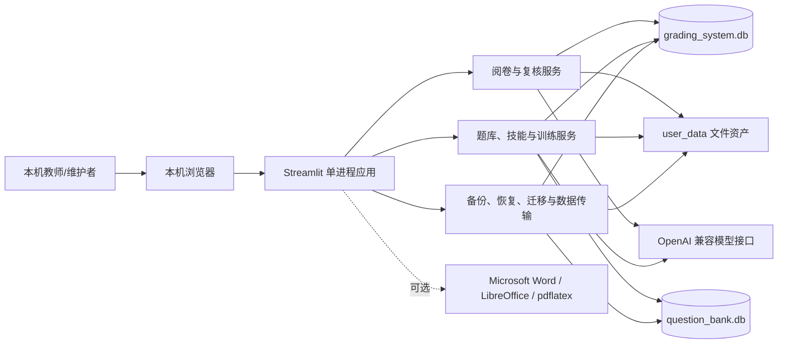
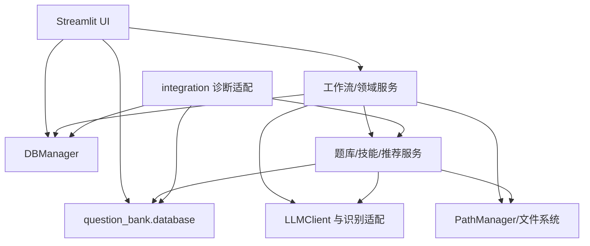
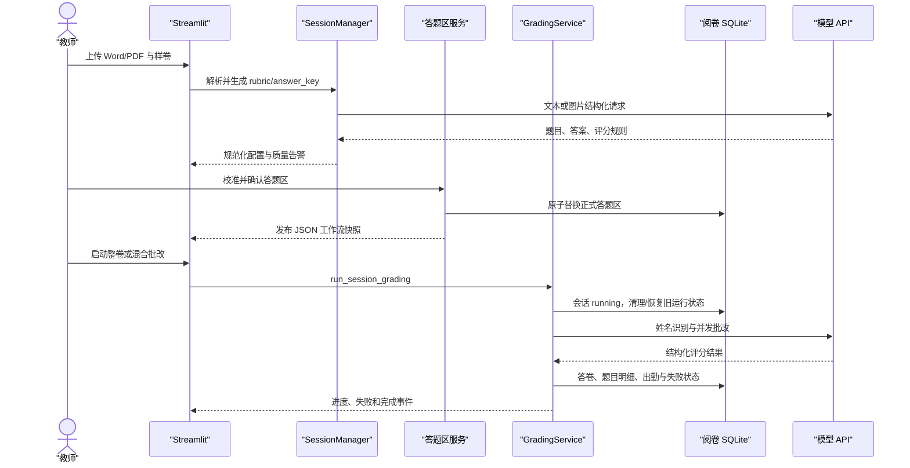
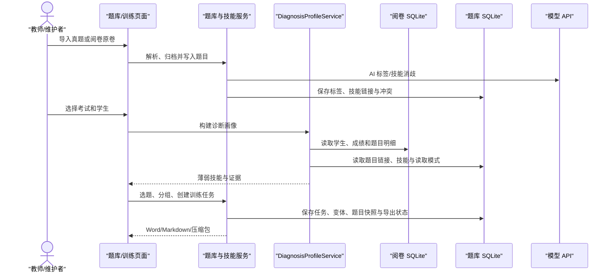
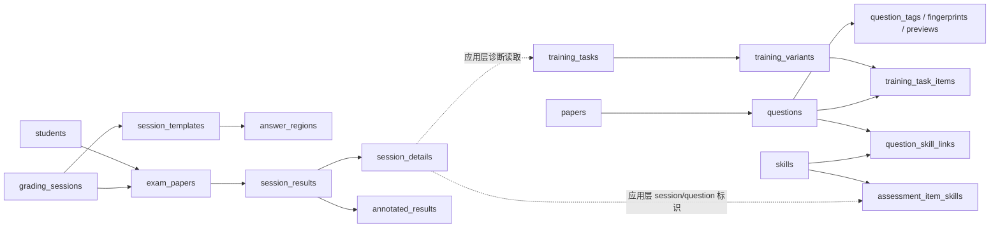

# AI 阅卷系统工作机版架构说明

> 本文档描述仓库当前的实际实现，不是目标架构设计稿。已确认事实与待确认事项分开记录；风险项不代表本次已实施修复。

## 0. 文档状态与证据

- **适用版本：** `VERSION` = `v1.5.0`
- **核验基线：** `main` 分支，提交 `5a3e2a5`；核验时工作区已有用户数据库和运行产物改动
- **最后核验日期：** 2026-06-28
- **核验方式：** Codex 静态代码/配置/测试调查、Python AST 导入图分析、便携运行时版本查询、现有 SQLite 数据库只读 Schema 查询、定向自动化测试
- **当前状态：** 已核验，部分运行环境与业务口径待确认
- **本次边界：** 仅更新本文件；未修改业务代码、配置、数据库或用户数据

### 主要证据

| 类型 | 证据 | 用途 | 状态 |
|---|---|---|---|
| 工程规范 | `AGENTS.md` | 分层、数据、安全、验证和文档要求 | 已核验 |
| 启动与运行 | `运行.bat`、`run_desktop.py`、`web_app.py`、`main.py` | 主入口、监听地址、运行进程和兼容入口 | 已核验 |
| 路径与配置 | `path_manager.py`、`config/app_config.yaml`、`VERSION` | 数据目录、日志目录、版本来源 | 已核验 |
| 阅卷代码 | `grading_service.py`、`hybrid_batch_grading_service.py`、`scanner.py`、`ai_grader.py`、`session_manager.py` | 阅卷主流程、并发、失败和重试 | 已核验 |
| 数据访问 | `db_manager.py`、`question_bank/database/schema.py`、`migrations/` | SQLite 表、约束、事务与迁移 | 已核验 |
| 题库与训练 | `question_bank/`、`integration/`、`pages/题库管理.py`、`pages/训练推荐.py`、`pages/组卷.py` | 题库、统一技能、诊断、推荐和导出 | 已核验 |
| 外部集成 | `llm_client.py`、`api_profiles.py`、客观题识别链、题库 AI 打标服务 | 模型协议、密钥来源、超时与降级 | 已核验代码；未调用真实 API |
| 本地运行时 | `runtime/python` | Python 3.12.1、SQLite 3.43.1、Streamlit 1.58.0、OpenAI SDK 2.43.0 等实际版本 | 已核验 |
| 自动化测试 | `tests/` 共 87 个测试文件；本次定向执行 37 项 | 路径、数据传输、工作流锁、训练闭环、答题区提交 | 37 项通过 |
| 当前数据库 | `user_data/databases/grading_system.db`、`question_bank.db` | 只读核对实际表集合 | 已核验 Schema；未审查业务数据 |
| 运维文档 | `README_*.md`、`docs/maintenance/*.md`、发布清单 | 便携发布、备份、存储策略 | 已核验；存在版本漂移 |

### 未确认事项

| 事项 | 影响 | 验证方式 | 状态 |
|---|---|---|---|
| 当前生产使用的模型供应商、模型名和 SLA | 影响超时、兼容参数、成本和数据出境判断 | 在不暴露密钥的前提下核对实际配置并执行受控 API 健康检查 | 待确认 |
| 是否只允许单机单用户使用 | 影响认证、并发和 SQLite 写冲突设计 | 用户确认部署边界；进行多会话并发演练 | 待确认 |
| `completed` 是否表示“批次结束”而非“全部答卷成功” | 影响状态展示和运营口径 | 产品确认并对照失败答卷统计 | 待确认 |
| 备份恢复是否做过真实恢复演练 | 影响灾难恢复可信度 | 在隔离副本执行备份、恢复和一致性检查 | 待确认 |
| 当前打包目录是否与最新源码同步 | 发布清单生成于 2026-06-04，而核验提交更晚 | 重新执行受控打包和发布验收 | 待确认 |

## 1. 项目目标与范围

### 已确认目标

系统面向本机使用的教师工作流，用于把试卷、答案、学生答卷和学生名单组合成可复核的阅卷结果，并进一步沉淀题库、技能诊断和训练材料。页面文案包含“教师”和“管理员”操作，但代码中没有对应的身份认证或角色授权；这些是工作流称谓，不是安全角色。

主要能力包括：

1. 从 Word/PDF 生成并人工确认评分依据、答案和答题区映射。
2. 扫描答卷、识别姓名、匹配学生，执行整卷或混合批改。
3. 标记低置信、异常或不完整结果，支持人工调分、失败重试和报告导出。
4. 导入本地真题，保存题目、图片/富文本、标签、频次和预览。
5. 将阅卷题目与题库题目统一到技能目录，生成个人/分组训练任务和 Word/Markdown 产物。
6. 在本地完成数据库备份、恢复、迁移和数据包导入导出。

### 当前实现边界

- 这是本地单体应用，不存在独立部署的前端、后端 API 服务或远程数据库。
- 主入口是 `运行.bat -> python -m streamlit run web_app.py`；`run_desktop.py` 是另一套桌面/冻结构建启动器，`main.py` 是较早的命令行批改入口。
- 核心状态保存在两个 SQLite 数据库和 `user_data/` 文件树中。
- AI 能力依赖可配置的 OpenAI 兼容 HTTP 接口；当前代码路径使用 OpenAI Python SDK 的 Chat Completions 和 Responses API。
- 没有证据表明当前实现支持公网、多租户、集中式账号体系、跨机器共享写入或无人值守任务队列。

### 已确认的关键规则

| 规则 | 实现/证据 | 状态 |
|---|---|---|
| 正式批改前必须确认样卷模板和答题区映射 | `GradingService.run_session_grading()` 调用 `DBManager.is_template_ready()` | 已核验 |
| 评分依据来自 Word/PDF 生成配置，样卷阶段只负责版面和题框 | `web_app.py`、`template_analyzer.py` 页面与注释 | 已核验 |
| 未匹配名单的答卷保存为 `unmatched/skipped`，不进入正式批改 | `grading_service.py` | 已核验 |
| 试卷处理状态至少包含 `pending/grading/graded/failed/skipped` | `grading_service.py`、`db_manager.py` | 已核验；数据库无枚举约束 |
| 批改结果必须经过完整性审计；局部失败可保留为需复核结果 | `grading_completeness.py`、混合批改与失败重试测试 | 已核验 |
| 统一技能推荐通过 `legacy/shadow/skill` 读取模式切换 | `skill_system_settings`、技能迁移服务和使用说明 | 已核验 |
| AI 题库标签只有质量状态为 `complete` 才自动保存 | `is_auto_saveable_result()` | 已核验 |

## 2. 系统上下文



### 外部参与者与系统

| 对象 | 作用 | 数据方向 | 认证/边界 | 证据 |
|---|---|---|---|---|
| 本机教师/维护者 | 配置、批改、复核、导出和运维 | 浏览器与本机应用双向 | 无应用登录；依赖本机访问控制 | Streamlit 页面、README |
| OpenAI 兼容模型服务 | 评分依据生成、视觉/OCR、主客观题批改、题库打标和技能消歧 | 试卷文本/图片发出，结构化结果返回 | API Key；Base URL 可配置 | `llm_client.py`、识别链、打标服务 |
| Microsoft Word | DOCX 转 PDF、部分预览/公式保真 | 本地文件与 COM | Windows 本机权限 | `docx2pdf.ps1`、`rubric_auto_cropper.py`、`preview_service.py` |
| LibreOffice | DOCX 预览转换的可选替代 | 本地文件与子进程 | 本机可执行文件 | `preview_service.py` |
| `pdflatex` | 公式转图片的可选优先路径 | LaTeX 文本与临时文件 | 本机可执行文件 | `question_bank/exporters/base_exporter.py` |

## 3. 逻辑视图与模块边界

### 核心领域

| 领域 | 主要职责 | 主要实现 | 当前边界情况 |
|---|---|---|---|
| UI 与工作流编排 | 页面状态、上传、进度、确认、复核、导出 | `web_app.py`、`pages/`、`pages_shared/`、`components/` | 直接访问数据库和部分文件系统，未形成纯 UI 层 |
| 考试配置 | 解析 Word/PDF、生成/规范化 rubric 与 answer key、质量检查 | `session_manager.py`、`rubric_auto_cropper.py`、`score_policy.py` | 生成、规则、文件写入和外部调用集中在大模块中 |
| 模板与答题区 | 模板分析、坐标模型、草稿、提交、快照和编辑器 | `template_analyzer.py`、`answer_region_*`、JS 编辑器 | 已形成相对独立子域；提交采用数据库+文件快照补偿流程 |
| 扫描与阅卷 | PDF 标准页、姓名 OCR/匹配、整卷/混合批改、完整性检查和重试 | `scanner.py`、`grading_service.py`、`ai_grader.py`、`hybrid_batch_grading_service.py`、客观题识别链 | 服务层直接依赖数据库管理器、文件和模型客户端 |
| 人工复核与报告 | 调分、批注、分析、Excel/PDF/原卷导出 | `manual_review_service.py`、`annotation_renderer.py`、`analytics.py`、`report.py`、`original_paper_exporter.py` | 报告查询与 UI 编排仍有部分留在 `web_app.py` |
| 题库 | 试卷导入、题目 CRUD、标签、频次、预览、富文本和组卷 | `question_bank/importers`、`services`、`exporters`、`pages/题库管理.py`、`pages/组卷.py` | 服务通常直接打开 SQLite；没有统一仓储接口 |
| 技能与知识对齐 | 统一技能目录、旧知识映射、题目/阅卷题技能链接、冲突处理和迁移 | `question_bank/models`、`taxonomy`、技能/对齐服务 | 新旧两套身份模型通过读取模式共存 |
| 诊断与训练 | 跨库读取阅卷证据、薄弱技能计算、候选题推荐、训练任务和导出 | `integration/`、`question_bank/recommendation`、训练服务、`pages/训练推荐.py` | 通过应用层同时访问两个数据库；无跨库事务和外键 |
| 数据与运维 | 路径、SQLite、备份、恢复、迁移、存储审计和数据包 | `path_manager.py`、`db_manager.py`、`question_bank/database`、`update_tools/`、`tools/` | 运行时建表与 SQL migrations 两套机制并存 |

### 主要依赖关系



实际边界偏差必须保留为事实：

- `web_app.py` 直接导入 `DBManager` 和题库数据库路径；`pages/训练推荐.py` 直接使用两个数据库；题库和组卷页面也直接持有数据库路径。
- `db_manager.py` 反向依赖 `ai_grader` 的结果模型和 `scanner.ExamPaperGroup`，数据访问层不是独立底层。
- 题库服务大多直接执行 SQL，`question_bank/database/schema.py` 只提供连接和建表，不是完整数据访问层。
- 外部模型调用未完全收敛到 `LLMClient`：选择/填空/批量客观题识别和题库打标部分路径会直接实例化 OpenAI 客户端。
- AST 静态导入图存在两组循环耦合：Schema 与技能目录服务、题目服务与题目频次服务。当前通过函数内延迟导入避免了直接初始化死循环，但仍增加演进风险。

### 当前应维持的边界

1. 页面层可调用工作流/领域服务；新增复杂业务规则不应继续写进页面。
2. 新服务不应依赖 Streamlit、DOM 或具体组件。
3. 数据库连接、SQL 和文件路径解析不应进一步散落到新页面。
4. 两个 SQLite 数据库之间只通过应用层 ID/快照关联；任何跨库更新都必须显式处理部分成功。
5. 答题区正式数据以数据库为主，JSON 快照是可恢复的发布产物；不得绕过提交服务同时手写两者。
6. `PathManager` 是新增持久化路径的唯一入口；兼容代码可继续读取 `AI_GRADING_DATA_DIR`。

## 4. 开发视图

```text
AI阅卷系统_工作机版_v1.5.0/
├── web_app.py                     # Streamlit 主页面和主工作流编排
├── pages/                         # 题库、组卷、训练推荐、技能管理、系统自检
├── pages_shared/                  # 多页面共享样式与组件
├── components/answer_region_editor/ # 答题区自定义前端组件
├── grading_service.py             # 阅卷会话主编排
├── scanner.py                     # 扫描页标准化、姓名识别与配对
├── ai_grader.py                   # 单份答卷评分模型与校验
├── hybrid_batch_grading_service.py # 混合批改批处理
├── session_manager.py             # 评分依据与答案生成/规范化
├── answer_region_*.py             # 答题区模型、草稿、锁、提交和 UI
├── db_manager.py                  # 阅卷库 Schema 与查询/写入
├── question_bank/
│   ├── database/                  # 题库连接与 Schema
│   ├── models/                    # 题目、标签、知识、技能模型
│   ├── importers/                 # DOCX/PDF 导入
│   ├── services/                  # 题库、技能、对齐、训练等服务
│   ├── recommendation/            # 诊断候选、评分与练习计划
│   ├── exporters/                 # Word/Markdown 导出
│   └── taxonomy/                  # 内置技能目录与注册表
├── integration/                   # 阅卷库与题库/训练之间的适配
├── migrations/                    # 阅卷库、题库 SQL 迁移
├── update_tools/                  # 更新、备份、恢复和迁移 CLI
├── tools/                         # 存储与 Git 数据策略检查
├── tests/                         # 单元、集成、契约和回归测试
├── config/                        # 非敏感应用路径配置
├── user_data/                     # 持久化业务数据、密钥和生成资产
├── runtime/                       # 便携 Python 运行时（Git 忽略）
└── docs/                          # 设计、计划、维护与操作文档
```

### 维护热点（2026-06-28 实测行数）

| 文件 | 约行数 | 混合职责 |
|---|---:|---|
| `web_app.py` | 9,418 | UI、流程编排、上传、数据传输、复核和导出 |
| `session_manager.py` | 4,422 | 文档解析、模型提示、重试、规范化、评分分配和文件写入 |
| `db_manager.py` | 2,983 | Schema、迁移兼容、备份、多个聚合根的查询与写入 |
| `pages/题库管理.py` | 2,761 | 题库导入、打标、筛选、批处理和管理 UI |
| `pages/组卷.py` | 1,802 | 候选查询、试题篮、预览、导出和历史记录 UI |
| `question_bank/recommendation/practice_plan_service.py` | 1,323 | 新旧推荐模式、分组、选题和解释数据 |
| `hybrid_batch_grading_service.py` | 1,219 | 图像切片、并发请求、客观/主观合并和结果组装 |
| `scanner.py` | 1,205 | PDF 渲染、OCR、姓名匹配、页配对和序列化 |

## 5. 运行视图

### 5.1 启动

1. `运行.bat` 选取 `runtime/python/python.exe`，设置 `AI_GRADING_DATA_DIR=user_data`，默认监听 `127.0.0.1:8501`。
2. Streamlit 导入 `web_app.py`；模块加载时 `PathManager` 根据 `config/app_config.yaml -> AI_GRADING_DATA_DIR -> user_data` 的顺序解析路径。
3. `main()` 调用 `ensure_env_ready()`：创建目录、对已存在阅卷库执行每日一次启动备份、运行 `DBManager.initialize()` 的幂等建表/补列逻辑。
4. 题库数据库不是主页面启动时统一初始化，而是在题库、组卷、诊断或导入服务使用时由 `initialize_database()` 初始化并播种内置技能目录。
5. Streamlit 页面与业务服务运行在同一 Python 进程中；没有独立后台 Worker。

### 5.2 考试配置与批改



答题区提交是“数据库提交 + 文件快照发布”的补偿式流程：先在 SQLite 中原子替换正式答题区并记录 `regions_snapshot_pending/token`，再原子写 JSON 快照和 `workflow_state.json`，最后清理草稿并清除 pending 标记。文件阶段失败不会回滚已提交数据库，而是保留 pending 状态供重试。

### 5.3 题库、技能与训练



### 5.4 并发、状态与失败恢复

| 任务 | 并发方式 | 持久状态 | 失败/重试 |
|---|---|---|---|
| 扫描 OCR | `ThreadPoolExecutor` | 扫描分析和后续 `exam_papers` | 记录扫描问题，允许人工匹配 |
| 整卷批改 | 线程池 + RPM 节流 | session、paper、result、detail | 单卷失败标 `failed`；应用级有限重试 |
| 混合批改 | 客观题/主观题批次线程池 | 同上，另有完整性与 fallback 元数据 | 局部失败转人工复核；失败题可原子替换重试 |
| 评分配置生成 | 单题并发线程池 | rubric/answer JSON 文件 | 瞬时错误有限重试，失败题可单独重试 |
| 题库 AI 打标 | 线程池 + RPM 节流 | tags、skill links、conflicts | 批失败可降为单题；低质量结果不自动保存 |
| 答题区提交 | 会话内线程锁 + 文件锁 + SQLite 事务 | 正式区域、草稿、快照 token | 快照失败保留 pending，可重试发布 |
| 训练导出 | 同步执行 | task/export 状态与文件 | 记录错误和 retry_count，可重试导出 |

进程被终止后没有后台任务续跑。下一次启动/运行通过 `running/grading` 状态检查把遗留试卷标记为失败，再由用户发起重试。

## 6. 数据视图

### 6.1 数据库

两个数据库都启用 `foreign_keys=ON`、`busy_timeout=5000` 和 WAL。当前只读查询显示阅卷库 12 张业务表、题库库 26 张业务表；两库均没有现存 `schema_migrations` 表。

| 数据库/表组 | 表 | 主要关系与用途 |
|---|---|---|
| 阅卷库：旧版兼容 | `exam_results`、`grading_details` | `main.py` 旧入口的结果与题目明细 |
| 阅卷库：人员与会话 | `students`、`grading_sessions`、`app_settings` | 学生唯一编码、考试配置路径、工作流设置 |
| 阅卷库：答卷与结果 | `exam_papers`、`session_results`、`session_details`、`session_attendance` | 会话答卷、学生匹配、分数、逐题证据和出勤 |
| 阅卷库：模板与批注 | `session_templates`、`answer_regions`、`annotated_results` | 样卷、答题区、快照发布状态和批注文件索引 |
| 题库：试卷与题目 | `papers`、`questions`、`question_tags`、`question_fingerprints`、`question_frequency_cache`、`question_previews` | 来源试卷、题目内容、AI 标签、去重/频次和预览 |
| 题库：旧训练集 | `training_sets`、`training_set_items` | 旧式训练集合与顺序 |
| 题库：知识对齐 | `knowledge_concepts`、`knowledge_relations`、`knowledge_source_mappings`、`grading_question_links` | 旧知识身份、关系和阅卷题/题库题映射 |
| 题库：统一技能 | `skill_topics`、`skills`、`assessment_item_skills`、`question_skill_links`、`skill_resolution_conflicts`、`skill_neighbors`、`skill_system_settings`、`skill_migration_runs` | 稳定技能身份、直接/辅助技能、冲突、邻接和灰度切换 |
| 题库：训练任务 | `training_tasks`、`training_variants`、`variant_students`、`training_task_items`、`training_exports`、`training_attempts` | 任务、个人/分组变体、题目快照、产物和训练回流 |



虚线是跨数据库应用层关联，不受 SQLite 外键保护，也不在同一事务中。

### 6.2 文件存储

| 路径 | 内容 | 是否可再生 |
|---|---|---|
| `user_data/databases/` | 两个主数据库、技能迁移备份 | 主库不可再生 |
| `user_data/config/` | API 配置、客观题配置 | 配置不可安全推导；包含敏感密钥 |
| `user_data/exams/` | 原始答卷、PDF 标准页和增强图 | 原件不可再生；派生图可重建 |
| `user_data/templates/` | 会话样卷、评分配置、答题区草稿/快照 | 部分可重建，人工确认结果应保留 |
| `user_data/annotated/` | 批注图片 | 有源图和数据库时可重建 |
| `user_data/reports/` | Excel、PDF、迁移/审计报告 | 最终交付物应保留 |
| `user_data/question_bank/` | 原卷归档、抽取图片、富文本侧车 | 部分可重建；原卷和富文本应保留 |
| `user_data/outputs/` | 混合批改图集、组卷和比较产物 | 多数可重建 |
| `user_data/backups/` | ZIP 和 SQLite 备份 | 灾难恢复数据，不可视为普通缓存 |
| `logs/` | 运行、更新和错误日志 | 可轮转；不得记录密钥/完整敏感数据 |

`docs/maintenance/storage-policy.md` 定义了保留建议，但当前主要依赖人工运行 `tools/storage_audit.py` 和 `tools/storage_maintenance.py`，不是自动定时保留策略。

### 6.3 Schema 变更机制

当前有两套并行机制：

1. 应用运行时：`DBManager.initialize()` 和 `question_bank.database.initialize_database()` 执行 `CREATE TABLE IF NOT EXISTS`、补列、索引、触发器、数据回填和技能播种。
2. 运维迁移：`update_tools/migrate_db.py` 按 `migrations/` 执行 SQL、备份并记录 `schema_migrations`。

当前数据库没有 `schema_migrations` 表，说明实际 Schema 主要由运行时初始化形成，迁移记录不能还原其来源。迁移工具会容忍重复列/表，但两套定义仍可能漂移。

## 7. 接口与集成

| 接口/服务 | 调用方 | 协议/定义 | 超时与重试 | 降级/失败策略 |
|---|---|---|---|---|
| Streamlit 页面 | 本机浏览器 | Streamlit HTTP/WebSocket；无公开 REST API | 由 Streamlit 会话控制 | 页面显示错误；部分长任务在同进程线程中执行 |
| 通用模型客户端 | 配置生成、整卷批改、OCR 等 | OpenAI SDK `chat.completions.create` | 客户端默认 120 秒、SDK 自动重试关闭；应用层做参数兼容和 JSON 修复/截断重试 | 抛错、单卷失败或转人工复核 |
| 客观题识别链 | 混合批改 | OpenAI 兼容 Chat Completions | 不同路径 30 秒或无显式上限；批量并发受 RPM/worker 限制 | 规则校验、升级主模型或人工复核 |
| 题库 AI 打标 | 题库导入/批处理 | OpenAI Responses API，部分兼容路径使用 `LLMClient` | 线程池、RPM、批失败转单题 | 低置信复核模型；非 complete 不保存 |
| SQLite | 所有服务 | Python `sqlite3` | busy timeout 5 秒、WAL | 事务回滚；跨库操作无统一事务 |
| 本地文件 | 上传、模板、报告、题库、备份 | DOCX/PDF/JPG/PNG/JSON/XLSX/ZIP | 同步 I/O | 多数显示错误；部分流程有原子临时文件/快照补偿 |
| 数据包导入导出 | 侧边栏运维 | ZIP；只接受 `user_data/` 和 `config/` 根 | 浏览器内存缓冲；200 MB 仅告警 | 导入前尽力备份；逐文件覆盖，不是事务 |

### 兼容约束

- 数据库存储路径可能来自旧机器，读取时通过 `resolve_stored_file_path()` 重映射；不要直接改变已存路径格式。
- `main.py` 的旧表和 `DBManager` 旧 API 仍保留，删除前需确认没有外部脚本消费者。
- 统一技能目录仍保留旧知识映射读取路径；切换到 `skill` 模式必须遵循 dry-run、apply、shadow、验收、回滚流程。
- OpenAI 兼容供应商对 `max_tokens`、`max_completion_tokens` 和 `response_format` 支持不同，`LLMClient` 已包含参数回退；新增调用不应绕过兼容策略。

## 8. 安全、隐私与权限

- **网络边界：** 当前两个启动器都绑定 `127.0.0.1` 或 `localhost`。若改为局域网/公网监听，现有无登录设计将直接暴露全部页面和数据。
- **身份与权限：** 没有应用级认证、授权、角色或操作审计。任何能访问本机 Streamlit 地址的人都具有完整操作能力。
- **敏感数据：** 学生姓名、班级、答卷、成绩、错因、报告和题库原卷均在本地文件/SQLite 中。
- **密钥：** API Key 由环境变量或 `user_data/config/api_profiles.json` 读取；保存文件是明文 JSON，没有操作系统密钥库或加密封装。
- **数据导出：** 轻量和完整数据包都包含 `user_data/config/`；发布说明也明确私人便携包包含 API 密钥。
- **输入边界：** 当前数据包导入对目标根目录做归一化和 `relative_to` 校验；源试卷归档使用文件名净化/哈希。数据包仍会逐文件覆盖，且备份失败被当作非阻塞。
- **模型输入：** 试卷文本和图片会发送到配置的外部模型服务；`solution_answer_guard.py` 和 prompt injection 回归测试提供部分防注入保护，但不能替代供应商数据合规评估。
- **日志：** 部分异常和模型响应摘要会进入日志/结果 JSON；`sanitize_incomplete_failure_summary()` 会隐藏部分认证信息，但尚未见全局敏感字段审计器。

## 9. 部署与运行环境

| 项目 | 当前实现 | 证据 | 状态 |
|---|---|---|---|
| 部署形态 | Windows 私人便携源码+运行时目录 | `manifest.json`、私人版 README | 已核验 |
| Python | 便携 CPython 3.12.1 | `runtime/python/python.exe` | 已核验 |
| UI/服务 | Streamlit 1.58.0，同进程 | 运行时查询、启动脚本 | 已核验 |
| 数据库 | SQLite 3.43.1，两个本地文件，WAL | 运行时查询、Schema 代码 | 已核验 |
| 主 AI SDK | OpenAI 2.43.0 | 运行时查询 | 已核验 |
| 文档/图像依赖 | python-docx 1.2.0、PyMuPDF 1.27.2.3、Pillow 12.2.0、OpenCV 4.13.0 | 运行时查询 | 已核验 |
| 表格依赖 | pandas 3.0.3、openpyxl 3.1.5 | 运行时查询 | 已核验 |
| 监听地址 | `127.0.0.1:8501`（`PORT` 可改） | `运行.bat` | 已核验 |
| 数据根 | 默认项目内 `user_data/`；配置文件优先于环境变量 | `path_manager.py` | 已核验 |
| 备份 | 启动日备份、手工/更新/迁移前备份 | `DBManager`、`update_tools` | 已核验实现；恢复演练待确认 |
| 监控告警 | 页面进度、日志和系统自检；无外部监控 | 代码与页面 | 已核验 |

`requirements.txt` 只给下限，没有锁文件；因此“重新安装依赖”不能复现上述便携运行时版本。

## 10. 已实施的关键技术决策

| 决策 | 状态 | 依据 | 影响/回退 |
|---|---|---|---|
| 使用本机 Streamlit 单体应用 | 已实施 | `运行.bat`、`web_app.py` | 部署简单；UI、任务和数据访问同进程耦合 |
| 代码与持久化数据分离到 `user_data/` | 已实施 | `PathManager` | 便于更新代码；当前 Git 跟踪策略破坏了隔离目标 |
| 阅卷与题库使用独立 SQLite | 已实施 | 两套 Schema | 领域隔离较清楚；跨库一致性由应用负责 |
| SQLite 使用 WAL 与 5 秒 busy timeout | 已实施 | 两个连接工厂 | 改善本机并发；不等于支持多机共享写入 |
| 评分结果保留原始 JSON 和结构化明细 | 已实施 | `session_results/session_details` | 便于审计和兼容；重复数据需保持一致 |
| 混合批改区分客观题/主观题并支持局部降级 | 已实施 | `hybrid_batch_grading_service.py` | 提高吞吐；合并和完整性逻辑复杂 |
| 答题区使用草稿、正式库、不可变快照 token | 已实施 | `answer_region_*` | 可恢复；需要补偿跨 SQLite/文件系统的一致性 |
| 统一技能目录以 `legacy/shadow/skill` 灰度切换 | 已实施 | 008 migration、技能服务 | 可回滚；新旧读路径长期并存增加复杂度 |
| 题库原卷采用 SHA-256 归档/复用 | 已实施 | `source_paper_archive_service.py` | 减少重复并稳定引用 |

## 11. 已知风险与技术债

| 优先级 | 问题 | 已确认事实 | 影响 | 建议方向 | 阻塞本次文档任务 |
|---|---|---|---|---|---|
| P0 | 敏感运行数据已被 Git 跟踪 | `git ls-files user_data` 返回 1,032 个文件，包含 `api_profiles.json`、两个数据库和备份；`.gitignore` 明示全部跟踪，而 `tools/check_tracked_user_data.py` 判定失败 | API Key、学生信息、成绩和原卷可能进入历史/远端；与 `AGENTS.md` 安全底线冲突 | 先评估远端与历史暴露，轮换密钥；经用户批准后从索引/历史移除业务数据并恢复白名单策略 | 否；本次不改 Git/数据 |
| P0 | 数据包导入不是事务且备份失败不阻塞 | 当前实现捕获备份异常后继续逐文件覆盖数据库和配置 | 导入中断可形成跨文件/跨库不一致，原数据可能无法恢复 | 先验证备份成功，再解压到暂存区、校验清单并原子切换；提供回滚日志 | 否 |
| P1 | API Key 明文存储并随导出/私人包传播 | `api_profiles.py` 原样 JSON 保存；导出清单包含 `user_data/config`；README 明示包含密钥 | 本机拷贝、备份、Git 或误传均会泄密 | 使用 OS 凭据库或至少将密钥排除出默认导出/版本控制；建立轮换流程 | 否 |
| P1 | Schema 有双重真相来源 | 运行时初始化与 SQL migrations 都改 Schema；当前数据库无 `schema_migrations` | 定义漂移、升级路径不可审计、测试库与工作库来源不同 | 选定唯一迁移主路径；运行时只做版本检查/最小引导；补基线迁移 | 否 |
| P1 | 核心模块过大且跨域 | `web_app.py` 9,418 行、`session_manager.py` 4,422 行、`db_manager.py` 2,983 行 | 回归面大、难以独立测试、继续叠加易触发跨层调用 | 先加特征测试，再按工作流/仓储逐步抽取，保留兼容门面至少一个版本 | 否 |
| P1 | UI 与数据层直接耦合，跨库无事务 | 多个页面直接导入 DB 模块；诊断同时访问两个库 | 页面修改容易带入业务/SQL，训练链路可部分写入 | 新增应用服务门面和明确的跨库补偿/幂等键；不做一次性大重写 | 否 |
| P1 | 无认证，安全完全依赖 loopback | 启动器仅本机绑定，但代码无登录/权限 | 一旦监听地址放宽即完整暴露敏感数据与破坏性操作 | 固化 loopback 校验；任何远程化前先设计认证、授权、CSRF 与审计 | 否 |
| P1 | 状态口径可能误导 | 即使部分答卷失败，批次末仍可能把 session 标记 `completed`，失败数另存于 paper 状态 | UI/报表若只看 session 会误认为全成功 | 明确 `completed_with_errors` 或规定 completed=运行结束并强制展示失败计数 | 否，需业务确认 |
| P1 | 部分模型请求无超时上限 | 客观题批量路径存在 `timeout=None`，SDK 自动重试关闭 | 网络异常可能长时间占住 Streamlit 任务 | 统一超时预算、可取消机制、有限退避重试和请求级追踪 ID | 否 |
| P2 | 静态循环依赖由延迟导入维持 | Schema↔技能目录、题目服务↔频次服务 | 初始化顺序脆弱，重构时易出现运行时导入故障 | 抽取常量/端口接口，令 Schema 不依赖服务，频次服务不反向依赖题目服务 | 否 |
| P2 | 状态字段缺少数据库约束 | 阅卷 session/paper 等状态是自由文本，写方法接受任意字符串 | 拼写或新旧状态不一致会污染查询 | 集中枚举和迁移 CHECK 约束；先统计现有值 | 否 |
| P2 | 依赖不可复现 | `requirements.txt` 仅最低版本，便携运行时已远高于下限；存在未见直接导入的依赖 | 新机器安装结果随时间漂移，兼容性难复现 | 从已验收运行时生成约束/锁文件，区分运行与打包依赖 | 否 |
| P2 | 文档和版本元数据漂移 | 工作机 README 仍为 v1.3.0/`run.bat`；配置写 v1.4.0-RC；ownership 行数过期 | 运维人员可能使用错误入口或误判版本/规模 | 以 `VERSION` 为唯一版本源并在发布时校验文档 | 否 |
| P2 | 客观题准入向导引用缺失脚本 | `run_objective_admission_wizard.py` 引用的 5 个诊断/评估脚本在仓库不存在 | 对应辅助流程会失败 | 移除失效入口或把脚本作为受测试工具恢复并纳入发布清单 | 否 |
| P2 | 存储保留主要靠人工 | 有审计/清理工具和策略文档，无自动调度 | 备份、报告、图像长期膨胀 | 在明确保留规则后增加可预览的定期维护入口，默认 dry-run | 否 |

## 12. 待确认问题

1. 是否确认本项目永远只在受信任 Windows 工作机、单用户、loopback 下运行？如果不是，认证和数据隔离必须先于远程访问。
2. `user_data` 被完整提交到 Git 是历史临时决定还是仍需保留？当前状态与仓库自带策略检查及安全规范直接冲突。
3. 会话 `completed` 是否允许包含失败答卷？若允许，UI 和报告必须始终同时展示失败数；若不允许，需要新的终态。
4. 哪一套应成为 Schema 的权威来源：SQL migrations，还是运行时初始化？建议迁移文件为权威、运行时只校验版本。
5. 实际模型供应商是否允许发送学生答卷和姓名图像，数据保存/训练政策是否满足学校要求？
6. 是否仍使用“客观题准入向导”？若使用，需要补齐并测试缺失工具；若不使用，应移除入口避免误导。

## 13. 更新记录

| 日期 | 变更 | 原因 | 核验 |
|---|---|---|---|
| 2026-06-28 | 将占位模板替换为当前系统、模块、运行、数据、集成、安全和风险视图 | 按 `AGENTS.md` 从现有代码库恢复实际架构 | 静态调查、AST 导入图、运行时版本、数据库只读 Schema、37 项定向测试、差异复核 |
