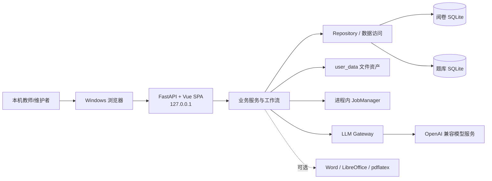

# AI 阅卷系统当前架构

> 本文只记录当前系统事实、长期业务不变量和已知限制。动态执行包状态以
> `docs/superpowers/packages/EXECUTION_INDEX.md` 为准；历史设计、逐包实施过程和测试数字不在本文重复。

## 1. 当前边界

- 当前版本以根目录 `VERSION` 为准，产品是运行在受信任 Windows 工作机上的本机单用户应用。
- 唯一日常入口是 `运行.bat`。它检查已构建的 `frontend/dist`，应用待重启的受保护运维操作，再启动
  `backend.api.launcher`。
- FastAPI 默认监听 `127.0.0.1:8000`，同源托管 Vue 3 SPA 和全部业务 API。浏览器不直接访问数据库、
  任意本机路径或模型供应商。
- 在 linked worktree 中复用主项目便携 Python 时，`运行.bat` 必须通过项目引导器显式加载当前工作树代码；
  验收工作树默认使用 `8035` 和自身数据、运维状态及模型配置，不能回落到主项目页面或数据。
- 旧 Streamlit 日常 UI、旧桌面启动器和旧 CLI 批改入口已经退役。历史正式验收工具仍可在不含真实数据的
  隔离副本中启动 Streamlit，因此相关测试依赖在该工具退役前保留。
- 当前没有应用级账号、角色或权限系统；安全边界依赖 Windows 账户、受信任工作机和 loopback 监听。
  改为局域网、公网、多用户或多机共享前，必须重新设计认证、授权、CSRF、审计和数据隔离。
- Phase 3 已完成后端拆分、Schema 收敛和性能决策。当前 P3.5 允许大幅调整前端显示、布局和交互，
  也允许把现有后端中尚未定型的功能行为与用户讨论后统一、精简；它**不更换现有架构**。
  Phase 4 暂停，不因 P3.5 自动开始。

## 2. 系统上下文

系统主要提供：

1. 考试草稿、试卷来源解析、评分依据生成与人工编辑；
2. 样卷、答题区、答卷上传、扫描预检、学生匹配和批改运行；
3. 按题批量复核、单份证据深查、教师调分、批注和报告导出；
4. 学生名单、题库、组卷、精确标签诊断、知识图谱和训练任务；
5. 自检、备份、恢复、迁移、数据包导入导出和受控文件下载。

## 3. 模块与依赖

| 边界 | 当前职责 | 长期约束 |
|---|---|---|
| `frontend/` | Vue 页面、Pinia 状态、统一 API Client、设计 Token 和浏览器验证 | 页面只调用同源 `/api/`；复杂业务规则不在浏览器重写 |
| `backend/api/` | 路由、公开 Schema、统一错误、静态托管、应用生命周期和依赖组装 | 公开数据使用允许列表；错误不回显路径、密钥、正文或原始异常 |
| 业务服务 | 配置、模板、扫描、批改、复核、报告、题库、训练、图谱和运维编排 | 服务不依赖 Vue/DOM；跨资源操作显式处理冲突、部分成功和恢复 |
| `backend/repositories/` | 阅卷库连接所有权、事务和命名仓储 | 正式调用方经 `GradingRepositoryAccess` 使用仓储；事务边界不可散落回页面 |
| `db_manager.py` | 兼容门面、备份、非 DDL 维护、跨域兼容编排和少量尚未抽取的聚合 SQL | 只由单一兼容组装点创建；不得重新成为所有新功能的万能入口 |
| `question_bank/` | 题库连接、标签、题目、频次、预览、组卷和训练数据访问 | 题库服务仍拥有自己的数据访问边界；不与阅卷库建立跨库外键 |
| Job 子系统 | 持久 Job 状态、进程内线程池、进度、取消、重试和受控产物发布 | 没有独立 Worker；进程退出后任务不续跑；取消必须在安全边界确认 |
| `backend/llm/` | 传输、超时、错误分类、有限重试、节流、请求标识和脱敏用量 | 正式模型调用必须经过 Gateway 或其兼容门面；不得新增无超时或无限重试直连 |
| `PathManager` 和文件服务 | 持久目录解析、旧路径兼容、受控根和文件发布 | 新持久路径只经 `PathManager`；客户端永不提交服务器绝对路径 |

当前仍存在的兼容现实：

- 两个 SQLite 数据库之间只有应用层 ID 和快照关联，没有跨库事务或外键。
- 题库部分服务直接执行 SQL；它不是阅卷库 Repository 的子模块。
- `DBManager`、配置生成和若干扫描/批改模块仍较大，但 P3.5 不做一次性重写。
- 题目服务与频次服务仍有由延迟导入维持的循环耦合，应在独立任务中通过窄接口拆解。

## 4. 数据、Schema 与文件

### 4.1 双库边界

- 阅卷库保存学生、考试会话、答卷、运行账本、评分结果与明细、模板、答题区、批注索引、Job 和应用设置。
- 题库保存试卷、题目、`question_tags`、预览/频次、评分来源链接、组卷与训练任务。
- 跨库写入必须使用幂等键、状态重算或补偿收敛；不得声称具有单事务原子性。

### 4.2 Schema 唯一权威

- `migrations/` 下的顺序 SQL 是两个数据库 Schema 的唯一权威来源。
- 启动与迁移工具核对连续版本、checksum、未来版本和历史缺口；不兼容时在服务开放前失败关闭。
- 后续 Schema 变化只能新增 forward migration，不能修改已登记历史迁移，也不能恢复运行时建表、补列或删表。
- 破坏性迁移只允许精确迁移名和表白名单，并在隔离副本预演、迁移前整库备份和事务完整性检查后执行。
- 核心持久状态同时受共享应用契约和数据库 `CHECK` 约束；新增状态必须同步领域决定、应用契约和新迁移。
- `session_details.knowledge_ids` 是活动知识点列表真值；接口需要兼容单值时只能从列表派生。
- 题库同步状态四列继续归属 `grading_sessions`，理由见
  `docs/adr/0001-keep-question-bank-sync-state-on-grading-session.md`。

### 4.3 真实数据红线

- `user_data/databases/grading_system.db`、`user_data/databases/question_bank.db` 和整个 `user_data/` 文件树都是真实业务数据。
- 未获得用户对本次具体操作的明确授权时，不得修改、删除、迁移、暂存、提交或 stash 真实 `user_data/`。
- 测试、截图、性能实验、冒烟和迁移演练只使用临时数据、匿名合成数据或隔离副本；真实两库只做只读指纹核对。
- 数据库变更必须先有 forward migration、隔离副本预演、自动备份和专项验证；真实库迁移仍需单独授权。
- 文档、普通运行日志、API 和 Git 提交不得包含真实业务正文、内部绝对路径、数据库内容或密钥。
  用户在 P3.5 明确要求的本机 AI 调用诊断日志是唯一正文例外，只能保存模型实际收到和返回的文本，
  并继续禁止密钥、完整服务 URL、本机绝对路径、数据库内容和图片正文；其具体边界见第 9 节。

### 4.4 文件资产

`user_data/` 同时保存原始答卷、配置来源、模板、题框草稿/快照、批注、报告、题库原卷和备份。
原件、人工确认结果与灾难恢复备份不可按普通缓存处理；裁剪图、部分预览和其他派生产物可以按已定义规则重建。

## 5. API 与前端长期契约

### 5.1 请求与状态

- 前端 Client 只接受同源 `/api/` 路径。
- GET 的临时网络/服务失败可以有界重试；POST、PUT、PATCH、DELETE 默认不自动重放。
- 写响应丢失时，页面必须先通过服务器请求令牌、Job、revision 或资源读取确认事实，不能直接再次提交。
- 服务器持久状态是真相；浏览器本地状态只保存最小引用和无敏感草稿，不得把缓存候选当作已完成事实。
- 切换考试、题目、学生、图谱范围或页面后，旧请求必须被取消或按 generation 丢弃，不能覆盖新上下文。
- 422、409、取消、超时和普通服务器失败必须分开表达；错误说明应包含“发生了什么、数据是否保留、下一步”。

### 5.2 草稿、冲突与部分成功

- 长流程允许保存可恢复草稿，但草稿不能冒充正式配置、正式题框或已确认结果。
- 影响持久结果的编辑使用不透明 revision、模板/来源指纹、请求令牌或锁。409 时保留本地输入，不自动合并或覆盖。
- 正式文件先写入受控 staging，验证后原子发布；发布失败不能替换当前可用版本。
- 跨数据库、数据库与文件系统、评分与批注等两阶段操作可能产生“主要结果已保存、派生产物待补写”的部分成功。
  页面必须如实显示并提供限定重试，不能把主要成功误报为整体失败，也不能重复主要写入。
- 离开、刷新、网络失败和进程重启后，应从服务器恢复已持久事实；未保存浏览器草稿需要明确提醒。

### 5.3 用户可见数据

- 未知、尚未计算、无数据和真实数值 `0` 是四种不同事实；分析和工作台不能把缺失值自动显示为 0。
- 图表必须同时提供文字名称、样本量、口径和可读明细或下钻；颜色不能成为唯一状态编码。
- 会话 `completed` 只表示本次批改运行结束，允许仍有失败答卷。所有完成提示必须同时展示成功、失败、跳过和冲突统计。

## 6. Job、并发、取消与恢复

- JobManager 是 FastAPI 进程拥有的线程池；JobStore 持久化公开状态、进度和安全结果，但没有独立后台 Worker。
- `queued` 可在未开始时取消；`running` 取消只是请求，handler 只有在未跨过不可逆发布边界时才能确认 `cancelled`。
- 已跨过安全发布边界的正常完成可以在取消竞态中胜出；前端不得提前显示“已取消”。
- 进程退出不会让线程任务在后台续跑。下一次启动把遗留 `queued/running` Job 收口为失败或领域定义的可恢复状态，
  不能伪装成安全取消。
- 批改另有 `grading_runs/grading_run_items` 账本。安全暂停停止派发新答卷、保存在途结果，未开始项保留待恢复；
  继续、补批和失败重试必须核对 run ID、模式、状态和配置指纹。
- 取消批改保留已经发布的结果，未完成项不能算业务失败；已确认取消的 run 不应重新开放继续或失败重试。
- 同一考试的互斥写入、配置生成、模板上传、预检和运行控制必须由锁、revision 或单赢家规则串行化。

## 7. 核心业务不变量

### 7.1 配置、模板与扫描

- 正式批改前必须有完整评分依据、已确认样卷和正式答题区；题库入库不是批改前置条件。
- 配置来源由服务器托管，浏览器只提交语义 ID 和有限教师修改；完整题干、答案、图片和服务器路径不进入本地持久缓存。
- 程序拆出的题型和答案片段都是待核对候选；只有教师实际修改过的题型才标记为教师确认。
  非空答案片段不自动等于可信标准答案，弱证据或不完整多问答案必须继续显示“需核对”。
- 配置生成提供两种由教师明确选择的方式。分批方式按顺序处理：选择/填空最多 3 题一批，
  其他解答题 1 题一批；每批一次模型请求，失败批次只能由教师明确重试，全部题目完成后再进行一次受控 AI 统一配分。
- 整卷方式不依赖拆题候选：DOCX 发送整份可读文本，PDF 发送按页排列的整页图片，一次模型请求完成全卷解析、
  评分点和配分。本地只做 JSON 修复、结构校验和总分规范化；失败不自动重试、不局部发布，教师再次点击才会产生新请求。
- 样卷替换、题框草稿和正式提交绑定模板指纹。数据库题框是正式真值，JSON 快照是可恢复发布产物；
  快照失败保留 `pending` 并只重试补写。
- 扫描批次冻结后输入不可变。低可信匹配和异常卷必须由教师决定；未处理异常在教师明确确认跳过前不能进入 AI 批改。

### 7.2 批改与复核

- 未匹配答卷不进入正式批改；答卷状态、运行状态和 Job 状态是不同维度，不能互相替代。
- 整卷与混合批改保持各自算法和结果语义。生产整卷按一份在途、一次物理模型请求和本地 JSON 修复执行，
  不自动追加模型修复或普通重试；混合批改继续使用其有界策略。
- 模型评分、候选分、置信度和错因只供教师参考，教师最终分是人工复核后的业务结果。
- 教师确认可以保持 AI 原分不变；“没有改分”不能阻止人工确认。
- 同一批复核写入由服务器重新验证考试、结果、明细、题号、归属、重复项和分数范围，并在事务内原子更新明细和总分。
- 评分事务成功后，批注或标注图生成失败不回滚分数；页面显示“分数已保存，批注待重试”。

### 7.3 学生删除

- 批改处于 `running`、`pause_requested` 或可恢复 `paused` 时，永久删除学生必须返回冲突，不得自动取消批改。
- 系统空闲时，删除在一个事务中清理该学生的终态历史账本引用、成绩与派生证据，再解绑答卷。
- 被解绑答卷恢复为 `student_deleted/pending`：未匹配、待处理，重新匹配后必须主动重新批改。
- 备份失败、revision 变化、学生不存在或未知运行状态时删除失败关闭；不得留下部分清理。

### 7.4 题库、标签、图谱与训练

- `question_tags.knowledge_point` 的精确值是活动知识语义身份；评分来源题只通过明确或题号唯一的
  `grading_question_links(status='confirmed')` 关联题库题。
- 今后经过正式 AI 标注质量流程的新知识点、能力、方法、数学模型和章节先按规范词与已登记别名收敛；
  未知词标记为冲突并阻止自动保存。该规则不迁移历史标签，也不覆盖教师手工标签。
- 题库列表、组卷工作台和配置来源拆题核对共用同一套安全富内容渲染语义：正文保留上下标与下划线，
  表格使用真实表格结构，图片使用受控素材 URL 并按容器自适应；不直接执行来源 HTML。
- 查询时读取题库当前标签，不使用旧技能目录、近义词、视觉距离或 AI 二次匹配推断身份。
- 当前知识图谱是 tag-only：Graph API 的知识关系边保持为空。学生/范围/标签分组线只表示当前查询归属，
  不能解释为知识点父子、先修或相关关系。
- 当前“掌握度”只是现有证据按满分加权的得分率，不是预测、排名、学生画像或 Phase 4 掌握度模型。
- 缺少标签、链接或证据时返回明确缺失原因；训练推荐只接受精确共享知识点，不以模糊相似题补足。

## 8. 媒体、下载与运维写操作

### 8.1 受控文件访问

- API 只接受 session、result、detail、page、job、question、asset 等语义 ID，向浏览器返回同源受控 URL。
- 浏览器不得提交或拼接文件系统路径；服务端解析后再次校验受控根、真实路径、扩展名、所有权和文件存在性。
- 媒体、报告、题库素材和 Job 下载都不是通用文件浏览器。路径越界、过期、类型不符或所有权不符时失败关闭。
- 公开 Job payload/result、review 元数据和错误响应必须使用显式允许列表或共享净化器。

### 8.2 备份、恢复、迁移和数据包

- 五类 Ops 写操作先预检，再使用短期、单次、绑定完整计划与资源指纹的确认令牌提交独立 Job。
- 备份和导出可以在线原子发布；恢复、迁移和导入只准备候选，在下一次受控启动、正式数据库尚未打开时离线应用。
- 恢复、迁移和导入在触及正式目标前必须重新预检并创建、验证应用时备份；备份失败阻断操作。
- 候选内容必须完整暂存并通过路径、ZIP、数据库完整性和迁移校验，不能边读取边覆盖正式数据。
- 离线应用失败先从最新应用时备份回退；回退也失败时阻止服务启动并保留脱敏恢复说明。
- 恢复和导入只覆盖包内明确包含的受控文件，不删除包中未出现的现有文件；镜像式清理属于新的破坏性语义。
- 客户端不能提交 `path`、`destination`、`command`、`sql` 或迁移目录。

### 8.3 已退休数据

- 旧 CLI 两表和旧技能语义 11 表只通过既定 forward migration 008/009 精确删除。
- 删除前可用只读导出工具归档，迁移器另做整库备份；迁移后不由运行时代码重建这些表。
- 唯一受支持的结构回退是恢复迁移前整库备份并运行匹配的旧版本代码，不能在新版本中手工补表。
- 旧 `training_sets/training_set_items` 不属于已完成的旧技能语义删除范围，仍按独立事项处理。

## 9. 模型调用、隐私与费用保护

- 模型能力通过 OpenAI 兼容接口提供，正式传输由 `LLMGateway` 统一承接显式超时、SDK 零自动重试、
  集中错误分类、有限退避、节流、逻辑请求 ID 和脱敏用量事件。
- 临时网络错误只有在具体调用策略允许时才有限重试；认证、普通 4xx、未知错误和业务 JSON 校验失败不自动重试。
- 参数兼容降级次数有界，不能与普通重试叠加成无上限物理请求。
- 常规模型调用与用量日志不保存 API Key、完整 URL、prompt、响应正文、学生姓名、答卷图片、
  内部路径或原始异常。
- P3.5 按用户明确要求新增独立本机诊断日志 `logs/llm_diagnostics.jsonl`：记录实际文本请求、
  模型原始文本响应、本地可解析 JSON、耗时、错误与重试；图片正文和 base64 不落盘，只记录用途、
  压缩后字节数与 SHA-256。写入前递归移除 API Key、Authorization 和本机绝对路径。
  `logs/` 已被 Git 忽略；诊断日志单文件约 32 MiB 时滚动，保留当前文件和最近 3 个轮转文件，
  更早的轮转文件按这一明确的日志保留策略自动删除。
- 配置生成、整卷批改和题库打标的额外调用必须有清晰预算；失败、截断或坏 JSON 不自动追加“修复”模型请求。
- 涉及真实模型、网络、真实考试副本或可能费用的人工验证，必须在执行前由用户确认数据范围、网络和费用上限。
- 试卷文本和图片会发送给用户配置的外部供应商；供应商、合同或使用范围变化时必须重新评估数据合规。

## 10. 安全边界

- API profile 默认保存在 `%LOCALAPPDATA%/AIGradingSystem/config/api_profiles.json`，不进入仓库、数据包、
  普通备份或便携包；当前仍是本机账户可读的明文 JSON。
- 任何能访问本机 loopback 服务和 Windows 账户的人都可能执行完整业务操作；这不是多用户安全模型。
- 输入文件受扩展名、MIME/文件头、大小、哈希、受控根、symlink/junction/reparse point 和 ZIP 展开限制保护。
- 常规日志只记录脱敏元数据。含实际请求/响应文本的 AI 诊断日志仅保存在本机 `logs/`，
  不进入 Git；不得记录密钥、图片正文或绝对路径，也不得把其中的真实业务内容复制到文档和提交。
- 缓存只保存可重建派生物，键必须包含源内容与影响输出的版本/几何信息；损坏项重建，写失败回退为直接计算。
- 当前选用的复核裁剪缓存和请求内图片压缩 memo 的正式证据位于
  `docs/performance/p3-18-evidence-performance.md`；性能数字是生成工作负载证据，不是 SLA。

## 11. 当前文档入口

| 事实 | 当前入口 |
|---|---|
| 动态阶段和下一动作 | `docs/superpowers/packages/EXECUTION_INDEX.md` |
| 长期协作、P3.5 工作流和真实数据规则 | `AGENTS.md` |
| 视觉规范 | `docs/ui/STYLE.md` |
| Schema | `migrations/`、`backend/schema_migrations.py` |
| 接受的架构决定 | `docs/adr/` |
| Phase 3 性能决定 | `docs/performance/p3-18-evidence-performance.md` |
| P3 起点结构快照 | `docs/architecture/p3-01-structural-baseline/manifest.json` |
| P3.5 用户体验与讨论 | `docs/user-testing/README.md`、`docs/user-testing/USER_TEST_TEMPLATE.md` |

P3.5 迭代期间不以代码复审或自动测试作为交付门槛。Codex 直接把真实应用改到可供用户查看，
只在展示页面所需时启动服务或执行构建；用户通过实际操作和讨论给出“满意”或“有问题”。
当用户明确要求准备合并时，先冻结新需求并统一精简一次，再由用户做最终人工确认。
任何自动测试、专项诊断或额外技术门槛都必须由用户另行要求，不能从旧阶段规则自动恢复。

## 12. 已知限制与未决事项

- **Phase 4 暂停：** 当前不实施图谱 2.0、掌握度 v2 或训练闭环新模型；P3.5 不改变这一决定。
- **真实模型人工复验：** Issue #67 仍待用户另行确认真实数据副本、网络和费用上限；自动门槛不能替代该人工决定。
- **确认取消的持久化窗口：** 批改账本终结与取消控制记录之间若恰好发生磁盘失败或进程退出，
  已取消运行可能在重启后显示为普通失败并重新开放重试。用户已接受当前限制；若实际出现，应建立独立恢复任务。
- **跨库一致性：** 阅卷库与题库没有统一事务，现有工作流依靠幂等、状态重算和补偿；新的跨库写入必须延续该边界。
- **备份恢复演练：** 受保护恢复机制已有隔离测试，当前工作机真实备份是否做过完整恢复演练仍需单独确认。
- **运行时 SQLite：** 当前便携 SQLite 版本没有较新上游 WAL-reset race 修复；维持本机单用户、备份和完整性检查，
  运行时升级应作为独立包验证。
- **本机密钥：** API profile 已与项目数据分离但仍是明文；迁移到 Windows Credential Manager 尚未实施。
- **旧训练集：** `training_sets/training_set_items` 的最终去留仍是独立事项，不能与已删除旧技能语义混同。
- **前端依赖：** 锁文件中的既有高等级审计提示尚未通过行为兼容升级关闭；不能在文档或局部 UI 任务中自动执行
  `npm audit fix`。
- **便携发布同步：** 当前打包目录是否与最新源码完全一致，仍需在下一次正式发布前重新生成并验收。
- **远程化：** 当前没有认证和授权；不得仅修改监听地址就把系统暴露到局域网或公网。
