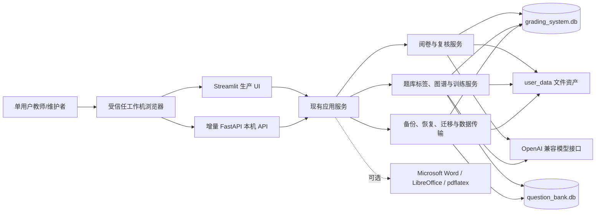
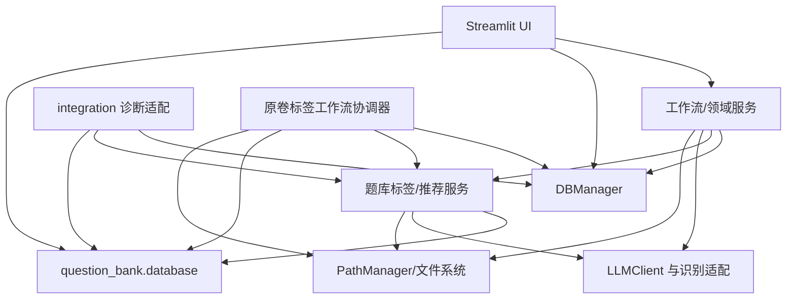
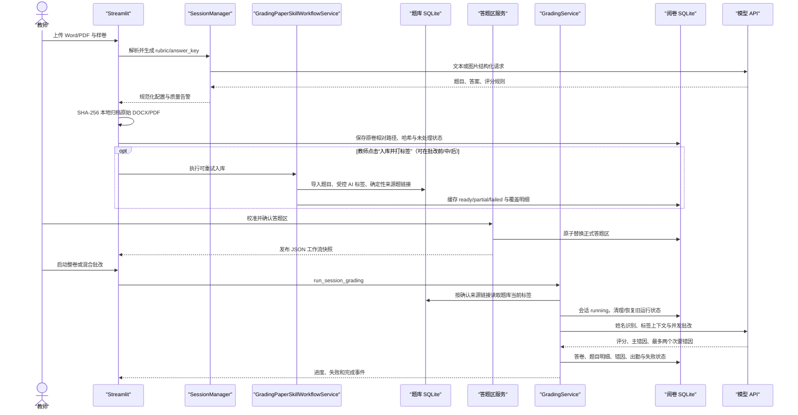
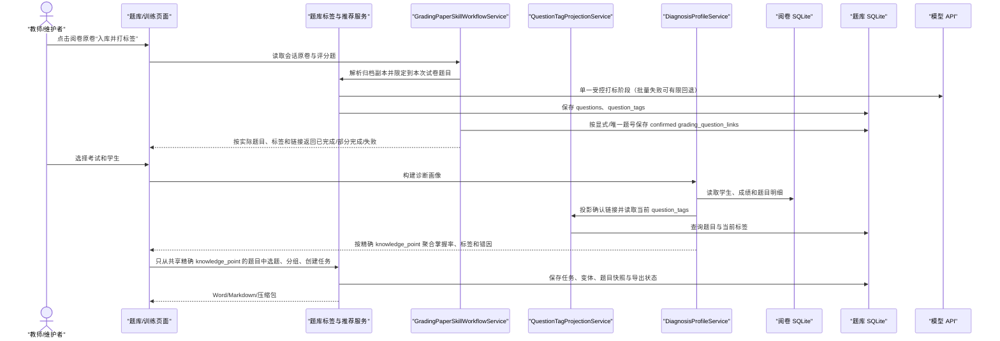
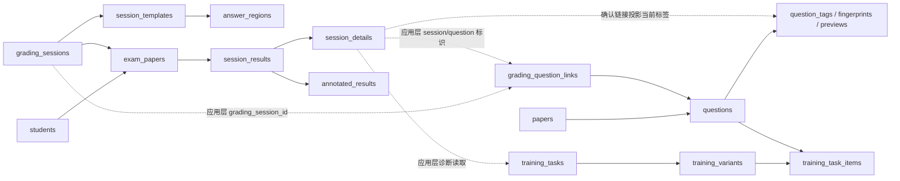

# AI 阅卷系统工作机版架构说明

> 本文档描述仓库当前的实际实现，不是目标架构设计稿。已确认事实与待确认事项分开记录；风险项不代表本次已实施修复。

## 0. 文档状态与证据

- **适用版本：** `VERSION` = `v1.5.0`
- **核验基线：** 最新 `origin/main`
- **最后核验日期：** 以本文件最近一次 Git 变更为准
- **核验方式：** Codex 静态代码/配置/测试调查、Python AST 导入图分析、便携运行时版本查询、SQLite 数据库副本 Schema/幂等初始化验证、全量与定向自动化测试、真实 Streamlit 浏览器流程验证
- **当前状态：** 本文只描述已进入共同基线的实现事实；动态执行进度见 `docs/superpowers/packages/EXECUTION_INDEX.md`
- **既有题库语义边界：** 在隔离分支把题库当前 `question_tags` 设为批改上下文、知识图谱和训练推荐的唯一活动语义来源；旧技能目录、概念映射和相关表保留一个版本作为只读回退，不再参与活动图谱/推荐
- **P1-15 增量边界：** FastAPI 只公开试卷、题目分页/详情、当前标签、富文本/预览元数据和受控图片 GET；源题库通过有界 M1-W1-W2-M2 临时快照读取，SQLite 不打开源 main/WAL/SHM，持续变化以脱敏 503 fail closed
- **P1-16 增量边界：** FastAPI 增加教师确认标签、带 revision 的题目软删除/恢复、受控 DOCX/PDF 流式暂存和 pending 导入请求；不执行长导入、不调用 AI、不写旧技能表，写入冲突以 409 fail closed
- **P2-01 增量边界：** 仓库增加尚未切入生产的 `frontend/` Vue 3/TypeScript/Vite 空工程；直接依赖、npm 11.8.0 与锁文件固定，提供 lint/typecheck/unit/Chromium e2e/build 和 loopback `/api` 开发代理；便携发布只携带已构建的 `frontend/dist`，当前不切换 `运行.bat`、不实现页面视觉、App Shell 或 API client
- **P2-02 增量边界：** `frontend/` 已把 `STYLE.md` 固化为唯一 CSS Token、按需 Element Plus 主题、字段/状态徽章/空加载错态/反馈基础控件和组件展示页；具备对比度、Token 散落值、键盘焦点与五视口无溢出守卫，但仍不实现 App Shell、API client、业务页面或生产入口切换
- **P2-03 增量边界：** `frontend/` 已增加 App Shell、集中式导航与路由、404、桌面响应式侧栏和当前考试 Pinia 上下文；浏览器只持久化经 `/api/sessions` 成功校验的考试 ID，失败时不把候选暴露为当前选择。当前仅支持宽度不低于 1024px 的 Windows 桌面浏览器；P2-03 交付时的 sessions 专用窄适配器已由下列 P2-04 统一 Client 承接，业务页面和生产入口仍未切换
- **P2-04 增量边界：** `frontend/` 已增加唯一原生 Fetch Client、统一脱敏 `ApiError`、sessions 运行时契约复用和 Pinia Job Store；Client 只接受同源 `/api/` 路径，只对 GET 临时失败有界重试。浏览器只持久化自己记录的 Job ID/类型/时间，刷新后按 ID 恢复；每 Job 单轮询，取消仍以服务器终态为准。本包不新增可见 UI、业务页面、后端契约、生产入口或真实数据操作
- **P2-05 增量边界：** `frontend/` 已增加只读单题复核队列样板页，复用既有 review questions/items GET 契约，提供题目选择、姓名/学号/班级搜索、待复核筛选、稳定排序、每页 100 条分页、URL/Store 同步和上一/下一及 J/K 连续导航。1000 条生成数据与五档桌面视口已验证左队列独立滚动、当前行和右侧摘要同时可见；本包不加载答卷媒体，不提供调分、确认或其他写入口，也不切换生产 UI
- **P2-06 增量边界：** `frontend/` 已在只读单题复核队列内增加答卷证据查看器，只使用既有受控媒体 URL 显示裁剪图、原卷正面和可用时的原卷背面；支持适应宽度、原比例、10%—400% 缩放、90° 旋转、拖拽、指针位置缩放和局部键盘操作。页面同时只挂载一张活动图片，并最多预加载相邻两张裁剪图；记录/来源切换会重置视图并隔离旧响应，失败信息脱敏且可安全重试。本包不使用 Canvas 改写图像，不持久化查看状态，不提供调分、确认或其他写入口，也不切换生产 UI
- **P2-07 增量边界：** `frontend/` 已在单题复核样板页右栏接入当前题评分标准、AI 初评与证据、风险摘要、教师最终分草稿和单条安全确认。草稿只驻留浏览器内存，切换记录时保留；确认失败不丢输入，成功后以教师分覆盖 AI 建议并进入预先确定的下一份，写请求不自动重放，后续队列或批注刷新失败不会误报评分失败。本包只复用既有配置、Review GET 和 confirm POST，不新增后端契约、评分规则或数据库迁移，也不切换生产 UI
- **P2-08 增量边界：** 单题复核样板页已把 J/K、搜索、答卷缩放和唯一的 Enter“确认并下一份”动作统一为页面级快捷键，并提供可换行的真实快捷键说明；Shift+Enter 与 `R` 均不执行操作，也不新增“重新标记待复核”状态。`frontend/demo/` 提供只绑定 `127.0.0.1:4188` 的固定匿名正式验收服务，数据与确认只驻留进程内存，媒体由程序生成，支持重置及受限的慢加载/空队列/失败/批注重试模式；五种桌面视口、刷新恢复和异常门禁均已自动验证。该服务不读取数据库、不调用模型、不切换生产 UI
- **P2-14 增量边界：** 后端增加由 Streamlit 与 FastAPI 共同复用的只读会话分析服务，并公开 Job 安全摘要列表、工作台概览、会话异常、题目分析和学生明细五个 GET；Job、异常和学生公开结果只保留页面所需的脱敏字段。Vue `/workbench` 以“批改进度—行动带”组织当前考试进度、待复核、异常、最近任务、题目/学生下钻和最近考试，并仅在选择班级后复用既有 Graph POST 读取标签覆盖与证据；各区独立加载，旧请求和跨考试/班级响应不能覆盖当前内容，更新失败时保留同一范围最后一次成功数据。该增量不增加数据库 Schema、统计口径、业务写语义、模型调用或前端依赖，生产 UI 仍未切换
- **P2-09 增量边界：** FastAPI 已增加可恢复考试草稿、受控 DOCX/PDF 来源、服务器本地拆题、来源生成、revision 化 Rubric 编辑与保存投影；同一考试只允许一个活动配置生成/完善/重试任务，逐题部分失败在返回前复核活动来源且只重试所选题，整卷模式只发一次模型请求，配置与来源只在完整成功后原子绑定。完整生成与人工保存都沿用样卷映射三态结果；刷新失败时已保存配置不回滚，Job 结果保守持久化为需重新确认。上传或生成写响应丢失后，浏览器先按精确请求令牌查询；只有服务器原子保留尚未出现的令牌后才解除页面锁，迟到的同令牌写入返回 409，避免“查询 404 后原请求又成功”造成重复任务。Vue `/sessions` 是连续四阶段考试配置工作台，浏览器只持久化 session/source/job 引用和无敏感核对决定，未保存答案只驻留内存；409 不自动覆盖，422 可定位到允许编辑的字段。生产入口仍为 Streamlit，Vue 未切换为生产 UI
- **P2-10 增量边界：** FastAPI 已增加双页样卷 PDF 安全上传、第一页正反面角色选择、受控页面图片、脱敏工作区、revision 草稿冲突、显式丢弃、正式提交和快照补写；每次上传先整体发布一个不可变模板版本，再由数据库原子切换当前版本，进程中止不会覆盖旧模板。上传单赢家由进程退出时自动释放的操作系统文件锁保证，请求令牌同时绑定由服务器复核的 PDF SHA-256 内容指纹，数据库确认启用后才形成可恢复的成功历史；遗留 `processing` 可在确认原进程已退出后安全接管。Vue `/sessions/:sessionId/regions` 直接复用既有原生 JS/SVG 几何核心，提供原图像素画框、题号绑定、同题多框确认、草稿自动保存、409 停写和正式只读态；`/sessions` 增加第五阶段入口。浏览器只持久化考试编号和随机上传令牌以恢复未知结果，公开响应不包含模板、映射、草稿或快照的本机路径。该增量不增加数据库 Schema、不改变评分语义、不切换生产 UI，也不包含 P2-11 的整班答卷上传和扫描预检
- **P2-11 增量边界：** FastAPI 已增加会话级整班答卷工作区：原始 PDF/JPG/PNG 由服务器托管，按内容 SHA-256 去重，草稿批次可删除/清空，预检开始后冻结；公开响应只返回安全文件信息、受控预览 URL、revision 化人工决定、扫描摘要和当前批次预检 Job 的安全投影，不接受浏览器提交本机目录。预检提交与新建批次共用同一会话锁，活动预检阻止切批，发布扫描快照前再次核对批次身份；失败或重启后可由服务器状态重新预检。预检异常可以匹配学生、标记无效或保持待处理；启动批改前必须携带当前上传/决定 revision，并对仍待处理数量显式确认，任一 revision 变化都会使确认失效。批改运行继续以 `GradingRunStore` 为答卷计数真相、Job 为执行载体，公开摘要合并两者并提供安全暂停、同 run 继续、取消终结和保留原模式的失败项重试；继续运行前精确核对当前批改配置，完成结果在取消竞态中优先于未确认的取消标记。正常完成或部分失败后另有“补批新匹配答卷”动作，沿用原模式且只处理从未进入既有批改来源的新匹配扫描，与失败项重试互不混用；已取消运行仍要求新建批次。Vue `/sessions/:sessionId/grading-run` 使用左侧“装订边运行轨”串联上传、预检、双模式启动和运行/补批，从工作台与已完成样卷配置进入；“整卷批改”和“混合批改”并列保留，`/grading` 仍是批后评分复核。该增量不增加数据库 Schema、不改变 OCR/匹配/评分算法、不切换生产 UI，也不触碰真实 `user_data/`
- **P2-15 增量边界：** Vue 增加独立只读 `/knowledge-graph` 页面和工作台受控入口，严格复用现有 sessions、students、Graph rows/evidence 契约，支持当前/指定/跨考试与班级/单学生/已选学生范围。Canvas 图模式把精确 `knowledge_point` 标签放入四档得分率证据带且固定 `links=[]`；分组树只在浏览器内临时构造“筛选范围 → 学生 → 精确标签”虚线，并常驻声明其不是父子、先修或相关知识关系。文字目录、节点事实和分页证据与同一范围绑定，旧请求不得串入新范围；前端继续拒绝非空 `edges`。该增量不修改 API、数据库 Schema、关系语义、统计公式、业务写入、模型调用或生产 UI 切换
- **Phase 2 前端来源重校准边界：** P2-03 至 P2-08 的实现、合并、快捷键、验收服务和五档桌面视口等既有证据都保留为客观历史事实；这些 Vue 行为共同构成待核验能力清单、审计输入和复用候选，不能单独证明业务规则或自动成为后续页面范式。现有 Streamlit 行为、服务实现、数据库契约和测试提供业务能力、数据语义、结果和安全边界的基线，但旧 Streamlit 与既有 Vue 都不是逐屏、逐控件、逐点击的复刻模板；组件复用只是实现偏好，在业务等价且安全边界不降低的前提下，合理 UX 理由可以支持重构或替换外壳与组件。2026-07-14 用户确认：按题号批量比较和复核是默认可达的业务能力，但新页面的布局和操作顺序应按任务效率与上下文连续性重新设计，单份详情只作为可选入口或异常深查；`docs/ui/STYLE.md` 仅约束视觉，完整 AI 概念图退出活动参考集。P2-09 等复杂页面在一次性非正式来源重校准门槛通过前保持阻断，门槛状态见执行 Index
- **P1-17 增量边界：** FastAPI 增加 `config_generation` Job；生成输入以服务器 ID 原子暂存，Job payload 不保存密钥、试卷正文或客户端路径，部分题失败只发布可重试草稿，失败题清零后才原子发布 rubric/answer_key 并绑定会话
- **P1-18 增量边界：** FastAPI 增加独立的 `question_import` 与 `tagging_sync` Job；前者只消费 P1-16 服务器导入请求，后者只消费题目 ID 并分批调用现有打标服务。两类任务复用通用查询/取消，支持受控重试和脱敏部分失败摘要；打标仍只有 `complete` 才保存且不运行旧技能消歧，当前不切换 P1-24 LLM Gateway
- **P1-19 增量边界：** FastAPI 增加 Training 诊断、推荐预览和训练任务确认/分页/详情 API；诊断只走现有 `question_tag` 主路径，推荐固定精确 `knowledge_point`、`exact_only` 且禁止 broad/legacy/skill 回退。任务确认以 UUID 唯一代码和计划 revision 幂等写入题库，客户端不能指定 `created_by`；公开任务快照移除源文件和输出路径
- **P1-20 增量边界：** FastAPI 增加 `training_export` Job 的专用提交和失败/取消重试；只消费服务器 Training task/variant ID，复用现有 Word/Markdown 与整任务 ZIP bundle。导出先写 job 临时目录，在协作式取消边界后原子发布到 `outputs/training`；公开 Job 结果只返回记录 ID、安全文件名和受控下载 URL
- **P1-21 增量边界：** FastAPI 增加独立 Graph 只读查询路由；每次请求先把阅卷库与题库的稳定 main/WAL 文件代际捕获到系统临时候选，SQLite 只打开候选，再复用现有 tag-only 诊断一次性生成 profiles、确定性 graph rows、聚合节点和脱敏证据分页。响应固定保留空 `edges` 作为后续契约位置，但不创建关系表、不推断关系，也不读取旧 concept/skill 活动语义
- **P1-22 增量边界：** FastAPI 增加独立 Ops 只读路由；自检只返回版本、逻辑目录可写性、数据库临时候选完整性/迁移摘要、外部工具布尔状态和 API 配置布尔状态，备份清单只返回受限数量的安全文件元数据。数据库 SQLite 不打开真实源库，响应不包含路径、密钥或业务正文，也不提供备份、恢复、迁移、导入导出或命令执行操作
- **P1-23 增量边界：** FastAPI Ops 增加备份、恢复、数据库迁移、数据包导入和导出的严格预检、5 分钟单次确认令牌及五类独立 Job。备份和导出在线原子发布；恢复、迁移和导入只准备待重启清单，由 `运行.bat` 在 API/Streamlit 启动前离线复核、创建最新备份、应用并按 Journal 回退。五类任务、撤销与离线应用共用进程内和跨进程锁；公开结果不返回内部路径。该增量只在临时数据根验证，未对真实业务数据执行任何写操作
- **P1-24 增量边界：** `backend/llm/` 增加统一模型请求策略核心、安全 API profile 覆盖、Chat Completions/Responses 协议适配、有限重试分类、按配置与请求类型共享的节流、逻辑请求 ID 和统一脱敏用量事件；根目录 `LLMClient` 兼容入口保留，SDK 自动重试关闭，参数兼容与 JSON 修复次数不扩张。本包只使用假客户端验证，未调用真实模型。选择、填空、批量客观题和题库 AI 打标四条直连调用链，以及批量客观题的 `timeout=None`，仍保留给 P1-25 迁移和清零
- **P1-25 增量边界：** 选择、填空、批量客观题与题库 AI 打标的第一方 SDK 直连均已迁入 `LLMGateway`；Chat Completions 识别请求使用有限 recognition 策略，Responses 打标请求使用有限 tagging 策略，SDK 自动重试固定关闭，第一方 Python 已无 `timeout=None`。原 prompt、请求参数、解析、评分、fallback、批次大小、worker 与业务 RPM 规则保持不变；客观题批量及其 root `LLMClient` 备用路径把原三次外层尝试转交 Gateway，其他兼容调用方仍默认单次委托，避免重试倍增。验证只使用假客户端、临时文件和数据库副本，真实两库文件指纹未变，未执行真实 API 健康检查
- **P1-26 增量边界：** FastAPI 与五类目标 SQLite 连接边界增加可选请求测量；生产默认关闭，关闭时不安装 trace callback，也不改变响应或 OpenAPI 契约。版本化基线使用固定生成数据运行 `small`、`medium`、`large_5pct` 三个命名工作负载的 16 个只读场景，汇总语句总数、SELECT 语句数、返回记录数、响应字节和机器相关延迟；三个名称不表示单调规模序列，`large_5pct` 是用户把原大型档各计数按 5% 向上取整后的覆盖。聚合 JSON/Markdown 位于 `docs/performance/p1-26-api-db-baseline.*`；每个文件通过同目录临时文件和 `os.replace()` 单独原子替换，捕获到 `BaseException` 时尝试恢复旧成对版本并清理临时/恢复文件，但突然终止或掉电可能在两次替换之间留下新旧混合，下次使用前应重新生成或人工核对。本包不实现跨文件事务，也未实施优化、缓存、索引、连接池或 Schema/SQL/业务语义变更，未读取或写入真实业务数据，也未调用模型。
- **P1-27 增量边界：** `POST /api/training/diagnosis`、`POST /api/training/plans/preview` 与 `POST /api/graph/{profiles,rows,evidence}` 每个请求分别捕获阅卷库和题库临时候选，并由请求上下文各自拥有一条 `mode=ro`、`query_only`、显式稳定读事务连接；服务只借用连接，请求结束统一关闭连接并清理候选。Streamlit、旧构造方式、`POST /api/training/tasks` 和其他写事务保持原行为，不引入跨请求连接池或缓存。生成数据聚合对比位于 `docs/performance/p1-27-request-connection-comparison.*`；验证只在临时/生成数据库执行写入，真实根与功能工作区两库仅做只读指纹核对且保持不变。
- **P1-28 增量边界：** `tests/api_e2e/` 使用临时双库、合成图片和假外部模型串联配置与评分依据、模板/答题区域、扫描匹配、部分批改失败与 failed-only 恢复、教师复核、真实 XLSX 导出/下载和 Job 重启恢复；FastAPI、现有服务、JobManager 与数据库编排仍在真实调用链内。E2E 不调用真实模型、不读取或写入真实业务数据，也不改变业务规则、API 契约或 Schema。
- **P1-29 收口边界：** Phase 1 组合门槛复核 P1-26 优化前基线、P1-27 请求级只读连接与 P1-28 五流程 E2E，并通过受影响回归、OpenAPI/`timeout=None` 门槛和完整 smoke。`tools/p1_29_acceptance.py` 只从完整 Git SHA 在系统临时目录生成匿名源码/数据副本，排除并二次拒绝 `user_data`，把项目模块、API profile、Ops state、日志和双库全部限制在副本内，清空继承的敏感 Key，在交接前把日志中的临时工作区、功能仓库和运行时仓库绝对根替换为逻辑占位符，再以 loopback 启动真实 Uvicorn 与 Streamlit；两名合成学生的最终结果固定为 90/70。该工具只服务正式验收，不改变生产启动入口、API、评分规则或 Schema；自动门槛、独立复审、用户验收和阶段状态只在即时计划、版本化清单与执行 Index 中维护。

### 主要证据

| 类型 | 证据 | 用途 | 状态 |
|---|---|---|---|
| 工程规范 | `AGENTS.md`（`CLAUDE.md` 为兼容指针） | 分层、数据、安全、验证、文档与前端设计要求（当前 AI 协作入口） | 已核验 |
| 启动与运行 | `运行.bat`、`run_desktop.py`、`web_app.py`、`main.py` | 主入口、监听地址、运行进程和兼容入口 | 已核验 |
| 路径与配置 | `path_manager.py`、`config/app_config.yaml`、`VERSION` | 数据目录、日志目录、版本来源 | 已核验 |
| 阅卷代码 | `grading_service.py`、`hybrid_batch_grading_service.py`、`scanner.py`、`ai_grader.py`、`session_manager.py` | 阅卷主流程、并发、失败和重试 | 已核验 |
| 数据访问 | `db_manager.py`、`question_bank/database/schema.py`、`migrations/` | SQLite 表、约束、事务与迁移 | 已核验 |
| 题库与训练 | `question_bank/`、`integration/`、`pages/题库管理.py`、`pages/训练推荐.py`、`pages/组卷.py` | 题库标签、诊断投影、精确标签推荐和导出 | 已核验 |
| 外部集成 | `backend/llm/`、`llm_client.py`、`api_profiles.py`、客观题识别链、题库 AI 打标服务 | 模型协议、策略、密钥来源、超时、节流、用量与降级 | 已核验代码和假客户端；未调用真实 API |
| 本地运行时 | `runtime/python` | Python 3.12.1、SQLite 3.43.1、Streamlit 1.58.0、OpenAI SDK 2.43.0 等实际版本 | 已核验 |
| 自动化测试 | `tests/`、`tools/smoke_check.py` 与 `requirements-test.txt` | 业务回归、静态编译、迁移与数据库副本完整性；完整 pytest 默认串行，显式试点可把隔离测试交给 2 个进程并将数据库/端口/进程类测试留在串行车道 | 以最新里程碑稳定候选或共同基线的测试结果为准 |
| Phase 1 收口 | `docs/performance/p1-29-phase1-closeout.md`、`docs/user-testing/checkpoints/P1-29-v1.5.0-phase1-formal.md` | P1-26/27/28 组合门槛、匿名双入口、已知限制和正式用户结论 | 稳定证据入口；动态复审和验收状态见即时计划与执行 Index |
| 浏览器验证 | Streamlit 本机页面、现有工作区数据 | 部分覆盖提示、标签诊断空态、学生选择交互、1366×768/1440×900/1920×1080 | 已核验；无横向溢出，浏览器控制台无应用错误 |
| 数据库副本 | `grading_system.db`、`question_bank.db` 的临时副本 | 新字段、新索引和重复初始化幂等性 | 已核验；副本验证前后主工作区两库哈希均未变化 |
| 运维文档 | `README_*.md`、`docs/maintenance/*.md`、发布清单 | 便携发布、备份、存储策略 | 已核验；存在版本漂移 |

### 未确认事项

| 事项 | 影响 | 验证方式 | 状态 |
|---|---|---|---|
| 当前生产使用的模型供应商、模型名和 SLA | 影响超时、兼容参数、成本和数据出境判断 | 在不暴露密钥的前提下核对实际配置并执行受控 API 健康检查 | 待确认 |
| 备份恢复是否做过真实恢复演练 | 影响灾难恢复可信度 | 在隔离副本执行备份、恢复和一致性检查 | 待确认 |
| 当前打包目录是否与最新源码同步 | 发布清单生成于 2026-06-04，而核验提交更晚 | 重新执行受控打包和发布验收 | 待确认 |

## 1. 项目目标与范围

### 已确认目标

系统面向本机使用的教师工作流，用于把试卷、答案、学生答卷和学生名单组合成可复核的阅卷结果，并进一步沉淀题库、知识点标签诊断和训练材料。页面文案包含“教师”和“管理员”操作，但代码中没有对应的身份认证或角色授权；这些是工作流称谓，不是安全角色。

主要能力包括：

1. 从 Word/PDF 生成并人工确认评分依据、答案和答题区映射。
2. 扫描答卷、识别姓名、匹配学生，执行整卷或混合批改。
3. 标记低置信、异常或不完整结果，支持人工调分、失败重试和报告导出。
4. 导入本地真题，保存题目、图片/富文本、标签、频次和预览。
5. 将阅卷题目确定性关联到题库题目，以题库当前 `knowledge_point` 标签生成个人/分组训练任务和 Word/Markdown 产物。
6. 在本地完成数据库备份、恢复、迁移和数据包导入导出。

### 当前实现边界

- 这是仅供单用户在个别受信任 Windows 工作机运行的本地应用，不存在独立部署的生产前端或远程数据库；Streamlit 与增量 FastAPI 均只监听 loopback。`frontend/` 已提供可重复构建的 Vue 工程基础、设计 Token、基础控件、App Shell、路由、当前考试上下文、连续考试配置与样卷题框工作流、工作台、只读知识图谱，以及带答卷证据查看器和教师评分确认的复核页，但 Vue 尚未成为生产 UI。
- 主入口是 `运行.bat`：默认并行启动 `python -m streamlit run web_app.py`（8501）和增量 FastAPI 本机 API（8000，包含健康检查、基础 sessions/students/config/template/regions、JobManager、config-generation/report/scan/grading/review/media/files/question-bank 路由，可用 `START_API=0` 跳过）；`run_desktop.py` 是另一套桌面/冻结构建启动器，`main.py` 是较早的命令行批改入口。
- 核心状态保存在两个 SQLite 数据库和 `user_data/` 文件树中。
- AI 能力依赖可配置的 OpenAI 兼容 HTTP 接口；当前代码路径使用 OpenAI Python SDK 的 Chat Completions 和 Responses API。
- 公网访问、多用户/多租户、集中式账号体系、跨机器共享写入和无人值守任务队列不在当前范围内。
- “客观题准入向导”不属于当前使用流程；相关入口和辅助代码属于待清理的停用实现。

### 已确认的关键规则

| 规则 | 实现/证据 | 状态 |
|---|---|---|
| 正式批改前必须确认样卷模板和答题区映射 | `GradingService.run_session_grading()` 调用 `DBManager.is_template_ready()` | 已核验 |
| 评分依据来自 Word/PDF 生成配置，样卷阶段只负责版面和题框 | `web_app.py`、`template_analyzer.py` 页面与注释 | 已核验 |
| 未匹配名单的答卷保存为 `unmatched/skipped`，不进入正式批改 | `grading_service.py` | 已核验 |
| 试卷处理状态至少包含 `pending/grading/graded/failed/skipped` | `grading_service.py`、`db_manager.py` | 已核验；数据库无枚举约束 |
| 批改结果必须经过完整性审计；局部失败可保留为需复核结果 | `grading_completeness.py`、混合批改与失败重试测试 | 已核验 |
| 旧技能目录的 `legacy/shadow/skill` 切换只保留为一版本回退能力，不控制活动图谱或推荐 | 显式 `build_legacy_profiles()` / `build_skill_profiles()` 与迁移工具 | 已核验 |
| AI 题库标签只有质量状态为 `complete` 才自动保存 | `is_auto_saveable_result()` | 已核验 |
| 题库标签保存默认只更新 `question_tags`，不运行旧技能 AI 消歧或写 `question_skill_links`；旧双写仅允许显式启用 | `QuestionService.save_tag_analysis(resolve_skills=False)`、旧双写兼容测试 | 已核验 |
| 保存评分依据时先本地归档原始 DOCX/PDF，但题库导入与 AI 打标签只在教师点击按钮后执行 | `web_app.py`、`source_paper_archive_service.py`、`grading_paper_skill_workflow_component.py` | 已核验 |
| 题库入库不是批改前置条件；未处理、部分完成或失败状态不阻断批改、复核和导出 | `web_app.py`、工作流 UI 契约测试 | 已核验 |
| 活动知识图谱与训练推荐只读取确认来源链接所指题目的当前精确 `knowledge_point` 标签，不提交 AI 做二次匹配 | `QuestionTagProjectionService`、`build_tag_profiles()`、`build_question_tag_graph_rows()`、标签推荐测试 | 已核验 |
| 批改模型接收题库标签上下文，只返回主错因和最多两个次要错因，不生成知识点/技能身份 | `grading_service.py`、`ai_grader.py`、`hybrid_batch_grading_service.py` | 已核验 |
| 会话 `completed` 表示本次批改运行已经结束，允许同时存在失败答卷 | 用户于 2026-06-28 确认；失败答卷由 `exam_papers.processing_status` 单独记录 | 已确认 |

## 2. 系统上下文



### 外部参与者与系统

| 对象 | 作用 | 数据方向 | 认证/边界 | 证据 |
|---|---|---|---|---|
| 单用户教师/维护者 | 在个别受信任工作机上配置、批改、复核、导出和运维 | 浏览器与本机应用双向 | 无应用登录；依赖工作机账户和 loopback 边界 | 用户确认、Streamlit 页面、README |
| OpenAI 兼容模型服务 | 评分依据生成、视觉/OCR、主客观题批改和题库打标 | 试卷文本/图片发出，结构化结果返回 | API Key；Base URL 可配置 | `llm_client.py`、识别链、打标服务 |
| Microsoft Word | DOCX 转 PDF、部分预览/公式保真 | 本地文件与 COM | Windows 本机权限 | `docx2pdf.ps1`、`rubric_auto_cropper.py`、`preview_service.py` |
| LibreOffice | DOCX 预览转换的可选替代 | 本地文件与子进程 | 本机可执行文件 | `preview_service.py` |
| `pdflatex` | 公式转图片的可选优先路径 | LaTeX 文本与临时文件 | 本机可执行文件 | `question_bank/exporters/base_exporter.py` |

## 3. 逻辑视图与模块边界

### 核心领域

| 领域 | 主要职责 | 主要实现 | 当前边界情况 |
|---|---|---|---|
| UI 与工作流编排 | 页面状态、上传、进度、确认、复核、导出 | `web_app.py`、`pages/`、`pages_shared/`、`components/` | 直接访问数据库和部分文件系统，未形成纯 UI 层 |
| 考试配置 | 解析 Word/PDF、生成/规范化 rubric 与 answer key、质量检查 | `backend/config_workspace/`、`backend/api/routers/config.py`、`backend/jobs/config_generation.py`、`session_manager.py`、`rubric_auto_cropper.py`、`score_policy.py` | FastAPI 通过受控来源 manifest、服务器编辑投影、revision 冲突保护和原子发布复用既有规则；旧 Streamlit 入口继续兼容 |
| 模板与答题区 | 模板分析、坐标模型、草稿、提交、快照和编辑器 | `template_analyzer.py`、`answer_region_*`、JS 编辑器 | 已形成相对独立子域；提交采用数据库+文件快照补偿流程 |
| 扫描与阅卷 | PDF 标准页、姓名 OCR/匹配、整卷/混合批改、完整性检查和重试 | `scanner.py`、`grading_service.py`、`ai_grader.py`、`hybrid_batch_grading_service.py`、客观题识别链 | 服务层直接依赖数据库管理器、文件和模型客户端 |
| 人工复核与报告 | 调分、批注、分析、Excel/PDF/原卷导出 | `backend/review/service.py`、`backend/media/service.py`、`backend/files/service.py`、`manual_review_service.py`、`annotation_renderer.py`、`analytics.py`、`report.py`、`original_paper_exporter.py` | FastAPI 复核由应用服务集中判定/校验，单 JOIN 读取，跨 result 调整在一个 SQLite 事务提交；批注是事务后可重试补偿。媒体/下载只接受语义化 ID，在受控根与扩展名白名单内解析；报告查询与 Streamlit UI 编排仍有部分留在 `web_app.py` |
| 题库 | 试卷导入、题目 CRUD、标签、频次、预览、富文本和组卷 | `question_bank/importers`、`services`、`exporters`、`pages/题库管理.py`、`pages/组卷.py` | P1-15 的 `QuestionBankReadService` 通过稳定文件捕获提供零源写入读投影；P1-16 的 `QuestionBankWriteService` 只承担教师确认标签、乐观软删除/恢复和受控导入请求准备。既有 Streamlit 写服务保持兼容，长导入仍未迁入 API Job |
| 标签投影 | 确认来源题关联、子题继承父题关联、读取题库当前标签 | `integration/question_tag_projection_service.py`、`SourceQuestionLinkService` | 只接受显式或题号唯一对应，不做语义匹配；每次查询实时读取标签 |
| 诊断与训练 | 跨库读取阅卷证据、按精确知识点标签聚合、精确标签候选推荐、训练任务和导出 | `integration/`、`question_bank/recommendation`、训练服务、`backend/jobs/training_export.py`、`backend/api/routers/training.py`、`pages/训练推荐.py` | FastAPI 复用现有服务提供 tag-only 诊断、推荐预览、幂等任务确认和可取消/重试的导出 Job；通过应用层同时访问两个数据库，无跨库事务和外键；真实训练结果回流尚未进入 API |
| 原卷标签工作流 | 原卷归档、题库导入、受控 AI 打标、来源题确定性关联、状态重算和重试 | `integration/grading_paper_skill_workflow_service.py`、共享 Streamlit 组件、题库导入/链接服务 | 两库不能共享事务；每次运行后从实际题目、标签和链接重算 `ready/partial/failed` |
| 旧技能与知识对齐（回退） | 统一技能目录、旧知识映射、技能链接、冲突和迁移 | `question_bank/models`、`taxonomy`、技能/对齐服务 | 保留读取与迁移工具；活动图谱/推荐不读写这些身份，题库标签保存也只在显式 `resolve_skills=True` 时双写 |
| 数据与运维 | 路径、SQLite、备份、恢复、迁移、存储审计和数据包 | `path_manager.py`、`db_manager.py`、`question_bank/database`、`update_tools/`、`tools/` | 运行时建表与 SQL migrations 两套机制并存 |

### 主要依赖关系



实际边界偏差必须保留为事实：

- `web_app.py` 直接导入 `DBManager` 和题库数据库路径；`pages/训练推荐.py` 直接使用两个数据库；题库和组卷页面也直接持有数据库路径。
- `db_manager.py` 反向依赖 `ai_grader` 的结果模型和 `scanner.ExamPaperGroup`，数据访问层不是独立底层。
- 题库服务大多直接执行 SQL，`question_bank/database/schema.py` 只提供连接和建表，不是完整数据访问层。
- 外部模型调用未完全收敛到 `LLMClient`：选择/填空/批量客观题识别和题库打标部分路径会直接实例化 OpenAI 客户端。
- AST 静态导入图存在两组循环耦合：Schema 与技能目录服务、题目服务与题目频次服务。当前通过函数内延迟导入避免了直接初始化死循环，但仍增加演进风险。

### 当前应维持的边界

1. 页面层可调用工作流/领域服务；新增复杂业务规则不应继续写进页面。
2. 新服务不应依赖 Streamlit、DOM 或具体组件。
3. 数据库连接、SQL 和文件路径解析不应进一步散落到新页面。
4. 两个 SQLite 数据库之间只通过应用层 ID/快照关联；任何跨库更新都必须显式处理部分成功。
5. 答题区正式数据以数据库为主，JSON 快照是可恢复的发布产物；不得绕过提交服务同时手写两者。
6. `PathManager` 是新增持久化路径的唯一入口；兼容代码可继续读取 `AI_GRADING_DATA_DIR`。

## 4. 开发视图

```text
AI阅卷系统_工作机版_v1.5.0/
├── web_app.py                     # Streamlit 主页面和主工作流编排
├── backend/api/app.py             # 增量 FastAPI 本机 API，统一错误体、同步/媒体/下载/question-bank 路由和 JobManager 入口
├── backend/public_data.py         # API 公开 payload/result/复核元数据的共享敏感键与路径净化
├── backend/file_access.py         # 受控根、旧路径映射与扩展名白名单守卫
├── backend/media/                 # review 原卷/批注页读取与内存裁剪服务
├── backend/files/                 # Job 导出文件下载服务
├── backend/config_workspace/      # P2-09 草稿、受控来源、Rubric 编辑投影与原子发布
├── pages/                         # 题库、组卷、训练推荐、技能管理、系统自检
├── pages_shared/                  # 多页面共享样式与组件
├── components/answer_region_editor/ # 答题区自定义前端组件
├── frontend/                       # Vue 工程、设计 Token、App Shell、统一 Client、考试配置、样卷题框、工作台、只读知识图谱、复核页与匿名浏览器验证；生产切换前仅开发构建使用
├── grading_service.py             # 阅卷会话主编排
├── scanner.py                     # 扫描页标准化、姓名识别与配对
├── ai_grader.py                   # 单份答卷评分模型与校验
├── hybrid_batch_grading_service.py # 混合批改批处理
├── session_manager.py             # 评分依据与答案生成/规范化
├── answer_region_*.py             # 答题区模型、草稿、锁、提交和 UI
├── db_manager.py                  # 阅卷库 Schema 与查询/写入
├── question_bank/
│   ├── database/                  # 题库连接与 Schema
│   ├── models/                    # 题目、标签、知识、技能模型
│   ├── importers/                 # DOCX/PDF 导入
│   ├── services/                  # 题库、技能、对齐、训练及严格只读 API 读模型
│   ├── recommendation/            # 诊断候选、评分与练习计划
│   ├── exporters/                 # Word/Markdown 导出
│   └── taxonomy/                  # 内置技能目录与注册表
├── integration/                   # 阅卷库与题库/训练之间的适配
├── migrations/                    # 阅卷库、题库 SQL 迁移
├── update_tools/                  # 更新、备份、恢复和迁移 CLI
├── tools/                         # 存储与 Git 数据策略检查
├── tests/                         # 单元、集成、契约和回归测试
├── config/                        # 非敏感应用路径配置
├── user_data/                     # 持久化业务数据、密钥和生成资产
├── runtime/                       # 便携 Python 运行时（Git 忽略）
└── docs/                          # 设计、计划、维护与操作文档
```

### 维护热点（2026-06-28 实测行数）

| 文件 | 约行数 | 混合职责 |
|---|---:|---|
| `web_app.py` | 9,581 | UI、流程编排、上传、数据传输、复核和导出 |
| `session_manager.py` | 4,422 | 文档解析、模型提示、重试、规范化、评分分配和文件写入 |
| `db_manager.py` | 2,983 | Schema、迁移兼容、备份、多个聚合根的查询与写入 |
| `pages/题库管理.py` | 2,761 | 题库导入、打标、筛选、批处理和管理 UI |
| `pages/组卷.py` | 1,802 | 候选查询、试题篮、预览、导出和历史记录 UI |
| `question_bank/recommendation/practice_plan_service.py` | 1,323 | 新旧推荐模式、分组、选题和解释数据 |
| `hybrid_batch_grading_service.py` | 1,219 | 图像切片、并发请求、客观/主观合并和结果组装 |
| `scanner.py` | 1,205 | PDF 渲染、OCR、姓名匹配、页配对和序列化 |

## 5. 运行视图

### 5.1 启动

1. `运行.bat` 选取 `runtime/python/python.exe`，设置 `AI_GRADING_DATA_DIR=user_data`，默认监听 Streamlit `127.0.0.1:8501`。
2. 当 `START_API` 未设为 `0` 时，`运行.bat` 同时用 uvicorn 启动 `backend.api.app:app`，监听 `127.0.0.1:8000`；FastAPI lifespan 创建 app-owned JobManager、把旧 queued/running 任务标为 failed，并清理普通生成/完善任务独占的中断输入，retry 共享输入继续保留；随后在退出时关闭线程池。JobManager 的 queued/paused 取消可立即终止，running 只记录请求，必须由 handler 在安全边界确认 cancelled；包括 `CancelledError` 在内的 handler 退出都必须落入终态，完成 future 通过锁外 callback 按对象 identity 回收。当前 API 已提供健康检查、sessions/students/config/template/regions、JobManager、report/scan/grading/review/media/files/question-bank/training/graph/ops 等增量路由。
3. Streamlit 导入 `web_app.py`；模块加载时 `PathManager` 根据 `config/app_config.yaml -> AI_GRADING_DATA_DIR -> user_data` 的顺序解析路径。
4. `main()` 调用 `ensure_env_ready()`：创建目录、对已存在阅卷库执行每日一次启动备份、运行 `DBManager.initialize()` 的幂等建表/补列逻辑。
5. 题库数据库不是主页面启动时统一初始化，而是在题库、组卷、诊断或导入服务使用时由 `initialize_database()` 初始化并播种内置技能目录。
6. P1-15 的 Question Bank GET 不调用 `initialize_database()`，也不触发元数据、指纹、考频或技能播种写入。每次请求把源 main 与可选 WAL 按 M1-W1-W2-M2 捕获到系统临时目录，经 `quick_check`/必要表校验后只打开候选；源变化最多重试 4 次/5 秒，持续变化返回 503。P1-16 的轻写 API 使用题目状态与当前标签生成不透明 revision，在 `BEGIN IMMEDIATE` 内比较后精确保存教师标签或切换软删除状态；相同目标重试幂等，冲突返回 409。
7. P1-16 的导入准备只把 `.docx/.pdf` 以 200 MiB 上限流式写入数据根内受控暂存目录，并按内容哈希验证后发布确定性 pending 请求。路径经过 canonical root 与 junction/symlink 守卫；本阶段不解析、导入或 AI 打标。
8. P1-17 的配置生成端点把确认题块、试卷文本和可选题图写入受控配置目录，Job 数据库只记录会话、模式和服务器输入 ID；通用 Job 提交端点拒绝该类型，防止正文或客户端路径绕过专用校验进入 payload。Job 复用当前 API profile 与 `session_manager`；协作式取消在模型调用返回后的安全边界确认，不强杀单次外部请求。部分失败草稿不替换会话配置；单题/多题重试保留未选失败项，同一个部分结果通过数据库事务只允许一个有效重试后继。最终发布以开始时的配置路径为乐观校验，在同一个 SQLite 事务内同时绑定 rubric/answer_key 并把 Job 置为 succeeded；会话被删除、人工改配或被更快 Job 更新时，旧 Job 回滚且清理未绑定文件。
9. P1-18 的题库导入 Job 在执行前重新计算服务器请求 ID，并校验 P1-16 请求清单、上传哈希和受控路径；同一导入请求与具有重叠题目 ID 的打标任务通过进程内键控锁串行执行，锁按稳定顺序获取、等待时轮询协作式取消，并在最后一个持有者/等待者离开后清理注册项。重复执行再依赖现有来源指纹或完整核心标签跳过副作用。打标 Job 在每个有界批次前后检查协作式取消，取消到达时丢弃当前未保存批次并停止后续批次。Job payload/result 不保存源路径、题干、密钥、模型配置或原始异常，候选加载和 AI 工厂初始化异常也只持久化通用失败文本。
10. P1-19 的 Training API 从同一 `PathManager` 快照构造诊断、推荐和任务服务。推荐预览每次重建当前 tag-only 诊断并返回脱敏计划及 SHA-256 revision；教师确认时再次生成并比对 revision，空计划拒绝写入，相同确认 UUID 依靠 `training_tasks.task_code` 唯一约束收敛到同一任务。任务列表和详情使用只读连接，写入只发生在确认端点。
11. P2-01 前端开发服务器只监听 `127.0.0.1`，把 `/api` 代理到 `http://127.0.0.1:8000`；Node/npm 只用于开发和构建，当前生产启动入口仍不读取 `frontend/dist`。
12. P2-02 的产品色彩、字体、间距、圆角、阴影和动效只在 `frontend/src/styles/tokens.css` 定义；Element Plus 只按展示页需要导入 Button/Input/Icon CSS 并由 `ElConfigProvider` 提供中文配置。状态徽章和反馈均含文字，警告正文使用主文字色满足对比度，AI 与教师语义保持独立。展示页只使用生成文案，不调用 API 或读取业务数据。
13. P2-03 的 Vue App Shell 使用集中式导航和路由，提供工作区占位页、保留的设计系统页、设置入口与 404；Pinia 会话上下文只持久化经 `/api/sessions` 成功确认的考试 ID。
14. P2-04 的统一前端 Client 只允许同源 `/api/` 路径并集中解析脱敏错误；GET 临时失败可有界重试，写请求不自动重放。Job Store 只恢复当前浏览器记录的任务并保证每个 Job 单轮询。
15. P2-05 的 `/grading` Vue 路由是首个已迁移的只读业务切片：页面只调用 review questions/items 两个 GET，筛选、排序、分页和选择回收全部在浏览器内完成；问题/明细 URL 查询参数经过校验并串行同步，在途切换与卸载以 AbortController 和 generation 防止旧响应回写。队列每页最多渲染 100 条，列表与详情独立滚动；快捷键在输入和可编辑上下文中失效。
16. P2-06 的答卷证据查看器直接把既有受控媒体 URL 交给单个活动 ``，不通过 Fetch/Blob/Object URL/Canvas 复制像素；相邻预加载仅保留至多两张裁剪图。缩放、旋转和拖拽状态只存在当前组件内，记录或媒体来源变化立即释放指针捕获并回到适应宽度；generation 和当前 URL 双重校验阻止大图延迟响应污染新记录。查看器局部快捷键不劫持输入框和重试按钮；评分写入仍留给 P2-07。
17. P2-07 的评分检查器在 `/grading` 右栏按当前 `session_id/question_id/detail_id` 建立内存草稿；配置读取只投影当前题或当前 part 的已有评分字段，AI 候选和证据仅作建议。确认调用既有单条 Review confirm POST 且不自动重试；成功后先以教师结果局部更新，再按提交前队列目标导航并刷新，旧响应不得抢走教师后来选择的记录。刷新失败保留成功事实与干净草稿，未确认草稿只在关闭/刷新浏览器前触发标准提醒；活动记录在 API 提供历史前保持明确占位。
18. P2-08 的页面级快捷键总线只在 `/grading` 生效，并跳过输入、按钮和可编辑区域；普通 Enter 在页面非输入区域执行单条确认并按提交前队列前进，最终得分框由局部处理器复用同一动作，Shift+Enter 不提交。固定匿名验收服务只服务构建产物、精确模拟 API、受控 SVG 媒体和两个测试控制端点，静态路径被限制在 `dist`；所有写入只修改内存副本，关闭或重置即恢复固定数据。
19. P2-09 的 `/sessions` Vue 路由按考试草稿、上传与拆题、生成、评分依据四阶段恢复服务器事实。来源上传只发送原始文件和安全文件名，浏览器不提交服务器路径或嵌套 Rubric JSON；逐题部分结果、整卷手动重试、Job 取消竞态和刷新恢复均以服务器终态为准。编辑保存携带不透明 revision，422 只显示允许列表问题并定位字段，409 保留本地修改直到教师二次确认，样卷映射失败不回滚已保存配置。
20. P2-10 的 `/sessions/:sessionId/regions` Vue 路由按当前模板指纹恢复正式区域或兼容草稿。编辑器适配层直接加载既有 `components/answer_region_editor/` DOM/SVG 核心，保存原图像素坐标；浏览器只接收受控图片 URL、尺寸、题号选项、脱敏区域和问题。草稿写入在会话锁内比较 revision 与模板指纹，冲突后停止自动保存并保留内存编辑；正式提交后只读，快照 pending 只触发补写。样卷上传使用精确请求令牌、浏览器计算且服务器复核的 PDF SHA-256 指纹和跨进程文件锁核对未知结果；完整文件包先以不可变版本发布，数据库切换后才记录成功，页面刷新可恢复原令牌，进程中止留下的处理中记录可被下一次上传安全收口。
21. P2-11 的 `/sessions/:sessionId/grading-run` Vue 路由从服务器恢复上传批次、预检决定、当前批次预检 Job 和批改运行账本。上传内容先在会话锁内校验类型、大小和 SHA-256，再原子发布到内容寻址批次；冻结后不再允许修改，预检提交与新建批次在同一会话临界区串行化，活动预检期间不能切批，扫描结果发布前仍须复核批次身份。预检只公开受控媒体引用和脱敏信息，人工决定以扫描快照身份和 revision 防止旧页面覆盖。批改启动不接收客户端路径，暂停、继续、取消、失败项重试和新匹配补批使用 run 专用端点；继续与补批精确核对当前配置，补批只选未进入既有运行的扫描来源并保持首次运行模式。页面左侧运行轨与主工作区保持同一服务器状态，两种评分模式拥有同等入口，未处理异常只在教师显式确认后跳过，确认在上传或决定 revision 变化时失效。
22. P2-15 的 `/knowledge-graph` Vue 路由只读取 sessions、students 和既有 Graph POST。筛选草稿必须经“应用范围”才发出请求；受控 URL 只保存经活动列表验证的当前/指定/跨考试范围、班级/单名/已选学生范围及其服务器 ID 或班级显示值，不保存节点或证据。Graph store 用 AbortController、请求世代和规范化范围阻止旧 rows/evidence 回写；同范围刷新失败保留上次成功内容，刷新成功后清除旧节点证据。ECharts 只用 Canvas 渲染 tag-only 证据带或临时学生分组树，图模式无 links，树线不持久化且不表示知识关系；真实 DOM 文字目录提供搜索、分页和键盘选择。
21. Streamlit 页面与业务服务仍运行在同一 Python 进程中；FastAPI 目前是增量本机 API 外壳，JobManager 仍为进程内线程池而非独立 Worker。测试通过 dependency override 注入的 manager 由测试自身关闭，不归应用 lifespan 所有。

### 5.2 考试配置与批改



答题区提交是“数据库提交 + 文件快照发布”的补偿式流程：先在 SQLite 中原子替换正式答题区并记录 `regions_snapshot_pending/token`，再原子写 JSON 快照和 `workflow_state.json`，最后清理草稿并清除 pending 标记。文件阶段失败不会回滚已提交数据库，而是保留 pending 状态供重试。

### 5.3 题库标签、知识图谱与训练



### 5.4 并发、状态与失败恢复

| 任务 | 并发方式 | 持久状态 | 失败/重试 |
|---|---|---|---|
| 扫描 OCR | `ThreadPoolExecutor` | 扫描分析和后续 `exam_papers` | 记录扫描问题，允许人工匹配 |
| 整卷批改 | 线程池 + RPM 节流 + 有界增量派发（实际并发取整卷并发与大图并发上限较小者） | session、paper、result、detail；`grading_runs`/`grading_run_items` 账本 | 单卷失败标 `failed`；应用级有限重试；支持安全暂停（停止派发新答卷、保存在途、未派发保持 pending 待恢复）；同学生多份不同答卷判 `conflict` 不批改 |
| 混合批改 | 客观题/主观题批次线程池 | 同上，另有完整性与 fallback 元数据 | 局部失败转人工复核；失败题可原子替换重试；大题批次提交前检查暂停，已提交批次照常合并 |
| 评分配置生成 | 单题并发线程池；FastAPI 通过 `config_generation` Job 编排 | 服务器输入资源、部分结果草稿、最终 rubric/answer JSON；只在完整成功后绑定会话 | 瞬时错误有限重试；失败题可单独或分组重试；running 取消在安全边界确认，重启时未完成 Job 标为 failed |
| 题库 AI 打标 | 统一请求控制器统计并限制批量、回退、重试、复核请求；线程池 + RPM 节流 | `question_tags`、请求/失败进度 | 有界重试；阅卷入库关闭批次扇出和复核二次请求，低质量结果不自动保存 |
| 题库导入/打标 Job | JobManager 线程池；导入为单个受控文件发布边界，打标按至多 20 题的顺序批次编排 | 通用 `jobs`、题库 `papers/questions/question_tags` 与受控导入暂存 | 导入/打标 payload 分离；失败分类和题目 ID 可查询；running 取消不强杀在途解析/模型请求，打标在安全保存边界停止后续批次；重试跳过重复来源和完整标签 |
| 阅卷原卷标签入库 | 复用题库导入/打标；跨库串行编排 | `grading_sessions.question_bank_sync_*`、题目、标签、确认来源链接 | 五阶段进度；成功题目立即保留；失败后为 `partial/failed`，再次点击只补缺失项且完整题不重调 AI |
| 答题区提交 | 会话内线程锁 + 文件锁 + SQLite 事务 | 正式区域、草稿、快照 token | 快照失败保留 pending，可重试发布 |
| 训练导出 | Streamlit 仍可同步调用；FastAPI 通过 JobManager 线程池执行 | task/export 状态、`jobs`、job 专属输出目录与文件 | 复用现有错误/retry_count 记录；running 取消在 exporter 返回后、原子目录发布前确认；失败/取消 Job 可以原安全 payload 重试 |
| FastAPI 真实 Job | 进程内 `ThreadPoolExecutor`，完成 future 自动回收 | `jobs` 通用状态；批改另用 `grading_runs` 明细账本 | queued/paused 立即取消；running 经 `JobContext.raise_if_cancelled()` 确认。报告只从 staging 原子发布到含 job ID 的独立文件，扫描 latest 用临时文件替换；配置生成的部分草稿不绑定会话、最终 JSON 原子发布；批改停止派发、等待单次在途调用返回并丢弃尚未发布结果 |

进程被终止后没有后台任务续跑。下一次启动时，尚未由 handler 确认安全停止的 running cancel request 与其他旧 queued/running job 一样标为 failed，不伪装成 cancelled；未确认取消标记不覆盖已经完成的领域终态，也不阻止中断运行重新恢复。整卷批改另有批改运行账本（`grading_runs`）：新运行开始时把该会话遗留的 `running/pause_requested` 运行标为 `failed`；安全暂停把运行置 `paused` 并保存在途结果，协作式取消则停止新派发、等待已发出的单次请求返回但丢弃尚未发布的结果，再把账本置 `paused`。failed-only 取消恢复每份 paper 的取消前状态，避免破坏后续重试入口。用户点击“继续批改”后可经 `resume_run_id` 从断点恢复；指定既有 run 的继续或补批必须精确匹配 run ID、状态、模式和配置指纹，任何不一致都失败关闭且不得退化为新运行。普通新运行仍把账本视为附加层并保留既有兼容回退。`completed` 的业务含义已确认为“本次运行结束”，不保证所有答卷成功；成功与失败数量必须结合 `exam_papers.processing_status` 和进度统计判断。

## 6. 数据视图

### 6.1 数据库

两个数据库都启用 `foreign_keys=ON`、`busy_timeout=5000` 和 WAL。当前只读查询显示阅卷库 12 张业务表、题库库 26 张业务表；两库均没有现存 `schema_migrations` 表。

| 数据库/表组 | 表 | 主要关系与用途 |
|---|---|---|
| 阅卷库：旧版兼容 | `exam_results`、`grading_details` | `main.py` 旧入口的结果与题目明细 |
| 阅卷库：人员与会话 | `students`、`grading_sessions`、`app_settings` | 学生唯一编码、考试配置路径、原卷相对路径/SHA-256、题库同步状态与明细 |
| 阅卷库：答卷与结果 | `exam_papers`、`session_results`、`session_details`、`session_attendance` | 会话答卷、学生匹配、分数、逐题证据、主错因、`secondary_errors_json` 和出勤 |
| 阅卷库：模板与批注 | `session_templates`、`answer_regions`、`annotated_results` | 样卷、答题区、快照发布状态和批注文件索引 |
| 题库：试卷与题目 | `papers`、`questions`、`question_tags`、`question_fingerprints`、`question_frequency_cache`、`question_previews` | 来源试卷、题目内容、AI 标签、去重/频次和预览 |
| 题库：旧训练集 | `training_sets`、`training_set_items` | 旧式训练集合与顺序 |
| 题库：活动来源关联 | `grading_question_links` | 评分来源题到题库题目的确认链接；活动投影只读取 `status='confirmed'` |
| 题库：旧知识/技能回退 | `knowledge_concepts`、`knowledge_relations`、`knowledge_source_mappings`、`skill_topics`、`skills`、`assessment_item_skills`、`question_skill_links`、`skill_resolution_conflicts`、`skill_neighbors`、`skill_system_settings`、`skill_migration_runs` | 保留旧身份、关系、冲突、邻接和迁移能力；不参与活动图谱/推荐 |
| 题库：训练任务 | `training_tasks`、`training_variants`、`variant_students`、`training_task_items`、`training_exports`、`training_attempts` | 任务、个人/分组变体、题目快照、产物和训练回流 |



虚线是跨数据库应用层关联，不受 SQLite 外键保护，也不在同一事务中。

活动语义身份只有 `knowledge_point:<精确裁剪后的标签值>`。`grading_question_links` 先把评分来源题确定性关联到题库题；评分小题继承父题关联；`QuestionTagProjectionService` 在每次批改、图谱或推荐查询时读取该题当前 `question_tags`，不缓存、不解析别名、不运行语义/AI 匹配。`sub_skill`、`method`、`model`、`prerequisite` 只作为推荐排序加分；`ability`、`error_type` 等保留其展示、过滤和批改上下文用途。旧知识/技能表仅供显式回退方法读取。

### 6.2 文件存储

| 路径 | 内容 | 是否可再生 |
|---|---|---|
| `user_data/databases/` | 两个主数据库、技能迁移备份 | 主库不可再生 |
| `user_data/config/` | 上传配置、客观题配置 | 配置不可安全推导；不再保存 API 密钥 |
| `%LOCALAPPDATA%/AIGradingSystem/config/api_profiles.json` | 批改、评分标准、客观题、题库打标与复核模型配置 | 本机用户级配置；明文保存，不随仓库、数据包或便携包传播 |
| `user_data/exams/` | 原始答卷、PDF 标准页和增强图 | 原件不可再生；派生图可重建 |
| `user_data/templates/` | 会话样卷、评分配置、答题区草稿/快照 | 部分可重建，人工确认结果应保留 |
| `user_data/annotated/` | 批注图片 | 有源图和数据库时可重建 |
| `user_data/reports/` | Excel、PDF、迁移/审计报告 | 最终交付物应保留 |
| `user_data/question_bank/` | 原卷归档、抽取图片、富文本侧车 | 部分可重建；原卷和富文本应保留 |
| `user_data/outputs/` | 混合批改图集、组卷和比较产物 | 多数可重建 |
| `user_data/backups/` | ZIP 和 SQLite 备份 | 灾难恢复数据，不可视为普通缓存 |
| `logs/` | 运行、更新和错误日志 | 可轮转；不得记录密钥/完整敏感数据 |

`docs/maintenance/storage-policy.md` 定义了保留建议，但当前主要依赖人工运行 `tools/storage_audit.py` 和 `tools/storage_maintenance.py`，不是自动定时保留策略。

### 6.3 Schema 变更机制

当前有两套并行机制：

1. 应用运行时：`DBManager.initialize()` 和 `question_bank.database.initialize_database()` 执行 `CREATE TABLE IF NOT EXISTS`、补列、索引、触发器、数据回填和技能播种。
2. 运维迁移：`update_tools/migrate_db.py` 按 `migrations/` 执行 SQL、备份并记录 `schema_migrations`。

当前数据库没有 `schema_migrations` 表，说明实际 Schema 主要由运行时初始化形成，迁移记录不能还原其来源。迁移工具会容忍重复列/表，但两套定义仍可能漂移。用户已于 2026-06-28 确认：**后续以 `migrations/` 中的迁移文件为 Schema 权威来源**；这一目标尚未在业务代码中完成收敛，当前运行时初始化仍是事实上的并行来源。

## 7. 接口与集成

| 接口/服务 | 调用方 | 协议/定义 | 超时与重试 | 降级/失败策略 |
|---|---|---|---|---|
| Streamlit 页面 | 本机浏览器 | Streamlit HTTP/WebSocket；无公开 REST API | 由 Streamlit 会话控制 | 页面显示错误；部分长任务在同进程线程中执行 |
| FastAPI 本机 API | 后续 Vue 前端/运维探活 | HTTP JSON/二进制流；健康检查、基础 sessions/students/config/template/regions、JobManager、config-generation/report/scan/grading/review/media/files/question-bank/training/graph/ops 增量路由，统一错误体、`x-request-id` 和 OpenAPI 422 `ErrorResponse`；二进制 200 明确声明 XLSX/图片/DOCX/Markdown/ZIP 媒体类型；Question Bank 提供 papers、分页 questions、detail/current tags/rich/preview metadata、受控图片 GET，以及教师标签确认、软删除/恢复、上传暂存和 pending 导入请求；Training 提供 tag-only 诊断、精确标签推荐预览、任务确认、分页/详情及导出 Job；Graph 提供 tag-only profiles、确定性 rows/聚合节点、固定空关系边和分页证据下钻；Ops 提供路径无关的自检快照、有界备份清单，以及受保护的备份/恢复/迁移/数据包导入导出预检与独立 Job | uvicorn 进程级控制；lifespan 所有唯一 JobManager；running cancel 为请求/确认两阶段；配置生成使用活动 API profile、服务器输入 ID 和原子文件发布；题库源快照 4 次/5 秒有界重试，busy/unavailable 为统一 503；题库轻写使用 revision 冲突保护和原子文件发布；Training 预览/确认以计划 revision 防止旧预览写入，导出以 job 专属目录原子发布并在发布前确认取消；Graph 对阅卷库和题库分别使用同一有界稳定文件捕获，只在临时候选上运行现有服务；每请求只构建一次 tag profile，再在内存投影 rows/nodes/evidence；Ops 只在稳定临时候选上检查数据库，写操作使用单次确认令牌、进程内/跨进程锁和本机 Journal；恢复/迁移/导入在双服务启动前离线应用，失败时使用应用时备份回退 | 可用 `START_API=0` 跳过；配置生成请求递归拒绝密钥、客户端路径和富文本图片文件引用，公开 Job 摘要不返回试卷正文、输入 ID 或内部路径；敏感 Job payload 在持久化前拒绝，公开 payload/result 与历史 review/题库/Training/Ops 元数据使用显式允许列表和路径/marker 脱敏；review 原子写失败整批回滚；媒体/下载越界、过期或类型不支持时返回稳定错误且 `no-store`；题库 JSON 不公开存储路径，图片仅以题目 ID + asset index/preview type 访问固定受控根；Training 不公开源文件/导出路径、不接受客户端目标路径或 created_by/broad/legacy/skill 控制；Graph 与 Ops 读预检不以 SQLite 打开真实源库；Ops 写接口不接受客户端路径、命令、SQL 或迁移目录，回退失败会阻止启动；P1-16 不执行长导入或 AI |
| 通用模型客户端 | 配置生成、整卷批改、OCR 等 | `LLMClient` 兼容入口委托 `LLMGateway` 的 Chat Completions；Gateway 同时提供 Responses 适配 | 按 grading/recognition/config-generation/tagging 分别使用显式策略预算；SDK 自动重试关闭；直接 Gateway 调用可对集中分类的临时错误做有限重试。保留旧外层循环的 `LLMClient` 调用方默认仍只发一次普通请求；P1-25 客观题备用路径显式把原三次尝试交给 Gateway，参数兼容和 JSON 修复/截断仍维持既有有限行为 | 每次物理请求共享逻辑请求 ID、连续 attempt 并默认写入既有脱敏 JSONL usage 日志；同键 RPM 在进程内只收紧且保留节流状态；最终抛错、单卷失败或转人工复核 |
| 客观题识别链 | 混合批改 | 选择、填空与批量识别通过 `LLMGateway` 的 OpenAI 兼容 Chat Completions | recognition 策略提供有限显式超时与最多三次物理尝试；批量外层每个逻辑请求只调用一次，既有 RPM/worker 限制不变 | 规则校验、升级主模型或人工复核；fallback、评分和复核合并不变 |
| 题库 AI 打标 | 题库导入/批处理 | 直接 Responses 分支通过 tagging Gateway；专用密钥与保存 profile 的兼容路径仍可使用 `LLMClient` | tagging 默认 120 秒并有限重试；请求控制器仍只统计逻辑批量、回退、质量重试和复核请求，Gateway 物理重试不放大业务事件 | 非 complete 不保存；保存原始标签后不再自动追加旧技能 AI 消歧；阅卷入库关闭批次扇出和复核二次请求 |
| 原卷标签工作流 | 主工作台、批改页、全局图谱 | `GradingPaperSkillWorkflowService` 调用归档、导入、标签与确定性来源链接服务 | 同一 SHA-256 归档复用；重复运行按数据库现状补缺 | 不做跨库事务承诺；每次运行后重算状态，部分成功可重试且不阻断批改 |
| 当前标签投影 | 批改、全局图谱、训练推荐 | `QuestionTagProjectionService` 读取确认链接和当前 `question_tags` | 只读本地题库，无 AI 请求、无标签缓存 | 未链接、题目缺失或缺少 `knowledge_point` 时返回显式缺失原因 |
| 全局知识图谱 | 全局资料页、知识点详情 | `DiagnosisProfileService.build_tag_profiles()`、`tag_evidence()`、`build_question_tag_graph_rows()` | 只读本地两库，无 AI 请求 | 按精确 `knowledge_key` 聚合；显示覆盖、支持标签、主/次错因和精确候选题数 |
| 训练推荐 | 训练推荐页 | `PracticePlanService` 的 `question_tag` 分支 | 只读当前标签、频次和确认来源链接；无 AI 请求 | 候选必须共享精确 `knowledge_point`；不足时明确缺题，绝不以近义/相邻技能补足 |
| SQLite | 所有服务 | Python `sqlite3` | busy timeout 5 秒、WAL | 事务回滚；跨库操作无统一事务 |
| 本地文件 | 上传、模板、报告、题库、备份 | DOCX/PDF/JPG/PNG/JSON/XLSX/ZIP | 同步 I/O | 多数显示错误；部分流程有原子临时文件/快照补偿 |
| 数据包导入导出 | 侧边栏运维 | ZIP；只接受 `user_data/` 和 `config/` 根 | 浏览器内存缓冲；200 MB 仅告警 | 导入前尽力备份；逐文件覆盖，不是事务 |

### 兼容约束

- 数据库存储路径可能来自旧机器，读取时通过 `resolve_stored_file_path()` 重映射；不要直接改变已存路径格式。
- `main.py` 的旧表和 `DBManager` 旧 API 仍保留，删除前需确认没有外部脚本消费者。
- 旧统一技能目录和知识映射仅保留一个版本的只读回退与迁移工具；活动页面不得由 `skill_system_settings` 切回或混入旧身份。
- OpenAI 兼容供应商对 `max_tokens`、`max_completion_tokens` 和 `response_format` 支持不同，`LLMClient` 已包含参数回退；新增调用不应绕过兼容策略。

## 8. 安全、隐私与权限

- **网络边界：** 已确认仅在个别受信任 Windows 工作机上供单用户使用；当前两个启动器都绑定 `127.0.0.1` 或 `localhost`。若未来改为局域网/公网或多用户访问，必须先重新设计认证、授权和数据隔离。
- **身份与权限：** 当前范围内接受依赖工作机账户和 loopback 隔离，不设置应用级认证、授权或角色。任何能访问本机 Streamlit 地址的人都具有完整操作能力。
- **敏感数据：** 学生姓名、班级、答卷、成绩、错因、报告和题库原卷均在本地文件/SQLite 中。
- **密钥：** API Key 由环境变量或 `%LOCALAPPDATA%/AIGradingSystem/config/api_profiles.json` 读取；保存文件仍是明文 JSON，但通过原子替换、文件锁和上一版本备份保护完整性。
- **数据导出：** 轻量/完整数据包和私人便携包均显式排除 `api_profiles.json`；新电脑首次使用需要重新配置 API。
- **输入边界：** 当前数据包导入对目标根目录做归一化和 `relative_to` 校验；源试卷归档使用文件名净化/哈希。数据包仍会逐文件覆盖，且备份失败被当作非阻塞。
- **媒体、下载与公开数据边界：** FastAPI 原卷/批注页、答题区裁剪、报告下载和题库素材只接受 session/result/detail/page/job/question/asset-index/preview-type 等语义化 ID。数据库内部路径先按完整旧路径重映射，再校验精确受控根、解析后真实路径、扩展名和文件存在性；不接受客户端路径参数，不提供通用文件浏览。Question Bank JSON 只返回显式字段，完整图片 marker（大小写不敏感）、富文本关系/XML、预览错误/路径和嵌入式标签文件位置均被移除或拒绝。通用 Job 提交在持久化前递归拒绝规范化后的 API key/token/password/secret 键；公开 Job payload/result 和历史 review 元数据使用共享净化器/显式允许列表，同时保留受控 `/api/...` URL。失败响应不回显内部异常文本。
- **模型输入：** 试卷文本和图片会发送到配置的外部模型服务；用户已于 2026-06-28 确认当前供应商的数据保存/训练政策满足学校要求。该结论来自用户确认，本次未独立审查供应商合同或执行 API 合规测试。`solution_answer_guard.py` 和 prompt injection 回归测试提供部分防注入保护。
- **日志：** 部分异常和模型响应摘要会进入日志/结果 JSON；`sanitize_incomplete_failure_summary()` 会隐藏部分认证信息，但尚未见全局敏感字段审计器。

## 9. 部署与运行环境

| 项目 | 当前实现 | 证据 | 状态 |
|---|---|---|---|
| 部署形态 | Windows 私人便携源码+运行时目录 | `manifest.json`、私人版 README | 已核验 |
| Python | 便携 CPython 3.12.1 | `runtime/python/python.exe` | 已核验 |
| UI/服务 | Streamlit 1.58.0；FastAPI 0.139.0 增量本机 API | 运行时查询、启动脚本 | 已核验 |
| 前端构建 | Vue 3.5.39、TypeScript 6.0.3、Vite 8.1.4、npm 11.8.0；Chromium e2e | `frontend/package.json`、`package-lock.json`、质量命令 | 已核验；尚未切入生产 UI |
| 数据库 | SQLite 3.43.1，两个本地文件，WAL | 运行时查询、Schema 代码 | 已核验 |
| 主 AI SDK | OpenAI 2.43.0 | 运行时查询 | 已核验 |
| 文档/图像依赖 | python-docx 1.2.0、PyMuPDF 1.27.2.3、Pillow 12.2.0、OpenCV 4.13.0 | 运行时查询 | 已核验 |
| 表格依赖 | pandas 3.0.3、openpyxl 3.1.5 | 运行时查询 | 已核验 |
| 监听地址 | Streamlit `127.0.0.1:8501`（`PORT` 可改）；API `127.0.0.1:8000`（`API_PORT` 可改，`START_API=0` 可跳过） | `运行.bat` | 已核验 |
| 数据根 | 默认项目内 `user_data/`；配置文件优先于环境变量 | `path_manager.py` | 已核验 |
| 备份 | 启动日备份、手工/更新/迁移前备份 | `DBManager`、`update_tools` | 已核验实现；恢复演练待确认 |
| 监控告警 | 页面进度、日志和系统自检；无外部监控 | 代码与页面 | 已核验 |

Python 的运行依赖 `requirements.txt` 只给下限，没有完整运行时锁文件；因此“重新安装 Python 运行依赖”不能复现上述便携运行时版本。测试专用的 pytest、pytest-xdist 与 execnet 由 `requirements-test.txt` 和 `constraints.txt` 固定，且不进入正式运行依赖。前端直接依赖、npm 版本和传递依赖已由 `frontend/package.json`、`.npmrc` 与 lockfile 固定。

## 10. 关键技术决策

| 决策 | 状态 | 依据 | 影响/回退 |
|---|---|---|---|
| 仅在个别受信任 Windows 工作机上供单用户使用 | 已确认并已实施 | 用户确认、loopback 启动配置 | 当前不建设应用登录；部署范围变化前必须重新评审安全架构 |
| 使用本机 Streamlit 单体应用 | 已实施 | `运行.bat`、`web_app.py` | 部署简单；UI、任务和数据访问同进程耦合 |
| 代码与持久化数据分离到 `user_data/` | 已实施 | `PathManager` | 便于更新代码；当前 Git 跟踪策略破坏了隔离目标 |
| 继续由 Git 跟踪完整 `user_data` | 已确认保留，风险接受 | 用户于 2026-06-28 确认 | 与密钥/敏感数据安全规范冲突；仓库和副本必须按高敏数据管理 |
| 阅卷与题库使用独立 SQLite | 已实施 | 两套 Schema | 领域隔离较清楚；跨库一致性由应用负责 |
| SQLite 使用 WAL 与 5 秒 busy timeout | 已实施 | 两个连接工厂 | 改善本机并发；不等于支持多机共享写入 |
| Question Bank GET 使用源文件稳定捕获与临时候选 SQLite | 已实施 | `QuestionBankReadService`、WAL/503/清理回归 | 避免只读连接在真实数据根创建/改写 WAL/SHM；持续变化 fail closed。该乐观快照不等同 SQLite 官方原子备份，性能成本留给 P1-26 测量 |
| 评分结果保留原始 JSON 和结构化明细 | 已实施 | `session_results/session_details` | 便于审计和兼容；重复数据需保持一致 |
| 混合批改区分客观题/主观题并支持局部降级 | 已实施 | `hybrid_batch_grading_service.py` | 提高吞吐；合并和完整性逻辑复杂 |
| 答题区使用草稿、正式库、不可变快照 token | 已实施 | `answer_region_*` | 可恢复；需要补偿跨 SQLite/文件系统的一致性 |
| 旧统一技能目录以 `legacy/shadow/skill` 灰度切换 | 仅回退保留 | 008 migration、技能服务 | 活动图谱/推荐不再读取；一个版本后再评估删除 |
| 题库原卷采用 SHA-256 归档/复用 | 已实施 | `source_paper_archive_service.py` | 减少重复并稳定引用 |
| 阅卷原卷入库采用显式可选按钮、五阶段进度和跨库状态重算 | 已实施 | `GradingPaperSkillWorkflowService`、共享工作流组件 | 不阻断阅卷；跨库部分成功通过幂等重试收敛 |
| `question_tags.knowledge_point` 是活动语义身份，查询时跟随当前标签 | 已实施 | 标签投影、诊断和推荐服务 | 避免二次 AI/本地语义匹配；教师改标签后无需重新批改 |
| 题库标签保存不默认投影旧技能身份 | 已实施 | `QuestionService.save_tag_analysis()`、题库管理页面 | 主流程不会因逐技能 AI 消歧而串行变慢；旧兼容调用必须显式 opt-in |
| 批改只输出主错因和最多两个次要错因 | 已实施 | 批改模型、`secondary_errors_json` | 知识点不再由批改 AI 生成；旧明细兼容为空数组 |
| 推荐只接受精确共享知识点标签 | 已实施 | `PracticePlanService` 标签分支 | 支持标签、难度、频次和多样性只影响排序；缺题不模糊补足 |
| 会话 `completed` 表示运行结束，允许存在失败答卷 | 已确认且符合当前实现 | 用户确认、`grading_service.py` | 所有运营展示必须同时读取失败答卷统计 |
| running job 采用协作式、两阶段取消 | 已实施于现有 report/scan/grading handlers | `JobStore.request_cancel()`、`JobContext.raise_if_cancelled()`、三类 handler 安全发布边界 | 不强杀线程或单次外部请求；取消只有在未发布结果仍可安全丢弃时确认，已跨过发布边界的正常完成可在竞态中胜出 |
| 以 SQL 迁移文件作为 Schema 权威来源 | 已确认，待实施收敛 | 用户于 2026-06-28 确认 | 需先补基线和迁移测试，再缩减运行时 DDL；可在收敛前保留现有初始化作为兼容回退 |
| 当前模型数据政策满足学校要求 | 用户确认 | 用户于 2026-06-28 确认 | 供应商或合同变化时重新评估；本次未独立核验 |
| 停用客观题准入向导 | 已确认，代码待清理 | 用户于 2026-06-28 确认 | 不恢复缺失辅助脚本；后续可在独立变更中移除入口和死代码 |

## 11. 已知风险与技术债

| 优先级 | 问题 | 已确认事实 | 影响 | 建议方向 | 阻塞本次文档任务 |
|---|---|---|---|---|---|
| P0 | 敏感运行数据仍被 Git 跟踪 | `api_profiles.json` 已从当前索引移除，但两个数据库、学生数据和历史备份仍被跟踪；历史提交仍可能包含旧 API Key | 学生信息、成绩、原卷以及历史密钥仍可能存在于远端和仓库历史 | 轮换现有 API Key；后续单独评估数据库/原卷的历史清理与白名单策略 | 否；API 当前传播路径已切断，历史风险未消除 |
| P0 | 数据包导入不是事务且备份失败不阻塞 | 当前实现捕获备份异常后继续逐文件覆盖数据库和配置 | 导入中断可形成跨文件/跨库不一致，原数据可能无法恢复 | 先验证备份成功，再解压到暂存区、校验清单并原子切换；提供回滚日志 | 否 |
| P1 | API Key 仍为本机明文存储 | 配置已移到 Windows 用户目录并排除出 Git、导出、更新备份和便携包，但尚未接入 Windows 凭据库 | 同一 Windows 账户下能读取该文件的进程仍可获得密钥 | 后续可迁移到 Windows Credential Manager；当前至少限制文件所在账户和机器访问 | 否 |
| P1 | Schema 尚未收敛到已确认的权威来源 | 已确认迁移文件为权威，但运行时初始化与 SQL migrations 仍同时改 Schema；当前数据库无 `schema_migrations` | 定义漂移、升级路径不可审计、测试库与工作库来源不同 | 补基线迁移和迁移测试；分阶段把运行时 DDL 缩减为版本检查/最小引导 | 否 |
| P1 | 便携运行时 SQLite 3.43.1 未包含上游 WAL-reset race 修复 | 上游修复位于 3.51.3+，并回移到部分后续旧分支；P1-15 临时快照不在源库建立 SQLite 连接，因此不新增源端 writer/checkpointer，但也不能修复既有并发写/checkpoint 风险 | 极低概率的源端 WAL reset/checkpoint 竞争可能损坏数据库；不能宣称任意并发 writer/checkpoint 下严格可靠 | 在独立运行时升级包验证并升级到含修复版本；保留备份、完整性检查和单机边界 | 否；P1-15 不新增触发参与者 |
| P2 | P1-15 题库读快照每请求多遍读取 main/WAL 并执行 `quick_check` | 正确性边界要求 M1-W1-W2-M2、临时写入和候选校验；P1-26 已建立三个命名工作负载的优化前基线，P1-27 只减少五个目标接口的请求内重复连接/语句，不消除快照 I/O | 数据量增长后仍可能增加列表/详情延迟与临时 I/O；当前报告不是容量或 SLA 结论 | 按版本化基线监测并只在独立优化包决策；没有可靠失效协议前不跨请求缓存 | 否 |
| P1 | 核心模块过大且跨域 | `web_app.py` 9,581 行、`session_manager.py` 4,428 行、`db_manager.py` 3,107 行 | 回归面大、难以独立测试、继续叠加易触发跨层调用 | 先加特征测试，再按工作流/仓储逐步抽取，保留兼容门面至少一个版本 | 否 |
| P1 | UI 与数据层直接耦合，跨库无事务 | 多个页面直接导入 DB 模块；诊断同时访问两个库 | 页面修改容易带入业务/SQL，训练链路可部分写入 | 新增应用服务门面和明确的跨库补偿/幂等键；不做一次性大重写 | 否 |
| P1 | P2-03 至 P2-08 的 Vue 原型可能被误读为业务权威或界面复刻模板 | P2-03 至 P2-08 的实现、合并、快捷键、验收服务和视口证据是客观历史事实，但只是待核验能力清单、审计输入和复用候选；业务基线来自现有 Streamlit 行为、服务实现、数据库契约和测试，按题号批量复核仍是默认业务能力 | 若把旧 Streamlit 或既有 Vue 当作逐屏、逐控件、逐点击模板，P2-09 以后可能固化低效布局、削弱批量任务效率或引入业务偏差 | 通过“业务能力与 UX 设计溯源表”逐项核验；组件复用只是实现偏好，可按合理 UX 理由重构或替换；保留按题号批量复核能力，布局和操作顺序按任务效率重新设计 | 是；阻断 P2-09、P2-13、P2-14、P2-16、P2-19 及后续依赖 |
| P2 | 部署边界漂移会绕过安全前提 | 已确认仅单用户/个别工作机/loopback，但代码无应用登录或权限 | 若监听地址或使用人数被扩大，会完整暴露敏感数据与破坏性操作 | 固化 loopback 配置并在运维文档标明边界；任何远程化或多用户化前重新设计认证、授权、CSRF 与审计 | 否 |
| P2 | `completed` 可能被展示层误读 | 已确认其含义是“运行结束”，允许部分答卷失败；失败数另存于 paper 状态 | 只读取 session 状态的页面或导出可能误报全成功 | 所有完成提示和报表必须同时展示 `graded/failed/skipped` 统计，并增加契约测试 | 否 |
| P2 | 静态循环依赖由延迟导入维持 | Schema↔技能目录、题目服务↔频次服务 | 初始化顺序脆弱，重构时易出现运行时导入故障 | 抽取常量/端口接口，令 Schema 不依赖服务，频次服务不反向依赖题目服务 | 否 |
| P2 | 状态字段缺少数据库约束 | 阅卷 session/paper 等状态是自由文本，写方法接受任意字符串 | 拼写或新旧状态不一致会污染查询 | 集中枚举和迁移 CHECK 约束；先统计现有值 | 否 |
| P2 | 依赖不可复现 | `requirements.txt` 仅最低版本，便携运行时已远高于下限；存在未见直接导入的依赖 | 新机器安装结果随时间漂移，兼容性难复现 | 从已验收运行时生成约束/锁文件，区分运行与打包依赖 | 否 |
| P2 | 文档和版本元数据漂移 | 工作机 README 仍为 v1.3.0/`run.bat`；配置写 v1.4.0-RC；ownership 行数过期 | 运维人员可能使用错误入口或误判版本/规模 | 以 `VERSION` 为唯一版本源并在发布时校验文档 | 否 |
| P2 | 已停用的客观题准入向导仍留有失效代码 | 用户确认不再使用；`run_objective_admission_wizard.py` 仍引用 5 个仓库不存在的脚本 | 误触入口会失败，维护者可能误判其为受支持能力 | 在独立、可回退变更中移除入口、导入和死代码，不恢复无需求的辅助脚本 | 否 |
| P2 | 存储保留主要靠人工 | 有审计/清理工具和策略文档，无自动调度 | 备份、报告、图像长期膨胀 | 在明确保留规则后增加可预览的定期维护入口，默认 dry-run | 否 |

## 12. 用户确认的约束与决定

| 编号 | 已确认结论 | 架构影响 | 确认日期 |
|---:|---|---|---|
| 1 | 系统只在单用户情形、个别受信任工作机上运行 | 维持 loopback 和本机账户边界；多用户/远程化不在当前范围 | 2026-06-28 |
| 2 | 继续保留 Git 对完整 `user_data` 的跟踪 | 不删除现有跟踪；安全冲突和敏感数据传播风险继续列为 P0 | 2026-06-28 |
| 3 | `completed` 允许包含失败答卷 | `completed` 定义为运行结束；必须结合答卷状态统计判断成功率 | 2026-06-28 |
| 4 | 以迁移文件为 Schema 权威来源 | jobs 已在 P1-10 收口：`003_add_jobs.sql` 是唯一完整 DDL；其他领域继续按 Phase 3 逐步收口 | 2026-07-10 |
| 5 | 当前模型供应商的数据保存/训练政策满足学校要求 | 数据合规结论以用户确认作为业务依据；供应商变化时重审 | 2026-06-28 |
| 6 | 不使用客观题准入向导 | 该能力不再视为受支持流程；后续删除失效入口和死代码 | 2026-06-28 |
| 7 | STYLE 只定义视觉；完整 AI 概念图退出活动参考；现有 Streamlit 行为、服务实现、数据库契约和测试提供业务基线；P2-03 至 P2-08 Vue 只是待核验能力清单、审计输入和复用候选，旧 Streamlit 与既有 Vue 都不是逐屏、逐控件、逐点击模板；按题号批量复核保持默认业务能力 | P2-08 历史事实保留，但 P2-09 前增加非编号前端来源重校准门槛；组件复用只是实现偏好，合理 UX 理由可以支持重构或替换，后续页面的布局和操作顺序按任务效率重新设计 | 2026-07-14 |

仍待外部验证的问题仅包括第 0 节所列的模型实际配置/SLA、备份恢复演练和当前打包同步性。
