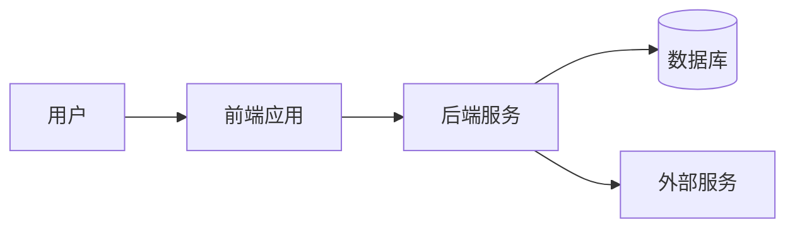
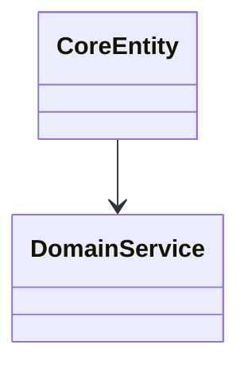
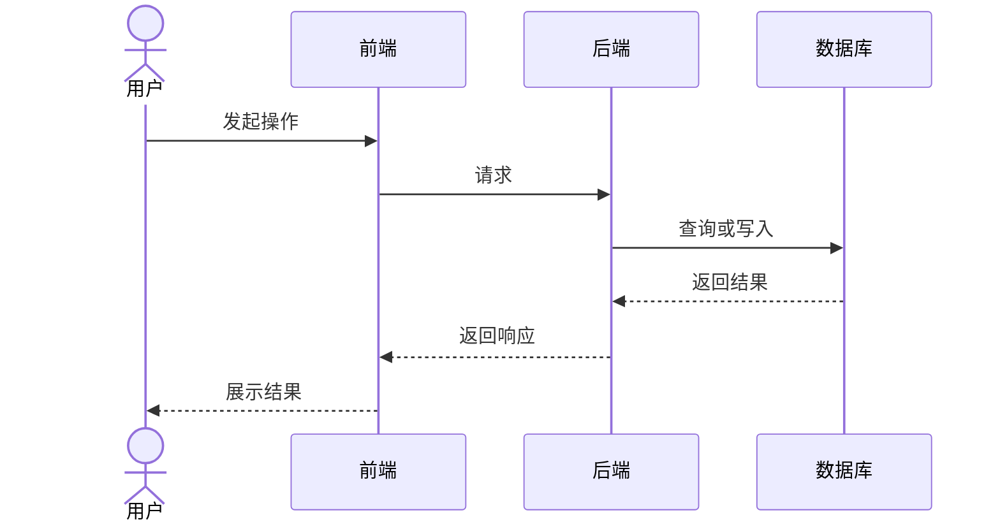
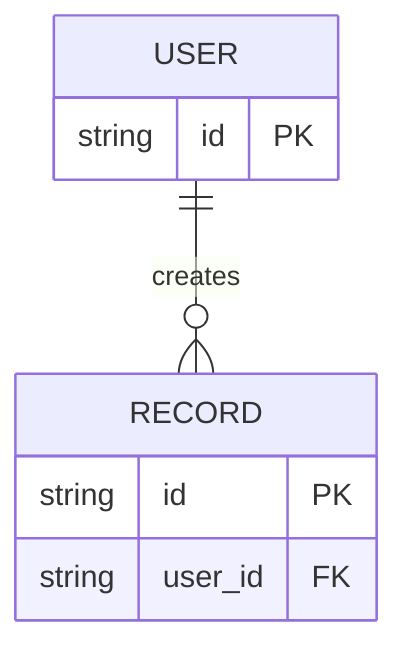

# 项目架构说明

> 本文档记录系统当前**实际架构**，不是理想化设计稿。所有结论应有代码、配置、测试、正式文档或实际运行结果作为依据；无法确认的内容必须标记为“待确认”，不得凭经验补全。
>
> 仅在模块边界、依赖、接口、数据模型、关键业务流程或部署方式发生实质变化时更新。

## 0. 文档状态与证据

- **适用项目/仓库：**
- **适用分支或版本：**
- **最后核验日期：**
- **核验人/工具：**
- **当前状态：** 草稿 / 已核验 / 部分待确认

### 证据来源

| 类型 | 位置或名称 | 用途 | 核验状态 |
|---|---|---|---|
| 代码 |  |  | 已核验 / 待确认 |
| 配置 |  |  | 已核验 / 待确认 |
| 测试 |  |  | 已核验 / 待确认 |
| 正式文档 |  |  | 已核验 / 待确认 |
| 实际运行 |  |  | 已核验 / 待确认 |

### 未确认假设

| 假设 | 产生原因 | 影响范围 | 验证方式 | 状态 |
|---|---|---|---|---|
|  |  |  |  | 待确认 |

## 1. 项目目标与范围

> 本节只记录已经由需求、代码或正式文档确认的业务事实。建议方案与未来规划应放在“关键技术决策”或单独的规划文档中。

- **目标用户：**
- **核心问题：**
- **主要功能：**
- **非目标：**
- **关键业务规则：**
- **关键约束：**

### 业务规则来源

| 规则 | 当前实现位置 | 权威来源 | 核验状态 |
|---|---|---|---|
|  |  | 代码 / 测试 / 文档 / 用户确认 | 已核验 / 待确认 |

## 2. 系统上下文

> 只保留项目中真实存在的参与者和系统；不存在的节点应删除，不得为了完整性而虚构。



### 外部参与者与系统

| 对象 | 作用 | 数据方向 | 认证方式 | 证据来源 | 状态 |
|---|---|---|---|---|---|
| 用户 |  |  |  |  | 已核验 / 待确认 |
| 外部服务 |  |  |  |  | 已核验 / 待确认 |

## 3. 逻辑视图

### 核心领域

| 领域/模块 | 主要职责 | 对外接口 | 不应承担的职责 | 实现位置 | 状态 |
|---|---|---|---|---|---|
|  |  |  |  |  | 已核验 / 待确认 |



> 上图是占位示例。使用时必须替换为从当前代码确认的实体与关系；无法确认时删除，不得保留为真实架构描述。

## 4. 开发视图

> 以下目录树仅为模板。应根据仓库实际结构替换，不存在的目录必须删除。

```text
project/
├── frontend/        # 前端界面与交互
├── backend/         # 后端接口与业务编排
├── services/        # 领域服务或外部服务适配
├── data/            # 数据访问与迁移
├── tests/           # 自动化测试
└── docs/            # 项目文档
```

### 模块职责

| 路径 | 职责 | 主要入口 | 允许依赖 | 禁止依赖 | 状态 |
|---|---|---|---|---|---|
|  |  |  |  |  | 已核验 / 待确认 |

### 依赖规则

- UI 层不直接访问数据库。
- 业务层不依赖具体 UI。
- 数据层不反向依赖业务展示层。
- 禁止循环依赖。
- 项目实际规则与上述默认规则不一致时，应记录真实情况、风险与改进计划，不得伪造“已符合”。

## 5. 运行视图

### 关键流程：示例



> 上图是占位示例。使用时必须替换为实际流程，并注明对应代码入口、接口或测试证据。

### 关键流程清单

| 流程 | 触发入口 | 核心步骤 | 失败路径 | 证据来源 | 状态 |
|---|---|---|---|---|---|
|  |  |  |  |  | 已核验 / 待确认 |

### 异步任务与状态

| 任务 | 触发方式 | 状态流转 | 重试策略 | 幂等策略 | 失败处理 | 状态 |
|---|---|---|---|---|---|---|
|  |  |  |  |  |  | 已核验 / 待确认 |

## 6. 数据视图



> 上图是占位示例。使用时必须替换为从迁移文件、Schema、ORM 模型或数据库结构确认的数据关系。

### 核心数据表

| 表/集合 | 用途 | 主键 | 关键约束 | 数据保留策略 | 定义来源 | 状态 |
|---|---|---|---|---|---|---|
|  |  |  |  |  |  | 已核验 / 待确认 |

### 数据口径与默认值

| 字段/指标 | 含义 | 计算或默认规则 | 权威来源 | 状态 |
|---|---|---|---|---|
|  |  |  |  | 已核验 / 待确认 |

## 7. 接口与集成

> 不得根据命名或相似项目猜测接口。接口信息应来自路由代码、类型声明、OpenAPI/Schema、正式文档或真实响应。

| 接口/服务 | 调用方 | 方法/协议 | 请求与返回定义来源 | 超时 | 重试 | 降级方案 | 核验状态 |
|---|---|---|---|---|---|---|---|
|  |  |  |  |  |  |  | 已核验 / 待确认 |

### 接口兼容约束

- 当前公共接口：
- 兼容策略：
- 已知消费者：
- 破坏性变更审批方式：

## 8. 安全与权限

- **身份认证：**
- **权限模型：**
- **权限规则来源：**
- **敏感数据：**
- **密钥管理：**
- **审计日志：**
- **尚未核验的安全假设：**

## 9. 部署与运行环境

| 项目 | 当前实现 | 配置或证据来源 | 核验状态 |
|---|---|---|---|
| 前端部署 |  |  | 已核验 / 待确认 |
| 后端部署 |  |  | 已核验 / 待确认 |
| 数据库 |  |  | 已核验 / 待确认 |
| 文件存储 |  |  | 已核验 / 待确认 |
| 环境划分 |  |  | 已核验 / 待确认 |
| 监控与告警 |  |  | 已核验 / 待确认 |
| 备份与恢复 |  |  | 已核验 / 待确认 |

## 10. 关键技术决策

| 日期 | 决策 | 状态 | 依据 | 影响 | 替代方案 | 回退方式 |
|---|---|---|---|---|---|---|
|  |  | 提议 / 已确认 / 已实施 / 已废弃 |  |  |  |  |

> “提议”不得写成当前已实现架构；“已实施”必须能定位到代码、配置或部署证据。

## 11. 已知风险与技术债

| 问题 | 证据 | 影响 | 优先级 | 建议处理方式 | 是否阻塞当前任务 |
|---|---|---|---|---|---|
|  |  |  |  |  | 否 / 是 |

## 12. 待确认问题

| 问题 | 为什么需要确认 | 可选方案 | 默认安全方案 | 负责人/来源 | 状态 |
|---|---|---|---|---|---|
|  |  |  |  |  | 待确认 |

## 13. 更新记录

| 日期 | 变更内容 | 变更原因 | 核验方式 |
|---|---|---|---|
|  |  |  |  |
