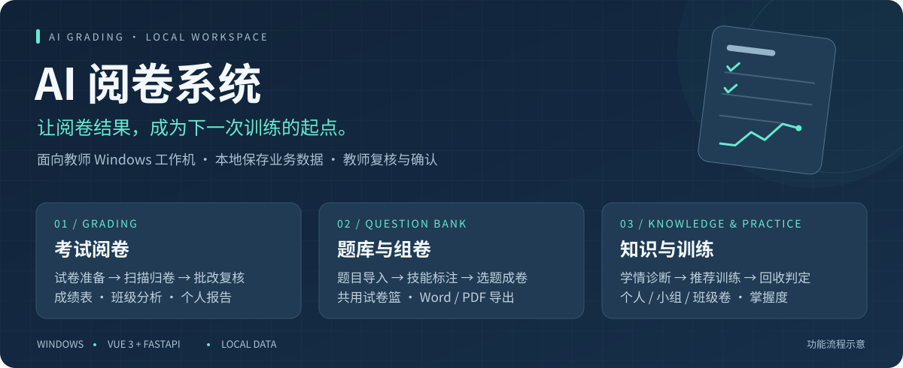
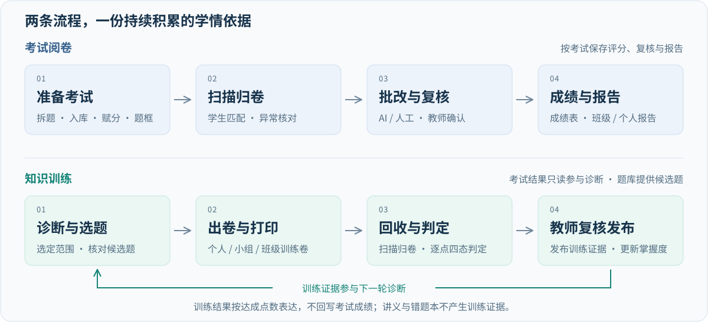

# AI 阅卷系统

[](https://github.com/Hineni412/ai-grading-system-workstation/actions/workflows/ci.yml)



<p align="center">
  <strong>Windows 本地应用 · AI 与人工批改 · 教师确认最终分 · Word / PDF 出卷</strong>
</p>

<p align="center">
  <a href="#项目简介">项目简介</a> ·
  <a href="#核心功能">核心功能</a> ·
  <a href="#工作流程">工作流程</a> ·
  <a href="#开始使用">开始使用</a> ·
  <a href="#技术与结构">技术与结构</a> ·
  <a href="#文档导航">文档导航</a>
</p>

## 项目简介

**把考试阅卷、题库积累和后续训练连接起来，帮助教师从成绩走向具体的教学行动。**

这是一个面向数学教学的 Windows 本地应用。教师在浏览器中准备考试、扫描答卷、执行批改和复核，再查看成绩、错因与报告。题目可以积累到题库，用于班级组卷和个性化训练。

作者是一名数学教师，已在每周阅卷中实际使用本项目，目前尚未大规模推广。

系统用学生的作答证据估计知识与技能的掌握情况，再按教师选定的范围推荐练习。训练卷支持打印、回收、逐点判定和复核发布，形成下一轮诊断的证据。

| 设计重点 | 对教师的实际意义 |
|---|---|
| 教师掌握最终决定 | AI 结果作为候选；教师确认的最终分优先生效，AI 原分另行保留 |
| 围绕纸面教学 | 支持试卷导入、扫描答卷、打印训练卷，以及 Word、PDF 等材料导出 |
| 根据证据安排练习 | 结合考试作答结果、题库技能关联和题目难度选题；没有证据不等于学生不会 |
| 业务数据保存在本机 | 通过本地浏览器使用；调用 AI 时，必要的题目或答卷内容会发送给所选服务 |

## 核心功能

| 功能 | 可以完成的工作 | 主要入口 |
|---|---|---|
| 📝 考试准备 | 导入 DOCX / PDF、核对拆题、分析入库、本场赋分、确认样卷题框 | 考试配置 |
| 🔍 批改与复核 | 扫描归卷、AI 或人工批改、核对评分依据、教师改分与确认 | 考试批改 |
| 📊 成绩与报告 | 查看成绩、题目分析和错因；阅读班级与个人报告，导出成绩表 | 成绩中心 |
| 📚 题库管理 | 积累题目、查重、按技能或知识主题找题、维护标签和判定点 | 题库管理 |
| 🧩 班级组卷 | 手动选题或根据班级失分配题，共用试卷篮，整理后导出 Word / PDF | 组卷工作台 |
| 🎯 知识与训练 | 查看学情与知识结构，按学生或章节选题，生成个人、小组或班级训练卷 | 知识与训练 |
| 📄 教学材料 | 导出刷题讲义、学生错题本和报告；在任务中心查看生成进度与结果 | 对应业务页面与文件中心 |

判定点是判断一项作答是否达成的具体依据。考试为判定点赋分；训练只记录达成情况。

## 工作流程



**考试阅卷**：创建考试 → 核对题目和评分依据 → 确认样卷题框 → 扫描归卷 → 批改与复核 → 查看成绩和报告。

**知识训练**：选择考试、章节与学生范围 → 查看作答证据和候选题 → 核对推荐草稿 → 打印训练卷 → 回收判定 → 教师复核并发布训练证据。

训练使用“达成、未达成、不确定、无法辨认”四种状态，结果按达成点数与总判定点数表达。发布的训练证据参与掌握度计算，不改变普通考试的分数、排名或教师最终分。讲义与错题本不产生训练证据。

具体操作和规则见 [考试阅卷](docs/product/GRADING.md) 与 [题库、组卷和训练](docs/product/KNOWLEDGE_AND_TRAINING.md)。以上图片为功能流程示意。仓库分享可使用 [Social preview 卡片](docs/assets/social-preview.png)（1280 × 640 像素）。

## 开始使用

### 使用完整便携包

完整便携包自带 Python 运行时和前端成品，目标电脑不需要另装 Python 或 Node.js。

1. 打开便携包文件夹，双击 [`运行.bat`](运行.bat)。
2. 浏览器自动打开后使用系统；也可以手动访问 [http://127.0.0.1:8035](http://127.0.0.1:8035)。
3. 在“设置 → 学生名单”中维护名单。需要使用 AI 时，在“设置 → AI 服务”中配置账号和模型。
4. 从“考试配置”准备考试，或从“题库管理”导入题目。
5. 结束使用时运行 [`关闭系统.bat`](关闭系统.bat)。

### 使用 GitHub 源码

**GitHub 源码与完整便携包的运行条件不同。** 仓库不随源码分发 `runtime/`、`frontend/dist/`、前端依赖或本机 `user_data/`。

| 运行条件 | 当前要求 |
|---|---|
| 操作系统 | Windows；维护命令使用 PowerShell 7 |
| Python 运行环境 | 启动脚本使用 `runtime/python/python.exe`；便携运行时基于 Python 3.12 |
| 前端构建 | Node.js 22.x 且 ≥ 22.18.0，或 Node.js ≥ 24.12.0；npm 11.8.0，以 [依赖声明](frontend/package.json) 为准 |
| 本地功能资源 | OCR 模型和 PDF 排版引擎等资源按便携运行环境准备；见 [打包说明](docs/maintenance/packaging.md) |

首次获取源码时，先按 [源码环境准备](docs/maintenance/source-setup.md) 创建启动脚本所需的 Python 运行时，并准备本地资源。已有运行环境时，在项目根目录安装前端依赖，再启动：

```powershell
cd frontend
npm ci
cd ..
.\运行.bat
```

源码启动时会检查前端：输入与产物未变化时复用上次成功构建，否则重新构建；构建失败会停止启动。前端开发方式见 [系统架构](ARCHITECTURE.md)。当前完整打包脚本用于保存本机私有快照；仓库尚未提供可公开下载的干净安装包。

### AI、数据与使用范围

- **AI 服务**：模型配置在设置页维护。实际调用费用取决于所选服务；人工批改不调用模型。
- **数据保存**：日常启动把业务数据保存在本目录的 `user_data/`。备份、更新和打包前，分别查看 [存储与备份](docs/maintenance/storage-policy.md) 和 [打包与更新](docs/maintenance/packaging.md)。
- **模型发送**：AI 功能会发送必要的题干、答案、答卷文字或图片。服务商的数据处理规则由所选服务决定，详见 [安全与诊断](docs/security/SECURITY.md)。
- **运行范围**：应用按本机单用户设计，只监听 `127.0.0.1`，没有应用内登录或角色控制，不应直接作为公网服务部署。
- **对外分享**：从教师工作目录生成的完整包可能包含真实业务数据和模型密钥。对外分发须使用不含真实数据的隔离目录，见 [打包说明](docs/maintenance/packaging.md)。

班主任工作台是独立应用。本项目不提供其接口，也不与其自动同步学生名单、成绩或题库。

## 技术与结构

| 层次 | 主要技术 | 用途 |
|---|---|---|
| 页面与交互 | Vue 3、TypeScript、Pinia、Vite | 业务页面、状态管理和前端构建 |
| 本地服务 | Python、FastAPI | 业务 API、后台任务和静态页面服务 |
| 数据存储 | SQLite、本机文件 | 考试、题库、训练记录与业务产物 |
| 文档与识别 | python-docx、PyMuPDF、本地 OCR | Word / PDF 解析、页面处理与文字识别 |
| 显示与排版 | ECharts、KaTeX、Tectonic / LaTeX | 图表、公式显示和 PDF 排版 |

页面和 API 由本机 FastAPI 服务统一提供。考试阅卷与题库训练分别维护业务数据，通过只读能力、稳定标识和快照协作。

```text
.
├── frontend/       Vue 页面、组件、状态与前端测试
├── backend/        API、阅卷、题框、报告、模型通道与维护能力
├── question_bank/  题库、知识标准、掌握度、推荐与训练卷
├── integration/    考试结果与题库训练之间的协作
├── components/     题框编辑器等独立组件
├── tests/          后端与业务流程测试
├── tools/          测试、检查和专项维护工具
├── update_tools/   备份、更新与回退工具
└── docs/           产品规则、安全、维护、测试与样式文档
```

根目录的 Python 文件只有 `path_manager.py`（本机路径）与 `package_v1.5.0.py`（私有打包入口）。阅卷、题框和报告代码分别位于 `backend/scan_grading/`、`backend/answer_regions/` 和 `backend/reporting/`；其他后端职责与数据位置见 [系统架构](ARCHITECTURE.md)。

详细模块连接和代码入口见 [ARCHITECTURE.md](ARCHITECTURE.md)，业务术语见 [CONTEXT.md](CONTEXT.md)。

## 文档导航

| 文档 | 何时阅读 |
|---|---|
| [考试阅卷](docs/product/GRADING.md) | 准备考试、扫描、批改、复核、成绩与报告 |
| [题库、组卷与训练](docs/product/KNOWLEDGE_AND_TRAINING.md) | 查题目管理、选题、掌握度、打印与训练回收规则 |
| [AGENTS.md](AGENTS.md) | 代理开始开发：范围、协作、授权、验证规则 |
| [ARCHITECTURE.md](ARCHITECTURE.md) | 查运行方式、模块连接、数据归属、模型通道与代码入口 |
| [CONTEXT.md](CONTEXT.md) | 评分、判定点、掌握度等业务术语不明确时 |
| [安全与诊断](docs/security/SECURITY.md) | 涉及模型发送、本机数据、日志或部署边界时 |
| [存储与备份](docs/maintenance/storage-policy.md) | 查文件保留、备份范围、归档与去重时 |
| [打包与更新](docs/maintenance/packaging.md) | 制作便携包、升级、回退或数据库迁移时 |
| [源码环境准备](docs/maintenance/source-setup.md) | 首次从 GitHub 获取源码，准备 Python、前端和本地资源时 |
| [参与维护](.github/CONTRIBUTING.md) | 报告问题、提出改进建议或准备 PR 时 |
| [测试](docs/testing/README.md) | 选择针对性测试或合成环境验收入口时 |
| [调查与待办](docs/requests/README.md) | 查看仍有用途的调查、未完成事项与未接入的实验原型 |
| [样式](docs/ui/STYLE.md) | 修改页面视觉与通用交互时 |
| [Word 与 LaTeX 排版调查](docs/requests/question-bank-latex-layout-evaluation-20261002.md)、[一手项目来源](docs/requests/latex-question-bank-primary-sources-20261002.md) | 查 PDF 导出方向、题型实排证据、外部参考与尚未验证的范围 |
| [训练推荐性能方案调查](docs/requests/training-recommendation-performance-options-20261004.md)、[方案图](docs/requests/training-recommendation-performance-options-20261004.html) | 查开源优化方法、现有模块复用候选及尚未实施的建议 |

产品文档记录业务规则，架构记录连接方式，代码与配置提供具体实现。维护时按当前任务查阅，不要求每次通读；发现不一致时核对实现和用户需求，修正文档，不能为迁就过期文字修改正常功能。

文档引用检查可在已准备 Python 运行环境的项目根目录执行：

```powershell
& .\runtime\python\python.exe tools\check_documentation.py
```

## 使用与再发布

仓库目前未设置项目许可证。第三方代码和资源保留各自的使用条件。公开安装包发布前，需要先核对授权，并在不含真实数据和模型配置的环境中制作和验收；当前私有打包脚本的产物不能直接作为公开安装包。

业务与页面测试按本次改动选择，入口见 [测试与人工验收](docs/testing/README.md)。

<details>
<summary><strong>维护人员：独立工具与使用边界</strong></summary>

以下工具由维护人员按需运行，不由日常页面自动调用。没有代码引用不代表可以删除；运行前按工具参数和项目授权规则区分只读检查、生成文件与正式数据写入。

| 用途 | 保留入口 | 使用边界 |
|---|---|---|
| 题库维护与标准修订预演 | `tools/maintain_question_bank.py` | 参数与正式执行条件见存储与备份文档 |
| 知识标准初始发布文件重建 | `tools/build_knowledge_graph_release.py` | `--check` 只核对现有文件；不带参数会重写初始发布文件 |
| 教学技能标准发布文件重建 | `tools/build_release_v5.py` | 必须提供 `--teaching-standard` JSON；默认预演，`--write` 生成发布文件；数据库应用是另行授权的操作 |
| 词表修订发布文件重建 | `tools/build_release_v7.py` | 默认读取已有输入并验证，`--write` 生成对应发布包和词表；不会自动切换数据库中的活动标准 |
| 技能候选发布 | `tools/build_skill_release.py` | 默认只预演并把已批准待发布的新技能并入下一版标准；`--write` 生成目录文件并打印需登记到 loader 的映射行；数据库激活是另行授权的操作，执行前先备份 |
| 难度校准与推荐有效性回看 | `tools/difficulty_calibration_report.py`、`tools/recommendation_validity_report.py` | 按显式数据库路径读取统计结果，不改写评分、难度或推荐规则 |
| 掌握度前向检验与参数选择 | `tools/mastery_validation.py` | `--volume` 指定教学学期；`--initial` 复现原型参数，`--grid` 选择参数；只读数据库，只向终端输出汇总数字，不调用模型、不落盘学生结果 |
| 第一、二章训练卷适配实验 | `tools/experiment_training_fit.py` | 只读原位置数据，核对只补弱个人对照与内存试配、小组共用卷；`--evidence-loss` 检查历史证据粒度敏感性，`--match-audit` 追查匹配、目标关联库存与入卷限制，保存匿名汇总；不是教师盲评或学习效果证明，当前实现、效果与性能交接见 [说明](docs/requests/training-recommendation-backend-handoff-20261004.md) |
| 相似题向量检索实验 | `tools/experiment_vector_similarity.py` | `--baseline-only` 只读核对现有排序；本地真实模型实验须单独授权，方案与限制见 [实验说明](docs/requests/vector-similarity-experiment-20261001.md) |
| 历史数据导出 | `tools/export_legacy_cli_data.py`、`tools/export_legacy_skill_data.py` | 保留退役数据的读取与导出能力，源数据库不改写 |
| 本机空间盘点、维护预览 | `tools/storage_audit.py`、`tools/storage_maintenance.py` | 产物位置、保留范围及执行授权见存储与备份文档 |
| 代理后台启动 | `tools/start_service.py` | 按项目运行约束使用；教师日常入口仍为 `运行.bat` |

知识标准构建脚本依赖的辅助脚本也应保留；生成候选发布文件与启用数据库中的活动标准是两个操作。前端专项浏览器测试的业务命令与构建要求见测试文档。

</details>
