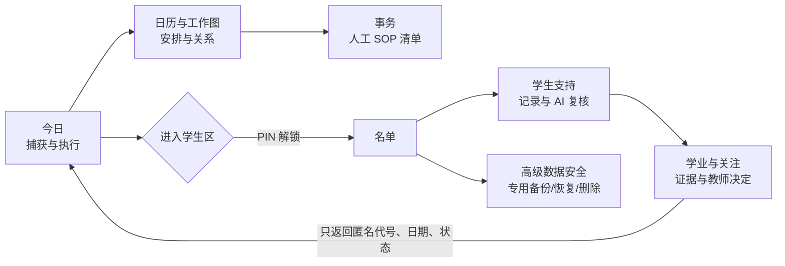
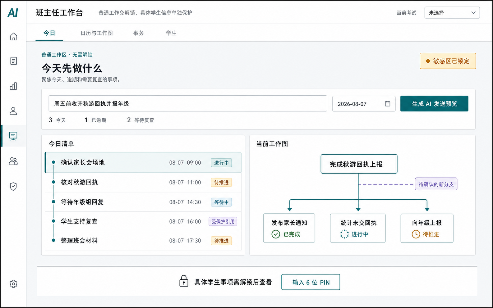
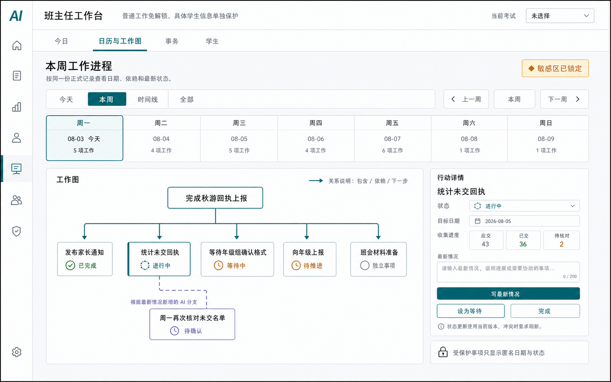
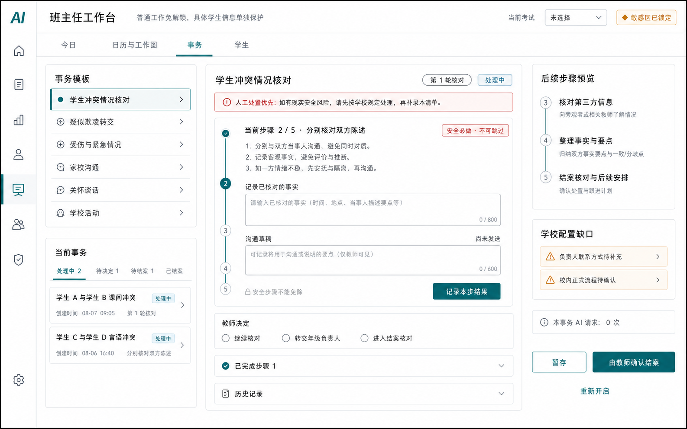
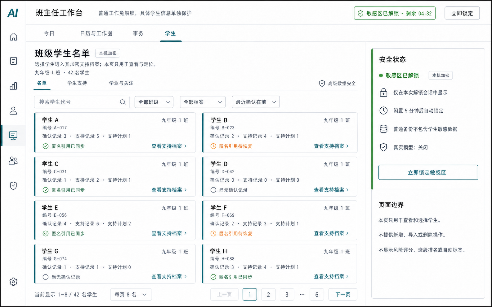
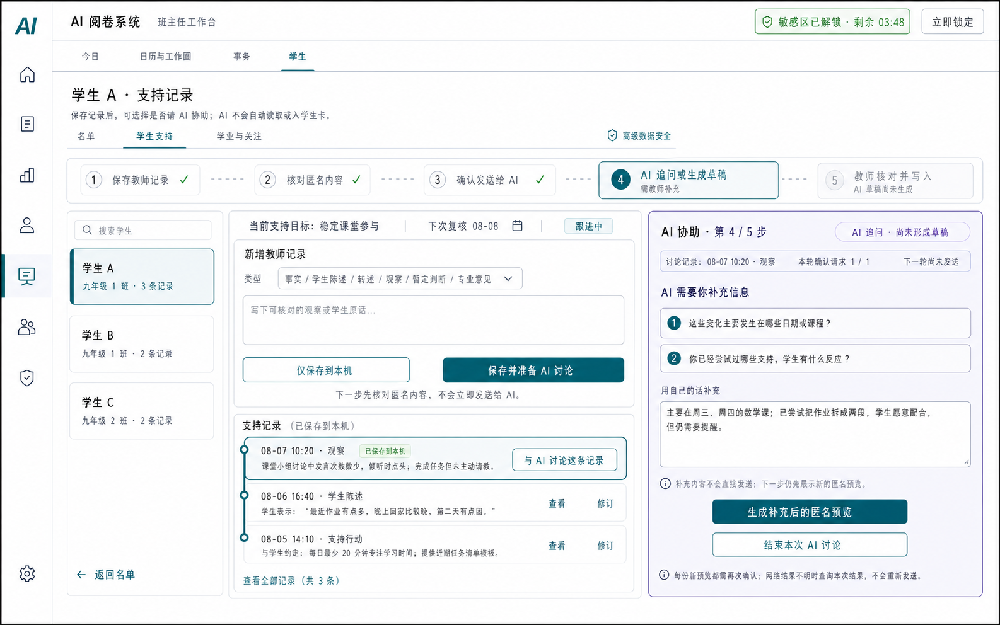
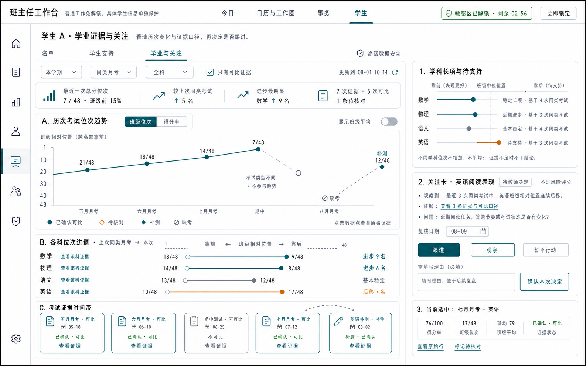
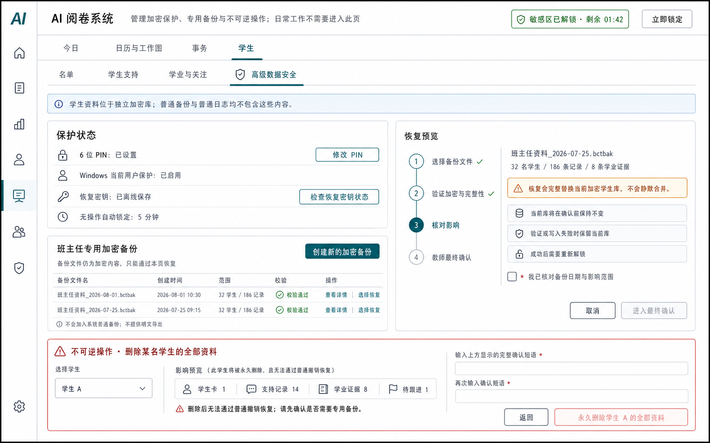

# 班主任工作台理想页面方案

> 实施权威入口：docs/product/class-teacher/B_UI_R1_IMPLEMENTATION_PLAN.md。本文和图片只表达视觉与页面意图；安全、数据、接口、迁移、故障恢复和验收发生冲突时，以实施设计为准。
>
> 生成日期：2026-08-01  
> 对应分支：`codex/class-teacher-iteration`  
> 性质：基于现有实现能力重新编排的目标界面概念图，不是当前程序截图。

## 结论

理想状态下，班主任工作台保持 **4 个一级工作面**：`今日`、`日历与工作图`、`事务`、`学生`；在这 4 个入口里组织成 **7 张核心页面模板**。PIN 解锁、AI 发送确认、任务详情、恢复确认和永久删除确认属于页面内流程，不再各占一个一级入口。

这样既能覆盖当前代码已有的功能，又不会把班主任每天的工作拆成过多菜单。

## 当前实现与本方案的关系

当前实际入口 `/class-teacher` 还是一张纵向较长的页面：

- 普通工作区已经能显示周工作、任务关系和状态更新；
- 敏感学生区只有在解锁后才加载，当前主要显示学生名单和 AI 学生讨论；
- 事务台、SOP、学生支持、学业证据和关注卡等能力已有组件、接口或测试基础，但还没有统一接入当前页面；
- 专用备份和恢复已有底层能力，高级数据安全页仍需要正式编排。

因此，下面 7 张图表达的是“把已经存在或已有实现基础的能力整理成理想产品”的结果，而不是声称这些界面现在已经全部上线。

## 总体导航与数据边界

普通工作和具体学生信息使用物理上分开的数据区。锁定时不只是把学生内容盖住，而是停止加载学生组件。学生区返回普通工作区的内容只能是匿名代号、复核日期和状态，不能包含姓名、成绩正文或学生记录。

## 1. 今日工作台

**用途**

教师打开应用后先回答三件事：今天要做什么、什么已经逾期、当前工作推进到哪里。

**布局**

- 顶部是一行快速录入，只填工作内容和日期；
- 中部用紧凑列表排列今日、逾期、待复核事项；
- 右侧展示当前选中工作的目标、步骤、等待项和最新情况；
- 学生敏感区保持锁定，只提供明确的 PIN 入口。

**交互逻辑**

1. 教师输入一句话和日期，系统先整理成问题、假设、步骤与关系预览。
2. 教师确认发送内容后，本次最多发起 1 次真实模型请求。
3. AI 结果仍是草案；教师第二次确认后才形成正式工作图。
4. 状态更新只能由教师填写“最新情况”、设为等待或完成。
5. 请求超时后恢复同一个操作，不复制任务，也不偷偷追加模型请求。

## 2. 日历与工作图

**用途**

在一周时间轴中查看工作之间的包含、依赖和下一步关系，并更新某一行动的状态。

**布局**

- 顶部提供今天、本周、时间线、全部等视图和周切换；
- 中间左侧是工作关系图，使用克制的青绿色“工作账本脊线”连接节点；
- 右侧是所选行动的详情、目标日期、收集进度和状态操作；
- 受保护事项在普通区只显示匿名日期与状态。

**交互逻辑**

- 点击日期过滤，点击节点在右侧检查详情；
- 更新状态时使用当前版本，若另一处已经修改则先刷新，避免覆盖；
- 不采用拖拽改期，日期通过明确字段修改，降低误操作；
- AI 根据教师填写的最新情况提出的新分支必须再次确认，不能自动进入正式图。

## 3. 事务处理台（个人 SOP 清单）

**用途**

把冲突核对、疑似欺凌转交、受伤与紧急情况、家校沟通、关怀谈话和学校活动等复杂事务拆成可核对步骤。

**布局**

- 左侧选择模板和当前事务；
- 中间只突出“当前一步”、事实记录、尚未发送的沟通草稿和教师决定；
- 右侧预览后续步骤，并列出学校联系人或正式流程的配置缺口；
- 安全必做步骤和人工处置优先提示始终可见。

**交互逻辑**

- 这是教师个人工作清单，不冒充学校正式 SOP；
- 安全步骤不能跳过，非安全步骤才能按规则免除；
- 沟通内容只保存为草稿，不自动发送微信、短信或邮件；
- 欺凌认定、惩戒、紧急处置、结案和重新开启都由教师或学校流程决定；
- 结案按钮必须经过教师确认，系统不自动结案。

## 4. 受保护的学生名单

**用途**

在解锁后的加密区快速找到某名学生，并进入其支持记录。本页只负责查看和定位，名单配置由系统其他受控入口负责。

**布局**

- 顶部持续显示剩余解锁时间和“立即锁定”；
- 上方只有搜索、班级、档案状态和排序筛选；
- 主区采用两列长方形圆角学生卡，每卡显示确认记录、支持记录、支持计划和匿名同步状态；
- 不使用表格、头像墙或风险颜色，也不在卡片中展开成绩和学生正文；
- 右侧固定显示解锁状态、自动锁定、普通备份排除和本页操作边界。

**交互逻辑**

1. 点击整张学生卡或“查看支持档案”进入该学生的加密档案。
2. 搜索、筛选和排序只改变卡片目录，不修改学生数据。
3. 本页不提供新增、导入、上传、删除或行内编辑入口。
4. 5 分钟无操作、离开页面或点击“立即锁定”后，学生卡立即卸载并返回锁定页。

## 5. 学生支持记录与 AI 复核

**用途**

围绕单个学生记录可核对事实、学生陈述、转述、观察、暂定判断、专业意见和支持行动，并在需要时让 AI 帮助整理。

**布局**

- 页面顶部横向显示五步路径：保存教师记录、核对匿名内容、确认发送给 AI、AI 追问或生成草稿、教师核对并写入；
- 左侧是学生选择器；
- 中间是新增记录和可修订时间线，每条已保存记录都有“与 AI 讨论这条记录”；
- 右侧展示 AI 的具体追问、教师自然语言补充框、本轮请求状态和下一步匿名预览按钮。

**交互逻辑**

1. “仅保存到本机”不会调用 AI；“保存并准备 AI 讨论”也只进入本机匿名预览，不立即发送。
2. 教师逐字检查别名、正文、指令和移除项，确认后本轮最多进行 1 次模型请求。
3. AI 如果认为信息不足，会显示具体问题；教师可在“用自己的话补充”中输入自然语言。
4. 教师补充后先生成新一轮匿名预览，再次确认后才能继续，不能形成自动连续对话。
5. AI 生成草稿后仍需教师修改和二次确认，才写入加密学生卡；网络结果不明时查询原操作，不重复发送。

## 6. 学业证据与关注行动

**用途**

在单个学生的加密页面中查看历次可比考试、各科位次进退、相对长项和待支持学科，再由教师决定跟进、观察或暂不行动。

**布局**

- 顶部是时间、考试家族、学科和“只看可比证据”筛选，以及四项紧凑摘要；
- 主区依次展示历次总分位次趋势、各科上次到本次的哑铃图和考试证据时间带；
- 右侧使用水平圆点条表达长项、近期进步、基本稳定和待支持，并显示每项依据的同类考试次数；
- 右侧关注卡保留“跟进、观察、暂不行动”三种教师决定，并展示当前选中考试的原始证据摘要。

**交互逻辑**

- 主页不再承担成绩导入；点图表数据、学科行或考试卡，在右侧查看原始行、排名人数、来源和可比依据；
- 位次同时显示为 `7/48` 和班级相对位置，参评人数或排名范围变化不能被隐藏；
- 只有同学科、同考试家族、口径一致且教师已确认的证据才用实线连接；不可比考试保留但断线；
- `0 分`、`缺考`、`免考`、`未录入`、`待核对`、`补测`使用不同点形和文字，缺考不能画成 0 分；
- 学科长项或待支持必须显示证据次数，不同学科位次不相加、不平均，单次波动不贴标签；
- 关注卡不是风险评分，三个处理选择都需要教师填写理由并确认。

本页的图表与下钻方案参考了智学网、Microsoft Education Insights、Canvas、Otus、NWEA、PowerSchool、i-Ready、1EdTech 和 Ed-Fi 的官方资料，调研与来源见 [单个学生学业分析模式调研](research/student-academic-analytics-patterns.md)。

## 7. 高级数据安全

**用途**

管理 PIN、恢复密钥状态、班主任专用加密备份、恢复预览和某名学生的完整删除。它不是日常页面。

**布局**

- 左侧是保护状态和专用加密备份列表；
- 右侧是恢复的四步影响核对；
- 底部单独划出克制的危险区，显示删除影响和双重确认输入。

**交互逻辑**

- 页面不显示真实恢复密钥，只显示是否已离线保存；
- 专用备份仍是加密内容，不加入普通备份，也不提供明文导出；
- 恢复是完整替换，不静默合并；验证或写入失败时保留当前数据库；
- 恢复成功后立即锁定并要求重新解锁；
- 删除前先预览学生卡、支持记录、学业证据和待跟进数量；
- 两次输入界面给出的完整确认短语后，永久删除按钮才可用。

## 全局设计规则

- 背景 `#F4F5F6`，主面板白色，主文字 `#1C2733`，强调色 `#135E6B`；
- 普通面板几乎不用阴影，弹层才使用轻阴影；
- 标题 20–24 px，正文 13–14 px，控件高度约 34–38 px；
- 红色只用于现实安全提醒和不可逆操作，橙色用于待核对，紫色只用于 AI 草案；
- 唯一的识别性装饰是 2–4 px 青绿色“工作账本脊线”；
- 不使用渐变、玻璃效果、营销式大标题、彩色卡片海、头像墙、聊天气泡或装饰性大图；
- AI 永远显示为“草案/建议”，教师确认永远显示为最终动作；
- 不展示全班风险排名墙、人格标签或诊断结论；单个学生页可展示有明确人数和口径的考试位次变化；不自动外发、自动认定或自动结案。

## 本次未做

- 没有修改业务代码、接口或数据结构；
- 没有启动或重启应用；
- 没有读取、复制、写入任何真实 `user_data`；
- 没有调用真实业务模型或产生业务模型费用；
- 图中全部使用“学生 A / B”等合成示例。
