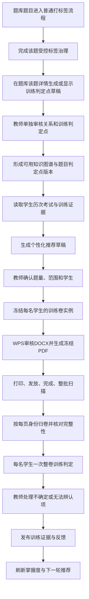

# 个性化训练闭环产品与实现设计

> 状态：P4-00—P4-16 已形成本地合成候选，等待 P4-17 整线集中验收
>
> 确认日期：2026-07-30
>
> 适用范围：本系统中的初中数学知识图谱、个性化选题、训练卷、扫描判定和训练反馈
>
> 执行入口：[《Phase 4 执行包地图》](../superpowers/packages/phase-4-execution-packages.md)
>
> 三路并行边界：[《Phase 4 与两大教师工作台三路并行实施总索引》](./TEACHER_WORKSPACES_PARALLEL_IMPLEMENTATION.md)
>
> 架构决定：[ADR-0003：训练覆盖证据不复用正式考试分数](../adr/0003-separate-training-coverage-from-exam-scores.md)

## 1. 结论

Phase 4 的最终成果不是一张关系更丰富的知识图谱，而是一条可以反复运行的个人训练闭环：

```text
历次考试证据
→ 知识图谱与掌握证据
→ 为每名学生选择不同题目
→ 生成有姓名和机器身份的一人一卷
→ 课堂发放与完成
→ 整批扫描
→ 自动按学生和试卷实例归卷
→ 每名学生一次整卷训练判定
→ 教师处理少量不确定项
→ 形成训练反馈
→ 更新掌握证据与下一轮推荐
```

这条闭环必须同时满足四个原则：

1. 普通考试的评分、分值、总分、排名和教师最终分锁保持原义；
2. 个性化训练使用独立的“训练判定点”和“覆盖证据”，不伪装成考试分数；
3. 每一份打印卷、每一道题和每一个判定点都冻结身份与版本，扫描后不能靠模糊匹配猜测；
4. AI 只产生候选关系、候选判定和解释，教师确认关系和不确定结果后才成为正式证据。

## 2. 已核对的当前基础

当前系统已经具备以下可复用能力：

- 题库题目、富内容、图片、六维受控标签和人工标签治理；
- 按题目复杂度动态合批的 AI 打标签流程；
- 题库筛选、推荐、组卷和训练任务快照；
- 学生、考试、答卷、题目成绩和只读知识图谱；
- 一名学生一份整卷、一次物理模型请求的普通整卷批改；
- 扫描预检、学生匹配、异常队列和教师最终分锁；
- WPS 可打开的 DOCX/PDF 导出基础；
- 持久化 Job、取消、恢复、用量和模型请求节流。

当前仍缺少：

- 经教师确认的知识点父子、先修和相关关系；
- 可解释、可对照和可回退的掌握度 v2；
- 题库题目的无分值训练判定点及版本；
- 一名学生一份不同题目的冻结训练卷实例；
- 每页可机器识别的试卷身份；
- 混合扫描后按试卷实例自动归卷；
- 不依赖分数的整卷训练判定协议；
- 训练证据到掌握度和下一轮推荐的可靠回流。

当前打标签并非固定“一题一次请求”。短选择/填空题可以小批合并，普通解答题使用较小批次，长题、证明题或图片题通常单题处理。Phase 4 延续这一思路，但批次大小必须同时考虑训练判定点带来的输出长度。

## 3. 任务边界

### 3.1 目标

- 在现有精确知识点标签之上建立教师确认的关系层；
- 让掌握证据能够体现时间、样本量、题目难度和来源；
- 根据每名学生历次证据选择不同的现有题库题；
- 生成可在 WPS 中审核、可稳定打印和扫描的一人一卷；
- 对每名学生整卷判断各训练判定点是否达成；
- 输出按题的“达成点数/总判定点数”、错因提示和下一步建议；
- 把教师确认后的训练证据回流到知识图谱和下一轮推荐；
- 保留整个闭环的来源、版本、费用、失败和人工修正记录。

### 3.2 首版包含

1. 知识点稳定身份和教师确认的关系；
2. 关系审核与图谱 2.0；
3. 掌握度 v2 与 v1 对照开关；
4. 题库入库/重标时生成训练判定点草稿；
5. 训练判定点版本、质量门和教师审核；
6. 基于现有题库的个性化推荐；
7. 每名学生独立的训练卷实例和题目清单；
8. WPS 可审核 DOCX、冻结 PDF 和每页机器标识；
9. 混合扫描归卷、缺页/重页/错卷处理；
10. 每名学生一次整卷训练判定；
11. 按判定点的教师复核锁；
12. 训练反馈、证据发布、掌握度刷新和下一轮建议。

### 3.3 首版明确不包含

- AI 自动编写新题；
- 把所有训练卷做成统一题目或统一评分标准；
- 把训练覆盖度换算成 100 分、班级排名或正式成绩；
- 在现有普通考试 `AIGrader` 中加入第二套训练语义；
- 任意外部练习纸的无身份扫描批改；
- 学生手机端、家长端或在线作答；
- 自动打印、自动发送或自动发布下一轮训练；
- 使用班主任档案、心理状态或家庭信息进行选题；
- 由 AI 自动确认知识关系；
- 由 AI 自动覆盖教师已经修正的训练判定；
- 一次性重标全部真实历史题库；
- 未经授权调用真实模型、迁移真实数据库或写入真实训练数据。

## 4. 统一业务词汇

### 训练判定点

针对一道题可以被观察和独立判断的答案、过程、条件、推导或结论要求。它不带分值。

### 训练判定点版本

某道题的一组不可变判定点。题干、答案、图片或判定规则变化后产生新版本，旧训练卷继续引用旧版本。

### 个性化训练卷实例

为一名确定学生生成并冻结的一份具体训练卷，包含固定的题目顺序、题目快照、判定点版本和页面身份。

### 训练答卷

由扫描页面组成、已确定属于某个个性化训练卷实例的一次提交。缺页、重页或身份冲突时不能进入自动判定。

### 训练判定结果

模型或教师对每个判定点给出的 `达成`、`未达成`、`不确定` 或 `无法辨认` 结果及其可见依据。

### 训练覆盖度

某道题的“达成点数/总判定点数”。它是一次训练证据，不是考试分数、等级、排名或学生标签。

### 训练证据

由已经冻结的题目、判定点版本、训练答卷和最终判定组成的可追溯记录，可参与掌握度更新。

### 教师最终判定锁

教师对某个训练判定点作出的最终修正。后续 AI 重跑不得覆盖。

## 5. 端到端工作流



## 6. 知识关系与掌握证据

### 6.1 关系类型

首版只支持三种受控关系：

| 关系 | 含义 | 方向 |
|---|---|---|
| `parent` | 一个较细知识点属于更上位的结构 | 子 → 父 |
| `prerequisite` | 学习目标点前通常需要具备的知识点 | 目标 → 先修 |
| `related` | 经常共同出现但不能认定父子或先修 | 无方向或规范化双向 |

AI 只能提出候选关系和理由。只有教师确认的关系进入活动图谱、掌握传播和推荐。

### 6.2 稳定身份

- 活动知识点必须使用稳定 ID，不以可变中文名称作为唯一身份；
- 别名、改名和教材显示名只改变展示，不改变历史证据关联；
- 关系不能引用未治理的新词候选；
- 自环、重复边、冲突方向和不允许的循环必须被本地规则拒绝；
- 已确认关系可以退役，但不能从历史记录中无痕消失。

### 6.3 掌握度 v2

掌握度 v2 是可解释的证据聚合，不是 AI 预测。至少考虑：

- 正式考试中同知识点题目的得分率；
- 个性化训练中每题的训练覆盖度；
- 证据时间和衰减；
- 样本量与小样本收缩；
- 题目难度或证据权重；
- 数据缺失、未完成和人工修正；
- 直接知识点证据与先修关系解释。

考试与训练是两类不同证据。二者可进入同一个掌握度解释，但不能先相加成一个虚构总分。

v2 上线前必须与当前 v1 并列运行，教师能看到差异原因，并可通过显式开关回退。

## 7. 题库入库与训练判定点

### 7.1 一次模型请求，两份业务投影

在长度允许时，一次物理模型请求可以同时返回：

```json
{
  "question_id": "QB-318",
  "tag_analysis": {},
  "training_criteria": {}
}
```

随后必须拆成两个独立投影：

- 标签投影继续进入现有六维词表、候选收敛和新词审核路径；
- 训练判定点投影进入独立的版本、质量门和教师审核路径。

产品操作顺序固定为：先完成这道题的普通打标签流程，再在题库的同一道题
详情中查看、编辑和批准训练判定点。底层为节省请求可以一次同时取得两份
草稿，但不能把训练判定点显示成独立于题目的临时结果，也不能绕过普通标签
治理直接用于组卷。

共享一次请求不代表：

- 共用一张表；
- 标签成功就等于判定点成功；
- 判定点失败要撤销已经有效的标签；
- 两者可以共用一个“完成”状态；
- 两者重试时必须同时再次调用模型。

### 7.2 判定点来源

按优先顺序支持：

1. 已有正式评分依据可可靠转换时，本地去除分值后生成草稿；
2. 新入库或需要重标的题，在同一次题目分析请求中生成；
3. 教师手工创建或修改；
4. 旧题库按独立、受控的回填任务补齐。

正式评分依据的转换只能复用答案、步骤、证明义务和等价方法，不能把原分值保存为训练分值。

### 7.3 题型策略

| 题型 | 判定策略示例 |
|---|---|
| 单选、单空 | 正确答案或明确等价答案 |
| 多空、多结果 | 每个独立答案一个判定点 |
| 计算题 | 建立关系、关键变形、计算和结论等可独立观察点 |
| 证明题 | 必要条件、定理使用、推理链和结论 |
| 作图题 | 必要图形要素、关系和标记 |

辅助说明、扣分提醒和参考步骤不自动成为分母。每个正式判定点只计一次。

### 7.4 质量门

只有同时满足以下条件的版本可用于组卷：

- 有稳定 `point_id`；
- 有明确目标和可观察证据；
- 有标准答案或教师确认的等价规则；
- 解答题不是单一笼统句；
- 证明题包含必要的证明义务；
- 图片题实际携带可读图片，而不只是 `has_images=true`；
- 不含分值字段；
- 来源题目内容哈希与当前题目一致；
- 已通过教师审核或明确批准的受控规则。

## 8. 个性化推荐与试卷实例

### 8.1 推荐输入

- 教师选择的学生范围；
- 训练目标、题量、预计时长和难度范围；
- 学生当前掌握证据和证据不足说明；
- 教师确认的知识关系；
- 题库当前有效题目、标签和训练判定点；
- 最近已经训练的题目和去重规则；
- 教师锁定或排除的题目。

### 8.2 推荐输出

每名学生得到一份可审核草稿，包含：

- 目标薄弱点；
- 必要先修点；
- 推荐题目及来源；
- 选择该题的证据链；
- 难度和预计时间；
- 直接巩固、先修补偿或迁移练习的用途；
- 缺题和证据不足提示。

首版只从现有题库选择，不为凑数量自动生成新题，也不以模糊相似题替代知识点不足。

### 8.3 冻结内容

教师确认后，每份训练卷实例至少冻结：

- `paper_instance_id`；
- 学生稳定引用与显示姓名快照；
- 任务版本和生成时间；
- 题目顺序与 `task_item_code`；
- 题目内容、答案和富内容快照；
- 训练判定点版本、内容快照和哈希；
- 推荐理由和知识点版本；
- 页面数、页面身份和输出文件哈希；
- 打印版式版本。

以后题库题目、标签或判定点被修改，不能反向改变已经打印的训练卷。

冻结前必须完成整卷判定预算预检：按当前模型配置估算题目、判定点、页面图片和预期输出是否能够放进一次请求。超出上限时，系统应在打印前要求减少题量、调整页面或改用教师选择的更大上下文模型，不能先打印后再把一次整卷判定偷偷拆成多次收费请求。

## 9. WPS、打印与页面身份

### 9.1 输出

首版生成两种互相关联的文件：

1. **WPS 可审核 DOCX**：教师检查姓名、题目、分页、留白和版式；
2. **冻结 PDF**：确认后用于打印和后续扫描识别。

DOCX 是审核稿，扫描闭环以冻结 PDF 的页面清单和哈希为准。教师修改 DOCX 后必须重新生成并冻结新的 PDF 版本。

### 9.2 页面标识

每页至少包含：

- 可见的学生姓名；
- 可见的“第 X 页/共 Y 页”；
- 机器可读的 `paper_instance_id`、页码和版本；
- 校验码或签名，防止手工改字符串后误归卷；
- 必要时的方向或版式标记。

机器标识优先使用二维码或等价的高可靠标记。姓名用于课堂发放和人工兜底，不能成为扫描归卷的唯一依据。

### 9.3 版式要求

- 姓名栏明显，便于课代表按姓名发放；
- 每道题有稳定题号，但永久关联使用 `task_item_code`；
- 判定区不印分值；
- 页面身份不覆盖作答区；
- 打印留白、裁切、双面顺序和扫描方向可检测；
- 同一训练批次允许不同学生页数不同。

## 10. 混合扫描与归卷

整批扫描可能同时包含不同学生、不同页数和不同题目。归卷流程为：

```text
导入扫描文件
→ 逐页读取机器身份
→ 校验批次、试卷实例、页码、总页数和签名
→ 按 paper_instance_id 分组
→ 检查缺页、重页、错序、跨卷混入和图片指纹
→ 形成 ready 或 manual_review 的训练答卷
```

以下情况在模型调用前进入人工队列：

- 页面身份无法读取；
- 身份签名不合法；
- 学生与试卷实例不一致；
- 缺页、重复页或页码冲突；
- 混入另一批次页面；
- 同一页面出现不同内容；
- 页面过暗、裁切严重或方向无法修正。

人工匹配必须展示整页图、候选学生、候选试卷和冲突原因，不以 OCR 姓名自动确认。

## 11. 整卷训练判定

### 11.1 默认调用方式

教师只需要：

```text
扫描整批
→ 处理少量无法归卷的页面
→ 点击“开始训练判定”
→ 处理少量不确定判定点
```

后台按训练答卷处理。每名学生的一份完整训练答卷对应最多一次物理模型请求。

如果运行时仍出现上下文超限，整份判定失败并保留答卷，供教师调整配置或人工处理；系统不自动拆卷、不自动追加请求。

### 11.2 模型输入

- 该学生冻结训练卷的题目顺序；
- 每道题的 `task_item_code`；
- 每道题冻结的答案和训练判定点；
- 完整、排序后的答卷页面；
- 等价方法、空白、涂改和无法辨认规则；
- 明确的结构化返回协议。

### 11.3 模型输出

模型只为每个预期 `point_id` 返回：

```text
met        已达成
not_met    未达成
uncertain  有作答但无法可靠判断
unreadable 图像或作答无法辨认
```

并提供简短、可在答卷上核对的依据。模型不能返回或决定总分、题分、等级和排名。

### 11.4 本地计算与发布

- `total_count` 来自冻结的正式判定点；
- `met_count` 由本地统计 `met`；
- `uncertain` 和 `unreadable` 不按错误或 0 分处理；
- 漏点、重复点、未知点或非法状态使对应题目进入人工队列；
- 教师修正后写入最终判定锁；
- 每道题最终显示“达成点数/总判定点数”；
- 未完成复核的题不发布训练证据；
- 已经完成的其他题可独立发布，掌握度明确显示仍有待复核证据。

### 11.5 与普通考试隔离

- 普通考试继续使用现有评分依据和数值分数；
- 个性化训练使用独立的判定模块、结果表和人工锁；
- 两者可以共享模型网关、图片处理和任务基础设施；
- 两者不能共享“分数结果”的领域对象；
- 训练失败不能阻塞普通考试批改；
- 普通考试重跑不能覆盖训练判定。

## 12. 训练反馈与下一轮

训练反馈至少包含：

- 本次训练目标；
- 每道题的达成点数/总判定点数；
- 已达成的关键步骤；
- 未达成的具体判定点；
- 不确定或无法辨认项；
- 教师修正记录；
- 对应知识点及证据时间；
- 建议继续巩固、回到先修点、改换题型或暂不追加训练；
- 下一轮推荐变化及其来源。

下一轮推荐必须由教师确认后发布。系统不能因为一次训练结果自动连续生成并打印下一套卷。

掌握度聚合以“每题覆盖比例 + 题目证据权重”为基础，不能把全卷所有判定点简单相加。不同题判定点数量不同，不代表判定点多的题天然更重要。

## 13. 建议深模块

### 13.1 `KnowledgeRelationModule`

外部只需要：

```text
propose_relations(scope)
review_relation(command)
read_confirmed_graph(query)
```

内部隐藏候选生成、关系状态、冲突、循环、审计和图查询。

### 13.2 `TrainingCriterionModule`

外部只需要：

```text
propose(question_batch)
review(command)
freeze(question_ids)
```

内部隐藏题目上下文、动态合批、不同题型策略、版本、质量门和来源转换。

### 13.3 `PersonalizedPaperModule`

外部只需要：

```text
recommend(request)
freeze(teacher_confirmed_plan)
render(paper_instance_id)
```

内部隐藏选题解释、去重、题目快照、WPS/PDF、分页和页面身份。

### 13.4 `TrainingSubmissionModule`

外部只需要：

```text
ingest(scan_batch)
resolve_page(command)
finalize_submission(paper_instance_id)
```

内部隐藏逐页识别、分组、缺页、重页、冲突和人工归卷。

### 13.5 `TrainingAssessmentModule`

外部主入口保持简单：

```text
assess(submission_id, expected_revision)
review_point(command)
publish_ready_evidence(submission_id)
```

内部隐藏冻结版本读取、一次整卷请求、结构校验、本地计数、幂等、人工锁和证据发布。

## 14. 数据边界

建议新增的逻辑对象包括：

| 对象 | 关键身份与作用 |
|---|---|
| `knowledge_tag_identities` | 稳定知识点身份、显示名和退役状态 |
| `knowledge_relations` | 关系类型、来源、建议/确认状态和版本 |
| `training_criterion_versions` | 题库题目的不可变判定点版本 |
| `training_criterion_heads` | 当前可用版本和并发 revision |
| `personalized_paper_instances` | 一名学生的一份冻结训练卷 |
| `personalized_paper_items` | 题目顺序、快照和判定点快照 |
| `personalized_paper_pages` | 页码、机器身份、输出哈希 |
| `training_submissions` | 一次扫描答卷和状态 |
| `training_submission_pages` | 页面身份、顺序、图像指纹和异常 |
| `training_assessment_runs` | 一次整卷判定 operation |
| `training_point_results` | 每个判定点的模型候选、教师最终值和证据 |
| `training_evidence_outbox` | 跨库发布与补偿状态 |

训练结果的稳定幂等身份至少包含：

```text
submission_id + submission_revision + task_item_code + point_id
```

不能依赖含可空字段的旧唯一约束防重。题库库和阅卷库仍不建立跨库外键或伪装成一个事务；通过快照、幂等键、outbox 和重算收敛。

## 15. 故障与恢复规则

| 场景 | 预期结果 |
|---|---|
| 同一题重复生成判定点 | 同一 operation 返回已有结果，不重复付费 |
| 标签成功、判定点失败 | 标签保持成功；判定点单独失败和重试 |
| 题目或图片变化 | 旧判定点标记过期；已打印卷继续使用冻结快照 |
| 教师同时编辑判定点 | revision 冲突，不静默覆盖 |
| 关系形成循环 | 本地规则阻止确认并说明路径 |
| 同一学生重复生成试卷 | 同一生成命令只产生一个实例；新版本必须显式创建 |
| WPS/DOCX 生成失败 | 不发布冻结 PDF，不改变已确认旧版本 |
| 教师修改审核稿 | 必须重新冻结并生成新的页面身份 |
| 页面身份读不到 | 模型调用前进入人工归卷 |
| 缺页 | 不调用模型，等待补扫或人工取消本次提交 |
| 重复页 | 根据身份和图像指纹阻断，不重复计入 |
| 拿错他人试卷 | 身份冲突，进入人工队列 |
| 同一答卷重复点击判定 | 返回已有 operation，不产生第二次费用 |
| 模型超时、取消或坏 JSON | 不自动重试；保留答卷并进入失败/人工状态 |
| 模型漏返回判定点 | 对应题不发布证据，进入人工队列 |
| 图片模糊 | 标记 `unreadable`，不当作未达成 |
| 等价方法 | 按冻结规则判断；规则不足时进入教师复核 |
| 教师修正 | 写最终判定锁，本地重算，不再调用模型 |
| 跨库证据发布中断 | outbox 保留待重放；重复重放幂等 |
| 应用重启 | 已冻结试卷、归卷结果和判定候选可恢复 |
| 题库题后来删除 | 训练实例保留题目与判定点快照，历史反馈仍可解释 |
| 学生或考试证据缺失 | 推荐明确降级，不凭空补齐 |

## 16. 费用、隐私和安全

- 标签与判定点合并请求可以减少请求数，但输出更长，必须显示预计范围；
- 每名学生最多一次整卷训练判定请求，默认不自动重试；
- 生成关系、生成判定点和训练判定都使用 Fake 模型完成自动测试；
- 真实模型验证必须单独确认题目、答卷、学生匿名化范围和费用上限；
- 模型输入不包含班主任档案、联系方式、家庭或心理信息；
- 页面机器身份使用内部实例 ID，不编码敏感资料；
- 普通日志不写答卷图片、模型正文、本机路径或学生姓名；
- 原始扫描、冻结试卷和反馈的删除、归档与保存期限在实施包中明确；
- 真实数据库迁移先在副本预演，取得用户授权后才可作用于工作机数据。

## 17. 首版验收

使用合成学生、题库和答卷完成：

1. 三种关系可由 AI 提议、教师确认、拒绝和退役；
2. 未确认关系不进入活动图谱和推荐；
3. v1/v2 掌握度并列显示且可回退；
4. 一批题在长度允许时一次请求同时产生标签和判定点；
5. 标签与判定点可出现独立成功/失败并独立重试；
6. 选择、填空、计算、证明和作图题的判定点通过质量门；
7. 旧题缺判定点时不会被错误视为可用于训练判定；
8. 至少 5 名学生生成内容不同的训练卷；
9. 每份卷冻结题目、判定点版本和每页身份；
10. 审核 DOCX 修改后，旧 PDF 身份自动失效；
11. 打乱全部扫描页后仍能正确归卷；
12. 缺页、重页、错卷和无法识别页面进入人工队列；
13. 每名学生的完整训练答卷最多产生一次模型请求；
14. 模型结果遗漏、重复或返回未知判定点时不发布错误证据；
15. 每道题由本地得到达成点数/总判定点数；
16. `uncertain` 和 `unreadable` 不被当作错误；
17. 教师修正后 AI 重跑不能覆盖；
18. 训练结果不出现在正式考试成绩、排名和分数报表；
19. 证据回流后掌握度和下一轮推荐发生可解释变化；
20. 重复、并发、中断、重启、取消和跨库发布失败均可恢复；
21. 普通考试整卷批改和人工复核没有行为回归；
22. 全流程关闭真实模型时可以用 Fake 完成自动验收。

真实试点另选小范围学生、题库和纸张，在确认备份、费用、打印和扫描设备后进行，不属于自动验收。

## 18. 当前冻结决定

截至 2026-07-30，以下决定已经确认：

1. Phase 4 的产品终点是一人一卷的个性化训练闭环；
2. 题库打标签时，在长度允许的情况下同步生成训练判定点；
3. 一次请求中的标签与判定点必须分别校验、保存、审核和重试；
4. “每点 1 分”最多作为模型适配器内部的临时编译手段，不进入数据库和界面；
5. 正式产品用语为“训练判定点”和“达成点数/总判定点数”；
6. 解答题必须有可独立判断的过程点，但不赋正式分值；
7. 个性化训练卷冻结题目 ID、题目快照、判定点版本和每页身份；
8. 默认采用 WPS 可审核 DOCX + 冻结 PDF；
9. 每页必须具有可见姓名和机器可读身份；
10. 扫描后先归卷和核对完整性，再调用模型；
11. 一名学生的一份完整训练答卷最多一次整卷模型请求；
12. 模型逐点判定，本地计算覆盖数；
13. 不确定和无法辨认进入教师复核，不按错误处理；
14. 普通考试评分与训练判定使用不同领域对象；
15. 训练证据参与掌握度，但不形成考试分数或排名；
16. 下一轮训练仍由教师确认，不自动连续发布；
17. 备课工作台只读使用已发布的题库和学情证据，不写入本闭环；
18. 班主任工作台不读取训练判定正文或个性化卷数据；
19. 三条开发线通过公共插槽和文件所有权并行，不共享业务数据库。
