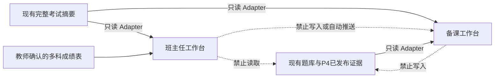

# Phase 4 与两大教师工作台三路并行实施总索引

> 状态：三路方向已确认，等待从文档合入后的稳定主线启动
>
> 本文件名为兼容既有链接保留；当前内容已经从“两大工作台并行”升级为“三路并行总控”。
>
> 三条业务线：
>
> - P4 线：[《Phase 4 详细实施计划》](../superpowers/packages/phase-4-execution-packages.md)
> - A 线：[《初中数学备课工作台详细实施计划》](./TEACHING_PREP_WORKBENCH_IMPLEMENTATION_PLAN.md)
> - B 线：[《班主任工作台详细实施计划》](./CLASS_TEACHER_WORKBENCH_IMPLEMENTATION_PLAN.md)
>
> 上位产品设计：
>
> - [《个性化训练闭环产品与实现设计》](./PERSONALIZED_TRAINING_LOOP.md)
> - [《初中数学备课工作台设计》](./TEACHING_PREP_WORKBENCH.md)
> - [《班主任工作台总体设计》](./CLASS_TEACHER_WORKBENCH.md)
>
> 重要声明：本文授权的是开发边界和顺序，不等于授权本轮立即读取真实 `user_data`、迁移真实数据库、调用真实模型、操作真实教学资料或学生资料、打印真实学生试卷，或执行不可逆操作。每类真实操作仍按项目规则逐次确认。

## 1. 目标与结论

目标是在同一套系统上同时推进三条互不污染的产品线：

- **P4 线**强化现有知识图谱、推荐、训练卷和训练回流；
- **A 线**新增个人备课工作台；
- **B 线**新增班主任工作台；
- 三条线各自拥有业务目录、数据库、状态、测试和人工验收；
- 公共导航、路由、模块加载、路径、迁移和 Job 插槽只由一个短期共同地基修改；
- 三条线不直接读写彼此数据库，不共享业务表，不用复制文件同步；
- 任何跨工作台联动都等三条线独立完成后另行立项。

三路并行不是在同一天直接建立三个大型业务分支，然后一起修改公共文件。冻结的启动方式为：

```text
本组设计文档合入 main，记录稳定起点 M0
                         ↓
            ┌────────────┼────────────┬────────────┐
            ↓            ↓            ↓            ↓
     F0 公共插槽地基   P4-00/01     A00 WPS Gate   B00 治理规格
     （短期公共线）    （可先研究）  （需文件授权） （不建库）
            ↓            ↓            ↓            ↓
      F0 合入 main，记录共同起点 M1
                         ↓
       P4 同步 M1；A、B 从 M1 或当时稳定 main 创建
            ↓                    ↓                    ↓
        P4 业务线              A 业务线              B 业务线
   图谱与个性训练闭环       个人备课工作台        班主任工作台
            ↓                    ↓                    ↓
       分别测试、复审和用户人工验收
            ↓
   按准备程度依次合入；后一条线同步最新 main 后再验收
            ↓
       可选：另开只读跨模块整合任务
```

P4-00/P4-01、A00 和 B00 都可以在 F0 期间进行，因为它们分别是基线研究、WPS 可行性验证和治理规格，不应修改公共接入文件。A00 的真实 WPS 文件操作仍需精确授权；B00 只使用匿名案例和规则文档，不创建学生数据库。

## 2. 当前任务边界记录

### 2.1 本计划包含

- 三条业务线的起点、分支、worktree 和文件所有权；
- F0 公共插槽地基的范围；
- P4、A、B 的数据库、API、Job 和前端命名空间；
- P4 与备课工作台之间的只读证据接口；
- B00 治理关口；
- 长期并行期间的同步、冲突、失败和合并规则；
- 默认验收顺序和交叉冒烟；
- 可以直接派发给四个启动任务的指令。

### 2.2 本计划不包含

- 本轮直接实现 F0、P4、A 或 B 业务代码；
- 读取或写入真实教材、PPT、教辅、学生档案、成绩、训练卷或答卷；
- 真实模型费用；
- 真实数据库迁移；
- 自动建立统一教师首页；
- 让三条业务线共享数据库、长期 AI 记忆或事件总线；
- 把班主任信息送入备课或个性化训练；
- 自动把个性化训练结果送入班主任档案；
- 自动生成新题；
- 自动发送消息、自动打印或自动发布下一轮训练。

### 2.3 验收条件

本计划可派发必须满足：

1. 三条线有明确且不重叠的业务目录、数据、路由和测试所有权；
2. 公共热点文件只能由 F0 或后续独立的地基修正修改；
3. P4 的普通考试与训练语义隔离；
4. A 只读使用已有题库和匿名学情证据；
5. B 在 B00 和安全底座前不创建敏感数据；
6. 每条线可以在另两条线禁用时独立运行；
7. 合并顺序、主线同步和交叉冒烟明确；
8. 真实文件、真实数据、模型费用和不可逆操作均保留独立授权关口。

### 2.4 风险等级

- 本次文档工作：低风险；
- F0 公共地基：中风险，影响应用导航、路由、启动和扩展点；
- P4：高风险，涉及迁移、一人一卷、扫描身份、模型费用和跨库回流；
- A：中高风险，涉及教材文件、PPTX、WPS 自动化和模型费用；
- B00：高风险决策；B01 以后为很高风险，涉及未成年人敏感信息、加密、删除、审计和外部模型边界。

## 3. 稳定起点、分支与 worktree

### 3.1 起点规则

- 本组文档合入后的 `main` 是启动前的稳定起点 `M0`；
- F0 从 `M0` 创建；
- P4 可从 `M0` 创建并只先做 P4-00/P4-01，F0 合入后必须在进入 Schema 包前同步 `M1`；
- A00 可作为隔离 Gate 从 `M0` 运行，但 A01 业务实现从 `M1` 创建；
- B00 可从 `M0` 整理治理规格，但 B01 业务实现必须同时满足 B00 获批和 `M1`；
- 每个执行记录写完整提交号，不写会漂移的“最新 main”。

### 3.2 建议分支与 worktree

| 用途 | 建议分支 | 建议 worktree |
|---|---|---|
| 公共地基 F0 | `codex/parallel-module-foundation` | `.worktrees/parallel-module-foundation` |
| P4 线 | `codex/phase4-personalized-training-loop` | `.worktrees/phase4-personalized-training-loop` |
| A 线 | `codex/teaching-prep-workbench` | `.worktrees/teaching-prep-workbench` |
| B 线 | `codex/class-teacher-workbench` | `.worktrees/class-teacher-workbench` |
| 可选跨模块整合 | `codex/teacher-platform-integration` | `.worktrees/teacher-platform-integration` |

### 3.3 创建前检查

- 根目录 `main` 的未知修改不被清理、暂存或覆盖；
- 每条线使用独立 linked worktree；
- worktree 中不能复制真实 `user_data`；
- 记录 M0/M1 和分支起点；
- 阅读届时有效的 `AGENTS.md`、`ARCHITECTURE.md`、执行索引和对应实施计划；
- 用户尚未授权真实数据/模型时，默认使用临时路径与 Fake。

## 4. F0：三路公共插槽地基

### 4.1 唯一目的

F0 只把目前集中登记的公共接入点改造成稳定插槽，使 A、B 通过自己的 manifest/feature 接入，并确保 P4 扩展现有图谱和训练页面时不会与新侧边栏入口争抢同一批文件。

F0 不实现：

- 知识关系、掌握度或训练卷；
- 课时树、资料库或 WPS 改课件；
- 日历、SOP、学生档案或加密数据库；
- 真实模型调用；
- 真实业务数据库迁移。

### 4.2 前端模块清单

建议目标：

```text
frontend/src/workspaces/
├── contracts.ts
├── registry.ts
├── registry.spec.ts
└── modules/
    └── README.md
```

工作台 manifest 至少声明：

- 唯一模块 ID；
- 显示名称；
- 左侧栏分组和排序；
- 路由前缀；
- 懒加载页面；
- 图标键；
- 启用条件；
- 数据分类和功能开关。

F0 一次性调整：

- `frontend/src/navigation.ts`
- `frontend/src/router/index.ts`
- `frontend/src/components/shell/AppSidebar.vue`
- `frontend/src/components/shell/AppIcon.vue`
- 必要的导航、路由和应用壳测试

规则：

- P4 继续使用现有“知识图谱/训练”位置，不伪装成新工作台；
- “备课工作台”和“班主任工作台”作为两个新一级入口，排在已有功能之后；
- 两个工作台内部小功能不再增加侧边栏入口；
- 重复 ID、路由或排序键启动失败，不静默覆盖；
- 模块禁用时不显示入口。

### 4.3 后端 feature 注册

建议目标：

```text
backend/workspaces/
├── __init__.py
├── contracts.py
└── registry.py

backend/teaching_prep/feature.py
backend/class_teacher/feature.py
```

F0 只在 `backend/api/app.py` 接入一次聚合注册器。feature 可声明：

- API Router；
- 依赖工厂；
- 模块迁移提供者；
- Job handler 注册器；
- 数据路径和启用条件。

加载器必须：

- 稳定排序；
- 检查模块 ID、API 前缀和 Job 前缀；
- 禁用模块不建目录、不建库、不注册任务；
- 一个模块失败时说明具体模块；
- 不扫描任意用户目录；
- 不把 A/B 业务依赖继续塞进全局依赖文件。

P4 沿用现有图谱/训练路由，不通过工作台 registry 重复注册。

### 4.4 受控路径与模块迁移

在 `PathManager` 中一次性提供：

```text
user_data/workspaces/<validated-workspace-id>/
```

要求：

- ID 使用白名单；
- 绝对路径仍位于受控根；
- 查询禁用模块不产生目录；
- 测试使用临时根；
- A、B 各自决定数据库、缓存和输出子目录；
- 模块迁移只有启用且通过前置 Gate 才运行；
- 迁移事务化、幂等、失败时模块保持不可用。

B 未通过 B00/B01 时，应用启动不能创建 `student_affairs.db`。

P4 的题库迁移仍由 P4 线独占，不把题库迁移塞入工作台注册器。

### 4.5 Job 和模型安全入口

F0 为 A/B 提供模块 Job 注册器：

- Job 类型带模块前缀；
- 重复类型启动失败；
- 禁用模块不注册；
- handler 只通过模块服务获得依赖；
- A/B 不再修改全局 Job 列表。

F0 还提供工作台专用模型策略：

- 默认零自动重试；
- 默认不保存请求和回复正文；
- 只记录模型、耗时、用量、operation ID 和脱敏错误；
- 调用者声明用途和数据分类；
- 未声明时失败关闭；
- A/B 仍各自负责匿名化、发送预览和教师确认。

P4 继续走现有题库/批改模型 Gateway 和统一请求准入，但其新操作同样遵守“一次操作最多一次请求、失败不自动修复”的冻结规则。

### 4.6 普通备份排除与依赖隔离

- A、B 工作台根目录默认不进入普通备份、便携包和传输包；
- B 的受保护目录不能进入明文普通包；
- 模块专用备份由各自业务线实现；
- F0 用备份预览测试证明排除；
- 为 A/B 预留独立依赖文件；
- 公共 `package.json` 或根 Python 依赖变化必须作为地基修正，业务线不得各自改。

### 4.7 F0 明确不做

- 不抽象统一“教师行动、证据、草稿、版本”业务表；
- 不建设三个模块共享数据库；
- 不建设统一教师首页；
- 不建设跨模块事件总线；
- 不改变题库、批改和训练语义；
- 不加入 WPS、加密或二维码的业务依赖；
- 不创建空白业务数据库。

### 4.8 F0 故障与验收

| 场景 | 预期结果 |
|---|---|
| 重复模块 ID/路由/Job | 启动明确失败 |
| 模块禁用 | 无导航、API、目录、数据库和 Job 副作用 |
| manifest 损坏 | 指出模块，不静默吞错 |
| 路径逃逸 | 拒绝并返回非敏感错误 |
| 模块迁移中断 | 回滚并保持该模块不可用 |
| 普通备份扫描工作台目录 | 测试失败并阻止合入 |
| 模型策略未声明 | 调用前拒绝 |
| 现有 P4 页面 | 导航和路由保持原行为 |
| 当前已有系统 | 启动、批改、题库和运维冒烟无回归 |

F0 合入后记录完整 `M1`。A01 和 B01 只能从包含 M1 的稳定主线开始；P4 在进入 P4-02 前同步 M1。

## 5. 三条业务线的永久隔离边界

### 5.1 命名空间

| 项目 | P4：图谱与训练 | A：备课 | B：班主任 |
|---|---|---|---|
| 逻辑模块 | `phase4-training` | `teaching-prep` | `class-teacher` |
| 前端入口 | 现有图谱/训练入口 | `/teaching-prep` | `/class-teacher` |
| API 前缀 | 现有 `/api/graph`、`/api/training` | `/api/teaching-prep` | `/api/class-teacher` |
| Job 前缀 | `relation.*`、`training.*` | `teaching_prep.*` | `class_teacher.*` |
| 主数据边界 | 题库库＋阅卷证据只读/回流协议 | `teaching_prep.db` | `student_affairs.db` |
| 后端主要目录 | `question_bank/**`、`backend/training_assessment/**` | `backend/teaching_prep/**` | `backend/class_teacher/**` |
| 前端主要目录 | 现有 graph/training 页面 | `frontend/src/workspaces/teaching-prep/**` | `frontend/src/workspaces/class-teacher/**` |
| 迁移 | `migrations/question_bank/**` | `migrations/teaching_prep/**` | `migrations/student_affairs/**` |
| 测试 | `tests/phase4/**` 及直接受影响既有测试 | `tests/teaching_prep/**` | `tests/class_teacher/**` |

三条线的表名、API 类型、状态枚举、缓存键、导出名和日志事件使用各自命名空间。不得建立跨模块数据库外键。

### 5.2 公共热点文件

F0 合入后，三条业务线默认都不得直接修改：

- `frontend/src/navigation.ts`
- `frontend/src/router/index.ts`
- `frontend/src/components/shell/AppSidebar.vue`
- `frontend/src/components/shell/AppIcon.vue`
- `frontend/src/main.ts`
- 公共前端依赖和锁文件
- `backend/api/app.py`
- `backend/api/routers/__init__.py`
- `backend/api/dependencies.py`
- `backend/jobs/default_handlers.py`
- `path_manager.py`
- 全局 Schema/迁移分发入口
- 工作台公共 LLM 策略、Gateway 和诊断器
- 普通备份、恢复和离线包的全局来源清单
- `AGENTS.md`、`ARCHITECTURE.md`、根 `CONTEXT.md`、执行索引和全局 UI 规范
- 另两条业务线的目录、数据库、测试和产品文档

确实需要修改时：

1. 当前业务修改暂停；
2. 记录真实触发过程和现有插槽不足；
3. 建立一个很小的公共地基修正分支；
4. 修正单独测试、复审并合入；
5. 三条活动线在包边界同步后继续。

不得让三个分支各自实现不同的公共补丁。

### 5.3 数据读取关系



冻结规则：

- A 可只读教材目录、题库和教师选择的匿名数学考情；
- A 保存自己的版本化证据快照，不回写 P4；
- B 可只读教师选择的完整考试摘要和自己确认导入的多科成绩；
- B 不读取训练判定点、个性卷、答卷图片或学生训练反馈正文；
- P4 不读取备课资料或班主任档案；
- 来源缺失时模块降级，不假设另一个模块存在；
- 跨模块写入和自动联动一律延后。

### 5.4 UI 边界

- P4 沿用现有图谱和训练入口；
- A、B 各自只增加一个一级入口；
- A/B 的小功能从课时、任务、事务或学生自然下钻；
- 三条线复用设计令牌和通用组件，只在自己的目录写局部样式；
- 全局样式变更走公共地基修正。

## 6. 三路启动节奏

### 6.1 第一波：四件事并行

1. F0 实现公共插槽；
2. P4 执行 P4-00 和 P4-01；
3. A 执行 A00 WPS 可行性 Gate；
4. B 执行 B00 治理、威胁模型和学校口径规格。

其中：

- F0 和 P4-00/01 只用代码、临时数据和合成样本；
- A00 读取和写入代表性 PPTX 副本前必须取得精确授权；
- B00 不创建业务分支、页面或数据库，只产出治理决定。

### 6.2 第二波：三条业务线并行

F0 合入并记录 M1 后：

- P4 同步 M1，进入 P4-02 以后；
- A 从 M1 创建正式业务分支，按 A01—A10 推进；
- B 只有 B00 获批才从 M1 创建正式业务分支并进入 B01—B11；
- 如果 B00 尚未完成，P4 和 A 不等待，B 继续治理工作；
- 如果 A00 失败，A 可转为“只生成改编清单、教师手工 WPS 执行”，但该产品变化必须由用户确认后冻结；
- P4 不因 A/B 延迟而停止。

### 6.3 每条线的节奏

1. 开始实施包前核对依赖和授权；
2. 只修改本包和本线范围；
3. 完成后运行受影响测试；
4. 更新本线执行记录；
5. 创建本地检查点；
6. 在实施包边界同步已经稳定的 `main`；
7. 整条线形成稳定候选后，才运行一次较大范围测试和正式复审。

不为每个小包重复跑相同全量测试，也不在一条线中合入另一条尚未验收的业务分支。

## 7. 同步、冲突和需求变化

### 7.1 同步主线

- 三条线只从 `main` 同步已验收内容；
- 不通过复制文件或互相 cherry-pick 未验收业务提交；
- 同步前工作区干净并记录检查点；
- 不 force push；
- F0 契约变化时三条线先适配；
- 一条业务线合入后，仍在开发的线在下一个包边界同步；
- 同步后只运行自身全套检查和已合入模块的启动/导航/只读冒烟。

### 7.2 需求变化归位

- 知识图谱、训练判定、一人一卷、扫描回流 → P4；
- 教材、教辅、课时、课件和 WPS → A；
- 日历、SOP、学生支持档案和状态关注 → B；
- 导航、模块加载、受控路径、全局 Job/迁移/模型安全入口 → 公共地基修正；
- P4 证据在备课中只读展示 → A 的 Adapter；
- 需要互相写入或统一首页 → 三条线独立合入后的整合任务；
- 改变真实数据、费用或不可逆结果 → 暂停并取得用户决定。

## 8. 默认验收与合并顺序

### 8.1 固定第一步

F0 必须先独立验收并合入 `main`。它不等待三个业务模块完成。

### 8.2 P4 与 A

P4 和 A 不设固定先后，以哪个先形成完整候选为准：

- 先完成者冻结候选、测试、双复审和用户人工验收；
- 用户明确批准后合入；
- 后完成者同步最新 `main`；
- 运行自身完整检查和已合入模块的启动、导航、只读 Adapter 冒烟；
- 不因同步而建立业务依赖。

### 8.3 B

B 默认最后验收和合入，因为它的敏感数据、安全和删除风险最高。B 在冻结候选前必须：

- 同步已经合入的 F0、P4 和/或 A；
- 运行 B 全部安全检查；
- 对 P4 与 A 做启动、导航和只读边界冒烟；
- 证明普通备份不包含 B 数据；
- 使用合成学生完成加密、恢复和删除；
- 经过用户安全人工验收。

如果 B 先完成，也不能降低 B00/B01 和安全验收门槛；合并顺序变化要在执行索引中明确记录。

### 8.4 每条线独立完成

一条线完成不以另两条线完成为前提。跨模块整合不作为任何一条线首版验收条件。

## 9. 三路并行故障场景

| 场景 | 预期结果 |
|---|---|
| 两条线要改同一公共文件 | 停止业务修改，另建公共地基修正 |
| F0 延迟 | P4-00/01、A00、B00 可继续；业务 Schema 不越过各自 Gate |
| A00 失败 | A08 暂停；由用户决定缩小自动编辑范围 |
| B00 未获批 | 不创建 B01 数据库；P4/A 继续 |
| P4 真实迁移未授权 | 使用临时数据库完成开发，停止在真实迁移关口 |
| 一条线模型失败 | 不自动重试，不影响另两条线 |
| 一条线合入 main | 其他线在包边界同步并做自身检查 |
| 同步出现业务目录冲突 | 视为所有权被破坏，停止并查明来源 |
| 一条线取消 | 保留其他线和已经合入的 F0，不删除其分支或数据 |
| 应用启动某模块失败 | 明确模块名；禁用该模块时其他功能可运行 |
| 真实数据误入工作树 | 立即停止，不暂存、不提交，按安全规则处理 |
| 跨模块新需求 | 记录为后续整合，不塞入当前线 |

## 10. 可直接派发的启动指令

### 10.1 给 F0 任务

> 阅读 `AGENTS.md`、`ARCHITECTURE.md`、当前执行索引和本总索引。从文档合入后的稳定 main 记录 M0，创建 `codex/parallel-module-foundation` 和独立 worktree。只实现第 4 节 F0：模块 manifest/feature 插槽、受控路径、模块迁移与 Job 注册、工作台模型安全策略和普通备份排除。不要实现 P4、备课或班主任业务，不创建业务数据库，不读取真实 `user_data`。完成受影响测试、现有导航/启动人工检查和正式双复审后停止，等待用户验收与合并授权。

### 10.2 给 P4 任务

> 从文档合入后的稳定 main 创建 `codex/phase4-personalized-training-loop` 和独立 worktree，记录完整起点。严格执行 `docs/superpowers/packages/phase-4-execution-packages.md`。F0 合入前只推进 P4-00/P4-01，不修改公共接入文件；进入 P4-02 前同步 M1。只使用临时数据库、合成学生、合成题目、合成扫描和 Fake 模型，真实迁移、真实答卷、真实模型和打印扫描逐次授权。不得修改 A/B 目录或普通考试分数语义。

### 10.3 给 A 任务

> 先按 `docs/product/TEACHING_PREP_WORKBENCH_IMPLEMENTATION_PLAN.md` 执行 A00；代表性 PPTX 必须只对经用户授权的副本操作。F0 合入后，从记录的 M1 创建 `codex/teaching-prep-workbench` 和独立 worktree，按 A01—A10 推进。只拥有 A 的目录和命名空间，不修改公共接入文件、P4/B 业务或源 PPTX。读取题库和学情只经过稳定只读 Adapter。

### 10.4 给 B 任务

> 先执行 `docs/product/CLASS_TEACHER_WORKBENCH_IMPLEMENTATION_PLAN.md` 的 B00，只产出治理、威胁模型、字段、保留、删除、加密、恢复和学校流程规格，不建库、不加页面、不接真实学生。只有 B00 获用户确认且 F0 已合入，才从包含 M1 的稳定 main 创建 `codex/class-teacher-workbench`，按 B01—B11 推进。全程先用合成数据，不读取 A/P4 业务数据库，不把敏感正文写入普通日志。

## 11. 总完成定义

三路计划全部完成需满足：

- F0、P4、A、B 分别通过自己的验收；
- 三条线都包含共同地基 M1；
- 三个模块可分别启用、禁用和启动；
- 禁用任一新模块不影响其他模块和现有阅卷；
- 不存在跨模块数据库外键或直接写入；
- P4 不污染正式考试分数；
- A 不覆盖源 PPT，输出可在 WPS 使用；
- B 的敏感数据加密、锁定、审计、备份和删除真实有效；
- 所有模型失败都不自动追加费用；
- 用户分别完成三条线的人工验收；
- 真实数据和费用均经过逐次授权；
- 跨模块联动仍保持为独立后续任务。
