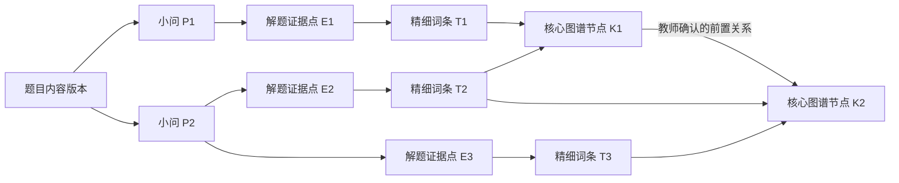

# UI 优化与统一工作流迭代

> 状态：正式数据库升级、8035 新服务重启与开发侧浏览器验收已完成；等待教师人工验收
> 日期：2026-08-01
> 分支：`codex/ui-optimization`
> 适用范围：题库与 P4 共用分析、评分依据生成、难度筛选、PDF/图片题目入库、Word/公式导出、班主任工作台

## 2026-08-01 人工复查返修（当前任务）

### 目标

把配置来源试卷的拆题核对改为“题目—完整答案”双卡，并让所有图片都能被教师重新归属；同时完成试卷级与全局重新标注、题目标签压缩、组卷难度一致、备课入口恢复和备课/班主任模型用途配置。最终候选必须能够由教师自行启动网页并完成合成数据人工验收。

### 包含

- 每道题左侧完整题目、右侧完整答案；移除题型选择、展开答案和排除此题；
- 所有题目图和答案图具有稳定图片身份，自动归属、不确定归属和教师调整使用同一套归属记录；
- 图片可以在题目与答案落点之间拖拽，也提供“移动到……”键盘/点击后备操作；
- 未处理图片黄色提示，最后一张处理完成后生成按钮立即可用；不可用时显示准确原因；
- 试卷卡片与页面顶部提供补齐标签和重新 AI 标注入口；全局操作先预检范围，失败只重试失败题；
- 试卷库回收站和卡片移入操作改为带可访问名称的图标；
- 题目详情隐藏标准知识点 ID 和置信度，每类标签使用紧凑分类行；
- 组卷工作台直接采用题库管理的完整双滑块表现；
- 备课工作台默认显示并加载；真实 WPS 执行继续由独立开关控制；
- 模型配置增加备课和班主任用途，默认继承高级配置的服务地址和密钥，但允许独立模型；调用记录增加对应用途。

### 明确不包含

- 不调用真实模型，不产生真实费用；
- 不读取、写入或迁移真实 `user_data`，不使用真实试卷、学生档案或教材验证；
- 不自动执行真实备课数据库迁移或真实 WPS 操作；
- 不 push、不创建 PR、不合并或同步 `main`；
- 不在本任务中重新设计已经冻结的解题证据、知识词表或知识图谱语义。

### 验收条件

1. DOCX 合成来源至少包含题目图、答案图和一张相邻不确定图；页面以双卡完整呈现，所有图片均可重新归属，刷新后教师决定仍保留。
2. 不确定图未处理时按钮旁显示具体原因；处理最后一张后按钮无需刷新立即启用，生成请求包含当前全部图片归属。
3. 同一图片只能位于一个落点；重复拖放幂等，多窗口旧版本写入被版本冲突拒绝并提示重新加载。
4. 单卷“补齐标签”只选择不完整题；单卷/全局“重新 AI 标注”在确认前显示题目数，不覆盖教师手工标签，不重复提交正在运行的题。
5. 标签详情不显示规范 ID 和置信度；组卷与题库难度条视觉、刻度和交互一致。
6. 默认启动构建中同时显示备课和班主任入口；备课 API 可加载，真实 WPS 仍未启用。
7. 模型配置可分别保存备课和班主任模型用途；不填写独立地址和密钥时安全继承高级配置；返回页面时不泄露密钥。
8. 受影响前后端测试、类型检查、规范检查、生产构建和合成浏览器流程通过；正式双复审无当前范围 `Critical` 或 `Important`。

### 风险等级与故障场景

风险等级为中高：涉及跨前后端数据契约、任务重试、外部费用入口、模块启用和本地配置保存。

- **重复操作**：图片重复拖到同一落点不产生重复记录；重新标注使用请求号防止重复任务和重复费用。
- **同时操作**：同一题的标注任务以题号加锁；不同窗口保存旧图片归属版本时返回冲突，不静默覆盖。
- **中途退出/重新启动**：图片归属随来源版本恢复；标注任务沿用任务记录，不因页面刷新重新请求模型。
- **失败重试**：默认只重试失败题；“全部重新标注”必须再次展示范围并确认，不从普通失败重试升级为全量调用。
- **取消**：已取消任务不自动重启，成功题结果保留；后续教师可以显式选择失败题重试。
- **部分完成**：页面分别显示成功、失败、跳过完整题数量；全局任务部分完成不伪装为全部完成。
- **数据缺失或冲突**：图片身份缺失、来源版本变化或落点题号不存在时拒绝生成；教材册别或模型用途不完整时给出明确可操作原因。

### 2026-08-01 候选收口记录

- 集中调查与实现覆盖本节冻结的拆题图片、标签任务、难度筛选、备课/班主任入口与模型用途；未扩大到知识语义重设计。
- 初始完整候选通过前端 98 个文件 893 项测试、后端受影响范围 478 项测试、类型检查、lint 与生产构建；浏览器已确认题库和组卷双滑块均可操作，右滑块可从 10 调至 9，班主任日期读取 2026-08-01 本机当天。
- 首轮并行复审收到 6 条原始意见：其中滑块意见被真实浏览器证据排除；其余问题归并为标签补齐、标签任务幂等、图片键盘后备操作、内部知识 ID 暴露和备课首次启动迁移门禁。
- 统一修复后，后端标签任务定向测试 17 项、前端定向测试 33 项、前端类型检查、lint 和生产构建全部通过；构建仅保留原有大分块体积提示，不影响功能。
- 一轮限定最终复审已完成，两名原评审者均确认无剩余 `Critical` 或 `Important`；没有启动第三轮开放式审查。
- 使用工作树内全新隔离数据目录完成一次真实启动路径冒烟：健康接口返回 `ok`，首页返回 200，备课模块报告启用且迁移到 `012_generation_performance`，隔离备课库成功创建；真实模型和真实 WPS 均保持关闭。隔离进程在检查后已停止。
- 当前剩余工作只有：取得一次正式备课数据库建立/升级与应用重启授权，随后检查健康状态和真实网页静态流程。该步骤不调用模型、不产生模型费用，也不写入真实学生正文；现有工作树中的历史 `user_data` 修改和备份不清理、不暂存、不覆盖。
- 当前任务代码候选通过验收；整个版本在完成上述授权启动和浏览器冒烟前不标记为可交付启动状态，也未 push、未建 PR、未合并 `main`。

### 2026-08-01 晚间连续修复目标

- **目标**：修复实际页面复查发现的双滑块、知识关系治理、训练范围筛选和班主任入口问题；完成后应用保持可启动，教师次日可直接打开页面验收。
- **包含**：双滑块可见性与刻度对齐；移除教师页面上的 V1/V2 工程术语；把知识关系治理改为“AI 与规则自动处理多数、教师只审异常”；训练推荐改为紧凑卡片筛选并在有效范围变化后自动刷新热力图；班主任周历默认定位系统当天；在敏感入口内提供班级学生名单配置和与 AI 讨论形成当前结构化学生摘要的明确入口。
- **明确不包含**：不增加第二个随手记、会议或 SOP 入口；一句话普通工作入口继续统一承担任务细化、流程卡片和日历更新。不调用真实模型，不写入真实学生内容，不迁移其他真实数据库，不 push、不创建 PR、不合并主线。
- **验收条件**：左、右滑块均始终可见且与 1—10 刻度中心对齐；知识图谱页不再出现 V1/V2，普通高可信关系不要求教师逐条确认，异常队列说明清楚；训练范围不使用低效原生多选框，筛选有效后无需再按“分析”按钮即可看到热力图；班主任工作台打开时默认选择系统当天，普通工作无重复功能卡，解锁敏感区后能配置名单并进入 AI 讨论式学生摘要流程；受影响测试、类型检查、构建和真实页面冒烟通过。
- **风险等级**：高。知识关系会影响薄弱点解释和训练推荐；自动分析可能造成重复请求；学生名单和摘要属于敏感数据。实现必须保留冲突/环路/新增核心节点等异常审核，筛选刷新必须防抖并取消过期读取，敏感入口锁定时不得加载名单或正文。

相关故障场景冻结为：重复快速改筛选只采用最后一次结果；旧分析晚返回不能覆盖新范围；模型置信度高但规则冲突时仍进入异常队列；知识关系自动处理失败不阻断题目标签保存；学生名单创建部分失败时如实报告已完成项；页面刷新或锁定立即清除敏感草稿；应用重启后日历重新读取当日本机日期，不沿用过期的上次默认日。

### 2026-08-01 指定学生累计选择限定返修

- **目标**：关闭最终复审发现的训练筛选直接回归，保证跨多次搜索累计选择的学生都进入正式分析范围。
- **包含**：把“当前班级学生”和“当前搜索可见学生”拆成两个明确集合；搜索只改变可见卡片，正式范围和顶部人数只按当前班级内已勾选学生计算；增加跨搜索累计选择回归测试。
- **明确不包含**：不调整得分率筛选、考试筛选、热力图算法或学生数据接口。
- **验收条件**：依次搜索并勾选学生甲、学生乙后，分析请求同时包含两人；切换班级仍清理旧班学生；清空或改变搜索词不触发分析、不改变已选范围。
- **风险等级**：低。只修复前端派生集合，既有请求取消与范围一致性逻辑保持不变。

返修结果：搜索可见集合与正式已选集合已经分离；跨搜索累计选择测试通过。该限定返修完成 1 个受影响测试文件 6 项测试、前端类型检查、lint、生产构建与差异检查；重新启动后的 `/api/healthz` 正常，题库与训练页面可打开且浏览器控制台无错误。真实模型仍未调用，真实学生正文未读取或写入。

## 1. 本轮结论

本轮不是若干互不相干的页面微调，而是把三条重复建设的流程收敛成两条底层主线：

1. **题目内容主线**：来源文件经过一次拆题和审核后，形成“小问—解题证据点—精细词条—图谱节点”的统一结构；题库标签、P4 训练判定点和考试评分步骤都从这一结构派生。
2. **教师工作主线**：教师用一句自然语言创建普通工作，系统形成可确认的日历与 SOP 工作图；只有学生敏感内容进入单独加密入口。

已经确认的产品决定：

- 1121 个知识词条保留为完整、精细的正式词表；不会用 70 个核心图谱节点取代它们。
- 每题仍先根据题干、答案和教学语境动态召回少量候选词，再交给模型选择。
- 标签精确到每个小问和每个解题证据点；整题知识词条和图谱节点由下层结果去重汇总，不再独立生成。
- 精细词条可连接一个或多个核心图谱节点，也可与其他精细词条建立有类型的关系；不是强制单父节点的树。
- 直接考查与辅助/前置知识分开保存，只有直接考查默认参与掌握度计算。
- 评分依据不再提供“分批生成/整卷生成”两条产品路径；内部可自动分批，但教师只经历一次“分析试卷—统一赋分—确认发布”。
- 难度标尺显示 1—10 全部刻度，`8—10` 明确标为“压轴拔高”。
- 普通班主任工作不要求密码；学生敏感信息入口使用教师创建的 6 位数字 PIN，并叠加 Windows 当前用户/当前设备保护。
- 普通工作的分类、细化、依赖和倒排由 AI 根据每次输入生成；本地程序不得把示例固化成关键词模板，只负责安全路由、明确日期约束、逐次发送确认、结果校验和防重复调用。
- 学生敏感文本只有在每一次都展示匿名化、最小化后的实际发送预览并由教师明确确认后，才可发给已配置的外部模型。
- LaTeX 作为数学表达的规范编辑/交换语言；Word 最终优先输出可编辑的 OMML 原生公式，不能把公式图片当作统一排版的主要方案。

### 1.1 三项限定返修边界（2026-07-31 已授权）

- **目标**：关闭限定最终复审留下的 3 个 `Important`，使普通工作图分支完整且不重复，并让已证实的常见姓名表达稳定进入敏感入口。
- **包含**：汇聚型多根 `review_of` 分支按连通分量去重；目标卡、普通步骤和独立事项共用分支呈现；补齐“动词＋姓名＋日期/相对日期/安排任务”硬敏感路由及回归测试。
- **不包含**：不新增本地业务拆解模板，不调整其他工作台功能，不扩大姓名识别为通用中文命名实体识别，不启动真实应用，不调用真实模型，不读取或迁移真实 `user_data`。
- **验收条件**：三个已证实触发过程先形成稳定失败测试，修复后全部通过；受影响后端与前端回归、类型检查、lint 和 `git diff --check` 通过；同一冻结候选完成一次需求符合性和代码质量并行复审。
- **风险等级**：高。分支错误会让教师误读或看不到已确认计划；姓名漏拦可能把学生身份带入普通模型请求，因此失败必须关闭，不能用“发送前由教师自己发现”代替本地安全路由。

### 1.2 姓名与组织称谓组合边界重新设计（2026-08-01 已授权）

- **目标**：同时关闭两种相反错误：组织称谓内部不得被截取成具体姓名；组织称谓后出现的真实姓名仍必须进入敏感入口。
- **包含**：重做姓名候选与“全班、各班、班级”等组织称谓的扫描边界；为“通知全班同学/各班同学”“提醒全班同学”三种误拦，以及“班级里的王小明”“全班的王小明”两种漏拦建立精确回归测试。
- **不包含**：不扩展为通用中文命名实体识别，不新增敏感类别，不改变普通任务的 AI 规划流程，不启动真实应用，不调用真实模型，不读取、迁移或写入真实 `user_data`。
- **验收条件**：五个已证实触发过程先形成稳定失败测试；修复后原有姓名与组织称谓用例及新增五例全部通过；受影响后端回归与差异检查通过；同一冻结候选完成一次需求符合性和代码质量并行复审。
- **风险等级**：高。误拦会阻止普通工作，漏拦则可能让学生身份进入普通模型请求；两类结果都属于安全路由错误。

## 2. 任务边界

### 2.1 目标

- 让一道题的题干、小问、答案、解题证据点、知识词条、图谱身份、训练判定点和评分步骤可追溯到同一内容版本。
- 简化评分依据生成，消除教师对“整卷还是分批”的技术选择。
- 修复题库难度筛选的可读性、刻度和区间表达。
- 建立可复用的 PDF、扫描件和照片题目识别底座，支持审核后入题库并导出 Word。
- 统一普通组卷与一人一卷的数学公式和版面渲染。
- 把班主任工作台改造成高信息密度、日历优先、自然语言驱动的工作图；敏感学生档案延迟加载并单独保护。

### 2.2 包含

- 新的数据契约、兼容适配器、页面流程、受影响 API、合成测试资料与测试。
- 新代码所需的数据库迁移定义与回退策略。
- 旧数据兼容读取；旧结果不会被自动改写。
- 本地、免费、可替换的 OCR/版面识别适配器，以及人工框选兜底。
- 模型请求的预览、确认、幂等、失败与审计边界。

### 2.3 明确不包含

- 不读取、复制、修改、迁移或删除真实 `user_data/`。
- 不使用真实学生档案、真实试卷、真实教辅或真实密钥验证。
- 不实际调用外部模型，不产生费用。
- 不自动把旧班主任加密数据迁到普通工作区，也不自动重包旧保险箱密钥。
- 不承诺 OCR、公式识别或答案配对 100% 正确；低置信结果必须保留原图并进入教师审核。
- 不自动激活模型提出的知识关系，不自动作诊断、欺凌认定、惩戒决定、紧急裁决、外发或结案。
- 本轮不 push、不创建 PR、不合并、不同步 `main`；这些动作仍需单独授权。

### 2.4 风险等级

**高风险。** 本轮涉及知识统计语义、评分依据、跨模块内容版本、文件导入导出、加密、权限、外部模型隐私、并发、重试和中断恢复。OCR 或公式错误还可能在一人一卷中被批量放大。

## 3. 问题—根因—修改方案总表

| 编号 | 现有问题与根因 | 冻结修改方案 | 核心验收 |
|---|---|---|---|
| Q1 | 标签能返回多个知识词，但图谱只接受少量稳定身份；大量精细词条没有明确投影，且当前主要知识身份是单值 | 保留完整词表和动态候选召回；新增精细词条关系层与多值 `knowledge_refs`；每个证据点分别绑定词条、图谱节点和角色 | 一题多小问、多证据点、多知识均不丢失；整题为可复算并集；映射缺失显式进入治理 |
| Q2 | 标签、P4 判定点和评分依据分别生成；教师还要选择分批/整卷 | 建立统一的无分值“解题证据点”；一次按题自动分批分析，同时产出标签与证据结构，再只做一次整卷赋分 | 页面只保留一个生成入口；评分总分正确；P4 判定点仍不带分值；失败不重复收费或发布半成品 |
| Q3 | 难度轨道和滑块过粗、遮挡文字、缺少刻度和当前数值 | 细轨道、小视觉滑块、大透明点击区；显示 1—10 全刻度和当前区间；8—10 标为压轴 | 8 位置有明确刻度；文字无遮挡；键盘和触控仍易操作 |
| Q4 | 题库 PDF 目前主要抽纯文本；扫描件只标记“需要 OCR”，照片未形成统一入库流程 | 复用现有本机 OCR、逐页渲染、跨页多区域和人工审核能力，建立共享 `QuestionDocumentPipeline` | 扫描/照片可形成可追溯题目草稿；双栏、跨页、题图、答案错配可人工纠正；确认后才入库 |
| Q5 | 现有 LaTeX 主要转 PNG；普通组卷和一人一卷使用不同渲染路径 | 建立统一数学表达节点和 Word 渲染器；经校验的表达输出 OMML，未知表达回退原图并报告 | DOCX 公式可编辑；两类组卷复用同一渲染器；批量成品无缺图、断关系或静默公式丢失 |
| B1 | 整个班主任模块进入即要求至少 12 位密码，普通任务也被保险箱会话绑住 | 普通工作与敏感学生档案物理分开；普通工作无需解锁；敏感入口首次使用时创建 6 位 PIN，并叠加 Windows 当前用户/设备密钥 | 未解锁也可使用日历和普通任务；敏感 API 与内容不加载；6 位 PIN 不是唯一加密强度来源 |
| B2 | B01 顺序靠后，卡片纵向堆叠、过大、信息密度低，内部编号暴露 | 首页改为“周日历/今日—一句话输入—工作图—敏感入口”；去除 B01 等内部编号；紧凑卡片与响应式栅格 | 首屏 30 秒内看清今天/逾期/等待；桌面每行 2—3 个工作卡；小屏单列不溢出 |
| B3 | B03 是固定本地模板拆解，缺少可靠日期语义、倒排和后续调整 | 普通输入经安全路由后，把当次语境和明确日期作为完整可见请求交给 AI；AI 生成任务细化、依赖和逆向排期，教师二次确认后入日历 | “8 月 30 日开家长会→可能提前准备 PPT”只是一种示意结果，绝不是本地固定规则；实际节点由 AI 结合当次要求生成，不编造未知日期或时刻 |
| B4 | B04 本质是 B03 的批量文本入口；“收集板”与会议的关系不清 | B03/B04 合并为同一个自然语言入口；会议纪要只是输入模式，收集任务成为工作图中的一种节点/详情 | 首页不再出现两个相似模块；会议中的通知、提交、收集、复查都进入同一工作图 |
| B5 | 事务清单要求先选分类、填多张表；SOP 卡片过大，状态和分支难更新 | 一句话输入后本地先做安全路由，AI 提出分类和 SOP 草稿；小矩形节点用箭头连接，颜色+文字表示状态；最新情况再次由 AI 提出待确认分支差异 | 无需先选分类；可点选完成/进行中/等待/受阻，或输入进展；新分支未经确认不改正式工作图 |
| B6 | “今天推进什么”不是日历管理，添加行动仍需表单 | 顶部周日历+今天/逾期/待复查摘要；自然语言和明确日期进入 AI 规划，AI 生成倒排草稿，本地校验日期与依赖；表单降为草稿编辑器 | 点击日期即可查看和添加；同一行动在首页、日历和 SOP 中一致，不产生重复记录 |
| B7 | 密码、备份、恢复设置占据首页；学生记录入口复杂且敏感内容提前加载 | 首页底部只保留“受保护学生档案”；解锁后按学生显示教师原始记录、结构化草稿、追问和 SOP；备份/恢复移入高级设置 | 未解锁不请求学生列表；每名学生一张卡；AI 结果必须确认；首页不展示运维型备份表单 |

## 4. 统一题目语义

### 4.1 两层知识模型

1121 个知识词条与核心图谱节点承担不同职责：

- **精细知识词条**：用于逐题、逐证据点的准确描述、检索和筛选。
- **核心图谱节点**：用于稳定关系、掌握度聚合、薄弱点解释和推荐。

它们不是互相替代，也不是强制的一对一关系。



精细词条关系必须有明确类型，禁止只用一个不可解释的“相关”：

| 关系 | 含义 | 是否直接影响掌握度 |
|---|---|---|
| `specializes` | 精细词条是某核心知识的细化 | 按证据点角色决定 |
| `part_of` | 词条是某知识结构的组成部分 | 按证据点角色决定 |
| `applies` | 词条表达核心知识在特定情境中的应用 | 按证据点角色决定 |
| `combines` | 一个综合词条同时组合多个核心知识 | 按各映射角色分别决定 |
| `equivalent` | 历史词、别名或等价表达 | 不重复计数 |
| `prerequisite` | 理解/完成该点通常需要的前置知识 | 默认不算直接考查 |

模型在题目分析阶段同时提出映射与关系线索；系统先复用已有确认关系，再由确定性规则和独立 AI 核验治理新关系。只有满足高置信、多证据一致、无重复、无方向冲突、无环路且不新增核心节点的低影响关系才可自动进入活动图谱，并记录来源和可回退收据；歧义、多映射、模型不一致、父子/先修方向冲突、新增核心节点或影响范围大的少数异常交给教师。教师不承担逐条维护整张词表的工作。词条确实无法合理投影到现有核心节点时，才进入“新增核心节点”治理，而不是因为 1121 大于 70 就批量扩图。

关系置信度不能只采用模型自报数字。自动采用门槛由以下信号共同构成：已有治理结果复用、题目/答案/证据点一致、跨题重复支持、模型核验一致以及本地图约束检查。单一模型高分但没有足够证据时只能继续观察或进入异常队列。

#### 当前覆盖审计

当前 1121 个正式知识词条由 70 个 `kp_*`、1029 个外部快照整理词和 22 个其他受控知识词组成。在新增映射层之前，只有 70 个词条能凭相同稳定键直接命中图谱，1051 个会进入 `missing`；这证明的是**映射层断裂**，不能据此直接证明核心图谱“只有 70 个所以一定太少”。

本轮已对 1121 个词条完成第一版确定性基线核算：

| 词条类型 | 总数 | 已明确映射 | 映射歧义 | 未映射 |
|---|---:|---:|---:|---:|
| 核心知识词 | 70 | 70 | 0 | 0 |
| 精细知识词 | 673 | 485 | 90 | 98 |
| 过程/动作词 | 378 | 0 | 0 | 378 |
| **合计** | **1121** | **555** | **90** | **476** |

这 476 个“未映射”不能合并理解：其中 98 个是后续需要治理的精细知识缺口；另 378 个是“计算、化简、证明、作图”等过程/动作词，继续用于描述踩分点，但原则上不应被强行伪装成核心知识节点。当前真正的图谱治理清单因此是 **90 个歧义精细词 + 98 个未映射精细词**。

本轮治理顺序为：

1. 先给 1121 个精细词条补充 `term_kind`，区分概念、性质/定理、程序/操作、综合应用等；“列方程、画垂线、举反例”等程序词可以保留用于逐点描述，但不能无条件变成核心概念节点。
2. 审核每个精细词条到一个或多个现有核心节点的有类型映射。
3. 无法映射的词保持 `unmapped` 或 `ambiguous`，不静默归入相似但错误的核心节点。
4. 对反复出现、语义稳定且确实无法由现有节点表达的词，提出新增核心节点候选。
5. 对重复、别名或维度错放项分别合并或迁移；当前正式词表未发现规范名完全重复项，因此本轮不先做无证据删词。

另有一个独立缺口：稳定教材小节树当前未覆盖全部九年级教材位置。这属于“教材归属”而非知识词表完整性，不用扩充图谱节点来掩盖。

### 4.2 动态候选召回保留并深化

当前正确机制保留：

- 完整词表只在本地参与排序，不整包发送给模型。
- 每道题建立独立候选合同，不能跨题选择。
- 题干、参考答案、题型、年级/学期/考试类型共同参与召回；知识维度最多发送 32 个候选。
- 候选外返回值先对完整词表精确归并，真正未知的词每题最多形成 2 个待审候选。

本轮增加：

1. 将答案解析和已识别的小问文本纳入召回语境。
2. 在不追加模型请求的前提下，对模型形成的证据点文本再次做本地完整词表匹配，记录候选召回遗漏。
3. 增加可替换的语义召回接口；首版仍可使用现有文字召回，测试保证未来更换算法不改变标签治理规则。
4. 模型对每个证据点选择精细词条；整题标签只能由证据点结果派生。

### 4.3 解题证据点

“解题证据点”是题库、P4 与评分依据共用的无分值语义单位：

```text
QuestionContentRevision
  └─ Subquestion[]
       └─ EvidencePoint[]
            ├─ target
            ├─ step_index
            ├─ justification
            ├─ answer_anchor
            ├─ observable_evidence
            ├─ depends_on[]
            ├─ acceptable_equivalents[]
            ├─ counterexamples_or_deductions[]
            ├─ direct_term_refs[]
            ├─ supporting_term_refs[]
            ├─ prerequisite_term_refs[]
            ├─ graph_refs[]
            ├─ source_regions[]
            └─ review_state
```

规则：

- 多小问题按真实小问保存；没有小问的客观题或不可再拆题至少形成一个证据点。
- 过程题中每个可独立获得部分分的数学台阶对应一个证据点；步骤顺序连续，依赖只能引用同一小问的前序点。
- 证据点不带分值，但必须明确该步结果、数学依据、可观察的学生作答证据，以及在完整答案中按顺序出现且包含具体数学内容的原文锚点；后续赋分不得改变证据点结构。
- 每个词条引用使用稳定词条 ID，不把中文显示名当主键。
- `graph_refs` 是多值；废止“整题只有一个主要图谱 ID”作为新写入真值，旧字段只作兼容读取。
- 每个图谱引用保留来源证据点、角色、映射关系和确认状态。
- 整题直接考查词条/节点 = 所有证据点 `direct` 集合的去重并集。
- 辅助/前置集合分别汇总，不向“直接考查”集合传播。
- 修改、删除或重新确认证据点后，整题汇总重新计算；禁止同时维护另一份可漂移的整题标签真值。

## 5. 评分依据生成简化

### 5.1 教师看到的唯一流程


- 页面不再询问“分批生成”还是“整卷生成”。
- 为控制上下文长度，后台仍可自动把题目分批；这是执行细节，不是产品模式。
- 同一物理分析请求同时返回该批题目的精细标签、图谱映射候选和无分值证据点。
- 所有题的证据结构验证完成后，只进行一次整卷赋分，将总分分配到小问和证据点。
- 教师可修改答案、证据点和分值，再发布评分依据。

当前底层已经存在一次响应返回标签与无分值训练判定点的联合结构，但普通题库打标签任务仍主要走旧的纯标签入口；现有联合模块在生产路径中主要用于判定点回填。实施必须把普通打标签主入口真正切换到新版联合分析，而不是只修改提示词或页面文案。

### 5.2 三种投影

同一个证据点内容版本产生三种受控投影：

| 投影 | 是否含分值 | 用途 |
|---|---:|---|
| 题库标签 | 否 | 检索、筛选、内容治理、图谱投影 |
| P4 训练判定点 | 否 | 判断达成/未达成/不确定/无法辨认 |
| 考试评分步骤 | 是 | 正式考试评分依据；分值来自后续整卷赋分 |

兼容路径继续支持“已确认评分依据 → 去分值训练判定点”，但新生成的首选方向是由共同证据点分别投影，避免评分文本反向污染训练语义。

### 5.3 请求与失败规则

- 每次分析和赋分都有操作 ID、输入内容版本和候选词表版本。
- 重复点击返回同一操作，不重复产生模型调用。
- 分析失败只标记失败题/批；不发布半成品，不自动追加付费请求。
- 教师明确重试时只重试失败范围；词表或题目版本改变后，旧结果标记过期。
- 赋分只在所有纳入题目的证据结构有效后运行；总分、小问分和证据点分必须逐层守恒。
- 标签治理、证据点确认和评分依据发布分别记录状态；一个状态失败不能伪装其他状态成功。

## 6. 难度筛选器

### 6.1 数值与文案

难度始终使用整数 1—10。页面显示全部十个刻度，并固定展示当前选择值，例如“难度区间 3—8”。

| 区间 | 页面说明 |
|---|---|
| 1—2 | 入门补缺 |
| 3—4 | 基础巩固 |
| 5—6 | 中档提升 |
| 7 | 综合突破 |
| 8—10 | 压轴拔高 |

“适合学生层次”与数值难度是不同概念；不再让模型用学生层次反向覆盖难度数值。

### 6.2 视觉与交互

- 可见轨道目标高度 3px；滑块可见直径约 12—14px。
- 实际键盘/鼠标/触控命中区至少 32px，不因视觉变细而难操作。
- 两个滑块不允许交叉；键盘方向键可逐级调整。
- 1—10 刻度与区间说明放在轨道下方独立层，不被滑块覆盖。
- 当前数值放在标题行，不依赖滑块内气泡。
- 颜色不是唯一信息；区间名称、数值和选中状态都有文字。
- 桌面和窄屏均不得截断“压轴拔高 8—10”。
- 两个原生范围输入不能依赖浏览器默认层叠顺序；左滑块位于最小值时也必须完整可见。轨道、选择区、滑块中心和刻度使用同一有效宽度，不允许用互不一致的边距造成视觉偏移。

### 6.3 实际复查纠偏

首版细化后仍出现两个问题：左侧滑块在重叠范围层中不可见，滑块中心与刻度使用的几何宽度不一致。本批统一采用“共享有效轨道宽度 + 按当前值动态提升活动滑块层级”，并以最小值、最大值、同值和交叉边界四种状态验证。

### 6.4 训练推荐范围筛选

训练推荐页的第一任务是快速改变热力图观察范围，不再把考试和学生做成两张占满整行的大表单：

- 考试范围使用紧凑模式卡和可搜索的考试卡片；支持当前考试、最近一个月和全部考试，手动范围通过卡片批量选择。
- 学生范围使用整班、按考试得分率分组、个别学生三种紧凑模式；学生以可搜索勾选卡呈现，支持当前筛选结果全选/清空，不再使用需要逐个按 Ctrl 的原生多选框。
- 班级、考试时间、得分率和学生搜索共同构成可见筛选条件；得分率筛选只在选定考试已有成绩证据时生效，缺失成绩不能伪装为零分。
- 有效范围变化后防抖触发同一个现有薄弱点分析读取，取消过期请求并只显示最后一次范围结果；该读取不调用外部模型、不产生费用，因此页面不再要求点击“分析薄弱知识点”。
- 尚未形成有效范围时显示明确空状态；请求失败保留最后一次成功热力图并提供重试，不自动无限重放。

## 7. PDF、扫描件和照片题目底座

### 7.1 现状判断

现有工程已经具备约一半能力：

- DOCX 导入能保留原始 Word XML、公式和图片关系。
- 配置试卷能逐页渲染 PDF、按题号裁图并要求教师审核。
- 备课资料已有本机 OCR、不可变资料版本、多区域/跨页裁图、答案核对和并发版本控制。
- 题库和一人一卷已经可以生成 DOCX。

缺口是这些能力分散在不同业务路径，尚无统一的页、区域、阅读顺序、题目、答案、公式和内容版本契约。题库 PDF 目前仍主要是纯文本抽取；扫描 PDF 只会标记“需要 OCR”。

### 7.2 共享深模块

建立不拥有题库标签、P4 掌握度或备课业务数据的 `QuestionDocumentPipeline`，对外只暴露四类行为：

1. `prepare_source`：固化来源版本，逐页渲染并生成待审核题目包。
2. `apply_review`：保存教师对阅读顺序、题界、公式和答案匹配的修正。
3. `publish_questions`：把满足条件的题目内容版本原子发布给题库适配器。
4. `export_word`：按同一题目内容版本和样式方案生成、验证 Word。

模块内部隐藏 OCR、版面分析、公式识别、题/答案配对、检查点、OMML 转换和 Word/WPS 验证工具，以便以后替换实现而不改变业务流程。

### 7.3 核心数据契约

- `DocumentSnapshot`：来源 ID、哈希、版本、格式、页数、解析方案和状态。
- `PageSnapshot`：页序、原尺寸、渲染资产、PDF 与像素坐标变换、文字层状态。
- `LayoutBlock`：页、坐标、多边形、类型、阅读顺序、识别来源、置信度和候选文本。
- `QuestionDraft`：稳定草稿 ID、题干/小问/选项/图/表/公式节点、来源区域、阻塞问题和内容版本。
- `MathExpression`：原始区域、受限 LaTeX、数学语义结构、OMML、引擎版本、置信度、审核状态和回退图片。
- `AnswerLink`：答案来源区域、匹配依据、置信度以及候选/教师确认/拒绝/缺失状态。
- `PublishReceipt`：操作 ID、来源与内容版本、目标题目版本、资产清单和发布状态。
- `ExportReceipt`：输入题目版本、样式方案、转换器版本、成品哈希、验证结果和公式回退清单。

### 7.4 处理流程

1. 固化原文件哈希和版本，按页渲染；有可信文字层的区域不重复 OCR。
2. 扫描/照片先做方向、去倾斜、透视矫正、裁边和必要去噪。
3. 本机 OCR 返回文字框、置信度和引擎版本，不只返回拼接文字。
4. 版面层识别栏、题号、选项、图、表、公式、页眉页脚和阅读顺序。
5. 一道题允许多区域、跨页和图文分离；双栏不能用整页横切代替阅读顺序。
6. 公式区域单独识别并始终保留高清原图；低置信或不支持表达进入审核。
7. 几何图、函数图和复杂示意图首版作为有锚点的高清图，不承诺自动变为可编辑矢量图。
8. 答案按资料角色、题号/子问和顺序提出候选；只有教师确认答案能进入教师答案页。
9. 教师确认题目完整性、公式和答案后，才允许加入题库并开始标签分析。
10. 题目内容版本改变后，依赖旧内容的公式确认、答案确认、标签建议和证据点标记过期。

## 8. Word 与数学公式统一排版

### 8.1 表达层级

- **LaTeX**：规范输入、人工校对、比较和测试表达；只支持明确白名单语法。
- **数学语义结构/规范 MathML**：验证公式结构和跨格式转换的中间层。
- **OMML**：DOCX 中实际保存的 Word 原生可编辑公式。
- **原始公式裁图**：识别不可靠或表达不支持时的保真回退。

禁止把 OCR、模型或用户提供的任意 LaTeX 直接拼入完整 TeX 模板执行。现有 LaTeX 转 PNG 能力只作为兼容回退，不作为统一 Word 方案。

### 8.2 两种导出策略

- `faithful`：原 DOCX 且内容未改时，优先保留其原始 OMML、图片和必要结构。
- `normalized`：从统一内容节点按样式方案重建；PDF/扫描题、一人一卷和需要统一版面的讲义默认使用。

统一 `WordStyleProfile` 管理题号、正文、选项、答案、行内/独立公式、字号、上下间距、图宽、分页和题干与选项的连页规则。普通组卷和一人一卷必须调用同一个渲染器。

### 8.3 批量质量控制

- 人工检查发生在“唯一题目入库”和“样式方案验收”，不是每名学生的每一份试卷。
- 每份成品自动检查 ZIP/DOCX 完整性、XML 关系、图片、字体/公式回退清单和可重新打开性。
- 批量任务按单份保存 manifest；某一份失败只重试该份，不重复已完成成品。
- Word 与 WPS 的换行可能不同，不承诺像素级完全一致；通过兼容样式和代表性抽样控制风险。

## 9. 班主任工作台

### 9.1 首页信息架构

首页采用“值日簿式今日工作台”，不再展示 B01—B08 内部编号。

```text
┌ 本周日历：今天 / 逾期 / 待复查 / 未排期 ─────────────┐
│  一句话输入：8 月 30 日开家长会，需要收材料和 PPT   │（仅为输入示意）
│  [生成行动草稿]                                     │
├ 今天与逾期 ─────────────────────────────────────────┤
│  紧凑行动卡（2—3 张/行）                             │
├ 当前工作图 / SOP ───────────────────────────────────┤
│  [待办] → [进行中] → [等待] → [完成]                │
│                 ↘ [待确认的新分支]                   │
├ 受保护学生档案（默认锁定且未加载）──────────────────┤
│  [输入 6 位 PIN 查看]                                │
└──────────────────────────────────────────────────────┘
```

### 9.2 普通工作图

教师输入一句话后，AI 根据这一次输入的真实语境形成待确认的工作图，而不是要求先选分类并填写多张表。

这里冻结为一条明确边界：**分类、任务细化、依赖关系、信息追问和向前倒排只能由 AI 提出。** 本地程序不得按“会议”“收集”“家长会”等关键词生成业务步骤，也不得在模型未配置、失败或返回信息不足时补出看似合理的假步骤。本地只负责：

1. 在发送前拦截学生敏感内容，并提取教师明确写出的最终日期作为约束；常用的 `8月30日`、`8.30`、`8/30`、`8-30` 及带年份写法都要识别，无效日期或与日历选择冲突时失败关闭；
2. 展示实际将发送给 AI 的完整 JSON、服务商、去凭据端点和模型，教师逐次确认后才允许一次物理调用；确认指纹同时绑定请求内容和目的地，确认后切换配置不得静默改发；
3. 校验 AI 返回的追问、假设、节点标题/说明、节点类型、日期、依赖、重复边、环、孤立节点和敏感/越权内容；诊断、欺凌认定、惩戒、自动外发和自动结案等结果均不得进入草稿；
4. 按模型返回的 `contains`、`depends_on`、`next` 原样展示关系与多节点分支，不按数组位置补装饰箭头；
5. 把合格结果仍作为草稿展示，教师再次确认后才写入普通工作图。

AI 信息不足时必须返回追问；没有最终日期时不得编造节点日期。物理调用前先原子登记操作收据；浏览器超时或刷新后只保存随机操作 ID 和请求模式并查询同一次操作，不保存任务正文、不重新发送。仍在当前进程执行时显示“进行中”；应用重启后无法确认结果的已发请求显示“结果未知”，两者都不自动重试，以免重复调用或计费。

节点类型包括：目标、行动、等待、决定、收集、沟通和 SOP 步骤。边表示依赖或条件，不为了装饰给所有卡片都画箭头。图必须保持可解释、无环且有版本。

状态使用颜色和文字共同表达：

- 草稿
- 待办
- 进行中
- 等待
- 受阻
- 已完成
- 已取消

教师可以点击状态，也可以输入最新情况。系统根据更新提出工作图差异，包括新节点、改期、分支或关闭建议；教师确认前只能显示为“待确认分支”。

### 9.3 B03、B04 与日历统一

- “本地任务便笺”和“会议收件箱”不再是独立业务模块。
- 一句话、会议纪要、粘贴清单只是同一入口的不同输入形态。
- 收集板不是独立首页功能，而是工作图中的“收集”节点；可记录对象、截止日期、已收/未收和复查。
- 日期支持仅日期和未知；本地程序只从 `8月30日`、`8.30`、`8/30`、`8-30` 及对应带年份写法中提取教师明确给出的最终日期作为 AI 规划约束，AI 负责提出倒排节点，本地再校验所有日期不晚于最终日期。系统不得因缺少学校作息就编造具体时刻。
- “某日开会，因此前一日交 PPT”只是可能的 AI 规划结果示例；是否需要 PPT、提前几天、还需哪些节点，都必须依据当次输入和 AI 追问结果决定。
- 同一行动在周日历、今日列表和 SOP 工作图中是同一记录的不同视图。

### 9.4 普通工作与敏感档案分离

新建普通工作存入独立普通工作库；现有加密学生事务库继续作为敏感保险箱。二者不建立跨库外键，只使用不含姓名等敏感信息的不透明引用。

本地安全路由在写入前判断内容去向：

- 普通会议、通知、材料、备课与行政日程进入普通工作区。
- 学生个人事实、家庭、健康、冲突、成绩身份等进入受保护档案。
- 硬敏感规则不能被模型降级；教师可以把普通内容升级为敏感。
- 路由不确定时先询问教师，不得先写普通库再搬移。

旧保险箱中的任务可能混有敏感信息，本轮不会自动移出。旧数据仍在解锁后兼容读取；任何真实迁移都需以后单独授权。

### 9.5 6 位 PIN 的安全边界（决定 1B）

6 位数字适合快速确认“当前操作者是教师”，但只有约一百万种组合，不能独自承担数据库加密强度。实现采用两层保护：

1. 随机生成高强度保险箱密钥。
2. 使用 Windows 当前用户范围的设备保护保存该密钥，并由应用 6 位 PIN 作为解锁门槛。

约束：

- 不使用“整台机器任意用户可解”的机器级保护。
- PIN 连续失败只增加延迟和提示，不删除数据。
- 应用重启、超时或切换用户后保险箱重新锁定，并清除前端敏感明文。
- Windows 用户/设备保护不可用时失败关闭，不降级为明文或只用 PIN 加密。
- 提供独立高强度恢复密钥；恢复和备份放入敏感入口的高级设置，不占首页。
- 旧的至少 12 位密码继续兼容；只有教师明确操作后才能重新包装为新方式，不能自动处理真实数据。

### 9.6 普通规划与敏感记录的逐次发送边界（决定 2B）

每次物理请求都必须：

1. 先在本地分类；普通工作若命中敏感内容则拒绝并转向受保护入口，敏感记录再执行最小化和匿名化。
2. 展示**实际将发送的全文**、服务商、去凭据端点、模型、目的、预计请求次数，以及可获得时的费用提示；确认指纹同时绑定全文与目的地。
3. 教师逐次明确确认；不保存“以后都同意”的总开关。
4. 使用持久操作收据防止双击、慢响应或页面重连产生重复请求；浏览器恢复只查询同一操作 ID，不重新发送正文。
5. 预览后服务商、端点或模型变化时，在网络请求前拒绝原确认；失败不自动重试，再次发送需要教师重新确认当次预览。
6. 模型结果只作为草稿；教师确认后才能进入正式学生记录、SOP 或行动。

普通工作规划的可见 JSON 请求就是模型收到的完整消息，不再附加教师看不见的业务模板；其中只包含本次输入、明确日期、必要父节点上下文、禁止事项和返回格式。普通工作结果还必须通过工作图与日期校验。敏感记录继续使用匿名发送预览，不能因为同属班主任模块而复用普通文本路径。

禁止外发的字段包括姓名、学号、联系方式、可直接识别身份的班级组合、原始成绩/排名、健康或诊断内容、欺凌/冲突中的身份细节、家庭身份与联系方式。无法在保留必要含义的同时匿名化时，该请求只能本地处理。

普通日志只记录操作 ID、字段类别、模型、时间、结果状态和内容指纹，不记录敏感原文或完整响应。

### 9.7 学生档案交互

- 首页默认不挂载、不调用、不缓存学生敏感组件。
- 普通工作区只保留一个 AI 一句话入口；不再增加内容重复的随手记、会议拆解或 SOP 功能卡。
- 敏感入口解锁后先提供两个紧凑入口：“班级学生名单”和“与 AI 讨论学生情况”。名单在加密库中独立维护，可逐名添加或批量粘贴；不能从普通成绩库静默复制学生身份。
- 解锁后按学生一人一张紧凑卡片；无记录显示空状态。
- 卡片分开呈现教师原始记录、模型结构化草稿、教师确认结果、待回答追问和相关 SOP。
- 记录入口只有一个文本框；本地先检查缺失事实，外部模型仅按 2B 流程使用。
- 模型可以提出追问，但不能自行补全事实、诊断、认定欺凌、决定惩戒、自动外发或结案。
- “学生画像”统一称为“当前结构化学生摘要”，带来源、时间和状态，可修订、到期和归档，不形成永久标签。
- AI 讨论允许模型连续追问教师缺失信息；每一轮仍先展示实际匿名发送预览，最终摘要和 SOP 必须由教师修改、确认后才写入学生卡。

## 10. 故障场景与预期结果

| 场景 | 预期结果 |
|---|---|
| 重复点击分析、赋分、发布或模型确认 | 同一操作 ID 返回同一结果；不重复写入、导出或产生模型费用 |
| 两个页面同时修改题界、证据点、SOP 或学生记录 | 旧版本写入被拒绝，展示差异并要求刷新/合并 |
| OCR/导出/模型中途退出 | 只在模块所属 staging 留安全检查点；正式库和正式目录不出现伪完整结果 |
| 应用重启 | 按来源哈希、处理方案和阶段恢复；普通工作可用，敏感保险箱重新锁定 |
| 失败重试 | 只重跑明确失败页、题、批次或单份成品；付费请求不自动重试 |
| 用户取消 | 停止后续阶段；保留原件和已完成安全检查点；不发布半成品 |
| 部分页面完成 | 可审核已完成页；只有内容完整且无阻塞问题的单题可发布 |
| 题号、题界、答案或公式有多个候选 | 显示原图和候选，等待教师决定，不静默猜测 |
| 题目内容在标签/赋分期间改变 | 旧结果标记过期，不绑定到新内容版本 |
| 词表在分析期间改变 | 当前操作使用冻结词表版本；新批次使用新版本；不得混用 |
| 精细词条无图谱映射 | 标签仍可保存和筛选，但图谱贡献进入待治理状态，不伪造核心节点 |
| 前置知识被识别 | 单独展示，不自动算作该题直接测量或学生掌握证据 |
| PIN 多次错误 | 延迟后续尝试并提示恢复入口；不删除或覆盖数据 |
| Windows 用户/设备密钥不可用 | 保险箱保持锁定，使用恢复流程；不降级明文 |
| 解锁超时或切换用户 | 清空浏览器敏感状态和明文，卸载敏感组件，后端会话失效 |
| 安全路由不确定 | 写入前询问教师；不先落普通库 |
| 外部模型预览后内容又变化 | 原确认失效，重新生成并确认实际发送预览 |
| 外部模型预览后服务商、端点或模型变化 | 原确认在网络请求前失效；展示新目的地并重新确认，不静默改发 |
| 模型请求超过前端等待时间或页面刷新 | 只凭原操作 ID 查询同一请求；不重新发送正文，不产生第二次物理调用 |
| 模型返回高风险决定或未经证实事实 | 标记为不可采纳建议；不进入正式记录或工作图 |
| Word 不支持某个公式 | 使用原始公式裁图回退并列入导出报告，不生成含义不确定的漂亮公式 |
| 单个个性化试卷导出失败 | 其他成品保持成功；只重试该实例，不重排或覆盖已发布文件 |

## 11. 实施顺序

本分支连续实施，实施包只用于组织依赖，不作为逐包正式验收关口。

1. **领域与契约（已实现）**：更新领域词汇和 ADR；加入证据点、精细词条关系、多图谱引用、内容版本与收据契约。
2. **难度筛选（已实现）**：完成低耦合页面修改和组件测试。
3. **标签与评分依据（已实现）**：扩展合并分析结构、逐点词条/图谱引用、整题派生汇总和单一路径赋分。
4. **文档底座（底层已实现）**：贯通页/区域/OCR/审核/发布契约，先可靠支持原图型题目，再增加可编辑公式；教师可见的完整审核 UI/API 另行接入。
5. **统一 Word 渲染（已实现）**：普通组卷和一人一卷改用同一 renderer、样式方案和验证收据。
6. **普通班主任工作台（已实现）**：新普通工作存储、AI 工作规划、逐次完整发送预览、工作图结果校验、教师二次确认、状态更新和新首页；本地关键词模板已移除。
7. **敏感档案（已实现）**：延迟加载、6 位 PIN + Windows 当前用户保护、恢复入口和逐次匿名发送预览。
8. **完整候选验收（等待用户确认）**：受影响回归、完整前端测试、构建和合成文件批量验证已通过；真实应用已启动，开发侧完成题库难度筛选与班主任首页的浏览器检查，等待用户亲自体验并确认。
9. **上一轮纠偏复审（已停止）**：普通工作 AI 规划纠偏与迁移修复的同一冻结版本完成需求符合性和代码质量初审；10 条 `Important` 去重为 7 个根因并统一修复一次。原评审者的限定最终复审为 `Critical 0 / Important 3`，因此该轮按规则停止，没有自动进入第三轮。
10. **三项限定返修（最终复审未通过）**：用户另行授权新的限定任务后，三个原触发过程先形成稳定失败测试：汇聚分支为 2 份、目标/独立事项分支为 0 份、四种常见姓名表达未抛出敏感错误；修复后原测试全部转绿，并完成班主任后端与工作台前端受影响回归。并行初审的需求与代码质量意见各 1 条，去重为同一个本次直接引入的根因：“全校、班级、班会、周会”等无姓名任务被误拦。统一修复增加明确非人名组织/事务边界，直接复测 32 项通过。限定最终需求复审为 `Critical 0 / Important 0`，但代码质量复审仍发现 1 个同根 `Important`：“全班同学/各班同学”可能被内层重新匹配为姓名，“班级里的王小明/全班的王小明”又可能因组织词例外而漏过。按最多一次统一修复和一次最终复审的规则，本任务停止，不自动开始第三轮。
11. **姓名组合边界重新设计（已通过）**：用户授权新任务后，五个具体触发过程独立形成 `5 failed / 13 passed` 的稳定红灯。实现改为先把完整组织称谓及其连接词遮罩为等长不可拆分区域，再从原位置继续扫描后续具体姓名；不再依赖组织词前置否定来中止整段搜索。五例与原有姓名/组织例 `18 passed`，工作图和模型预览受影响回归 `49 passed`，班主任全量 `127 passed`。并行初审得到需求 `Critical 0 / Important 0 / Suggestion 1`、代码质量 `Critical 0 / Important 1`；阻塞根因是遮罩未覆盖常用“中的”和裸“内”连接形式，建议项是架构说明仍保留上一轮旧结论。两项已在一次统一修复中关闭：三条连接表达在路由和预览两条路径先得到 `6 failed / 9 passed`，修复后直接范围 `25 passed`、受影响两文件 `56 passed`。原评审者限定最终复审均为 `Critical 0 / Important 0 / Suggestion 0`，本任务通过。

## 12. 验收清单

`[x]` 表示已有自动化或合成验证证据；`[ ]` 表示仍需浏览器人工验收，或属于后续明确列出的用户界面接入。

### 12.1 题目、标签和评分

- [x] 每个小问至少有一个证据点，或明确标记需要教师拆分。
- [x] 每个证据点可绑定多个精细词条和多个图谱节点，并区分直接/辅助/前置。
- [x] 整题知识与图谱集合严格等于下层集合的分类并集。
- [x] 1121 完整词表继续参与本地召回；单题发送的知识候选不超过合同上限。
- [x] 映射缺失不会丢标签，也不会伪造图谱贡献。
- [x] 页面只有一个评分依据生成入口；内部自动分批对教师透明。
- [x] 整卷赋分逐层守恒，教师最终评分依据可编辑、可验证、可追溯。
- [x] P4 判定点不带分值，普通考试评分语义不变。

### 12.2 难度筛选

- [x] 1—10 全部刻度可见，8—10 显示为压轴拔高。
- [x] 实际页面已确认轨道和滑块比例收窄、文字无遮挡、当前上下界始终可见；1280 像素宽度下刻度 10 不换行。
- [ ] 在实际页面完成鼠标、触控、键盘和读屏人工验收。

### 12.3 文档与导出

- [ ] 底层管线已用合成的纯文本 PDF、纯扫描 PDF、旋转/透视照片、双栏、跨页、题图和独立答案册验证；教师可操作的完整导入/审核 UI/API 待后续接入。
- [x] 每个题目节点都能追溯到来源页和区域。
- [x] 低置信公式、题界和答案不会自动发布。
- [x] 题目内容版本改变会使依赖的旧审核与分析过期。
- [x] 常见公式在 DOCX 中为可编辑 OMML；未知表达有显式原图回退报告。
- [x] 普通组卷和一人一卷复用同一数学与版面渲染器。
- [x] 合成 100 份不同题单可打开、无缺图、断关系或公式静默丢失。

### 12.4 班主任工作台

- [x] 未解锁时可完整使用普通日历和工作图，且不发起敏感学生 API 请求。
- [x] 实际页面已确认周日历位于普通工作区顶部，今天/逾期/待复查和一句话入口层级清晰，且普通区无需密码。
- [x] B03/B04 合并；会议、收集和普通任务进入同一工作图。
- [x] 普通工作的分类、细化、依赖和倒排由 AI 按当次语境提出；代码中没有“家长会→PPT”等关键词步骤模板。
- [x] 本地识别 `8月30日`、`8.30`、`8/30`、`8-30` 及带年份写法作为明确日期约束；无效或冲突日期失败关闭，模型未配置、失败或追问信息时不伪造行动草稿。
- [x] 每次规划先展示实际发送的完整 JSON 与服务商/端点/模型并绑定确认；目的地变化时零请求失效，合格 AI 方案还需教师二次确认才进入正式日历。
- [x] 超时或刷新后只恢复并查询同一随机操作 ID，不保存任务正文、不重发；同一操作最多一次物理请求。
- [x] 追问、假设、节点标题/说明均执行敏感和越权内容校验；诊断、欺凌认定、惩戒、自动外发或自动结案不会进入工作图。
- [x] `contains`、`depends_on`、`next` 的文字关系和无装饰箭头已实现；`review_of` 按连通分量去重，同一汇聚分支只显示一次。
- [ ] 启动实际页面后确认工作节点桌面每行 2—3 个、小屏单列且不溢出；自动测试已覆盖状态颜色与文字并存。
- [x] 进展更新不会未经确认改写正式工作图；目标卡、普通步骤或独立事项产生的已确认分支都进入同一个可见分支区，多节点关系不丢失。
- [x] 6 位 PIN 只保护敏感入口，实际密钥由 Windows 当前用户范围保护。
- [x] 保险箱锁定、超时和切换用户后不残留前端敏感明文。
- [x] 外部模型每次显示实际匿名发送内容并逐次确认；无自动重试和重复调用。
- [x] 模型草稿、追问、SOP 和结构化摘要都必须由教师确认。
- [x] 已安装主线 000—018 的真实学生事务库已在自动备份后升级到尾部 019；迁移前后数据库完整性均为正常，且不再出现迁移历史断档。
- [x] “全班同学/各班同学”不会从组织称谓内部截取姓名；“班级里的王小明/全班的王小明”仍会识别具体姓名并进入敏感入口。

## 13. 本地候选验证记录

2026-07-31 已形成完整本地候选，当前记录如下：

| 阶段 | 结果 | 耗时或范围 |
|---|---|---|
| 集中后端受影响回归 | `437 passed`，2 条第三方弃用警告 | 286.12 秒 |
| 完整前端测试 | 98 个 Vitest 文件、873 项通过；16 项编辑器测试通过 | 全部前端测试 |
| 前端规范与构建 | lint、类型检查、生产构建、`git diff --check` 均通过 | 构建仅有既有的大分块提示；jsdom 的 `scrollTo` 提示不构成失败 |
| 文档与导出合成验证 | 100 份不同题单批量 DOCX 验证包含在后端回归中 | 临时目录与合成文件 |
| 班主任安全定向复审 | 首轮 5 个 `Important` 全部统一修复；限定复审无剩余 `Critical/Important` | 只检查敏感边界及修复直接回归 |
| 正式双初审 | 需求 4 个 `Important`，代码质量 4 个 `Important`；原始 8 条、去重 7 个根因，`Critical 0` | 两路并行执行，未单独计时 |
| 统一修复后受影响回归 | 主组合 `282 passed / 3 failed`（211.28 秒）；3 项均为同一旧重试兼容根因，修复后限定 `4 passed`（8.64 秒） | 没有启动第二轮开放式全量测试 |
| 限定最终复审 | 原两位评审者逐项确认 8 条意见全部解决；`Critical 0 / Important 0`，无修复直接引入的新阻塞 | 两路并行执行，未单独计时 |
| 普通工作 AI 规划纠偏 | 受影响后端 `119 passed`；前端工作台 `9 passed`；前端类型检查通过 | 只使用临时数据库与合成模型；未调用真实模型 |
| 启动迁移编号回归 | 新增“已安装主线 000—018 后追加学生卡迁移”测试；先复现同一 `migration history has a gap`，改为尾部 `019_student_card_entries` 后通过 | 未启动应用、未读取或迁移真实数据库 |
| AI 规划纠偏双初审 | 需求 4 个、代码质量 6 个 `Important`；原始 10 条去重为日期、关系、目的地、安全校验、慢请求防重、常见姓名路由、架构文档 7 个根因，`Critical 0` | 两位评审检查同一冻结版本 |
| 7 根因统一修复回归 | 后端 `135 passed`、3 条第三方弃用警告；前端工作台 `12 passed`；类型检查、受影响 lint、`git diff --check` 通过 | 94.05 秒后端回归；合成数据与独立临时目录；未调用真实模型 |
| AI 纠偏限定最终复审 | 需求 `Critical 0 / Important 1`，代码质量 `Critical 0 / Important 2`；去重后 3 个阻塞，均属于原关系/分支或姓名路由根因 | 原两位评审只检查首轮问题和修复直接回归；按规则不启动第三轮 |
| 三项限定返修红灯复现 | 前端工作台 `2 failed / 12 passed`，精确得到“汇聚分支 2 份、目标/独立事项分支 0 份”；后端姓名路由 `1 failed` | 稳定、无网络、合成输入；作为新任务的最小反馈环 |
| 三项限定返修受影响回归 | 班主任后端 `109 passed`、3 条第三方弃用警告；前端工作台 `14 passed`；类型检查与受影响 lint 通过 | 后端 93.64 秒；独立临时目录已清理；未调用真实模型或数据库 |
| 三项限定返修并行初审 | 需求 `Critical 0 / Important 1`，代码质量 `Critical 0 / Important 1`；去重为 1 个“无姓名组织/事务词被误拦”根因 | 两位评审检查同一冻结版本；分支两项均确认通过 |
| 初审阻塞统一修复 | 姓名漏例与七种无姓名反例同一测试通过；普通规划与模型结果安全路径 `32 passed`；`git diff --check` 通过 | 14.28 秒；只复测修复直接影响范围 |
| 三项返修限定最终复审 | 需求 `Critical 0 / Important 0`；代码质量 `Critical 0 / Important 1`，仍为同一姓名/组织词边界根因 | 按规则停止，不自动进行第三轮修复或复审 |
| 姓名组合边界重新设计 | 五个精确用例先得到 `5 failed / 13 passed`；修复后组合与既有边界 `18 passed`，工作图和模型预览 `49 passed`，班主任全量 `127 passed`、3 条第三方弃用警告；`git diff --check` 无内容错误 | 只使用合成文本和临时数据库；未启动应用、未读取真实数据、未调用真实模型 |
| 姓名组合边界并行初审 | 需求 `Critical 0 / Important 0 / Suggestion 1`；代码质量 `Critical 0 / Important 1 / Suggestion 0`；原始 2 条、去重 2 个根因 | 阻塞为“中的/内”后姓名漏拦；建议为架构说明过期；均属当前任务原本遗漏 |
| 姓名组合边界统一修复 | 三条连接表达在路由和模型预览两条路径先得到 `6 failed / 9 passed`；扩展连接遮罩并更新架构说明后，直接范围 `25 passed`、受影响两文件 `56 passed` | 只复测初审问题及直接影响范围 |
| 姓名组合边界限定最终复审 | 需求与代码质量均为 `Critical 0 / Important 0 / Suggestion 0`；两条首轮意见全部关闭，修复区无直接回归 | 原两位评审者只检查登记问题和修复直接影响；未启动第三轮开放式审查 |
| 真实启动与尾部迁移 | 当前分支真实学生事务库由 000—018 升级到 `019_student_card_entries`；启动器自动生成迁移前备份，迁移前后完整性均为 `ok`，迁移后无待执行项 | 备份：`student_affairs_before_migration_019_student_card_entries_20260801_002617_192090.db`；未解锁敏感区、未调用模型 |
| 页面开发侧检查 | `/workbench`、`/question-bank`、题目检查器与 `/class-teacher` 均可打开；难度 1—10 刻度、8—10 压轴区间、普通工作区免密码和底部敏感入口符合冻结方案 | 浏览器未发现控制台错误；难度下界键盘实测 1→2→1；班主任页面未输入密码或学生信息 |
| 难度筛选收口 | 组件新增明确的方向键、Home、End 键盘处理，修复刻度 10 窄宽度换行；定向组件测试 `3 passed`，前端类型检查与生产构建通过 | 构建仅保留既有的大分块提示，不影响启动或验收 |

自动化已经覆盖本节勾选的行为，但仍保留以下明确边界：

- 当前分支应用已在本机 `8035` 端口运行，并保留班主任工作台作为验收页面。开发侧已完成桌面视觉和难度键盘路径检查；触控、读屏、窄屏以及生成真实工作图后的卡片密度仍留给用户人工体验。
- `QuestionDocumentPipeline`、审核/发布契约和共享 Word 渲染底座已经实现并通过合成验证；把它们接入完整的教师可见“导入—框选—审核—发布”UI/API 属于后续独立实现，不冒充为本轮已有页面。
- 本次经用户明确授权，只对精确定位的班主任学生事务数据库执行了尾部 019 迁移，并保留、校验了自动备份；未读取学生正文，未使用真实试卷、教辅、学生档案或模型密钥，也未调用真实模型。
- 未使用真实 Word/WPS 和真实资料验证最终兼容效果。
- 用户已授权的姓名组合边界重新设计已经通过自动验证和限定最终复审；UI-I1 已达到用户可自行打开验收的状态。
- 即使开发侧页面检查通过，仍需用户确认实际交互体验，并另行规划文档审核 UI/API 接入。当前版本尚未获准发布。

## 14. 发布与数据边界

代码候选已经通过当前自动测试、文件合成验证、限定最终复审、真实启动和开发侧页面检查；用户人工验收完成前仍不得发布。本次授权已覆盖上述精确数据库的迁移与回退准备，以下新动作仍需教师另行明确授权：

- 对其他真实数据库执行迁移，或进行密钥重新包装。
- 使用真实试卷、教辅、学生档案或模型配置验证。
- 调用真实模型并产生费用。
- push、创建 PR、合并或同步主分支。

除本次已授权并完成的班主任学生事务库尾部迁移外，验证仍只使用临时目录、内存数据库和合成匿名资料。

## 15. UI-I1 验收纠偏批次（2026-08-01）

### 15.1 冻结目标与范围

本批目标是让教师能够可靠完成“上传试卷—查看拆题—选择教材—生成评分依据”的首次人工验收，并修复题库难度范围的双滑块显示问题。

包含：

- 修复难度范围两个端点滑块在 `1—10`、`2—8`、`8—10` 与同值状态下的可见性和刻度对齐。
- DOCX 中高置信度的行内图片继续自动随题；位于相邻题目边界、仅靠版面无法可靠归属的浮动图片不再猜测，而是作为一次性候选条供教师绑定到上一题或下一题的题目/答案，或明确忽略。同一道题允许同时保留已有图片和新绑定图片，联合分析按角色接收全部图片。
- 拆题页只展示题目与答案预览、图片候选和“排除此题”异常操作；移除本地题型选择与“确认答案用于生成”，后续小问、作答形式和证据点由模型结合整题结构判断。
- 教材册别在上传完成后、长题目预览之前单独显示；选择后立即成为本次分析范围，不再要求额外点击“确认教材范围”。
- 修复已保存的当前模型配置没有传入联合题目分析适配器，导致任务在网络调用前报“缺少凭据”的问题。

明确不包含：

- 不增加图片归属视觉模型，不为图片判断产生额外请求或费用。
- 不迁移历史来源；旧来源如需得到新的图片候选边界，重新上传原文件即可。
- 不改变正式评分、教师最终分锁或评分依据发布语义。
- 不调用真实模型，不操作新的真实数据库，不 push、建 PR、合并或同步主分支。

### 15.2 验收条件

1. 两个难度滑块在四种边界状态都可见，视觉中心与 1—10 刻度共用同一有效轨道宽度，键盘仍可逐级操作。
2. 高置信度图片自动显示；模糊图片只在相邻题之间出现一次，教师可绑定到四个合法位置或忽略；一个候选只能有一个结果，未处理候选只阻止相关题进入生成，不影响无关题预览；目标题已有图片时仍可追加绑定，后续联合分析会收到全部图片。
3. 拆题页不再出现题型选择、标准答案编辑或“确认用于生成”；多小问大题不会因所属章节或空线被前端固化为填空题。
4. 教材册别选择行位于上传区和拆题预览之间，改变选项无需二次确认，生成按钮仍在拆题预览之后。
5. 使用模拟模型配置的自动测试能够证明：保存配置中的配置密钥、端点和模型被联合分析入口正确使用，密钥不进入任务载荷、日志或公开响应。

### 15.3 风险与失败规则

本批为高风险修改，因为同时涉及来源资产、请求契约和模型配置交接。冻结以下故障结果：重复点击图片绑定保持同一结果；互相冲突的绑定在提交前拒绝；刷新后浏览器安全索引恢复选择；重新上传产生新来源版本并自动丢弃旧绑定；中途退出不发布半成品；失败重试不自动追加模型请求；配置在预览后变化时沿用既有任务指纹与防重复规则，且任何错误都不得暴露密钥。

### 15.4 实施与验证记录

- 状态：`user_validation_ready`。当前修复分支已在本机 8035 端口启动，健康检查正常；页面保留在“考试配置”，等待教师人工验收。
- 后端受影响回归：来源解析与资产边界 55 项通过；配置来源 API、生成任务、模型配置交接与 DOCX 解析 146 项通过。全部使用临时合成 DOCX/PDF、合成图片和模拟模型，没有调用真实模型。
- 前端完整回归：98 个测试文件、889 项测试通过；规范检查、类型检查、Python 编译检查与生产构建通过。构建仅保留既有的大包体积提示，不影响本批功能。
- 页面检查：难度双滑块在 `1—10`、`2—8`、`8—10` 状态均同时可见，8 刻度与左端点对齐；教材册别位于长题目预览之前；拆题区不再出现题型选择和答案确认；浏览器控制台无错误。
- 首轮需求/质量自检发现 1 个 `Important`：候选图不能追加到已有图片的题目，无法修正“交通标志 + 几何图”这类实际题面。已统一修复为一题多图，并补充来源、模型输入和前端交互测试。限定最终自检未发现当前范围内剩余的 `Critical` 或 `Important`。
- 此阶段尚未对正式历史来源执行升级，因此当时只能用重新上传的合成 Word 验证；第 16 节记录用户授权后的正式升级结果，现有正式来源已可直接验收。尚未进行真实模型付费调用，也未 push、创建 PR、合并或同步主分支。

### 15.5 原始需求逐项完成审计（2026-08-01）

- 审计结论：统一题目语义、评分依据单一路径、难度双滑块、知识关系异常治理、训练范围自动筛选、文档/公式底座以及班主任普通/敏感双区均有代码、自动测试与页面证据；当前范围没有剩余 `Critical` 或 `Important` 缺口。
- 页面复查：题库双滑块在 `1—10` 时两个 14px 视觉端点均显示，中心分别与刻度 1、10 完全重合；知识图谱页不显示 V1/V2，明确说明教师只处理异常；训练推荐页提供当前考试、最近一个月、指定考试、全部考试，以及整班、得分率、指定学生卡片筛选，并自动读取热力图；班主任页默认定位系统当天，普通工作免解锁且只有一个 AI 一句话入口，敏感区锁定时不挂载学生组件；考试配置页教材选择位于拆题预览之前，题型/答案确认控件已移除。
- 集中回归：题目证据、1121 词表、知识关系与生产打标签 34 项通过；文档管线、统一赋分与评分依据任务 75 项通过；班主任完整后端 136 项通过；五个关键前端文件 52 项通过。前端类型检查、lint、生产构建和 `git diff --check` 通过；构建只保留既有的大分块提示。
- 测试环境说明：评分依据文件安全测试首次在受限环境中出现 40 个同根 Windows 临时目录访问拒绝；使用项目正常本机权限、仍只操作 pytest 隔离临时目录后 75 项全部通过，证明不是业务断言失败，也未读取真实试卷或调用真实模型。
- 审计中关闭 1 个非业务缺口：班主任模块顶部仍显示旧的“默认锁定”说明，已改为“普通工作免解锁，具体学生信息单独保护”，构建后实际页面已确认生效。
- 旧版长密码保险箱不自动改写；教师使用旧密码解锁后，可明确选择“改为 6 位 PIN”。成功后立即锁定并使旧会话失效；旧密码错误保持原状，改写后中断则保留可由新 PIN 完成激活的安全状态。该路径只用合成数据库验证，不对教师现有保险箱执行升级。

## 16. 正式启动与最终浏览器验收（2026-08-01）

- 用户已授权本批正式数据库备份/升级与应用重启。启动脚本从 `codex/ui-optimization` 工作树完成正式迁移并启动新服务，进程号为 `22764`；`/api/healthz` 返回 `ok`。
- 备课数据库已达到 `012_generation_performance`；备课工作台已启用，真实 WPS 输出保持关闭。班主任保险箱在重启后仍为锁定状态，普通工作区无需解锁即可使用；本次未解锁保险箱，也未读取或写入学生敏感正文。
- 正式浏览器逐页核对通过：题库与组卷共用双滑块，两个端点、1—10 刻度和 `8—10 压轴拔高` 区间一致；题库存在全库/单卷补齐与重新打标签入口；题目详情不再显示标准知识点 ID 或置信度。
- 考试配置使用已有正式来源 `0526学情小结.docx` 验证：教材册别位于拆题结果上方；12 道题均采用“题目预览 + 完整答案”双卡；题型确认、答案确认、展开答案和排除此题均已移除；所有已归属图片都可重新分配，1 张不确定图片以黄色卡片保留并可放入任意题目的题目区或答案区。
- 评分依据入口只保留一次完成的统一流程。当前已有来源中尚有 1 张黄色图片未归属，因此按钮正确保持不可用，并明确说明阻塞原因；本次没有替教师猜测图片归属，也没有触发模型生成。
- 知识图谱页不再出现 V1/V2，教师只处理 AI/规则筛出的异常；训练推荐使用紧凑卡片筛选，范围改变后自动刷新；备课入口、班主任入口及两者的模型用途配置均已在正式页面出现。
- 浏览器开发日志为空；本次启动后实际模型请求数保持为 0。未调用真实模型、未产生模型费用、未执行真实 WPS 导出；未 push、未创建 PR、未合并或同步 `main`。
- 当前结论：代码、自动测试、限定最终复审、正式迁移、正式重启和开发侧浏览器验收均已完成，分支已达到 `user_validation_ready`。剩余工作仅为教师按实际使用习惯进行人工验收。

## 17. 合并主线与工作区收口（2026-08-01）

- 已验收候选提交 `22a3c5da` 以快进方式合并到本地 `main` 并推送到 `origin/main`；发布清单共 156 个产品代码、迁移、测试和文档文件，不包含 `user_data`、数据库、上传文件、密钥、锁文件或迁移备份。
- 清理 linked worktree 后首次从仓库根目录启动，稳定复现 `PROJECT_ROOT.parents[1]` 越界。根因是启动脚本无条件求值只适用于两层 linked worktree 的共享运行时候选路径，即使根目录运行时已存在也会提前失败。
- 启动脚本现按项目层级有条件地添加 linked worktree 回退路径；新增根目录和 linked worktree 两种候选路径回归测试，2 项通过。原始启动命令随后从 `main` 成功启动 8035，健康检查通过。
- 本地和远端只保留 `main`；`p3-5`、`teaching-prep-workbench`、`ui-optimization` 三个旧工作区及其中测试数据已经删除，空 `.worktrees` 容器也已删除。主目录正式 `user_data` 保持在本机且未进入 Git 历史。

## 18. 拆题页评分依据与标签治理解耦（2026-08-01）

### 18.1 冻结目标与边界

本批目标是让拆题页生成评分依据时复用题库打标签的完整本地治理流程，同时把“踩分点是否合理”和“标签是否已经归并”拆成两个独立结果。只要答案、过程和可观察的踩分依据结构合理，标签缺失、低置信、冲突、未知词或待人工归并都不能阻塞评分依据保存。

包含：

- 使用完整本地规范词表对模型明确返回的知识词 ID、正式名称和别名做精确归并，记录候选遗漏、未知词和待审词；未知词不进入正式知识链接。
- 结构合理但没有正式知识链接的踩分点照常保存，并单独标记具体待处理题；纯空链接且没有待审词时不制造永久本地重试循环。
- 标签解析失败、低置信或冲突只进入标签待处理状态；结构不合理、空答案或空过程证据仍只使对应题失败。
- 同一知识词的“直接考查”和“辅助/前置”角色分别保留，只删除 ID 与角色都相同的完全重复链接。
- 正式入库结果分别报告入库、评分依据、标签待处理和真正可本地重试的状态；前端不再把有待处理标签的结果称为“完成标签治理”。
- 保留本轮已经实现的并发窗口、逐题进度、取消、断点和失败题定向重试行为，标签治理不能触发额外模型请求。

明确不包含：

- 不从踩分点自由文本做子串猜测，不为补齐标签伪造正式知识词。
- 不自动替教师接受待审词或修改完整词表；人工归并仍走现有标签治理入口。
- 不调用真实模型，不读取或写入真实题库、真实试卷或 `user_data/`，不重启当前服务，不 push、建 PR、合并或同步主分支。

### 18.2 验收条件与故障结果

1. 完整词表复核、别名归并和候选遗漏审计在拆题页与题库入库两阶段一致；配置阶段只读，正式入库阶段才幂等登记待审词。
2. 合理踩分点在标签未知、质量待审或链接为空时仍成功；教师能看到待处理题号，未知词可在人工归并后仅做本地复核，不重复付费调用模型。
3. 单纯空链接且没有 proposal 时，评分依据已保存、任务可完成、延期文件正常消费，不出现无结果的重复校验入口。
4. 同时处理多题时，完成数按每题真实落盘推进；取消后不再追加请求，已经发出的请求先收口；重启后不把结果未知的请求自动重发。
5. 重复操作依赖操作 ID 和任务指纹复用原任务；并发操作受窗口限制；部分成功只重试失败题；词表缺失或 ID/名称冲突进入待审，不污染正式知识链接；存储失败仍明确失败，不能伪装成人工审核。

本批风险等级为高：涉及并发、断点、重试、外部调用费用和评分/标签两类状态的一致性。上述规则覆盖重复操作、同时操作、中途退出、重新启动、失败重试、取消、部分完成以及数据缺失或冲突；未授权的真实模型和真实数据验证仍保持关闭。

### 18.3 实施、测试与复审记录

- 第一版稳定候选：后端受影响范围 `318 passed`；两个前端组件规格共 `43 passed`；类型检查和受影响 lint 通过。全部使用模拟网关、临时数据库和合成题目，没有真实模型请求。
- 首轮并行复审：需求与代码质量共 6 条原始意见，去重为 5 个 `Important`、`Critical 0`。根因分别是空链接无闭环、待审时错误完成文案、不同知识角色被误去重、结构合法但低质量标签漏审，以及自由文本子串误加正式词。
- 一次统一修复后：直接针对性测试 `40 passed`；完整受影响后端 `203 passed`；前端 `43 passed`；类型检查、受影响 ESLint 和 `git diff --check` 均通过。
- 限定最终复审：原两名评审逐项确认 5 个问题全部关闭；两路均为 `Critical 0 / Important 0 / Suggestion 0`，没有开启第三轮开放式审查。
- 当前状态：本地代码候选已通过自动验收，但没有重启或替换当前运行服务，也没有进行真实付费模型调用。待专用预览分支加载该候选后，由教师用实际页面确认进度、待处理题提示及人工归并体验；当前版本仍不可发布。

## 19. 评分依据“请求结果不确定”续作修复（2026-08-01）

### 19.1 真实触发与冻结范围

- 专用预览中任务 9 共分析 12 道题：11 道成功，Q10 的模型请求等待约 120 秒后读取超时。模型日志中的其他成功返回不代表 Q10 已被本机确认；持久凭证正确把 Q10 记为 `outcome_unknown`，评分依据未发布，题库同步停留在 `waiting_for_config`。
- 修复只处理这一类“请求已经发出，但本机无法确认最终结果”的续作死路：显示已完成数量、待处理题号和费用风险；教师明确点击后，只为完整的不确定题集合创建一次新请求。
- 不自动重试、不重做已经成功的题、不改变标签待审与评分依据解耦规则、不读取或修改预览数据库、不调用真实模型。

### 19.2 故障与费用规则

- **重复操作**：按钮提交后立即锁定；客户端请求号与服务端幂等记录共同防止双击、网络结果不明或刷新造成重复任务。
- **同时操作**：沿用同一考试的配置生成互斥；已有生成或重试任务时拒绝第二个并发写任务。
- **中途退出/重新启动**：原 `outcome_unknown` 凭证继续保留，不在启动时自动重发；只有带教师确认标记的新任务才能把旧请求记为已被显式续作。
- **失败重试**：普通失败批次仍按完整批次重试；不确定结果必须一次选择完整的不确定题集合，不能只重试同一未知请求的一部分。新请求使用新的物理请求身份，旧凭证保留审计但不再永久阻塞完成判断。
- **取消/再次超时**：取消或再次超时仍回到待处理状态，不发布半成品；已经成功的题继续保留。
- **部分完成**：页面显示“部分题目等待处理”和真实的 `已完成/总题数`，不再统称“评分标准生成失败”；补齐后沿用原流程发布评分依据并自动继续题库入库。
- **费用**：页面明确说明旧请求可能已在服务端完成，教师确认重试极端情况下可能产生一次重复调用费用；系统本身不追加请求。

### 19.3 实现与自动验证

- 后端重试契约新增显式教师确认；公开接口拒绝未确认、题号缺失、只选部分不确定题以及混入非待处理题的请求。历史部分完成检查点仍可读取，但不能绕过公开接口的重试范围校验。
- 延期分析凭证在教师确认的新请求建立前，为旧请求追加旧版本也能读取的关闭记录，原始未知结果不删除；新请求生成独立请求身份，成功后清除不确定状态，失败或再次超时按新结果继续处理。
- 前端兼容修复前已经持久化、没有 `uncertain_retry_available` 字段的任务，因此当前预览中的任务 9 也能直接显示 Q10 和确认入口。
- 自动验证：前端组件/API `64 passed`，类型检查、ESLint、生产构建和 `git diff --check` 通过；后端配置重试接口、配置生成任务与解题证据状态机完整受影响回归 `124 passed`。全部使用临时数据库、合成题目和假模型，没有真实调用或费用。
- 首轮并行复审：需求符合性发现 1 个 `Important`，代码质量无阻塞项。唯一问题是重启恢复出的 `failed + partial + outcome_unknown` 任务会被顶部状态误称为“生成失败”。统一修复后，同一用例同时覆盖 `succeeded` 与 `failed` 两种部分完成终态；前端定向回归 `41 passed`，类型检查与 ESLint 通过。
- 限定最终复审：原两名评审均确认已关闭登记问题，两路均为 `Critical 0 / Important 0`，没有开启第三轮开放式审查。
- 当前状态：阅卷系统分支候选已通过自动验证和复审，可合并到专用预览分支；没有调用真实模型。预览服务重启仍需用户对本次重启明确授权。

## 20. 本地结构失败题定向重试与单评分点边界（2026-08-02）

### 20.1 目标、边界与验收

- 目标：修复 Q11 在赋分后被本地结构检查拦截时，点击失败题重试只重复赋分、没有重新请求 Q11 的问题；同时收窄过严的“多分小问至少两个评分点”规则。
- 包含：教师明确重试后，为本地结构失败题创建新的物理分析请求，保留其他成功题和旧请求审计；单个具体、可观察的评分点可承担多分小问。
- 不包含：不自动调用模型，不重做其他 11 道成功题，不放宽通用空话、空答案、缺证明义务、缺具体扣分证据等错误，不读写预览数据库。
- 验收：失败题重试的题目分析调用数从 1 增加到 2，赋分在新结构返回后才继续；新请求身份不同于旧请求；未选中题的分析产物逐字保留；具体单评分点通过，仍有实质内容缺失的结构继续阻断。
- 风险等级：高。涉及教师触发的外部费用、定向重试、断点和部分成功状态一致性。

### 20.2 故障结果与费用规则

- 重复操作与同时操作：沿用操作号、来源任务与考试互斥；一个教师确认只创建一个重试任务。
- 中途退出与重新启动：新 Q11 请求在发送前先写入断点；中断后记为结果不确定，不自动再发。
- 失败重试与部分完成：从当前失败批次只取教师选中的完整题集；选中题的旧分析从当前产物中替换，其他成功题不重发。
- 取消或再次失败：保留其他成功题，Q11 继续进入待处理，不发布半成品。
- 数据缺失或冲突：来源指纹变化时拒绝复用；重试任务缺少分析断点时拒绝自动重做整卷，避免额外费用。
- 费用：只有教师点击失败题重试后才发出新 Q11 请求；自动测试全部使用假模型。

### 20.3 调查、实现与验证记录

- 精确红灯 1：证据分析断点已成功、后续本地质量失败时，教师重试后假模型记录为“题目分析 1 次、整卷赋分 2 次”，稳定复现没有重新发送失败题。
- 精确红灯 2：一个具有明确目标、可观察证据、证明义务和具体扣分规则的多分单评分点，仍因“步骤数少于 2”稳定被拦截。
- 修复：新增只替换选中成功分析的显式续作接口；当失败来自后续本地结构检查时走该接口，赋分失败仍只重试赋分。质量门槛改为“至少一个具体可评分点”，其他证明与扣分检查保持不变。
- 定向回归：4 项通过；完整受影响后端回归 `135 passed`，共 97.64 秒。使用临时数据库、合成题目和假模型，没有读写预览数据或产生费用。
- 第一版冻结提交：`a62d3031`。需求符合性复审 `Critical 0 / Important 0 / Suggestion 0`；代码质量复审原始意见 1 条，去重后为 1 个 `Important`：允许单评分点后，只靠三个固定短语黑名单仍会让“完成本题证明过程 / 写出必要过程 / 完成证明 / 酌情扣分”等近义套话通过。
- 一次统一修复：不恢复“至少两个评分点”的错误限制，改为从评分目标、必备要素、证明义务和扣分依据中剔除纯流程套话，并要求仍包含本题特有的数学对象、关系、结果或操作。具体单评分点继续通过，换说法的空泛结构继续阻断。
- 统一修复验证：质量检查定向测试 `10 passed`；完整受影响回归 `136 passed`，共 95.99 秒。受限测试环境首次运行有 61 项因 Windows 安全文件接口无法访问 pytest 临时目录而失败，其余 75 项通过；同一组测试在正常本机权限下全部通过，确认不是业务断言失败。测试仍只使用隔离临时目录、合成题目和假模型。
- 限定最终复审：原两名评审均为 `Critical 0 / Important 1 / Suggestion 0`。两条意见去重后仍是同一个根因：当前实现只从固定词表剔除套话，只要还剩任意文字就判为具体；“完整解答本小题 / 呈现解答 / 完成论证 / 视情况扣除分数”和“规范呈现本小题的论证 / 清晰展示作答思路 / 论证题目所述命题 / 视完成情况给分”仍可绕过。运行证据均为质量检查错误返回空警告。
- 复审同时确认：Q11 本地质量失败重试真实重发选中题、其他成功题不重发、具体单评分点仍通过，均没有直接回归；限定复审测试 `12 passed`，仍只使用临时目录和假模型。
- 当前状态：按“最终复审仍有范围内 Important 时停止、不得自动开始第三轮”的规则，本批停在未通过状态，不合并预览分支。下一步需由教师决定是否建立新的明确修复任务，把套话判断改为本题证据的正向校验；当前版本不可发布。

### 20.4 阶梯证据点契约任务（教师于 2026-08-02 确认）

- 目标：联合分析只负责按数学过程拆出无分值的阶梯证据点；每个可独立获得部分分的中间结论对应一个 `evidence_point`，后续整卷赋分只能沿用这些占位点并填写正整数分值。
- 包含：解题证据升级为 `question-solution-evidence-v2`；每点增加顺序、数学依据和前序依赖；过程题提示明确禁止把多个中间结论塞入一个点；粒度不足单列失败类型并重新分析所选题；旧 v1 断点和成功题继续可读、不会自动重发。
- 不包含：不调用真实模型，不读写预览真实数据，不改变标签待审与评分依据解耦，不让赋分模型新增、删除或重排步骤，不拆成没有独立判分意义的微小代数书写动作。
- 验收：Q11 型“先求角 B—再求角 ACD—最后推出 y=x/2”形成三个证据点；真正原子的一步题允许一个点；步骤序号连续，依赖只能指向同一小问的前序点；粒度失败时首次不进入赋分，教师重试后分析请求数增加而成功题不重发，结构成功后才进入一次赋分。
- 风险等级：高。涉及评分业务契约、外部费用、定向重试、断点兼容和部分成功状态。
- 故障场景：重复、同时操作、取消、中断、重启、结果未知、部分完成、来源冲突和断点缺失继续沿用 20.2；新契约只在教师明确重试失败题时产生新请求。旧 v1 结果原样读取，新生成请求统一要求 v2，不批量迁移历史数据。
- 精确红灯：合成 Q11 三步完整答案只返回一个复合证据点时，旧接口只能报普通结构失败；返回格式也没有步骤顺序、依据或依赖字段。新增接口测试在实现前共 5 项稳定失败。

- 实现：以解题证据契约作为唯一结构接口，在该接口内完成 v1/v2 兼容、v2 顺序与依赖校验以及明显复合过程的粒度检查；评分配置只投影同一证据点序列，并把依据与可观察证据一起交给后续赋分。移除本轮试验性的中文近义词证据分类器，避免本地措辞黑名单再次与模型契约割裂。
- 首轮冻结提交：`6811c7ae`。需求复审原始 `Important 1`，代码质量复审原始 `Important 2`；去重后为 2 个阻塞根因：粒度判断只检查“整问恰好一个点”且依赖数学符号分句，会同时漏过复合点和误拦一步题；移除正向文本校验后，字段齐全但内容全是套话的步骤可进入赋分。
- 一次统一修复：粒度检查改为逐点检查和整问显式顺序检查，只使用“先、再、最后”及编号步骤等明确过程标记，不再按数学符号句子数量猜测；v2 每个证据点新增 `answer_anchor`，必须是完整答案中按步骤顺序出现、互不重复且含具体数学对象、关系、数值、符号或操作的原文片段，并随评分投影进入必备要素。这样两个点中仍合并多步、纯中文多步和全套话锚点都会阻断，而“一步内容写成两个数学句子”继续通过。
- 统一修复验证：直接反例和证据契约 `71 passed`；评分生成任务、重试接口、并行批次、分值结构、v1/v2 断点和标签治理完整受影响回归 `198 passed`，共 91.22 秒。首轮稳定候选另有前端失败类型展示 `41 passed`、类型检查和受影响 lint 通过；本次统一修复未改前端。Q11 任务级测试仍明确验证首次分析失败时赋分调用为 0，教师重试后题目分析调用由 1 增至 2，结构成功后赋分调用才由 0 增至 1。
- 当前状态：一次统一修复完成，待原两名评审只检查首轮登记问题、修复区域和直接回归；通过后合并预览整合分支。没有调用真实模型、没有修改真实数据、没有重启服务。

### 20.5 模型负责拆分、本地只守结构（教师于 2026-08-02 确认）

- **目标**：联合分析模型根据数学过程生成合理的无分值占位点；本地不再用关键词、过渡词或固定短语猜测步骤数量和内容质量，避免模型已经成功返回后又被另一套语义规则稳定拦截。
- **包含**：为 Q11 型三步几何推导提供完整正例和“把三步合成一点”的反例；提供真正一步方程正例、客观题正例及发送前清单；过程题锚点来自完整解析，客观题锚点来自标准答案且完整解析可空；保留编号唯一、步骤连续、依赖只能指向同一小问前序点、必填字段、禁止分值字段和赋分不得改变步骤结构等确定检查；旧“评分点粒度不足”任务继续可显示和重试。
- **明确不包含**：不让本地判断数学语义是否拆得足够细，不因“套话”检测阻断整卷，不调用真实模型，不读写真实业务数据，不自动追加费用，不改变标签待审与评分依据解耦规则。
- **验收条件**：结构完整的单点或模型自选粒度不再被本地语义规则否决；Q11 三步正例、错误合并反例、一步原子题和客观题样例均进入实际模型提示；客观题只有标准答案也能通过；真正的编号、依赖、字段和步骤结构错误仍阻断并可定向重试。
- **风险等级**：中。模型可能仍偶发给出拆分不理想的内容，但不会再让不可靠的本地语义猜测阻塞全部入库；教师可在结果页人工调整或明确重新分析。旧任务、重复操作、并发、中断、重启、取消、部分完成和费用规则均沿用 20.2，新规则不会自动产生模型请求。
- **首轮实现与验证**：冻结提交 `0cc716a5`；精确红灯覆盖模型自选粒度、套话结构、客观题空解析和提示示例，完整受影响回归 `294 passed`，共 96.08 秒；语法和差异检查通过。测试只使用临时目录、合成题目和假模型。
- **首轮双复审**：代码质量 `Critical 0 / Important 0 / Suggestion 2`，两条建议均为旧失败类别和 v1 投影缺少更直接测试，不是现有功能错误；需求符合性 `Critical 0 / Important 1 / Suggestion 0`。唯一阻塞根因是训练判定点版本审批和评分配置规范化仍保留计算/证明/作图关键词、固定套话和“计算题至少两个点”规则，可能在新版证据通过后再次否定或改写模型结果。
- **一次统一修复**：移除训练判定点审批中的计算题点数、过程词、证明词和作图词语义门；仍保留来源一致、ID 唯一、点非空、重复证据、客观题答案、多个填空、真实图片等确定检查。配置规范化改为始终保留已经存在的步骤，只在步骤或必备要素确实缺失时补默认值，不再用固定短语挑选另一组步骤或改写已有内容。
- **统一修复验证**：4 个精确下游反例通过；训练判定点版本、接口和配置规范化完整直接影响范围 `96 passed`，共 15.76 秒。未调用真实模型，未读写真实业务数据，未重启服务。
- **限定最终双复审**：原两名评审只检查首轮登记问题、统一修复区域和直接回归，需求符合性与代码质量均为 `Critical 0 / Important 0 / Suggestion 0`；登记的下游语义门和静默改写问题已关闭。
- **最终状态**：任务通过验收，可以按教师既有授权合并预览整合分支；仍不包含启动服务、真实模型、真实数据写入、push、PR 或主线发布。
