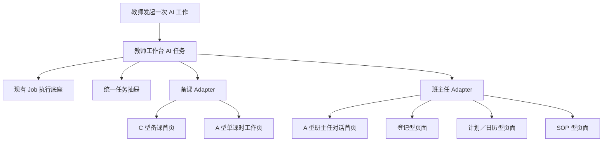

# 教师工作台体验重构设计冻结

> 状态：`design_frozen_for_implementation_breakdown`
>
> 适用范围：备课工作台 A-I1-R7、班主任工作台 B-UI-R7、两者共用的 AI 任务与页面交接地基。
>
> 本文记录 2026-08-04 经用户逐轮查看原型后确认的产品决定。它覆盖旧文档中与本轮页面结构、班主任隐私闸门、匿名化和首页路由相冲突的目标描述；旧实施记录仍保留为历史事实。

## 1. 本轮任务边界

### 1.1 目标

将已经确认的原型和讨论结果落成可直接实施、可测试、可分支合并的详细规格：

1. 冻结两个工作台的新信息架构和核心交互；
2. 冻结两个工作台共用的 AI 任务机制与页面交接契约；
3. 把共同地基、备课工作台和班主任工作台拆成三个可连续实施的批次；
4. 明确现有能力的复用点、需要替换的旧行为、故障结果和最终验收条件。

### 1.2 包含

- 备课工作台：C 型首页、A 型课时工作页、资料选择、原页预览、AI 修改检查器；
- 班主任工作台：A 型对话首页、六个业务语义域、三种处理样式、可恢复页面交接；
- 班主任班级选择和学生管理入口；
- 共用 AI 任务的持久化、幂等、取消、重启恢复、任务抽屉和安全投影；
- 前后端 Interface、Adapter、状态、实施顺序、测试和人工验收脚本。

### 1.3 明确不包含

- 本轮文档阶段不修改生产代码、数据库或真实业务文件；
- 不调用真实模型，不使用真实密钥，不产生模型费用；
- 不打开或改写真实教材、教辅、PPTX、学生档案、成绩或答卷；
- 不执行迁移、WPS 自动化、服务重启、push、PR、合并或同步 `main`；
- 不重做阅卷、知识图谱或个性化训练页面；
- 不把 A、B 的业务正文写入共同任务存储，也不建立 A 与 B 的业务数据互读。

### 1.4 验收条件

- 三份规格对同一术语、状态和接口使用一致定义；
- 每个页面都有默认态、进行态、失败态、空态和恢复路径；
- 每个实施包都能指出归属分支、允许修改的目录、依赖和完成证据；
- 重复、并发、退出、重启、失败、取消、部分完成、数据缺失和冲突均有确定结果；
- 旧规格中被替代的部分有明确指针，不要求实施者通过时间顺序猜测当前决定。

### 1.5 风险等级

`中高`。本轮只写文档，不改变数据；但文档会冻结后续的公共任务契约、班主任事务流转和备课源文件保护，因此需要在编码前完成交叉校验。

## 2. 已冻结的产品决定

| 主题 | 冻结决定 | 实际影响 |
| --- | --- | --- |
| 班主任默认入口 | 使用 A 型“对话案头”首页 | 首页可以接收学生、班级、学校和活动事务，不再把学生列表当作整个工作台首页 |
| 班主任 AI | 首页是可持续追问的会话，不是一次性输入框 | AI 可以补问信息，形成草稿后交接到对应工作页 |
| 班主任事务模型 | 六个业务语义域归并为三种前端处理样式 | 模型分类与页面数量解耦，避免每类事务复制一套页面 |
| 页面交接 | AI 返回受控业务意图，应用决定允许打开的页面 | 不接受模型直接返回 URL；交接只打开并预填草稿，不自动保存正式业务数据 |
| 学生管理 | 左侧学生管理与班主任工作台共用名册；教师选择“我的班主任班级” | 选定班级一直沿用，直到教师手动更改 |
| 班主任数据使用 | 不设隐私闸门，不做匿名化 | 教师发送首页消息时不再多一次匿名预览或解锁；仍禁止正文进入公共日志、任务列表和浏览器缓存 |
| 权限复杂度 | 保持简单，不围绕偶发多一名学生增加复杂判断 | 本轮不设计细粒度成员权限、自动剔除或多层确认 |
| 教师最终权 | 保存、创建日历、对外发送、惩戒、诊断、认定和结案均由教师决定 | AI 只生成解释、步骤和草稿，不自动执行高影响动作 |
| 备课默认入口 | 使用 C 型备课首页 | 首页按近期新授课展示准备状态与下一步，不直接铺开所有编辑面板 |
| 备课工作页 | 使用 A 型单课时工作页 | 来源、原页/幻灯片和 AI 修改检查保持同屏，中央画布占最大空间 |
| 课件保护 | AI 先生成修改方案；WPS 只操作隔离副本 | 源 PPTX 永不覆盖，方案预览不冒充真实修改结果 |
| 共用 AI 机制 | 复用阅卷任务底座的排队、查询、取消能力，在其上增加工作台 AI 任务深模块 | A/B 不再分别维护同步调用、轮询、重启和重复计费逻辑 |

## 3. 目标结构

共同模块只负责“这一次任务发生了什么”；A/B Adapter 负责“这一次结果在本业务里是什么意思”。共同模块不能直接写入课时草稿、学生记录、日历或事务正文。

## 4. 两个工作台的新页面骨架

### 4.1 备课工作台

备课工作台从“四个并列工作区”调整为两级主结构：

1. **C 型首页**：按个人课时树展示近期 5—8 个新授课及准备状态；
2. **A 型课时工作页**：围绕一个课时完成核资料、定方案、候选练习、审课件和上课包；
3. **资料库**：保留为独立管理工具，不与备课首页争夺默认入口。

旧五段业务语义继续存在，但不再等同于五张纵向堆叠页面。详细规格见 `docs/product/teaching-prep/A_I1_R7_IMPLEMENTATION_PLAN.md`。

### 4.2 班主任工作台

班主任工作台首页同时承接学生、班级、活动和学校事务：

1. **对话案头**：持续会话、必要追问、AI 整理说明和交接预览；
2. **今日与近期事项**：只呈现需要教师注意的节点，不用大面板无条件铺满；
3. **六域入口**：帮助教师理解系统覆盖面，不要求教师先分类才能说话；
4. **三种处理样式**：登记型、计划／日历型、SOP 型；同一样式可按业务对象落到不同页面，例如学生登记与一般事务登记共用登记交互，但不是同一数据目标；
5. **学生页**：作为闲暇时补录资料和近期状态的独立工作面。

详细规格见 `docs/product/class-teacher/B_UI_R7_IMPLEMENTATION_PLAN.md`。

## 5. 分支与文件所有权

| 批次 | 建议分支 | 主要职责 | 禁止事项 |
| --- | --- | --- | --- |
| TW-F1 | `codex/teacher-workspaces-r7-foundation` | 共同 AI 任务、任务抽屉、交接契约、manifest 子导航和公共测试 | 不实现 A/B 业务页面，不保存 A/B 正文 |
| A-I1-R7 | `codex/teaching-prep-iteration` | C 首页、A 课时页、备课 Adapter、课件修改预览 | 不修改 B/P4，不在 A 分支修公共任务底座 |
| B-UI-R7 | `codex/class-teacher-iteration` | 对话首页、事务分诊、三种页面 Adapter、班主任班级 | 不修改 A/P4，不在 B 分支修公共任务底座 |
| 集成预览 | `codex/teacher-platform-integration` | 按顺序合并、预览、跨工作台冒烟 | 不长期直接开发业务功能 |

当前共同设计文档先放在独立的 `codex/teacher-workspaces-design-freeze` 工作区，避免触碰集成预览中已有的真实数据和未整理文件。这个工作区必须形成一个同时包含共同契约、A/B 详细计划和两个 `ITERATION_SCOPE` 当前入口的完整文档检查点；用户确认并另行授权本地提交后，再通过 Git 合并该检查点同步到共同地基、A 和 B，禁止手工复制文件同步。随后按“共同地基 → A → B → 集成冒烟”的顺序实施。

## 6. 连续实施顺序

### 6.1 检查点 F：共同地基

- 完成 AI Task 深模块、运行投影、任务抽屉和混合 Job 索引兼容；
- 完成 manifest 驱动的工作台子导航，使公共顶部栏不再硬编码 A 的旧四入口；
- 提供 A/B Fake Adapter 合同测试；
- 只用合成正文，验证任务表、API、日志和 localStorage 不泄露业务正文；
- 形成稳定检查点后，A/B 分支同步这一共同起点。

### 6.2 检查点 A：备课工作台

- 先建立两级路由和聚合状态，不急于删除旧组件；
- 将现有资料选择、候选练习、草稿和课件审核能力迁入新的单课时壳层；
- 接入共同任务机制并移除 A 自有的 AI 轮询；
- 完成原页大画布和修改覆盖层；
- 整条 A 线形成完整候选后集中测试和双复审一次。

### 6.3 检查点 B：班主任工作台

- 先冻结六域、三样式和页面交接信封；
- 再增加持久会话和共同任务 Adapter；
- 最后重构首页和三个落地页面，复用现有草稿、事务驾驶舱、学生目录与日历；
- 删除旧匿名发送确认入口，但保留教师正式写入和外发决策；
- 整条 B 线形成完整候选后集中测试和双复审一次。

### 6.4 检查点 I：集成预览

- 合并顺序固定为 `共同地基 → A → B`；
- 只解决合并冲突和跨工作台契约问题，不借机重做业务；
- 运行共同任务合同、A/B 完整受影响测试、前端构建和跨工作台浏览器冒烟；
- 用户人工验收后，才讨论 push、PR、`main` 或真实模型验证。

## 7. 本轮故障场景

| 场景 | 共同预期 | A 额外预期 | B 额外预期 |
| --- | --- | --- | --- |
| 重复点击 | 同一操作号和指纹最多保留一次发送尝试；页面只按证据显示“尚未发送／可能已发送／响应已保存” | 不重复生成方案或课件副本 | 不重复生成会话轮次、草稿或事务 |
| 同时操作 | 一个原子 claim 获胜，其余读取同一任务 | 课时来源 revision 冲突时不覆盖 | 会话 revision 或目标草稿冲突时不覆盖 |
| 中途退出 | 可从任务抽屉和来源页恢复 | 返回原课时和原阶段 | 返回原会话和交接草稿 |
| 重新启动 | 发送前失败可明确继续；发送后未知绝不自动重发 | 已落地 proposal 只恢复本地交接 | 已落地 AI 结果只恢复草稿保存 |
| 失败重试 | 模型零自动重试；本地保存可以零模型重试 | 来源失效后必须重新确认范围 | 新会话轮次必须生成新操作号 |
| 取消 | 发送前可真正取消；发送后只停止本地后续并说明结果可能返回 | 不改变源 PPTX | 不写正式记录、不自动结案 |
| 部分完成 | 已持久化模型结果不丢失；多个 Handoff 独立采用并显示 0/N，领域 Adoption Receipt 防止跨库崩溃后重复写入 | 未验证版本不可下载或标为定稿 | 未确认草稿不进入学生档案、日历或事务 |
| 数据缺失 | 给出缺失项和下一动作，不伪造成功 | 缺页、缺资料或缺预览时停止相应步骤 | 缺学生、日期或即时安全事实时追问或让教师选择 |
| 数据冲突 | 保留双方 revision，要求教师决定 | 来源变化使旧 AI 建议失效 | 学生、班级或草稿目标变化使旧交接失效 |

## 8. 文档权威关系

本轮文档的权威顺序为：

1. 本文的共同产品决定；
2. `AI_TASK_AND_HANDOFF_CONTRACT.md` 的公共接口和状态；
3. A-I1-R7、B-UI-R7 各自详细实施计划；
4. 旧的 A-I1、B-UI-R1—R6 文档，仅作为已实现事实和复用依据。

`ARCHITECTURE.md` 继续记录当前已经实现的事实。在代码候选真正完成前，不把本文的目标状态提前写成“已实现”；候选完成时再更新架构索引和执行状态。
