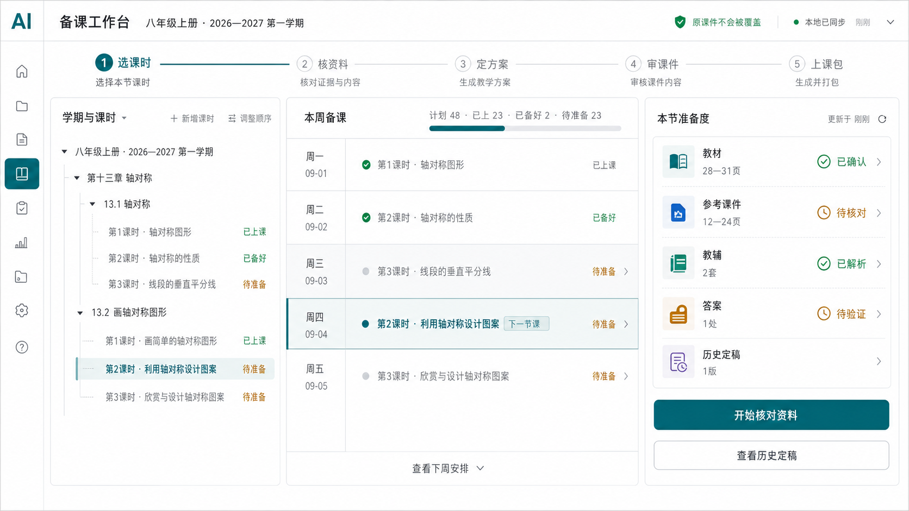
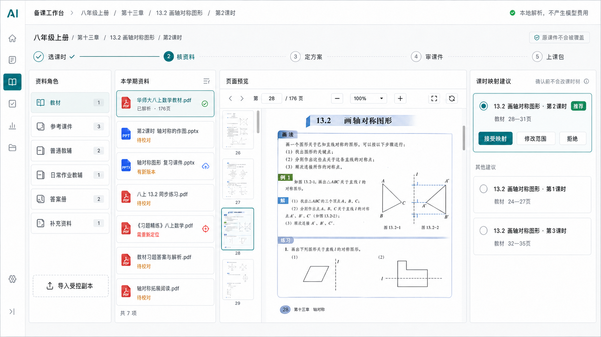
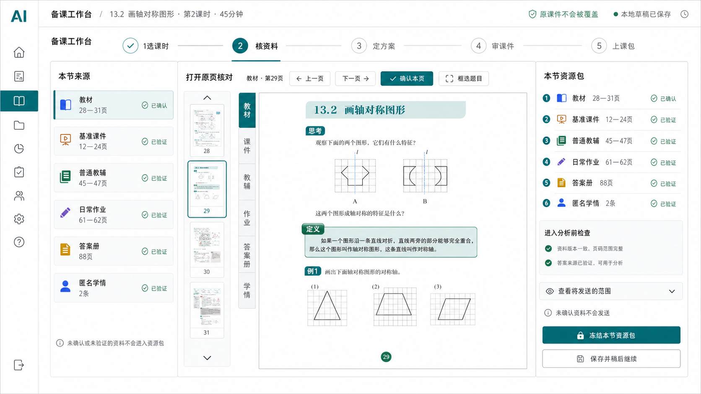
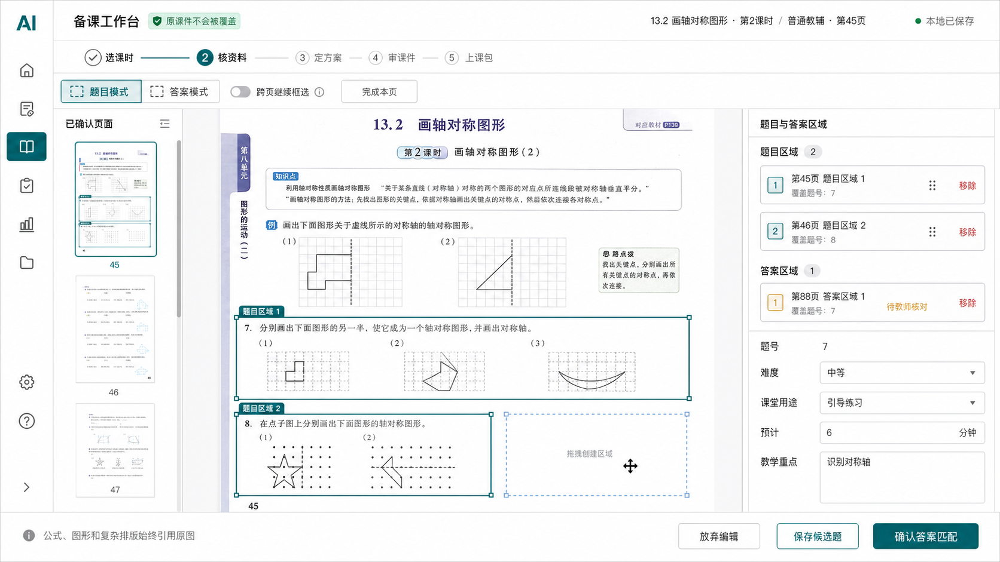
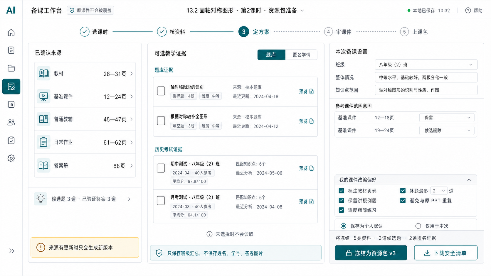
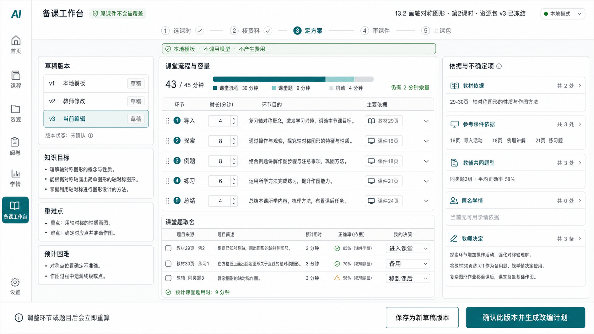
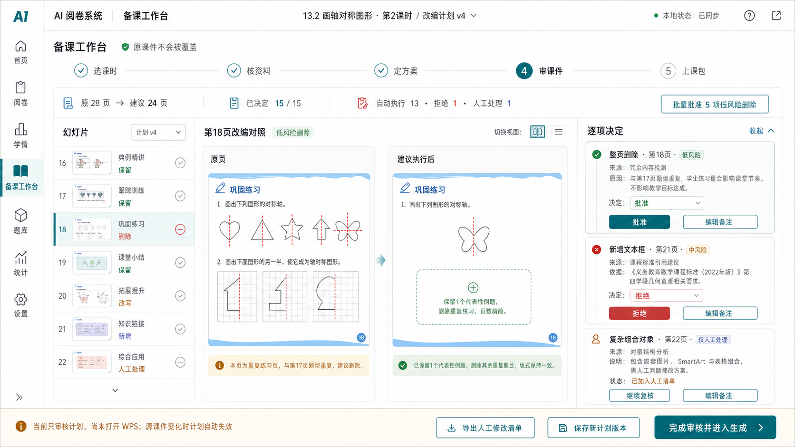
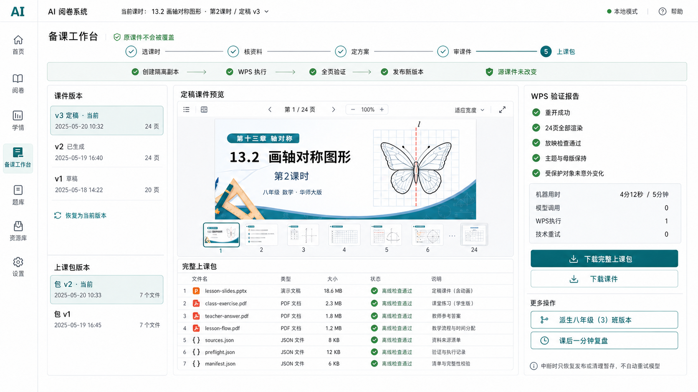

# 备课工作台理想页面概念

> 状态：视觉与交互概念稿，不是已经批准的实现规格。  
> 基于：`codex/teaching-prep-iteration`，调查起点 `862436f2`。  
> 日期：2026-08-01。

> 用户已完成本轮概念评议。实施时以
> [《备课工作台前端重构与补充需求落地规格》](./FRONTEND_IMPLEMENTATION_SPEC.md)
> 冻结的范围、业务语义和验收条件为准；本文及八张图片继续作为视觉与页面状态参考。

## 1. 本次任务边界

- 目标：依据现有产品设计、实际实现代码和项目视觉规范，给出备课工作台理想的信息架构、页面布局和交互逻辑，并生成可讨论的桌面端概念图。
- 包含：学期与课时、资料台账与映射、课时资料确认、题目与答案裁图、资源包冻结、课堂草稿、课件审核、WPS 版本和上课包。
- 不包含：修改前端或后端功能、操作真实教材或课件、启动 WPS、调用真实模型、读取真实数据库、改变全局导航或公共路由。
- 验收条件：概念图覆盖从建库到上课包的完整链路；不虚构当前未承诺能力；原课件安全、证据来源、教师确认和失败恢复在界面中可见；视觉语言与现有项目一致。
- 风险等级：低。产物只用于讨论，不改变程序行为或用户数据。主要风险是把概念误读为现有功能，因此所有页面均按“理想页面概念”标记。

## 2. 核心结论

备课工作台在全局左侧栏仍只有一个一级入口。内部采用 **4 个稳定工作区、8 个关键界面状态**：

| 内部工作区 | 对应界面状态 |
| --- | --- |
| 个人课时树 | 01 学期与课时总览 |
| 资料库 | 02 资料库与课时映射 |
| 本节备课 | 03 本节资源确认、04 题目与答案框选、05 证据选择与资源包冻结、06 课堂草稿与容量 |
| 课件版本 | 07 逐页课件改编审核、08 WPS 生成与上课包 |

8 张图不是 8 个一级菜单。教师始终围绕一个当前课时逐步下钻；练习单、同课异班、课后复盘和上课包都在相关课时或版本中按情境出现。

## 3. 共同视觉与导航规则

- 沿用现有应用骨架：桌面端 56px 收起导航栏、68px 顶部栏、独立滚动主工作区。
- 沿用现有颜色：应用底 `#F4F5F6`、白色工作面、正文 `#1C2733`、辅助文字 `#5C6672`、唯一主强调色 `#135E6B`。
- 页面标题 24px、区块标题 18—20px、正文 14px、高密度信息 13px、辅助信息 12px。
- 普通区域使用轻边框和 8—12px 小圆角，不使用强阴影、渐变、玻璃拟态、营销大标题、聊天气泡或卡片海洋。
- 教材页、教辅页和 PPT 预览始终获得最大空间；工具栏不得遮挡原内容。
- 唯一辨识元素是顶部 **备课进度尺**：`选课时 → 核资料 → 定方案 → 审课件 → 上课包`。它对应真实顺序，可返回已完成步骤；尚未满足前置条件的步骤不可直接执行。
- 当前课时作为贯穿页面的“课时脊柱”：学期、章、节、课时、时长和状态在页面切换后保持可见。
- 选中项使用浅青底和 4px 左边线；成功、警告和危险状态同时使用文字或图标，不能只靠颜色。
- 课件相关页面持续显示“原课件不会被覆盖”。

## 4. 八个界面状态

### 01 学期与课时总览

页面任务：回答“接下来要备哪一节课”。

- 左侧：学期选择和章—节—课时树；当前课时用课时脊柱强调。
- 中间：本周备课安排和紧凑的学期进度，不使用大号数据卡。
- 右侧：所选课时的教材、参考课件、教辅、答案和历史定稿准备度。
- 交互：展开树、行内改名、调整顺序、修改课时状态；点击“开始核对资料”进入当前课时。
- 闸门：不要求先录完整册；教师可从近期要备的小节开始渐进建立。

### 02 资料库与课时映射

页面任务：回答“本学期资料在哪里，它们对应哪些课时”。

- 左侧：教材、参考课件、普通教辅、日常作业教辅、答案册、补充资料六类角色。
- 次左侧：资料台账，显示解析、版本、缺失和重新定位状态。
- 中间：PDF 页或 PPT 幻灯片预览，占据最大空间。
- 右侧：课时—页码建议和待确认范围。
- 交互：导入受控副本、本地解析、重新选择缺失文件、查看新版本、接受/修改/拒绝映射。
- 闸门：AI 建议确认前不写正式课时树；一次只整理一份已解析资料；不会自动重试收费请求。

### 03 本节资源确认

页面任务：回答“本节课实际允许引用哪些原始内容”。

- 左侧：教材、基准课件、教辅、答案和匿名学情来源。
- 中间：原页或原幻灯片大预览，支持前后翻页、确认页和进入题目框选。
- 右侧：本节资源包清单、版本指纹和进入分析前检查。
- 交互：点击任一引用返回原页；选择页段；核对答案；查看将发送的范围；冻结资源包。
- 闸门：未确认资料不会进入资源包；正式草稿只使用冻结版本；旧冻结版本不会被来源更新静默改写。

### 04 题目与答案框选

页面任务：准确保存复杂数学题的原图区域，而不是依赖 OCR 重排公式和图形。

- 左侧：已确认页面缩略图。
- 中间：全尺寸教辅画布和有序框选区域。
- 右侧：题目区域、答案区域、题号、难度、课堂用途、预计时间和教学重点。
- 底部：放弃、保存候选题、确认答案匹配。
- 交互：题目和答案模式切换；一个题目可跨页、可由多个框组成；区域可排序或移除。
- 闸门：没有答案可以保存，但必须明确显示“答案缺失”；教师修改区域后，旧答案确认自动失效。

### 05 证据选择与资源包冻结

页面任务：在生成课堂草稿前，明确本次要使用的资料、匿名证据和教师偏好。

- 左侧：已确认来源、候选题和答案状态。
- 中间：题库摘要与历史考试的匿名班级汇总；默认不读取。
- 右侧：班级整体情况、知识点范围、基准课件页段意图和本次课件改编偏好。
- 交互：教师显式勾选证据；可把偏好保存为个人默认，也可只用于本次；冻结前下载安全清单。
- 闸门：只保存班级汇总，不保存姓名、学号、答卷图片或个人错误详情；来源变化只会创建新版本。

### 06 课堂草稿与容量审核

页面任务：回答“这 45 分钟具体怎样上，为什么这样安排”。

- 左侧：草稿版本、知识目标、重难点和预计困难。
- 中间：可编辑课堂流程、每环节分钟数和课堂题取舍；顶部实时显示容量。
- 右侧：教材、参考课件、教辅共同题型、匿名学情和教师决定的来源证据。
- 交互：改变环节或题目后立即重算时间；每个判断可打开引用原页；保存产生新草稿版本。
- 闸门：当前前端只开放本地模板，明确“不调用模型、不产生费用”；只有教师确认的草稿可生成逐页课件计划。

### 07 逐页课件改编审核

页面任务：在打开 WPS 前，让教师看清每一页、每一个对象准备怎样改。

- 左侧：幻灯片缩略图、页面状态和计划版本。
- 中间：原页与建议执行后对照。
- 右侧：操作类型、目标对象、原因、来源、风险和教师决定。
- 底部：导出人工清单、保存新计划版本、完成审核进入生成。
- 交互：逐项批准、拒绝或继续复核；低风险整页删除可批量批准；备注保留在计划历史中。
- 闸门：仅人工处理的复杂对象不能误批准为自动执行；来源变化时计划失效；本页不直接打开或修改 WPS。

### 08 WPS 生成、课件版本与上课包

页面任务：确认隔离副本已经安全执行、验证和发布，并形成可离线使用的课堂交付物。

- 顶部：创建隔离副本、WPS 执行、全页验证、发布新版本四段状态。
- 左侧：课件版本和上课包版本历史；旧版本不删除。
- 中间：定稿 PPT 预览和七个上课包文件。
- 右侧：重开、渲染、放映、主题母版、受保护对象和 5 分钟性能报告。
- 交互：下载课件或完整上课包；恢复旧版本为当前版本；从当前版本派生同课异班；课后填写一分钟复盘。
- 闸门：验证失败或中断时不出现可下载“定稿”；只允许恢复可信发布或清理暂存，不自动重试模型；源课件永不覆盖。

## 5. 跨页面交互逻辑

1. 页面始终保存当前学期和课时上下文；返回上一步不会丢失已保存草稿。
2. 进度尺允许返回已完成步骤查看或创建新版本；不能越过资源包冻结、草稿确认和课件审核三道闸门。
3. 编辑采用显式保存和版本化：资源包、草稿、改编计划、PPTX 和上课包均保留历史，不把后保存的旧页面静默覆盖新版本。
4. 资料、题目、答案和每条建议都能回到原页；没有证据时显示缺失，不用模型常识伪装成本班证据。
5. 一个操作区只保留一个视觉主按钮；危险删除与“移出工作台”区分。
6. 长编辑页使用底部粘附操作栏；发生冲突时在原位说明“发生了什么、已保存什么、下一步能做什么”。
7. WPS 未启用、资料缺失、答案未核对、计划仍有待决定项、源文件变化或验证失败时，按钮禁用并给出明确原因。
8. 键盘焦点、错误关联、状态文字、长文件名换行和减少动效继续遵守项目无障碍规范。

## 6. 视觉稿与现有实现的关系

当前代码把整条链路集中在一个 3568 行页面中。本概念将相同业务能力拆为可理解的深度工作状态，不改变底层数据含义，也不增加新的全局入口。

概念图中未将以下内容表现为已成熟能力：从零生成 PPT、自动出题、复杂对象自动修改、学生个人级学情、失败后自动追加模型调用、自动覆盖原 PPTX、HTML 交互素材、讲评课专用流程或多教师云端协作。

## 7. 视觉检查记录

- 已核对 8 张概念图的页面层级、主操作、来源边界和安全文案。
- 资料库初稿曾误出现 `.xlsx`，已改为实际支持的 PDF。
- 资源包初稿曾把“参考课件范围意图”错误应用到全部资料，已改为只处理基准课件页段。
- 其余图仍属于讨论级概念，不应把示例页码、示例课时名称或示例状态当成固定产品数据。

完整的内置 ImageGen 共同提示词、八张页面提示词和三次定点修正记录见
[ImageGen 提示词记录](./ui-concepts/IMAGEGEN_PROMPTS.md)。

## 8. 交付记录

- 集中调查：约 15 分钟；并行完成产品边界、实际功能代码和现有视觉规范三项只读审计。
- 视觉生成与修正：约 50 分钟；使用内置 ImageGen 生成 8 张页面，进行 3 次定点修正；一次网络中断后按原方式重试成功。
- 自检：8 张最终图片均为 1672×941；文档内图片链接、文件名和交付清单检查通过。
- 原始视觉问题：3 条；去重后 3 条，均为概念内容不一致，已全部修正；无未解决的 `Critical` 或 `Important`。
- 自动测试与正式复审：未运行。本次没有修改应用代码、业务接口或数据，只生成讨论用视觉与说明文档，按项目低风险规则进行一次自检。
- 当前剩余工作：用户已确认实施方向；具体前端、后端接口、状态保持、故障场景和验收范围已冻结在 `FRONTEND_IMPLEMENTATION_SPEC.md`，等待新窗口开始实现。
- 当前任务状态：概念交付和用户评议已完成；落地规格已形成，应用代码尚未开始修改。
- 版本发布：本次不改变程序版本，也不构成发布、push、PR、合并或真实资料试点授权。
## R7 视觉收口

R7 把备课首页定位为“教师的近期课时账本”：一张矩阵同时呈现系统准备度和教师授课状态，蓝色铅笔式标记只用于当前步骤。单课时页面把阶段压到左侧、原页或源幻灯片放在中央、状态与下一动作放在右侧；窄屏时阶段变成横向页签。课件修改检查器以源页为唯一主画布，修改框负责定位而不是伪造改后截图；`manual_only` 始终显示为人工处理。
