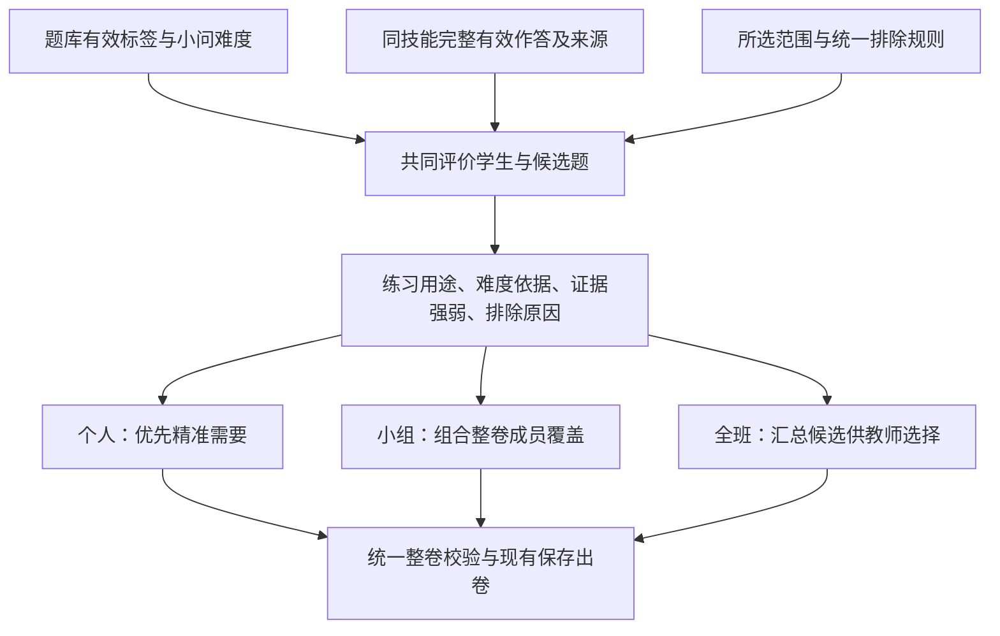

# 统一训练推荐与题目匹配：研究与待实施建议

研究日期：2026-09-28。

用途：根据用户已经确认的规则，研究个人训练、小组同卷与教师学情组卷可共用的推荐基础，支持后续改造决策。本文保留实施前的研究和建议，不作为当前已实现功能说明；实现后的统一规则见 [知识与训练产品说明](../product/KNOWLEDGE_AND_TRAINING.md)。外部结论优先引用作者论文、维护者仓库和官方文档；不记录真实学生身份、作答明细或业务统计。

**建议：保留现有题库、标签与难度来源、批改证据、掌握度、草稿保存和出卷流程，重新实现共用的匹配判断与组卷选择。** 改造的中心是“用完整学生证据评价候选题”，让三个入口消费同一结果。现有规则分散的问题已经涉及数据准备和职责划分，继续逐处补条件容易留下差异；全面重建则会重复已经具备的基础能力。

## 1. 已确认的业务规则

以下来自本轮用户确认，实施时不应再次推翻或重复询问。

| 项目 | 已确认口径 |
| --- | --- |
| 难度上限 | 最高 8 级；个人适合难度仍由作答证据判断。 |
| 标签使用 | 使用题库所有有效标签；不同类型分别承担范围、训练目标、方法、难度、错因和相似性等职责。 |
| 难度依据 | 看同技能多次有效作答，正确与错误都纳入，三处使用同一口径。 |
| 匹配规则 | 三处共用现有四级顺序：同技能且覆盖来源小问主题、同章同技能、覆盖来源小问主题、同小节；匹配证据应落在同一个候选小问。无来源作答的新练习直接按所选目标和范围进入，不能伪造一条来源错题。 |
| 场景区别 | 个人卷追求精准；小组与全班不要求每题对所有人都有核心补弱作用；全班候选最终由教师选择，个人与小组由本地程序组合。 |
| 新练习 | 允许所选且已学范围内、难度适合、该目标暂无个人作答证据的题；不能把未知直接当薄弱。 |
| 整卷限制 | 取消精细比例限制；解答题最多 2 道；保留相似题限制。相似题算法本身不属于本研究的另行研发范围。 |
| 原题排除 | 每名学生将训练与考试合并，取最近 3 次已有批改结果的场次，排除其中原题；未批改的生成、导出卷不计，草稿不计；同一场次补批、复核不重复计次。小组、全班汇总相关学生的排除题。 |

“最近 3 次”只限定原题排除窗口，不把学生的能力证据截断为最近 3 次。采用学生实际参与并已有结果的场次，考试与训练之间须按稳定场次标识去重，按实际作答活动时间排序；补批、复核的更新时间不创造一次新活动。

难度仍沿用现有 1—10 的题库公式值，训练推荐上限设为 8，不重标题库或把 9、10 级压缩到 8。现行难度工具已规定范围与上限直接比较小数值，所以统一执行 ≤8.0；不能把 8.4 四舍五入后放行。整道题入卷时沿用最难小问代表整题难度的规则。[当前难度来源](../../question_bank/services/standard_difficulty.py)

## 2. 研究支持的主要判断

更适合当前需求的是：先建立一个共用的、可解释的“学生证据与题目适配”计算过程，再让个人、小组和教师选卷使用其结果。知识追踪模型可以提供学生表现估计，但不会自动完成课程范围检查、全部标签利用、新练习识别、原题排除和整卷组合。

暂不建议为了统一规则而直接引入深度知识追踪或强化学习。原因是本轮首要问题是证据口径、匹配语义与组合职责不一致；增加一个模型不会自行解决这些问题。此判断是结合用户目标作出的工程建议，并非声称传统规则永远优于学习模型。

应始终分开三种结论：

1. **匹配适合**：题目在范围内，难度可承受，对准需要或适合作为新练习。
2. **表现预测**：基于历史数据，预测学生是否能够答对或完成某个判定点。
3. **训练有效**：练过以后，相比练前或合适的对照，技能表现、迁移或保持得到改善。

预测准确不能直接推出推荐有用。González-Brenes 与 Huang 的 EDM 2015 论文给出理论及真实、合成数据分析，说明常用预测指标可能偏好需要更多练习、却没有证据表明学习更多的系统；作者同样没有把其离线评价方法当作实际实验的替代品。因此，本项目当前只能验收第 1 项；未来有后续批改和教学对照后，再评价第 3 项。[原论文：Your model is predictive—but is it useful?](https://www.educationaldatamining.org/EDM2015/uploads/papers/paper_113.pdf)

### 2.1 为什么选择重做决策核心

本次读取了已有未提交修改下的工作目录，以下是所见实现，不能理解为已完成新规则改造。

| 当前可验证的情况 | 会造成的产品结果 | 建议处置 |
| --- | --- | --- |
| 个人推荐的 `_difficulty_plan` 能接收同技能多次作答；`_group_needs` 准备小组输入时保留的是失分来源 | 函数即使相同，个人与小组得到的证据仍不同；正确经历可能在小组路径消失 | 用同一份完整有效作答概况；失分只负责识别补练目标，不能负责裁剪能力证据 |
| 全班助手 `_key_pool` 调用 `_loss_difficulty` 时未传完整技能历史，再汇总为目标难度中位数 | 共用了局部函数，却没有共用完整的学生—题目判断；全班中位数也不能表达个人差异 | 逐学生评价后再汇总适合人数与原因 |
| `_build_draft` 与候选生成围绕历史失分来源展开 | 没有来源错题的目标不容易自然成为新练习；后续正确证据也容易被旧失分锚点牵制 | 候选题和当前技能证据直接匹配，历史错题作为解释之一 |
| `_common_entries` 对共同核心题要求全员核心，`_structure_allowed` 保留逐步比例限制 | 同卷候选交集变窄，可能出现人工规则造成的缺口 | 采用整卷成员覆盖；删去用户已取消的比例限制 |
| `target_matching` 明确把可选资格留给各调用者；个人近期历史和学期原题、组卷路由的近期导出排除各自计算 | 共用主题技能匹配，仍可能在难度、历史、范围等前置条件上分叉 | 候选资格、学生适配、原题排除都进入共同计算过程 |
| 个人练习偏好主要读取方法、模型、思想；丰富标签分布在其他现有读取能力中 | 技能、难度升级完成，不代表推荐已经完整消费升级成果 | 统一读取有效题目描述，按第 6 节分工使用标签 |

代码依据：[个人与小组推荐](../../question_bank/recommendation/personalized.py)、[全班候选助手](../../question_bank/services/assembly_assistant.py)、[当前四级匹配](../../question_bank/recommendation/target_matching.py)、[组卷入口](../../backend/api/routers/assembly.py)。

| 选择 | 收益与代价 | 本次判断 |
| --- | --- | --- |
| 三处继续补条件 | 单次改动较小，但证据裁剪、旧错题锚定和组合约束仍纠缠 | 不宜作为长期方案 |
| 重建题库、证据、推荐与出卷全套系统 | 可以从零设计，但重复稳定能力，扩大历史数据和保存流程的变化 | 没有必要 |
| 保留基础能力，替换共同决策核心 | 把差异收敛到“最终怎样选择”，同时保留已有数据与使用流程 | 推荐 |

### 2.2 现有能力的复用与替换范围

先复用下表中的现有位置，不另建后台服务、数据库、通用策略注册表或面向假想算法的接口层。

| 现有能力 | 保留或调整 | 为什么不能直接作为完整的新核心 |
| --- | --- | --- |
| [诊断证据服务](../../integration/diagnosis_profile_service.py)及[当前掌握度](../../question_bank/mastery/current.py) | 保留有效证据、来源、版本与唯一掌握度口径；推荐只读取 | 负责证据与掌握度，不负责逐题适配和整卷组合 |
| [当前知识标识](../../question_bank/current_knowledge.py)、[步骤技能关联](../../question_bank/solution_evidence/knowledge_links.py) | 保留稳定技能标识、小问和步骤的对应关系 | 解决身份与归属，不是选题算法 |
| [难度公式](../../question_bank/services/standard_difficulty.py)、[小问评估读取](../../question_bank/solution_evidence/part_assessments.py) | 保留公式及版本一致性检查，统一取有效特征 | 描述题目结构负担，不直接代表学生答对概率 |
| [四级匹配](../../question_bank/recommendation/target_matching.py) | 保留目标匹配能力，纳入共同计算 | 当前不统一范围、近期原题、难度与场景资格 |
| [个人推荐模块](../../question_bank/recommendation/personalized.py) | 保留保存、冻结、导出衔接、教师调整及已有回执；替换证据准备和选题决策部分 | 同一模块混合了匹配、整卷比例、共同题资格和保存，直接让三处调用其内部函数仍会分叉 |
| [全班助手](../../question_bank/services/assembly_assistant.py)及现有组卷页面 | 保留教师选题操作，改用共同评价结果 | 自行准备失分与目标难度，不能继续保留第二套实质判断 |
| [名为 recommendation_engine 的文件](../../question_bank/recommendation/recommendation_engine.py) | 保留现有文本工具用途 | 当前只是文本归一化与相似度函数，不能因文件名就当作已有统一推荐引擎 |

改造放在既有 `question_bank/recommendation` 包内。对外只需要“评价候选题”和“按场景组合并校验整卷”两类业务操作。具体文件拆分由实现时按职责决定，不需要用户选择技术命名。共同计算返回结果，不在计算过程中保存草稿、生成训练标准或触发模型请求；已存在的准备与保存步骤由现有流程负责。

题库描述按现有读取能力批量加载，先按范围和技能缩小候选，再做学生适配；同一批评价结果供个人、小组和全班汇总复用。避免逐学生、逐题重复读数据库，沿用现有数据版本与缓存失效机制，不另外建立独立缓存系统。性能验收使用同等输入比较耗时，不预先承诺未经测量的加速倍数。

### 2.3 建议的共同计算过程

共同评价的最小输入是学生有效观察、当前题目描述、所选已学范围和本轮统一规则。最小输出应能回答以下问题：

1. **能否作为候选？** 题目范围、有效难度、所需资料和最近 3 次原题排除是否符合。整题入卷时检查整题，不因一个小问匹配而遗漏其余小问。
2. **对这个学生练什么？** 哪个技能、知识或已观察到的错因；属于针对练习、巩固还是新练习。保留来源，不能从题目的预测错法反推学生已经犯过该错。
3. **为什么认为难度适合？** 优先看同技能在相近与不同难度上的多次有效表现，包含成功、失败和部分达成；相关知识与章节只作辅助。证据稀少、矛盾或映射不清要如实呈现。
4. **这道题是否增加新的练习价值？** 结合方法、思想、能力、模型、特殊题型、难度特征和现有相似题结果，判断与已选题是否重复、是否补充一个需要。

不再从每一道旧错题的难度分别乘系数得到多个目标难度，也不再让来源错题成为新练习的必要条件。一个学生在一个技能上的所有有效历史应形成同一份概况，再与不同候选题比较。现有掌握度继续是唯一掌握度；新增的是题目适配解释，不能另存一个同名、不同算法的“掌握度”。

首版建议使用本地确定性规则：对相近难度的已观察成功与失败分别汇总，保留最近变化、独立作答量和任务特征；先得到有证据支持的可练范围，再评价候选。不要先指定一个漂亮的答对概率，也不要未经比较就固定“满 3 次才算可信”或新的降档系数。具体系数属于后续实现时需用合成预期与只读回放检验的计算细节，不能写成已有研究证明的通用教学阈值。

“结构难度”和“实际易错”保留为两个维度。题目原本不难、得分率却低时，若同技能其他题表现稳定而特定任务反复出错，应优先说明并针对该易错点；不能自动降整项技能的能力等级，也不能只因低得分率就改高题库结构难度。错因未经确认时，解释应保留其自动候选性质。

### 2.4 三种场景怎样使用共同结果

| 场景 | 最终选择方式 | 应展示或保留的证据 |
| --- | --- | --- |
| 一人一卷 | 优先有直接需要且难度合适的题，再选合适巩固或新练习；按已选题避免重复 | 每题针对什么、同技能依据、是否新练习、缺题原因 |
| 同质小组同卷 | 分组读取相同的技能与难度概况；组合时优先覆盖整卷中尚未照顾的成员与需要 | 每题分别对谁补弱、对谁巩固或是新练习；整卷成员覆盖，不能用全员核心交集决定所有题 |
| 全班学情组卷 | 展示同一批评价的汇总，教师选择；选入后执行相同整卷限制 | 每题的适合与需求人数、证据不足情况和具体理由；不能把某知识点薄弱总人数当作该题实际适合人数 |

共同底线与场景排序分开：≤8.0、统一范围、最近 3 次原题、相似限制、最多 2 道解答题不因入口改变；个人优先精准、小组优先整卷覆盖、全班保留教师选择。各入口不再自行计算目标难度、历史排除或标签相似分。

不把“没有核心补弱作用”与“难度不适合”混为一谈。某题对甲补弱、对乙巩固、对丙是合适的新练习，可以进入共享候选；同样不能因为平均难度合适，就宣称它对所有成员都适合。具体成员结果必须保留，整卷选择据此权衡，不重新增加一个隐含的全员核心门槛。

整卷仍有用户所需题量；取消的是内部固定比例，不是取消题数需求。相同原题只出现一次；高度相似或仅换数的题继续按现有相似判定限制。相似识别的另行算法研究不在本文扩展。

以下为说明性的合成例子，不是实际学生记录：甲在某技能多次做对，只有特定读题条件出现错误；乙在同技能持续失分；丙暂无该目标作答。共同评价可以让同一道合适题分别成为甲的易错点练习、乙的技能补练、丙的新练习。个人卷分别排序，小组卷看整卷覆盖，全班页面给教师呈现这些差异，无须为每个入口重新定义学生能力。

### 2.5 实施顺序与验收边界

1. **先统一读数并建立对照。** 在现有只读证据基础上检查当前技能、小问和历史作答对应，保留成功与失败；区分无证据、无法归属和资料不完整。统计各筛选阶段的缺口原因，不改原始批改结果。
2. **替换共同判断。** 收拢候选资格、同技能难度依据、标签使用与最近 3 次排除；三处传入同一份输入，不保留入口自行计算的变体。新练习作为正式候选用途，不伪装为某条错题的补充。
3. **替换组合与解释。** 个人、小组和教师候选分别消费共同结果；移除精细比例与全员核心限制；教师查看和自动成卷都走相同最终校验。沿用现有页面步骤，不增加一排算法设置。
4. **用明确预期验收。** 执行第 8 节的合成场景和同输入前后回放，确认推荐质量边界、缺题原因与保存流程；按实际发现调整，不以“凑满更多试卷”单独证明合理。

已有冻结或完成的试卷和批改按原有快照保留。新计算影响新建或明确重新生成的推荐，不自动重算历史结果；开发过程通过范围清楚的本地提交回退代码，保留已有数据和保存契约。当前设计不需要真实模型调用、新数据库或批量重新标注。

实施前只需再次检查届时的并行修改与实际代码状态，已有业务答案不用重复确认。尚未校准的计算阈值应由代理用教学预期与回放证据说明；若发现必须改变已确认的功能含义，再集中提出该具体问题。

## 3. 理论分别能解决什么

| 方法 | 主要回答 | 可以借鉴 | 不能直接替代 |
| --- | --- | --- | --- |
| 知识追踪，尤其 BKT | 根据某技能的连续作答，估计掌握状态如何变化 | 同技能历史、正确与错误、猜对与失误的不确定性；把一次作答视为证据而非最终结论 | 全部标签匹配、具体错因诊断、课程范围与整卷选择 |
| PFA、AFM | 用技能、练习经历等可解释因素预测表现 | PFA 区分同技能既往成功与失败；AFM 有助于检查技能划分和学习曲线 | 一套无需拟合就可套用的概率公式；“预测答对”不等于“练习收益最大” |
| IRT，项目反应理论 | 在校准过的题目参数下估计能力，选择有测量价值的题 | 将题目参数、能力估计和选题操作分开；测量不确定性 | 把本项目的 1—8 难度等级直接当作 IRT 难度参数；把测量信息最大当教学收益最大 |
| 认知诊断，如 DINA/G-DINA | 结合学生作答和题目所需技能，估计多个技能的掌握组合 | 明确题目或步骤真正需要哪些技能；校验题目—技能映射 | 把每个方法、思想、能力标签都独立当作可可靠估计的技能；自动推断具体错误原因 |

BKT 的原始形态用“掌握/未掌握”两个隐含状态解释作答，并包含初始掌握、学习、猜对和失误等参数。pyBKT 作者提供了模型及变体的实现与数据要求分析；其输入和概率输出都依赖建模假设，不是观察到一次对错便得到了真实掌握状态。[pyBKT 作者论文](https://arxiv.org/abs/2105.00385)

PFA 原论文明确以学生在同一知识成分上的既往成功次数和失败次数分别作为输入；参数通过数据拟合。AFM 一类方法则强调学生基础、知识成分及练习机会。对本项目最直接的启发是：用于确定“练什么”的失分证据，与用于估计“能练多难”的完整作答证据应分开；后者不能只保留错题。本项目若先采用透明统计规则，应称为规则估计，不冒称已经训练了 PFA。[PFA 原论文，公式 3](https://files.eric.ed.gov/fulltext/ED506305.pdf)、[CMU 对 AFM 与知识成分的官方说明](https://www.cmu.edu/datalab/getting-started/key-concepts.html)

认知诊断需要作答矩阵和题目—技能关系，通常称为 Q 矩阵。GDINA 作者工具明确包含题目与模型拟合、Q 矩阵验证、分类准确性检查，说明标签对应关系本身需要检验。本项目已有小问与步骤证据，适合保留这种细粒度对应；不宜把整题一次失分复制为所有关联技能的一次独立失败。[GDINA 作者论文](https://www.jstatsoft.org/article/view/v093i14)、[作者使用说明](https://wenchao-ma.github.io/GDINA/articles/GDINA.html)

### 小数据与标签升级的限制

pyBKT 的数据充分性研究同时考察学生数量和每人每技能的序列长度。该研究的数值结论来自指定参数下的合成数据，不能转写为本项目通用的“有多少学生就一定可以准确建模”。判断能否拟合时，应看每个技能有多少独立、可对应的作答，而不是只看全库评分总条数。[pyBKT 数据充分性分析，第 4 节](https://arxiv.org/html/2105.00385v2)

以下是据此提出的本项目处理建议，尚未实施：

- 先用同技能不同题、不同场次的有效作答与对应难度形成证据摘要；保留证据条数、来源层级和适配理由。
- 一道题同时关联多标签，不等于学生产生了多次独立作答；同一原始观察不应被重复加权成多次练习。
- 考试与训练都可提供表现证据，但应保留场次和用途；不能把一次考试中的标签或步骤拆分，自动视为发生了多次带反馈的学习机会。
- 小问只反映总得分时，不把全部失分确定归给某个步骤；已有可信步骤判定时，优先使用该步骤的直接证据。
- 标签升级通过现有稳定标识和历史快照对应；对应失败应标为证据不可直接归属，不能静默猜成某个新技能。
- 保留同技能、不同难度的证据差异；不能用一个混合平均数抹去“会简单题、不会复杂题”或者“同级题特定条件易错”。

pyKT 的原论文特别指出：将一道多技能题拆成连续多条技能记录，再让后一个预测读到同题前一条的结果，会泄漏答案并虚增预测指标。将来离线比较本项目模型时，至少应按原始题或作答事件保持完整，按时间使用过去预测未来，不能把同题拆分条目随机散入训练和检验两边。[pyKT 原论文，第 3.3 与 4.1 节](https://papers.nips.cc/paper_files/paper/2022/file/75ca2b23d9794f02a92449af65a57556-Paper-Datasets_and_Benchmarks.pdf)

## 4. 核查过的开源项目

以下仅核查作者或维护者公开资料，没有安装依赖、运行模型或将本项目数据上传。许可是本次看到的仓库许可；没有把公开仓库存在等同于长期维护承诺，也没有核实每个项目的最新正式发布日。

| 项目 | 已核实的功能与输入 | 最值得借鉴的内容 | 不能直接搬用的原因 | 本次核实许可 |
| --- | --- | --- | --- | --- |
| [pyBKT](https://github.com/CAHLR/pyBKT) | BKT 与变体；学生按技能的作答序列，DataFrame 或 CSV/TSV；常规正确性为 -1/0/1 | 学生状态估计独立于选题；可作为后续小规模可解释预测基线 | 本项目有部分得分、步骤判定和丰富题目标签，不能不经证据转换就当二元序列；它不负责整卷。README 对 Windows 采用纯 Python 实现，不能照搬其他平台性能描述 | [MIT](https://raw.githubusercontent.com/CAHLR/pyBKT/master/LICENSE) |
| [catsim](https://github.com/douglasrizzo/catsim) | 计算机自适应测试与仿真；IRT 题目参数、作答向量、能力估计 | 把初始状态、能力估计、选题与停止条件分开；可借鉴职责划分 | 需要校准的 IRT 参数；本项目难度等级不是该参数。它主要解决测试测量，不能直接充当学习训练推荐器 | [当前主分支 BSD-3-Clause](https://github.com/douglasrizzo/catsim/blob/main/LICENSE) |
| [EduStudio](https://github.com/HFUT-LEC/EduStudio) | 统一认知诊断和知识追踪实验；交互表、学生特征表、题目特征表；题目表可含知识成分序列 | 统一原始数据到可读中间数据，再供不同计算消费；分开预测与解释评价 | 是 PyTorch 研究框架，模板与训练体系超出当前本地确定性选题所需；不应为一次统一改造整体引入 | [MIT](https://raw.githubusercontent.com/HFUT-LEC/EduStudio/main/LICENSE) |
| [pyKT](https://github.com/pykt-team/pykt-toolkit) | 深度知识追踪比较平台；学生、题目、技能、作答结果、时间等序列 | 规范离线比较；区分单步与多步预测；防止多技能题的数据泄漏 | 不是成品题库推荐服务；默认实验输入常是二元正确性，与本项目多层证据需适配；模型排行榜不能直接决定产品选型 | [MIT](https://raw.githubusercontent.com/pykt-team/pykt-toolkit/main/LICENSE) |

输入核对来源：[EduStudio 中间数据协议](https://edustudio.ai/lib_features/atom_file/)、[pyKT 官方数据预处理说明](https://pykt-toolkit.readthedocs.io/en/dev/contribute.html)、[catsim 官方工作过程](https://douglasrizzo.com.br/catsim/introduction.html)。

当前建议是借鉴这些项目的证据、评估和职责划分，暂不把任一研究框架整体接入业务。若未来要比较学习模型，优先选择透明统计基线与 pyBKT，再决定是否有证据支持增加复杂度。暂不推荐盲目采用 DKT 或强化学习；本轮也没有训练数据和教学收益实验可以支持“复杂模型更适合本项目”的结论。

## 5. 商业产品与教学平台的借鉴

以下核查的是公开机制与使用流程。产品并未公开全部排序代码或模型参数，因此不能据此断言其三个入口在内部共用某个算法，也不把官方产品描述当作本项目的学习效果证明。

| 产品或平台 | 官方可核实的做法 | 对本项目的具体启发 |
| --- | --- | --- |
| ALEKS | 知识空间理论区分已能做的内容与准备好学习的下一步；其理论说明同时强调专家构建和真实作答检验 | 新练习可依靠技能关系与前置条件筛选，未知不等于不适合；但本项目没有同样经过验证的知识空间，不能照搬其推断能力。[官方理论入口](https://www.aleks.com/about_aleks/knowledge_space_theory)、[理论说明中的内外边界](https://www.aleks.com/about_aleks/Science_Behind_ALEKS.pdf) |
| IXL | 官方指南的诊断分析按相近水平分组，呈现群体共同的技能建议；Trouble Spots 还区分同技能内不同题目任务的困难 | 共用个人证据后再汇总群体；保留“技能大体会、特定任务易错”的细分，不把一个平均掌握数当成全部事实。[官方指南，第 29—31 页](https://www.ixl.com/materials/userguides/IXLUserGuide.pdf) |
| ASSISTments | 教师选择 Skill Builder 目标并向班级布置，学生获得围绕目标的练习；有连续正确与最多作答后教师介入的产品规则 | 教师负责范围与教学目标，程序负责具体练习，是可行的职责分工；不直接移植“连续 3 次正确”作为本项目普适掌握标准。[官方 Skill Builders](https://www.assistments.org/individual-resource/skillbuilders) |
| Khan Academy | 2026 年官方课堂流程支持向整班、多班或指定学生布置任务，并查看技能掌握与进度 | 可以让相同内容、学生证据和教师目标进入不同布置场景；这是流程借鉴，不是其底层算法已公开的证明。[官方课堂说明](https://blog.khanacademy.org/meet-the-new-khan-academy-classroom-experience/) |

通用推荐工程也常把候选生成、相关性评价、最终重排分开。将本项目的题目适配与整卷多样性、数量限制分离，与这种职责划分相容；这是工程参考，不是把视频推荐的目标函数搬进教学。[Google 官方推荐系统概述](https://developers.google.com/machine-learning/recommendation/overview/types)

## 6. 所有标签如何发挥作用

“用上所有有效标签”不等于把标签展平成一个向量，再把相同标签数最多的题当作最佳题。以下是结合既有数据类型提出的职责划分建议：

| 数据 | 适合承担的职责 | 应避免的误用 |
| --- | --- | --- |
| 知识、技能、章节、小节、前置知识 | 确定训练目标、范围、关联背景及必要前提 | 单次失分扩散成整章薄弱；前置关联自动成为直接失分证据 |
| 方法、思想、能力、数学模型、特殊题型 | 判断任务方式、迁移方向、同法变式与内容差异；辅助排序与解释 | 每个标签都作为独立技能重复累计分数；仅同方法就判相似重复 |
| 小问难度与计算、推理、隐含条件等特征 | 判断任务负担和适合难度；解释同级题不同负担 | 把题库等级当作经过校准的答对概率；因得分率低直接提高结构难度 |
| 预测错法 | 描述候选题可能触发的易错点，与已观察错因匹配 | 将“题目可能出错”当成“该学生已经这样错过” |
| 学生实际小问、步骤及错因证据 | 决定实际需要、证据强弱与具体补练方向 | 把未作答自动解释成不会；把自动归类的错因说成教师已确认 |

使用全部有效标签不要求每道题每类标签都有值，也不要求学生与题目所有标签完全一致。没有某类标签代表少一项判断信息，不应自动变成新的排除门槛。前置关系也不能把“尚无前置技能作答”直接解释为“基础不具备”；要区分明确的范围或表现障碍与单纯缺少证据。

这一划分与 CMU 知识成分建模的基本观念一致：知识成分可以描述技能、概念、原则或过程，但其粒度应与活动和证据相适应，关联的多个成分也不必全部被建成独立掌握概率。本表中的具体分工是本项目建议，不是外部论文直接给出的产品规范。[CMU 官方知识成分说明](https://www.cmu.edu/datalab/getting-started/key-concepts.html)

## 7. 无作答证据时的新练习

题目内容标签能支持尚无历史作答的新题进入候选，也能说明新题练什么、难在哪里；这不意味着已经知道学生会不会做。

建议统一保留三类解释：有直接失分证据的针对练习、有已有表现支持的巩固练习、目标暂无直接证据的新练习。它们是推荐原因，不是新的固定题量配额。

对新练习，仍检查所选和已学范围、前置条件、难度上限、近期原题与整卷限制。适合难度可以参考同技能其他题的已有表现；如果连同技能也无证据，再说明采用了相关知识或章节的辅助判断。连相关依据也不足时，应显示证据不足，不生成貌似精确的答对概率或掌握率。此处是待实施建议；最终无需把每种依据变成用户必须填写的新设置。

个人卷可优先满足直接需求后补充新练习；小组和全班以整卷为单位检查成员被覆盖的情况。一道题可对部分学生补弱、对其他学生巩固或属于新练习，不要求每道题都命中所有人的失分；但汇总时应保留成员间难度和证据差异，不能只用全班平均数掩盖这些差异。

## 8. 如何判断改造是否成功

本轮可验收的是规则一致性和匹配可解释性，建议使用合成场景及只读回放检查：

1. 同一学生、同一题、同一范围与历史，在个人、小组、班级入口得到相同的基础适配判断；允许最终排序和组合不同。
2. 同技能新增一次正确或错误的有效作答，应按同一规则影响适合难度；切换入口不能丢失正确记录。
3. 目标无作答记录时，合适的新练习可以进入；页面原因不能伪装成已证实薄弱。
4. 历史三场次规则、8 级上限、解答题最多 2 道与相似题限制在三处一致；既定规则不能被场景悄悄覆盖。
5. 缺题能区分范围、证据对应、难度、历史原题、资料完整和整卷限制等原因；不能全部显示成题库不足。
6. 小组某题只对部分成员补弱时，不因其他成员用途为巩固或新练习被自动删去；成员明显不适合或依据不足也不会被全组平均数隐藏。
7. 同一场次复核不增加历史次数，多技能标签和重叠的小问、步骤不会把同一次观察扩增为多次独立练习；原题排除窗口也不裁剪能力证据。
8. 调整学生或题库返回顺序不改变基础适配，稳定相同输入下的选择；无法满足题量时给出确定原因。保存、重新进入、替换与冻结沿用现有正确行为，历史完成卷保持原样。

可复用现有验证入口：[主题技能匹配与范围](../../tests/phase7/test_topic_skill_matching.py)、[个人小组推荐及草稿操作](../../tests/phase4/test_personalized_recommendation.py)、[教师候选助手](../../tests/test_assembly_assistant.py)。更新受影响的预期即可，不把用户已经取消的比例要求继续保留为验收标准。

未来如比较预测模型，应另行评价时间顺序下的预测误差、概率校准和不同证据量下的表现。训练收益则需查看后续批改中同技能的变化、典型错因是否减少及变式迁移；若要声称某推荐方案优于另一方案，还需要可比较的教学安排或实验。两类验收不能相互替代。

## 9. 本轮仍未验证的事项

- 未训练 PFA、BKT、IRT、认知诊断或深度模型；未验证这些模型对本项目数据的准确性、速度与维护成本。
- 未证明推荐能够提高实际学习效果，未把论文的预测指标当作本项目教学收益。
- 未建立题库难度与 IRT 参数的校准关系；1—8 等级只能按当前题库语义使用。
- 未重新设计相似题算法；统一调用其结果和执行同卷限制，与算法研发应分开处理。
- 已核对本仓库复用与替换范围并提出方案，但尚未改业务代码或运行改造后的流程；实施时需以届时的代码状态重新确认修改边界。
