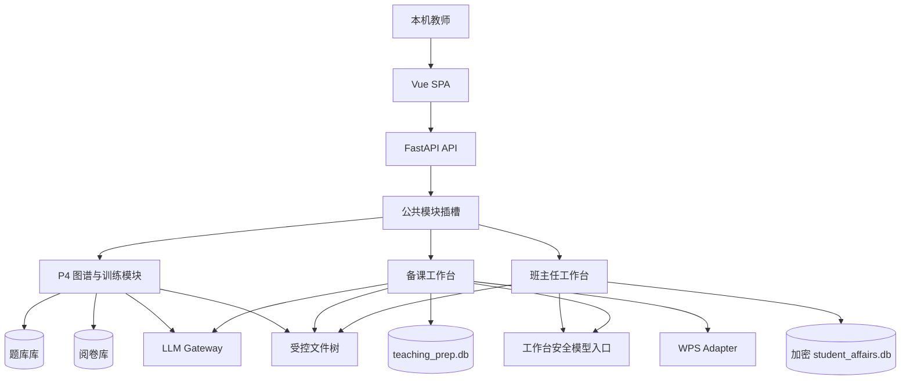

# 前后端现代化与功能演进总体方案（精简版）

> **文档性质：** 本文只保存长期产品方向、稳定技术选择和阶段关系，不保存当前任务、测试数字或实现流水。
>
> 当前实现事实见 `ARCHITECTURE.md`；当前状态与下一动作见 `docs/superpowers/packages/EXECUTION_INDEX.md`。

## 1. 已完成的现代化结果

Phase 0—3 和 P3.5 已进入主线，当前共同基线包括：

- Windows 本机单用户应用，FastAPI 仅监听 loopback，并同源托管 Vue 3 SPA；
- 日常入口为 `运行.bat`，旧 Streamlit 日常 UI 和旧 CLI 已退役；
- 后端具有类型化 API、持久化 Job、统一模型调用边界和 Repository/迁移版本门；
- 阅卷库、题库库和受控 `user_data/` 文件树仍是现有业务数据边界；
- 题库、组卷、训练推荐、复核、报告、运维和只读知识图谱已进入 Vue 生产界面；
- P3.5 已完成导航、题库、评分依据、扫描、三种批改、人工干预、成绩中心和题号契约等真实应用改进；
- 历史实现、迁移、测试、复审和验收过程由 Git/PR 历史保存。

## 2. 当前产品演进：三路并行

当前不再以单一 Phase 串行推进，而是在一个短期公共地基后并行三条相互隔离的业务线：

### P4：知识图谱 2.0 与个性化训练闭环

从已有精确标签和离散掌握证据继续发展：

- 教师确认的父子、先修和相关关系；
- 可解释、可对照和可回退的掌握度 v2；
- 题库题目的无分值训练判定点；
- 基于现有题库的一人一卷；
- WPS 可审核文件、冻结 PDF 和每页机器身份；
- 混合扫描归卷；
- 每名学生一次整卷训练判定；
- 达成点数/总判定点数、反馈、掌握度和下一轮推荐。

普通考试的分数、排名、报告和教师最终分锁保持原义。

### A：初中数学备课工作台

围绕教师真实新授课流程：

- 比教材目录更细的个人课时树；
- 教材、参考 PPT、教辅和答案的明确定位；
- 教师确认后的资源包和匿名学情证据；
- AI 重难点、课堂容量和题目取舍草稿；
- 逐页、逐对象审核；
- WPS 在副本上执行有限改动；
- 生成可直接授课的 PPTX。

A 只读使用题库和已发布学情证据，不写入 P4 或班主任数据。

### B：班主任工作台

围绕班主任连续工作流：

- 日历 DDL 倒排与沟通草稿；
- 德育事务 SOP 动态卡片；
- 可追溯、可修订、会到期的学生支持档案；
- 多学科学业证据与可解释关注建议；
- 跟进、等待、复查和结案回到同一行动账本。

B 当前先执行 B00 治理、安全和威胁模型；B00 获批前不创建敏感业务数据库。

三路的启动、文件所有权和合并规则见：

- `docs/product/TEACHER_WORKSPACES_PARALLEL_IMPLEMENTATION.md`

## 3. 共同地基 F0

F0 是一次短期公共插槽改造，不是第四个产品模块：

- 前端工作台 manifest 和稳定导航/路由加载；
- 后端 feature 注册；
- 受控模块路径；
- 模块迁移和 Job 扩展点；
- 工作台专用零自动重试、正文不落普通日志的模型策略；
- A/B 数据默认排除普通备份；
- 模块依赖隔离。

F0 不实现任何 P4、备课或班主任业务，也不创建业务数据库。P4 沿用现有图谱/训练入口；A、B 各增加一个位于已有功能之后的一级入口。

## 4. 稳定技术与产品决定

- 前端：Vue 3 + TypeScript + Vite + Element Plus + Pinia + ECharts；
- 后端：FastAPI + Uvicorn，单进程、loopback、本机同源托管；
- 发布：工作机不要求 Node，发布包携带已构建的 `frontend/dist`；
- 数据：现有阅卷库和题库保持独立；A/B 使用各自数据库；迁移是 Schema 变更唯一入口；
- 模型：统一经过现有 Gateway 或受控工作台入口；模型、费用、超时和重试不可被界面隐式改变；
- 活动知识语义：以题库当前精确知识点标签和教师确认关系为基础，不恢复旧技能/概念体系；
- 视觉：`docs/ui/STYLE.md` 定义视觉和可访问性，不替代业务来源；
- 用户体验：小能力从所属大工作台自然下钻，不把每个工具做成侧边栏入口；
- 隔离：P4、A、B 不共享业务数据库，不建立跨模块外键，不直接写入彼此；
- AI：结果先为草稿或候选，高影响决定由教师或学校作出；
- 费用：失败默认不自动追加模型请求。

## 5. 后续路线

### Phase 5 — 教师命题训练

继续保持 `planned`。方向是支持教师从构思、编辑、AI 辅助评审到题库发布。它不进入当前三路队列，也不借 P4 的训练判定点自动扩大成 AI 出题。

### 跨模块整合

只有 P4、A、B 分别完成并进入主线后，才考虑：

- 统一教师今日页；
- 一次考试同时提供备课建议和班主任关注；
- 只读的跨模块摘要；
- 统一通知或语音入口。

默认先做同屏只读展示，再判断是否真的需要数据交换；不直接互开数据库。

## 6. 目标架构

架构继续遵循：

- UI 不直接访问数据库或内部文件路径；
- API/router 保持薄，业务规则留在服务和领域模块；
- Repository 负责事务，migration 负责 Schema；
- 长任务通过 Job 暴露进度、取消、失败和恢复；
- 模型调用集中管理超时、零自动重试、节流、用量和脱敏诊断；
- 跨数据库使用快照、幂等键和补偿，不声称分布式事务；
- 模块禁用时不创建目录、数据库或后台任务。

## 7. 安全与授权

以下内容在所有阶段逐次授权：

- 读取、复制、修改、迁移或删除真实 `user_data`；
- 真实模型调用、密钥、费用额度和失败重试；
- 数据库迁移、批量覆盖、永久删除和其他不可逆操作；
- 真实教材、PPT、教辅、学生档案、成绩、训练卷和答卷；
- push、PR、合并、同步主线或丢弃未合并历史。

真实数据不得进入 Git、stash、文档、普通日志或公开 API。任何获准的数据写入和不可逆操作都要先明确目标、备份和回退。
