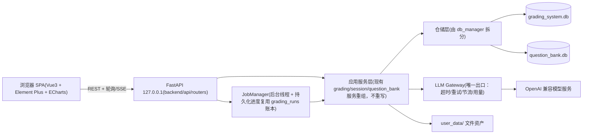

# 前后端现代化与功能演进总体方案（Master Plan）

> **文档性质：** 总体路线与架构策略，不再承担实时任务状态。当前进度、执行顺序、验收条件和建议模型以 `docs/superpowers/packages/EXECUTION_INDEX.md` 及各 Phase 执行包为准；每个执行包开始编码前，再生成一份与当时源码对应的 task-by-task 实现计划。
> **编制与复核：** 初稿 2026-07-03；文中原始 `文件:行号` 只代表编制时快照，执行时必须重新定位。
> **执行入口：** `docs/superpowers/packages/README.md`（规则）→ `docs/superpowers/packages/EXECUTION_INDEX.md`（队列）→ 对应 Phase 执行包。
> **优先级（用户指定）：** ① 更换前端架构并美化界面；② 后端精细化性能优化、冗余清理、必要时调整架构；③ 功能迭代（知识图谱、个性化训练、教师命题训练、班主任学生画像）。①②优先。
> **关键依赖顺序说明：** "更换前端"在工程上必须先有一个可供新前端调用的后端 API 层。因此实际执行顺序是：目标②的前半（API 层抽取）→ 目标①（新前端）→ 目标②的后半（深度重构与瘦身）→ 目标③。

---

## 0. 现状核查摘要（全部为已核实事实）

### 0.1 技术形态

- 单用户、本机 Windows、便携 Python 3.12 运行时；生产 UI 仍是绑定 `127.0.0.1:8501` 的 Streamlit，增量 FastAPI 已存在，Vue SPA 尚未成为生产 UI。
- UI/业务/数据访问同进程：Streamlit 1.58.0 + 两个 SQLite（阅卷库 12 表、题库库 26 表，均 WAL）+ `user_data/` 文件树。
- AI 调用走 OpenAI 兼容接口（OpenAI SDK 2.43.0），配置存于 `%LOCALAPPDATA%/AIGradingSystem/config/api_profiles.json`。
- 测试资产覆盖业务回归、静态编译、迁移和数据库副本完整性；具体数量以最新共同基线的测试结果为准。

### 0.2 规模与耦合（量化）

| 指标 | 数值 | 证据 |
|---|---|---|
| `web_app.py` | 9,750 行（2026-07-10 统计；仍含大段内联 CSS） | 行数统计 |
| `session_manager.py` / `db_manager.py` | 4,435 / 3,177 行 | 行数统计 |
| pages/ 五页面 | 题库管理 2,814、组卷 1,802、训练推荐 877、系统自检 447、知识点整理（高级）353 行 | 行数统计 |
| `st.session_state` 引用 | 全仓 589 处（2026-07-10 统计） | grep 计数 |
| `st.rerun()` | 127 处 | grep 计数 |
| `unsafe_allow_html=True`（手写 HTML 注入） | 70 处 | grep 计数 |
| UI 直连数据库 | `main()` 直接持有 `DBManager`（web_app.py:9547）；pages 3 个文件 6 处直接构建 DB 连接 | grep 计数 |
| 数据层反向依赖服务层 | `db_manager.py:13-16` 导入 `ai_grader.GradingResult` 与 `scanner.ExamPaperGroup` | 已读源码 |

### 0.3 已核实的关键问题清单

1. **Streamlit 长任务仍会阻塞会话体验**：最小 JobManager 已为批改、扫描与报告导出提供后台任务，但原 UI 仍有同步/轮询路径，且任务恢复与前端展示尚未闭环。
2. **一处 LLM 请求仍无超时**：当前明确命中为 `objective_batch_recognition_service.py` 的 `timeout=None`；4 处直连 OpenAI 的调用链仍待统一到 LLM Gateway。
3. **SQLite 连接粒度偏细**：多数操作仍各自创建连接并设置 PRAGMA，请求级复用尚未落地。
4. **全局 Schema 权威仍需逐步收口**：Phase 0 已落地基线迁移与 `schema_migrations`；P1-10 已让 `003_add_jobs.sql` 成为 jobs 唯一完整 DDL，并补齐 app-owned 生命周期，其他运行时 DDL 的仓储收敛仍按 Phase 3 推进。
5. **现有三类 Job 已完成协作式取消，后续类型仍须沿用**：P1-11 已让 report/scan/grading 采用 running 请求/安全确认两阶段并保护最终副作用；未来 config/tagging/training/ops job 不得退回“只改状态”的取消方式。
6. **复核与受控媒体闭环已收口**：P1-12 已用单 JOIN 应用读模型、跨 result SQLite 单事务和事务后批注补偿消除路由重逻辑、N+1 与部分提交；P1-13 进一步用语义化 ID、受控根/扩展名白名单、内存裁剪和 Job 下载 URL 封闭图片与导出文件访问边界。
7. **三代 Streamlit 答题区编辑器与原生 JS 核心并存**：唯一实现的收敛应随 Phase 2 样板页完成，不在 Phase 1 提前大改 UI。
8. **旧语义体系与旧入口链仍保留**：按 D4 在 Phase 3 分批退役；必须保留历史迁移文件，只能通过向前迁移演进。
9. **知识图谱目前仍是 HTML/CSS 树**：真正的关系图、掌握度模型和训练闭环属于 Phase 4。
10. **安全边界仍需持续执行**：`user_data/` 包含真实学生数据且工作区长期脏；默认不删除、不改写、不提交，数据库操作必须备份、预演和验证。

## 1. 需要用户确认的决策点

执行前请逐项确认（推荐项已给出）。确认结果应回填到本节。

**确认记录（2026-07-03，用户回复）：**

- **D1 = 已确认，推荐方案 A**：Vue 3 + TypeScript + Vite + Element Plus + Pinia + ECharts。
- **D4 = 已确认**：旧语义体系保留一个版本后删除（v1.6 只读保留，v1.7 独立变更中执行 WP3.6）。
- **D6 = 边界已确认，实施延期**：技术红线保持不变；2026-07-10 决定 Phase 6 暂缓，不进入当前执行队列，待单独确认数据治理与产品边界后重启。
- D2/D3/D5/D7：用户未提出异议，按推荐项执行；后续可随时调整。
- **D8（新增，见下表）**：视觉基调分歧，默认按推荐 A 执行，用户可改。
- **D9（2026-07-10 新增）**：Phase 1-5 建立正式执行包；Phase 5 必做但先实验和设计；Phase 6 暂缓。

**设计规范与参考资产（2026-07-14 重置）：** 现有 Streamlit、服务、数据库契约、测试，以及带日期和范围的用户明确决定，提供用户任务、业务能力、数据语义、业务结果、状态和安全边界；信息架构、页面拆分、布局、控件、呈现顺序和操作步骤允许在这些边界内主动重设计。`docs/ui/STYLE.md` 只作为颜色、字体、间距、密度、控件外观、视觉可访问性（如对比度、可见焦点、文字可读性）和视觉验收的权威；交互语义、键盘操作、上下文连续性和错误恢复仍由 UX 与业务验收约束，不由 STYLE 定义。此前 7 张 AI 完整概念图已退出当前树和活动参考集，原件仅由 Git 历史保留用于审计；当前参考资产规则见 `docs/ui/references/README.md`。当前 AI 协作入口为根目录 `AGENTS.md`（`CLAUDE.md` 仅保留兼容指针）。

| 编号 | 决策 | 选项与推荐 | 影响 |
|---|---|---|---|
| **D1** | 新前端技术栈 | **推荐 A：Vue 3 + TypeScript + Vite + Element Plus + Pinia + ECharts**。备选 B：React 18 + Ant Design 5。不推荐 C：留在 Streamlit 做主题化（无法根治 rerun 全脚本重跑、长任务阻塞、568 处 session_state 的结构性问题） | A/B 工作量相当；Element Plus 中文文档成熟、适合表格/表单密集的教务风格界面；ECharts 原生支持力导向图谱与热力图 |
| **D2** | 后端 API 框架 | **推荐 FastAPI + Uvicorn（单进程，绑定 127.0.0.1）**，同进程托管前端静态文件与后台任务线程 | 与现有同步/线程模型兼容（FastAPI 同步端点自动跑在线程池）；便携运行时只需 `pip install fastapi uvicorn` 进 `runtime/python` |
| **D3** | Node 构建链 | **推荐：工作机不装 Node**。前端在开发机构建，`frontend/dist/` 随包分发；仓库同时保留前端源码 | 便携性不受影响；发布脚本 `package_v1.5.0.py` 需加入 dist 目录 |
| **D4** | 旧语义体系（11 张技能表+相关服务/页面）删除时点 | **推荐：v1.6 全程只读保留，v1.7 起在独立变更中删除**（与 ARCHITECTURE.md"保留一个版本"约定一致） | 删除前需确认 `user_data` 中无仍想回看的旧数据 |
| **D5** | 答题区编辑器收敛 | **推荐：以 `components/answer_region_editor/` 原生 JS 核心为唯一实现**，包装成 Vue 组件；退役 st_canvas 三套与 `streamlit-drawable-canvas` 依赖 | 该 JS 核心已有独立单测（editor_core.test.mjs），是全仓最"可迁移"的 UI 资产 |
| **D6** | 学生画像功能的数据边界 | **推荐：独立 `student_affairs.db`；默认排除出数据包导出与便携包（备份包含）；AI 输出定位为"仅供参考的沟通建议"；提供一键删除** | 涉未成年人敏感个人信息（事件、家庭情况、人格推断），建议启用前与学校确认合规口径 |
| **D7** | 打包形态 | **推荐：维持"源码 + 便携运行时"目录式发布**，不启用 PyInstaller（`run_desktop.py` 与 `pyinstaller` 依赖仅在确认无用后归入删除清单） | 保持现有更新工具链不变 |
| **D8** | 主强调色与视觉基调 | 颜色、字体、间距、密度、组件外观和全部设计 Token 只以 `docs/ui/STYLE.md` 为准；布局结构、状态含义和交互不由 STYLE 定义 | 避免总体方案与视觉规范重复保存色值，同时防止视觉资料扩张为功能需求 |
| **D9** | 执行包治理 | **Phase 1-5 正式排包；Phase 5 先实验后开发；Phase 6 暂缓。** | 降低长期计划因源码漂移失效的风险；具体安全停机条件见执行包 README |

---

## 2. 目标架构

### 2.1 结构图



### 2.2 目标目录结构（增量演进，不是一次性搬家）

```text
├── backend/
│   ├── api/
│   │   ├── app.py                 # FastAPI 实例、静态托管、异常处理、请求日志
│   │   ├── routers/               # sessions/ config/ templates/ regions/ scan/
│   │   │                          # grading/ review/ reports/ students/
│   │   │                          # question_bank/ training/ graph/ jobs/ ops
│   │   └── schemas/               # Pydantic 请求/响应模型（前后端契约）
│   ├── jobs/                      # JobManager、进度事件、取消协议
│   ├── llm/                       # LLM Gateway（llm_client.py 演进）
│   ├── domain_models.py           # GradingResult 等共享数据类（自 ai_grader/scanner 下沉）
│   └── repositories/              # 由 db_manager.py / schema.py 拆出的按聚合仓储
├── frontend/
│   ├── src/{views,components,api,stores,styles}/
│   └── dist/                      # 构建产物，随发布包分发
├── （过渡期保留）web_app.py + pages/   # 逐页退役，Phase 2 末删除
└── 其余现有模块原位保留，逐步归位
```

**演进原则：** 现有服务文件（grading_service.py、session_manager.py、question_bank/ 等）在 Phase 1 不迁移、不重写，只被 API 层调用；物理归位放到 Phase 3，避免"大爆炸式"重构。

### 2.3 任务系统（JobManager）设计要点

- 任务类型：`grading_run`（复用在途计划的 grading_runs 账本）、`config_generation`、`scan_analysis`、`tagging_sync`、`report_export`、`training_export`。
- 通用 `jobs` 表（阅卷库）：`id, job_type, payload_json, result_json, status(queued/running/paused/succeeded/failed/cancelled), progress, stage, detail, error, cancel_requested, created_at, started_at, updated_at, finished_at`。批改类任务的明细进度仍以 grading_runs 为准，jobs 行仅作统一索引。
- `migrations/grading/003_add_jobs.sql` 是 jobs 表、约束和索引的唯一完整 DDL；`JobStore` 运行时直接读取该迁移，并只额外保留旧表缺 `result_json` 时的兼容补列。
- 执行：进程内 `ThreadPoolExecutor`（沿用现有各服务的线程池与 `RequestPacer`，不改并发语义）；服务现有的 `report(progress, stage, detail)` 回调协议（web_app.py:647-648 已定义）直接对接 job 进度写入。
- 生命周期：每个 FastAPI app 在 lifespan 启动时创建并恢复自己的 manager，放入 `app.state`；退出时等待线程池关闭。dependency override 注入的 manager 由注入方拥有，不由应用关闭。
- API：`POST /api/jobs/{type}`、`GET /api/jobs/{id}`（轮询）、`POST /api/jobs/{id}/cancel`；SSE 可选后加。
- 取消：queued/paused 可立即终止；running 只置 `cancel_requested`，handler 在安全边界通过专用异常确认 cancelled。普通异常保持 failed；阻塞调用已跨过最终发布边界时允许正常完成赢得竞态。
- 恢复语义沿用现状：进程重启不续跑，启动时把 `running` 任务标 `failed`（与 grading_service 现有恢复逻辑一致）。

### 2.4 LLM Gateway 设计要点

- `LLMClient`（llm_client.py:27）已具备：视觉/文本 JSON 输出、参数兼容回退、JSON 修复、图片压缩（:425）。在此基础上收编 4 处直连（0.3 节第 3 条），统一：
  - **超时预算**：每类请求显式超时（批改 300s、识别 60s、打标 120s——数值以现有配置为初值，可进 api_profiles）；禁止 `timeout=None`。
  - **重试**：统一有界退避重试装饰器，替换各文件自写循环；可重试条件集中定义。
  - **观测**：请求 ID、耗时、token 用量统一走 `usage_logger.py`。
- `api_profiles.py`（ApiProfileStore，:143）保持配置存储职责不变，新增功能只加 profile 字段、不动存储协议。

---

## 3. 分阶段路线图

> 每阶段末尾的"验收"是该阶段合并回主线的硬门槛。工作量为相对量级（S<1 天级，M=数天级，L=一周级以上，均指专注执行时间）。
> 本节只保留阶段目标，不保存实时完成数、待执行数或队列；这些动态信息只见 `docs/superpowers/packages/EXECUTION_INDEX.md`。

### Phase 0 — 地基与防护网（前置，量级 M）

**启动条件与验收：** 作为后续阶段的工程防护网；其稳定目标与验收项保留如下，完成事实只在 Index 记录。

| WP | 内容 | 关键文件 | 量级 |
|---|---|---|---|
| WP0.1 | 完成并提交在途计划（2026-07-01），冻结 `grading_service.py`/`web_app.py` 的并行改动 | 见该计划 | — |
| WP0.2 | 仓库卫生：删除/移出 `debug_test.db`、`test_math.png`、`merge_staging_known_hosts.tmp`、`第十五周学情反馈.pdf`；归档 `task.md`（已全部完成）、`scratch/`、`analysis_outputs/`；`.gitignore` 补齐同类产物 | 根目录 | S |
| WP0.3 | 依赖锁定：从便携运行时导出 `constraints.txt`（pip freeze）；`requirements.txt` 拆分运行/构建两份；删除无使用证据的 `google-generativeai`（grep 零命中，删除前跑全量测试复核） | requirements.txt | S |
| WP0.4 | Schema 基线：为两库各生成一份"与当前运行时 DDL 等价"的基线迁移 + 建 `schema_migrations` 表并打标；写迁移预演脚本（复制库→迁移→PRAGMA integrity_check→比对 schema） | migrations/、update_tools/migrate_db.py | M |
| WP0.5 | 冒烟脚本：一条命令跑"全量 pytest + 静态编译 + 两库副本初始化幂等检查"，作为 integration 波次结束时的最终门禁入口；功能分支使用聚焦测试、受影响回归和跳过 pytest 的快速冒烟 | tools/ | S |

**验收：** 全量测试保持通过；两库真实文件经迁移预演无差异；仓库根目录无杂物。
**回退：** 全部为可逆提交；基线迁移不改现有数据。

### Phase 1 — 后端 API 层与任务系统（目标②前半，量级 L）

**目标与验收：** 提供可供新前端调用的本机 API 与可恢复任务边界；包定义见 `docs/superpowers/packages/phase-1-execution-packages.md`。

| WP | 内容 | 依据/关键点 | 量级 |
|---|---|---|---|
| WP1.1 | FastAPI 骨架：`backend/api/app.py`、统一错误体、请求日志、`/healthz`；`运行.bat` 增加双入口（8501 Streamlit + 8000 API 并行） | D2；绑定 127.0.0.1 | S |
| WP1.2 | 领域路由分批落地（资源草案见附录 A）。顺序：sessions → students → config 生成 → templates/regions → scan → grading → review → reports → question-bank → training → graph → ops。每个路由 = 薄壳，直接调用现有服务/DBManager 方法，Pydantic schema 定契约 | UI 现调用点即 API 形状来源（如 render_config_and_session_tab web_app.py:2313 起） | L |
| WP1.3 | JobManager（2.3 节设计）；最小 manager、生命周期和现有 report/scan/grading 协作式取消已验证，继续把 config/tagging/training 等长任务迁入同一协议 | 复用 grading_runs 账本并区分暂停与取消语义 | M |
| WP1.4 | LLM Gateway 收编（2.4 节）：改 4 处直连、消灭当前剩余 1 处 `timeout=None`、统一重试与用量记录 | 以 P1-24/P1-25 执行前重新搜索的结果为准 | M |
| WP1.5 | 数据访问最小优化（不动 schema）：`DBManager` 与题库 `connect()` 增加"外部传入连接"形态，API 请求内复用单连接；只读端点用 `mode=ro` URI；为每个端点记录耗时日志（后续 Phase 3 性能专项的基线数据） | db_manager.py:46、schema.py:9 | M |
| WP1.6 | 契约测试：每个路由配 API 级测试（复用现有服务层测试的构造器）；核心五流程（建会话→配置→模板/区域→批改→导出）一条 API e2e | tests/ | M |

**验收：** Streamlit 与 API 双通道同时可用且共享同一数据；API e2e 通过；无超时缺失的模型请求（grep `timeout=None` 零命中）。
**回退：** API 层是纯增量，删除 backend/ 即回到现状。

### Phase 2 — 新前端 SPA（目标①，量级 XL，分两批交付）

**启动条件与验收：** 后端契约和前端工程门槛满足后按依赖推进。在 P2-08 与后续复杂页面之间必须先通过 2026-07-14 新增的 Phase 2 前端来源重校准门槛。包定义见 `docs/superpowers/packages/phase-2-execution-packages.md`。

**设计依据（2026-07-14 来源重置）：** 现有 Streamlit 行为、服务实现、数据库契约、测试，以及带日期和范围的用户明确决定，提供用户任务、业务能力、数据语义、业务动作与结果、状态、权限和安全边界；旧页面结构、控件位置和点击顺序不是设计模板。新 Vue SPA 在业务能力可达、数据语义和结果等价、安全边界不降低的前提下，可以主动重组导航、合并或拆分页面、调整布局、控件、呈现顺序和操作步骤。`docs/ui/STYLE.md` 只负责设计 Token、字体、密度、控件外观、视觉可访问性（如对比度、可见焦点、文字可读性）、反面清单和视觉验收；交互语义、键盘操作、上下文连续性和错误恢复仍由 UX 与业务验收约束，不由 STYLE 定义。执行约束见 `AGENTS.md`。旧 `pages_shared/shared_styles.py` 的 #4F46E5 色板**废弃**，不再作为 tokens 来源。

**业务能力与 UX 设计溯源：** 不再从 STYLE 或参考图预设固定的 7 项一级导航。P2-03 的导航与外壳、P2-04 的统一 Client 与 Job Store、P2-05 至 P2-08 的单份三栏页及相关交互均保留为历史实现事实，但全部只作为审计输入和复用候选，不是业务事实来源，也不能自动成为后续页面范式。每个可见页面的即时计划必须包含下列“业务能力与 UX 设计溯源表”：

| 用户任务或业务能力 | 现有业务来源 | 必须保持的语义、结果与安全边界 | 新 Vue 呈现与操作设计 | UX 调整理由 | 业务差异及用户决定 | 验证方式 |
|---|---|---|---|---|---|---|
| 开工时逐项填写 | Streamlit、服务、数据库契约或测试 | 明确不可丢失或改义的内容 | 允许重新设计 | 说明效率、清晰度或可访问性依据 | 仅业务边界变化时必填 | 自动检查、浏览器证据与用户验收 |

纯 UX 差异不需要逐控件专项批准；只有改变业务能力、数据语义、结果、状态、权限、安全、持久化、危险操作保护、失败恢复、幂等性或审计时，才填写带日期和范围的用户决定。STYLE、AI 概念图、演示数据和历史实现计划不得单独出现在“现有业务来源”中。无来源的业务能力、数据语义或业务结果不得实现；服务于已有能力的新布局和控件不要求旧 UI 存在同形元素。未来功能不创建当前占位入口，除非用户另行确认。

**参考资产：** 7 张 AI 完整概念图已从当前树移除，不再维护页面对应关系。未来如确需视觉参考，只能按 `docs/ui/references/README.md` 保存裁去功能语义的局部片段；片段不能证明任何页面、字段或操作需要存在。

**桌面响应式与验收视口：** 产品支持边界以 `AGENTS.md`、`ARCHITECTURE.md` 和 Phase 2 map 为准：当前只支持宽度不低于 1024px 的 Windows 桌面浏览器，平板和手机不进入实现或验收范围。STYLE 只规定视觉 QA 覆盖 1920×1080、1440×900、1366×768、1280×800、1024×768，全部无横向溢出。

**WP2.1 前端工程与设计系统（M）**：Vite 工程；以 STYLE.md 的视觉 Token 生成 CSS Variables 并定制 Element Plus 主题；Axios 封装统一错误提示和 job 轮询。P2-03 已实现的 App Shell 尺寸和导航是待审计实现事实，不由 STYLE 证明其业务正确性。**UI 状态映射表**必须从数据库与 API 的现有状态集合和含义出发，再选择 STYLE 的状态外观，**不改数据库枚举**（那是 WP3.4 的范围）。

**WP2.2 页面迁移（每页一个独立实现计划），推荐顺序与映射：**

> P2-08 的历史实现与验收保留，但 2026-07-14 新增的 Phase 2 前端来源重校准门槛必须先通过。P2-03 至 P2-08 全部只是审计输入和复用候选；组件复用只是实现偏好，不能凌驾于已批准的 UX 主动重设计。已经验证的 Token、网络层和通用组件可以继续复用；若现有外壳或组件妨碍信息架构、清晰度、可访问性、上下文连续性、错误恢复或批量效率，可以在即时计划说明理由后重构或替换。

| 批次 | 新页面 | 迁移来源（行号为当前实测） | 要点 |
|---|---|---|---|
| 1 | 考试工作台（会话+配置+模板+答题区） | web_app.py:2313-3052（配置与会话）、6024-7141（rubric 编辑器族）、7341-8763（模板/区域） | 最大单页；rubric 统一表格编辑（5652-6024）改为前端可编辑表格组件 |
| 1 | 批改进度 | web_app.py:3144-3481 + JobManager | 进度页刷新不丢状态；暂停/恢复按钮对接在途计划的账本 |
| 1 | 答题区编辑器组件 | components/answer_region_editor/（原生 JS 核心） | D5：包装为 Vue 组件；退役 st_canvas 三套（7492/8128/8439） |
| **0（样板页，已实现后待纠偏）** | 阅卷与人工复核（评分审阅域） | web_app.py:3700-4060（按题号批量复核、裁剪网格、调分逻辑） | 按题号批量比较和复核必须作为默认可达的业务能力，但不固定 Streamlit 的布局或点击顺序；P2-05 至 P2-08 现有 Vue 的队列、证据查看、评分检查和安全确认实现与组件可以复用、重构或替换，但相应业务能力、评分结果和安全确认语义不得丢失或改义；单份详情能力作为可选入口，现有三栏只是一种原型；**来源重置与修正通过前不得开始其他复杂页面** |
| 2 | 评分审阅补全 | web_app.py:3700-4060 剩余功能 | 按“业务能力与 UX 设计溯源表”补齐批量筛选、连续处理与必要详情；不得从概念图新增业务能力、数据语义或业务结果 |
| 2 | 报告导出 | web_app.py:4879-5242 | 导出任务化 + 下载；保留现有导出缓存键逻辑（5147-5188） |
| 2 | 全局资料：学生名单 | web_app.py:1873-1992（StudentManager 导入流程） | 上传解析 → API |
| 2 | 全局资料：知识图谱 | web_app.py:4060-4877（现 HTML 树 4237-4303） | **升级为 ECharts 力导向/树图 + 掌握度着色 + 点击下钻**（替代 query 参数跳页 4565-4642） |
| 3 | 题库管理 | pages/题库管理.py（2,814 行） | 导入向导、批量打标（进度任务化）、筛选表格虚拟滚动 |
| 3 | 组卷 | pages/组卷.py（1,802 行） | 试题篮沿用 assembly_basket_state 的持久化语义 |
| 3 | 训练推荐 | pages/训练推荐.py（877 行） | 诊断热力图改 ECharts |
| 3 | 系统自检 | pages/系统自检.py（447 行） | 只读状态页，最简单，可作为练手首页 |
| — | 知识点整理（高级） | pages/知识点整理（高级）.py（353 行，旧技能目录 UI） | **不迁移**，随 D4 退役 |

**WP2.3 切换与退役（M）：** 每页完成后按“业务能力与 UX 设计溯源表”逐项验证（以业务能力、结果、数据语义和安全边界等价为准，不要求屏幕或点击等同）→ 全部页面通过后：`运行.bat` 切换为单入口（FastAPI 托管 dist）→ 删除 `web_app.py` UI 部分、pages/、pages_shared/、streamlit 与 streamlit-drawable-canvas 依赖。web_app.py 中的非 UI 逻辑（文件工具 7167-7460、快照写入 7250-7314 等）此前已在批次 1-2 中下沉到服务层。

**验收（硬门槛）：** ① Phase 2 前端来源重校准门槛先通过：视觉按 STYLE.md 检查，业务按“业务能力与 UX 设计溯源表”检查，证明业务能力、结果、数据语义和安全边界等价，并证明新信息架构与操作更清楚、高效且可恢复；不要求逐屏、逐控件或逐点击一致，专用版本化清单记录用户确认批量复核为默认主流程且单份详情不喧宾夺主；② 用一次**用户明确授权的考试副本**在新 UI 走完"建会话→生成配置→确认模板与答题区→批改→复核调分→导出报告"全流程；③ 视口检查按统一桌面清单（1920×1080/1440×900/1366×768/1280×800/1024×768）；④ 批改中刷新页面进度不丢。
**回退：** 双入口期间任意时刻可退回 Streamlit；切换 `运行.bat` 是最后一步且可单文件还原。

### Phase 3 — 后端深度重构与瘦身（目标②后半，量级 L）

| WP | 内容 | 依据 |
|---|---|---|
| WP3.1 | 解除反向依赖：`GradingResult/QuestionGradingDetail/ExamPaperGroup` 下沉到 `backend/domain_models.py`；`db_manager.py:13-16` 改引新位置（旧位置留别名一个版本） | 0.3-第2条 |
| WP3.2 | `db_manager.py` 按聚合拆仓储：students / sessions / papers+results+details / templates+regions / settings；Legacy API（:419 起）标记废弃 | 0.3-第10条 |
| WP3.3 | `session_manager.py` 拆分为五模块：docx/pdf 解析（:59-180）、提示词构建（:196-216、1968-2069）、生成编排与重试（:239-551、984-1108）、本地题块解析（:1109-1620）、质量告警（:1746-1875）。行号为当前函数骨架实测 | 骨架 grep |
| WP3.4 | Schema 收敛：运行时 DDL 缩减为"版本检查 + 拒绝启动提示"；新变更只走 migrations；状态列补 CHECK 约束（先 `SELECT DISTINCT` 统计现值再定枚举：grading_sessions.status、exam_papers.processing_status/match_status、answer_regions.mapping_status） | 0.3-第5条 |
| WP3.5 | 冗余字段治理（详见第 5 节清单）：`session_details.knowledge_id` 与 `knowledge_ids` 归一为后者（迁移回填+读方切换）；`grading_sessions.question_bank_sync_*` 四列评估迁入独立工作流状态表；`session_results.raw_json` **保留**（审计用途，明确记录不删原因） | schema 阅读 |
| WP3.6 | 死代码删除（D4 时点执行，独立可回退变更，分三批）：向导组、旧入口组、旧语义组。删除运行时代码和废弃表必须走向前迁移；**历史 migration 文件永久保留，不改写、不删除** | 0.3-第7/8条 |
| WP3.7 | 性能专项（用 WP1.5 的端点耗时日志定位后再改，避免臆测优化）：候选项见第 4 节 | — |

**验收：** 全量测试通过；`ARCHITECTURE.md` 同步更新；两库迁移预演通过；删除批次各自可独立 revert。

### Phase 4 — 知识图谱 2.0 与个性化训练闭环（目标③a/b，量级 L）

现状根基（已核实）：活动语义 = `question_tags.knowledge_point` 精确标签；`QuestionTagProjectionService` 实时投影确认链接；`DiagnosisProfileService.build_tag_profiles()`（integration/diagnosis_profile_service.py:62）按标签聚合掌握率；训练任务 schema 已含 `stage IN ('direct','prerequisite','transfer')`（schema.py:378-379）与回流表 `training_attempts`（:407-419）；旧 `knowledge_relations` 表已有 `prerequisite/related/parent` 关系模型可借鉴（:274-287）。

1. **WP4.1 标签关系层**：新表 `tag_relations(source_key, target_key, relation_type CHECK(prerequisite/parent/related), source CHECK(ai_suggested/teacher_confirmed), weight)`——挂在 knowledge_point 标签键上（不是旧 concept id）。AI 批量建议 + 教师确认双态；只有 confirmed 参与图谱与推荐。
2. **WP4.2 图谱可视化 2.0**（依赖 Phase 2 的 ECharts 图组件）：层级/先修边、班级与单生两种视图、掌握度热力着色、按考试范围过滤、点击节点下钻到证据（复用 `tag_evidence()` :247）。
3. **WP4.3 掌握度模型 v2**：现按得分率加权；升级为"得分率 + 时间衰减 + 样本量置信度"三因子，实现为纯函数模块 + 单测，向后兼容旧口径（开关切换）。
4. **WP4.4 个性化训练闭环**：`prerequisite` 阶段选题从 tag_relations 的先修边取候选（当前 direct/transfer 已可用）；现有 `TrainingTaskService.record_attempt_stub()` 已能写入占位尝试，但尚未与真实训练卷批改结果闭环。正式目标是：真实批改写 `training_attempts` → 掌握度更新 → 图谱/下一次推荐生效。

### Phase 5 — 教师命题训练（目标③c，量级 M）

**启动条件与验收：** 前 5 个包用于工作流访谈、富文本编辑器 Spike、相似题评估、AI 评审评估和统一设计门；只有设计门通过后才进入 Schema、API、Job、UI 与试点。完整 13 包见 `docs/superpowers/packages/phase-5-execution-packages.md`。

可复用资产包括 `question_fingerprints`、受控打标、富文本侧车渲染和组卷导出器。2026-07-10 审计未确认 `questions.source` 字段，因此“发布到题库后的来源追踪”必须由 P5-05 设计门决定，不能在计划里预设 `source='teacher_authored'`。

### Phase 6 — 班主任学生画像（目标③d，量级 L，敏感功能）

**启动条件与红线：** 只有 `docs/superpowers/packages/phase-6-deferred.md` 的重启条件满足并获得用户确认后才能建立活动执行包。此前只保留独立敏感数据边界、默认排除出数据包和便携包、AI 内容显著标注、按学生删除、日志不落敏感正文等约束，不得创建 Schema、接入真实数据或实现画像推断。

---

## 4. 性能优化清单（按预期收益排序）

> 标注【事实】= 已核实的代码行为；【假设】= 合理推断，**动手前必须用 WP1.5 的耗时日志验证**，避免臆测优化。

| # | 问题 | 证据 | 方案 | 落点 |
|---|---|---|---|---|
| 1 | 交互卡顿的结构性根源：Streamlit 每次交互重跑整个约 9,750 行脚本（2026-07-10 统计）【事实：框架行为】 | 框架模型 | SPA 迁移根治（Phase 2）；过渡期不投入局部缓存优化 | Phase 2 |
| 2 | 长任务占住 UI 会话线程，0.35s 轮询期间页面完全阻塞，刷新丢进度【事实：web_app.py:637-708】 | 同左 | JobManager 后台化 + 前端轮询 | WP1.3 |
| 3 | 无超时模型请求可无限挂起批改线程【2026-07-10 当前明确命中：objective batch】 | 同左 | 统一超时预算 | WP1.4 |
| 4 | 每次 DB 操作新开连接 + 3 条 PRAGMA；一次页面渲染触发数十次【事实：db_manager.py:46-52；假设：单机 SQLite 下单次开销小、但在循环/列表页会放大】 | 同左 | 请求级连接复用；只读走 `mode=ro`；**先测量再深化** | WP1.5 |
| 5 | 复核/报告页逐行生成答题区裁剪预览图（PIL 实时裁剪）【事实：_build_answer_region_crop_preview web_app.py:5533、3918 网格调用；假设：大会话下是主要等待点】 | 同左 | 派生图磁盘缓存（键：paper+region+增强版本），批改完成时预生成 | WP3.7 |
| 6 | 标签投影每次全量实时查询题库（设计使然，教师改标签即时生效）【事实：ARCHITECTURE.md 接口表"无标签缓存"】 | 同左 | 保留语义，加**请求内** memo（同一次图谱/推荐请求不重复查同一题） | WP3.7 |
| 7 | 图片为每次请求重复压缩编码 base64【事实：llm_client.py:425 _compress_image_for_api 无缓存；在途计划已含"参考图降载缓存"】 | 同左 | 以在途计划的缓存为准，扩展到答卷图 | 在途+WP3.7 |
| 8 | 批量打标/批改的 RPM 节流为全局互斥锁排队【事实：request_pacer.py:24-31，行为正确】 | 同左 | 保持；仅把 RPM/并发参数暴露到统一配置 | WP1.4 |
| 9 | 报告导出无增量：改一个分数需整本重导【事实：导出缓存以 score_revision 为键 web_app.py:5156-5188，已有部分缓存】 | 同左 | 保留缓存机制并迁到服务层；暂不做增量导出（收益存疑） | WP2 批次2 |
| 10 | 题库列表/筛选页在大题量下的查询形状未知【假设】 | 待测 | WP1.5 日志 + 大数据集压测后决定（虚拟滚动已列入 WP2.2） | WP3.7 |

## 5. 冗余与删除清单

### 5.1 高置信（当前即无调用方/无使用证据，Phase 0-1 期间即可删）

| 对象 | 证据 |
|---|---|
| `requirements.txt` 的 `google-generativeai` | 全仓 grep 无导入 |
| `web_app.py:19` 对向导的 import | 全文件无调用点 |
| `run_objective_admission_wizard.py` | 引用 5 个不存在的脚本（ARCHITECTURE.md 已记录，用户已确认停用） |
| 根目录杂物：debug_test.db、test_math.png、merge_staging_known_hosts.tmp、第十五周学情反馈.pdf、task.md、scratch/、analysis_outputs/ | 目录清单 |

### 5.2 保留一个版本后删（D4 时点，WP3.6 三批执行）

- 旧语义组：`knowledge_concepts`、`knowledge_relations`、`knowledge_source_mappings`、`skill_topics`、`skills`、`assessment_item_skills`、`question_skill_links`、`skill_resolution_conflicts`、`skill_neighbors`、`skill_system_settings`、`skill_migration_runs`（11 表）+ skill 系服务与迁移工具 + `pages/知识点整理（高级）.py` + practice_plan_service 的 legacy/skill 分支（practice_plan_service.py:1027-1205 一带）+ `DiagnosisProfileService.build_legacy_profiles/build_skill_profiles`。
- 旧训练集：`training_sets`、`training_set_items`（schema.py:135-156）。
- 旧入口组：`main.py`、`exam_results`/`grading_details` 表、`DBManager` Legacy API（db_manager.py:418 起）。
- 编辑器组：st_canvas 三套实现 + `streamlit-drawable-canvas` 依赖（随 Phase 2 批次 1 退役，早于 D4）。
- 待确认后处理：`run_desktop.py` 与 `pyinstaller`（D7）、`subjective_only_grader.py`（需先 grep 确认调用方再定档）。

### 5.3 看似冗余但**不能删**（防误删清单）

| 对象 | 原因 |
|---|---|
| `objective_crop_calibration.py` | 被 choice_recognition_chain.py:31 活跃使用 |
| `image_preprocessor.py`、`equivalence_engine.py`、`export_names.py`、`student_manager.py`、`analytics.py` | 分别被 scanner/grading_service、session_manager、报表与页面、web_app.py:1879、web_app.py:9549 使用 |
| `session_results.raw_json` | 审计与兼容用途（ARCHITECTURE.md 技术决策表），保留并记录原因 |
| `rapidocr_onnxruntime` | scanner.py 本地姓名 OCR 使用 |

### 5.4 字段级归一（WP3.5）

- `session_details.knowledge_id`（TEXT NOT NULL，单值）与 `knowledge_ids`（JSON 列表）双存 → 迁移回填后统一读 `knowledge_ids`，`knowledge_id` 降级为生成列或删除（db_manager.py:237-253）。
- `grading_sessions.question_bank_sync_state/details_json/error/updated_at` 四列（db_manager.py:158-171）→ 评估迁入独立工作流状态表（保持会话表窄）；若迁移成本大于收益则保留并记录。
- 状态自由文本列补 CHECK（WP3.4，先统计现值）。

## 6. 风险与回退

| 风险 | 缓解 |
|---|---|
| 双入口期数据竞写（Streamlit 与新 UI 同时操作同一会话） | WAL + busy_timeout 已有；页面迁移期间约定"单页面单入口"，切完一页在旧 UI 该页挂"已迁移"提示 |
| 前端重写引入业务偏差（568 处状态逻辑隐含业务规则） | 每页迁移前先建立“业务能力与 UX 设计溯源表”，锁定必须保持的语义、结果与安全边界，并记录 UX 调整理由；UI 契约测试保留到对应页退役 |
| Schema 收敛破坏旧库升级路径 | 基线迁移 + 预演脚本（WP0.4）；所有迁移幂等；升级前自动备份（现有机制） |
| 在途计划与本方案冲突 | Phase 0 先合并冻结；本方案不改题号契约与暂停语义 |
| 删除批次误伤 | 三批独立提交、各自可 revert；删除前全量测试 + 真实数据冒烟 |
| 学生画像合规 | D6 红线；功能开关默认关闭；上线前用户与学校确认 |
| 便携机无 Node | D3：dist 随包分发；CI/开发机构建 |

## 7. 验证策略（每个 WP 的实现计划必须含对应条目）

1. **回归底座**：每个执行包保持聚焦测试和受影响回归通过，并在功能分支交接前运行跳过 pytest 的快速冒烟；WP0.5 完整冒烟（全量 pytest + 编译 + 库初始化幂等）由 integration 在当前波次全部合入后只运行一次。额外全量只在执行包规则规定的高风险或候选变化条件下运行。
2. **API 契约**：每路由的请求/响应 schema 测试 + 核心五流程 e2e（WP1.6）。
3. **前端**：每页先完成基于当前生产行为、服务、数据库契约、测试和用户决定的“业务能力与 UX 设计溯源表”，同时验证业务能力、结果、数据语义与安全边界等价，以及新信息架构和操作更清楚、高效且可恢复；不按旧 UI 逐屏、逐控件或逐点击判定一致。组件级测试从简，以“真实浏览器 + 授权数据副本全流程 + 五档桌面视口”为硬验收；STYLE 只负责视觉检查，不能替代业务等价验证。答题区编辑器沿用 editor_core.test.mjs 并扩展。
4. **迁移**：每个 schema 变更附预演（副本库跑迁移 + integrity_check + schema diff）。
5. **性能**：WP1.5 端点耗时日志为基线；WP3.7 每项优化提供前后对比数字，无数字不合并。
6. **删除**：删除类变更必须"grep 调用方清单为空 + 全量测试 + 真实数据冒烟"三证齐全。

## 附录 A：REST 资源草案（WP1.2 的起点，实施时按现有服务签名细化）

```text
/api/sessions                GET/POST/PATCH/DELETE     会话 CRUD、软删、状态
/api/sessions/{id}/config    GET/PUT + POST /generate  评分依据（生成走 job）
/api/sessions/{id}/template  GET/POST                  样卷上传与分析
/api/sessions/{id}/regions   GET/PUT + POST /commit    答题区草稿/提交（复用提交服务）
/api/sessions/{id}/scan      POST(job) + GET /analysis 扫描与预检
/api/sessions/{id}/grading   POST(job)/pause/resume    批改运行（对接 grading_runs）
/api/sessions/{id}/results   GET（+明细/调分 PATCH）    复核
/api/sessions/{id}/reports   POST(job) + GET /files    导出
/api/students                GET/POST/import           名单
/api/question-bank/...       papers/questions/tags/import(job)/tagging(job)
/api/training/...            diagnosis/plans/tasks/exports(job)
/api/graph                   GET profiles/evidence/rows（Phase 4 加 relations）
/api/jobs/{id}               GET/cancel                统一任务查询
/api/ops                     backup/restore/transfer/self-check
```

## 附录 B：假设与未验证事项（执行时逐条消解）

1. 端点级性能数字（第 4 节所有【假设】项）未实测——WP1.5 先建测量。
2. `subjective_only_grader.py`、`run_desktop.py`、`usage_report.py` 的实际使用情况未逐一确认调用链，删除前需补 grep 证据。
3. 大题量（数千题）下题库页查询形状未压测。
4. 真实模型供应商 SLA/参数兼容性以 `api_profiles.json` 实际配置为准（ARCHITECTURE.md 未确认事项，本方案未改变）。
5. 本方案行号基于 2026-07-03 工作区（含在途未提交修改）；在途计划合并后行号会漂移，各 WP 实现计划应重新定位。

## 附录 C：给 Codex 执行任务的固定约束

1. 遵守仓库 `AGENTS.md`、执行包 README 与 `docs/ui/STYLE.md`；STYLE 只作为视觉规范。每个可见前端执行包先建立“业务能力与 UX 设计溯源表”，逐项追溯当前业务来源、锁定必须保持的语义与结果并记录 UX 主动重设计理由，再按当时源码生成 task-by-task 实现计划后编码。
2. 不改的东西：评分规则与知识点口径、`question_tags.knowledge_point` 活动语义、两库分立格局、127.0.0.1 单用户边界、`PathManager` 作为唯一路径入口、答题区"数据库+快照补偿"提交协议。
3. 每次提交保持其聚焦测试和受影响回归通过；完整测试按 `AGENTS.md`、执行包 README 与 integration 分层门禁执行，不因复审、纯文档提交或主线同步重复运行。结构性变化同步 `ARCHITECTURE.md`（按其"仅实质变化才更新"原则）。
4. 破坏性操作（删表、删文件、改 schema）前先备份/预演，且独立成可回退的提交。
