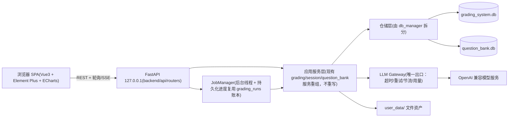

# 前后端现代化与功能演进总体方案（Master Plan）

> **文档性质：** 总体路线方案，不是单次可执行的 task 清单。供 Opus 等执行模型使用：每个"工作包（WP）"在实施前，应先在 `docs/superpowers/plans/` 下产出一份独立的 task-by-task 实现计划（沿用本仓库既有格式），再动手写代码。
> **编制日期：** 2026-07-03。**依据：** 对当前工作区的直接代码调查（文中所有 `文件:行号` 均已核实）+ `ARCHITECTURE.md`（2026-06-29 核验版）。
> **优先级（用户指定）：** ① 更换前端架构并美化界面；② 后端精细化性能优化、冗余清理、必要时调整架构；③ 功能迭代（知识图谱、个性化训练、教师命题训练、班主任学生画像）。①②优先。
> **关键依赖顺序说明：** "更换前端"在工程上必须先有一个可供新前端调用的后端 API 层。因此实际执行顺序是：目标②的前半（API 层抽取）→ 目标①（新前端）→ 目标②的后半（深度重构与瘦身）→ 目标③。

---

## 0. 现状核查摘要（全部为已核实事实）

### 0.1 技术形态

- 单用户、本机 Windows、便携 Python 3.12 运行时，`运行.bat -> streamlit run web_app.py`，绑定 `127.0.0.1:8501`。
- UI/业务/数据访问同进程：Streamlit 1.58.0 + 两个 SQLite（阅卷库 12 表、题库库 26 表，均 WAL）+ `user_data/` 文件树。
- AI 调用走 OpenAI 兼容接口（OpenAI SDK 2.43.0），配置存于 `%LOCALAPPDATA%/AIGradingSystem/config/api_profiles.json`。
- 测试资产雄厚：`tests/` 全量 659 项通过（2026-06-29 记录），含 UI 契约、迁移、回归测试——这是本次改造最重要的安全网。

### 0.2 规模与耦合（量化）

| 指标 | 数值 | 证据 |
|---|---|---|
| `web_app.py` | 9,625 行（其中 ~930 行为内联 CSS，`_DESIGN_CSS` 于 711–1641） | 行数统计 |
| `session_manager.py` / `db_manager.py` | 4,435 / 3,177 行 | 行数统计 |
| pages/ 五页面 | 题库管理 2,814、组卷 1,802、训练推荐 877、系统自检 447、知识点整理（高级）353 行 | 行数统计 |
| `st.session_state` 引用 | 全仓 568 处（web_app.py 360、题库管理 88、组卷 70） | grep 计数 |
| `st.rerun()` | 127 处 | grep 计数 |
| `unsafe_allow_html=True`（手写 HTML 注入） | 70 处 | grep 计数 |
| UI 直连数据库 | `main()` 直接持有 `DBManager`（web_app.py:9547）；pages 3 个文件 6 处直接构建 DB 连接 | grep 计数 |
| 数据层反向依赖服务层 | `db_manager.py:13-16` 导入 `ai_grader.GradingResult` 与 `scanner.ExamPaperGroup` | 已读源码 |

### 0.3 已核实的关键问题清单

1. **长任务阻塞 UI 会话**：`_run_with_stage_progress()`（web_app.py:637-708）在 `ThreadPoolExecutor(1)` 里跑任务，主线程以 0.35s 轮询刷新进度——浏览器刷新即丢进度视图，任务不可恢复展示。
2. **两处 LLM 请求无超时**：`hybrid_batch_grading_service.py:523`（`timeout: None`）、`objective_batch_recognition_service.py:582`（`timeout=None`）。
3. **4 处绕过统一 LLM 客户端直连 OpenAI**：`choice_recognition_chain.py:253`、`fill_blank_recognition_chain.py:193`、`objective_batch_recognition_service.py:579`、`question_bank/services/ai_tagging_service.py:385-387`（各自维护超时/重试）。
4. **每次操作新开 SQLite 连接并重设 3 条 PRAGMA**：`db_manager.py:46-52`、`question_bank/database/schema.py:9-24`；无请求级/线程级复用。
5. **Schema 双源漂移**：运行时 DDL（`DBManager.initialize()` + `initialize_database()`）是事实来源；`migrations/` 仅题库 8 个、阅卷库 1 个文件；两库无 `schema_migrations` 表。用户已确认（2026-06-28）以迁移文件为权威，尚未收敛。
6. **三代答题区编辑器并存**：`_render_region_editor_legacy`（web_app.py:7492）、`_render_region_editor`（8128）、`_render_region_editor_v3`（8439）均依赖 `streamlit-drawable-canvas`；另有一套原生 JS 编辑器 `components/answer_region_editor/`（editor.html/js/css + 单测）供聚焦页使用。
7. **死代码与杂物**：`web_app.py:19` 导入 `render_objective_admission_wizard_tab` 但全文件无调用（向导已被用户确认停用）；`run_objective_admission_wizard.py` 引用 5 个不存在的脚本；根目录留有 `debug_test.db`、`test_math.png`、`merge_staging_known_hosts.tmp`、`第十五周学情反馈.pdf`、`task.md`（已全部勾完）、`scratch/`、`analysis_outputs/`。
8. **依赖声明与实际不符**：`requirements.txt` 声明 `google-generativeai>=0.7.2`，全仓库无任何导入（grep 零命中）→ 可删；`pyinstaller` 属构建期依赖混在运行期清单里。
9. **旧语义体系整套保留**：题库库 11 张旧知识/技能表 + `training_sets/training_set_items` + `pages/知识点整理（高级）.py`（即旧技能目录 UI）+ `practice_plan_service.py` 的 legacy/skill 双分支 + `DiagnosisProfileService.build_legacy_profiles()/build_skill_profiles()`（integration/diagnosis_profile_service.py:46-60）。按 ARCHITECTURE.md 约定"保留一个版本后评估删除"。
10. **旧入口链**：`main.py`（旧 CLI）+ 专属表 `exam_results/grading_details` + `DBManager` Legacy API（db_manager.py:419 起）。
11. **知识图谱是 HTML/CSS 树，不是图**：`_render_knowledge_graph_from_rows()`（web_app.py:4237-4303）拼接 `kg-tree` 类名的 HTML 字符串，点击经 query 参数跳详情；无真正的图布局/交互/层级关系。
12. **P0 安全事实（ARCHITECTURE.md 已记录、用户已知悉）**：Git 仍跟踪含学生数据的 `user_data/`（用户确认保留）；数据包导入非事务且备份失败不阻塞。

### 0.4 在途工作（必须先落地或显式合并）

`docs/superpowers/plans/2026-07-01-unified-question-ids-resumable-grading-tag-retry.md` 正在实施（当前工作区 `answer_key_utils.py`、`grading_service.py`、`web_app.py`、`ARCHITECTURE.md` 的未提交修改属于它）。它将新增：题号契约模块、**批改运行账本 `grading_runs/grading_run_items`（migrations/grading/002）、安全暂停/恢复**、参考图降载、打标批次重试。

**衔接规则：** 本方案 Phase 1 的任务系统（WP1.3）**必须复用该账本作为批改类任务的持久化进度来源**，不得另建一套；Phase 0 开始前先完成/冻结该计划并提交，避免两条线同时改 `grading_service.py`。

---

## 1. 需要用户确认的决策点

执行前请逐项确认（推荐项已给出）。确认结果应回填到本节。

**确认记录（2026-07-03，用户回复）：**

- **D1 = 已确认，推荐方案 A**：Vue 3 + TypeScript + Vite + Element Plus + Pinia + ECharts。
- **D4 = 已确认**：旧语义体系保留一个版本后删除（v1.6 只读保留，v1.7 独立变更中执行 WP3.6）。
- **D6 = 已确认，直接实施**：用户告知学校已支持该功能。本方案的技术红线（独立 student_affairs.db、默认排除出数据包导出/便携包、AI 输出标注"仅供参考"、按学生一键删除）**不因此取消**，作为工程默认执行。
- D2/D3/D5/D7：用户未提出异议，按推荐项执行；后续可随时调整。
- **D8（新增，见下表）**：视觉基调分歧，默认按推荐 A 执行，用户可改。

**设计规范与参考资产（2026-07-03 用户提供，已入库 `docs/ui/`）：** `docs/ui/STYLE.md` 为前端权威设计规范；当前 AI 协作入口为根目录 `AGENTS.md`（`CLAUDE.md` 仅保留兼容指针）；7 张 AI 生成概念图位于 `docs/ui/references/mockups/`（**仅视觉参考，不是功能需求清单**，边界见 `AGENTS.md` 与 `docs/ui/STYLE.md`）。

| 编号 | 决策 | 选项与推荐 | 影响 |
|---|---|---|---|
| **D1** | 新前端技术栈 | **推荐 A：Vue 3 + TypeScript + Vite + Element Plus + Pinia + ECharts**。备选 B：React 18 + Ant Design 5。不推荐 C：留在 Streamlit 做主题化（无法根治 rerun 全脚本重跑、长任务阻塞、568 处 session_state 的结构性问题） | A/B 工作量相当；Element Plus 中文文档成熟、适合表格/表单密集的教务风格界面；ECharts 原生支持力导向图谱与热力图 |
| **D2** | 后端 API 框架 | **推荐 FastAPI + Uvicorn（单进程，绑定 127.0.0.1）**，同进程托管前端静态文件与后台任务线程 | 与现有同步/线程模型兼容（FastAPI 同步端点自动跑在线程池）；便携运行时只需 `pip install fastapi uvicorn` 进 `runtime/python` |
| **D3** | Node 构建链 | **推荐：工作机不装 Node**。前端在开发机构建，`frontend/dist/` 随包分发；仓库同时保留前端源码 | 便携性不受影响；发布脚本 `package_v1.5.0.py` 需加入 dist 目录 |
| **D4** | 旧语义体系（11 张技能表+相关服务/页面）删除时点 | **推荐：v1.6 全程只读保留，v1.7 起在独立变更中删除**（与 ARCHITECTURE.md"保留一个版本"约定一致） | 删除前需确认 `user_data` 中无仍想回看的旧数据 |
| **D5** | 答题区编辑器收敛 | **推荐：以 `components/answer_region_editor/` 原生 JS 核心为唯一实现**，包装成 Vue 组件；退役 st_canvas 三套与 `streamlit-drawable-canvas` 依赖 | 该 JS 核心已有独立单测（editor_core.test.mjs），是全仓最"可迁移"的 UI 资产 |
| **D6** | 学生画像功能的数据边界 | **推荐：独立 `student_affairs.db`；默认排除出数据包导出与便携包（备份包含）；AI 输出定位为"仅供参考的沟通建议"；提供一键删除** | 涉未成年人敏感个人信息（事件、家庭情况、人格推断），建议启用前与学校确认合规口径 |
| **D7** | 打包形态 | **推荐：维持"源码 + 便携运行时"目录式发布**，不启用 PyInstaller（`run_desktop.py` 与 `pyinstaller` 依赖仅在确认无用后归入删除清单） | 保持现有更新工具链不变 |
| **D8** | 主强调色与视觉基调 | **推荐 A：布局、密度、组件与状态规范全部按 `docs/ui/STYLE.md`；主强调色（accent）采用参考图的明亮蓝（≈#2563EB–#3B82F6 区间取一档），中性色/语义色（AI 紫、教师绿、风险色）按 STYLE.md 9.1 节**。备选 B：完全按 STYLE.md 的低饱和蓝灰 #365f7d | 参考图与 STYLE.md 布局理念一致、仅 accent 色调分歧；旧 shared_styles.py 的 #4F46E5 靛紫**废弃不用**（STYLE.md 反面清单禁蓝紫基调）。默认按 A 执行 |

---

## 2. 目标架构

### 2.1 结构图



### 2.2 目标目录结构（增量演进，不是一次性搬家）

```text
├── backend/
│   ├── api/
│   │   ├── app.py                 # FastAPI 实例、静态托管、异常处理、请求日志
│   │   ├── routers/               # sessions/ config/ templates/ regions/ scan/
│   │   │                          # grading/ review/ reports/ students/
│   │   │                          # question_bank/ training/ graph/ jobs/ ops
│   │   └── schemas/               # Pydantic 请求/响应模型（前后端契约）
│   ├── jobs/                      # JobManager、进度事件、取消协议
│   ├── llm/                       # LLM Gateway（llm_client.py 演进）
│   ├── domain_models.py           # GradingResult 等共享数据类（自 ai_grader/scanner 下沉）
│   └── repositories/              # 由 db_manager.py / schema.py 拆出的按聚合仓储
├── frontend/
│   ├── src/{views,components,api,stores,styles}/
│   └── dist/                      # 构建产物，随发布包分发
├── （过渡期保留）web_app.py + pages/   # 逐页退役，Phase 2 末删除
└── 其余现有模块原位保留，逐步归位
```

**演进原则：** 现有服务文件（grading_service.py、session_manager.py、question_bank/ 等）在 Phase 1 不迁移、不重写，只被 API 层调用；物理归位放到 Phase 3，避免"大爆炸式"重构。

### 2.3 任务系统（JobManager）设计要点

- 任务类型：`grading_run`（复用在途计划的 grading_runs 账本）、`config_generation`、`scan_analysis`、`tagging_sync`、`report_export`、`training_export`。
- 通用 `jobs` 表（阅卷库，新迁移文件）：`id, job_type, payload_json, status(queued/running/paused/succeeded/failed/cancelled), progress, stage, detail, error, created_at, started_at, finished_at`。批改类任务的明细进度仍以 grading_runs 为准，jobs 行仅作统一索引。
- 执行：进程内 `ThreadPoolExecutor`（沿用现有各服务的线程池与 `RequestPacer`，不改并发语义）；服务现有的 `report(progress, stage, detail)` 回调协议（web_app.py:647-648 已定义）直接对接 job 进度写入。
- API：`POST /api/jobs/{type}`、`GET /api/jobs/{id}`（轮询）、`POST /api/jobs/{id}/cancel`；SSE 可选后加。
- 恢复语义沿用现状：进程重启不续跑，启动时把 `running` 任务标 `failed`（与 grading_service 现有恢复逻辑一致）。

### 2.4 LLM Gateway 设计要点

- `LLMClient`（llm_client.py:27）已具备：视觉/文本 JSON 输出、参数兼容回退、JSON 修复、图片压缩（:425）。在此基础上收编 4 处直连（0.3 节第 3 条），统一：
  - **超时预算**：每类请求显式超时（批改 300s、识别 60s、打标 120s——数值以现有配置为初值，可进 api_profiles）；禁止 `timeout=None`。
  - **重试**：统一有界退避重试装饰器，替换各文件自写循环；可重试条件集中定义。
  - **观测**：请求 ID、耗时、token 用量统一走 `usage_logger.py`。
- `api_profiles.py`（ApiProfileStore，:143）保持配置存储职责不变，新增功能只加 profile 字段、不动存储协议。

---

## 3. 分阶段路线图

> 每阶段末尾的"验收"是该阶段合并回主线的硬门槛。工作量为相对量级（S<1 天级，M=数天级，L=一周级以上，均指专注执行时间）。

### Phase 0 — 地基与防护网（前置，量级 M）

| WP | 内容 | 关键文件 | 量级 |
|---|---|---|---|
| WP0.1 | 完成并提交在途计划（2026-07-01），冻结 `grading_service.py`/`web_app.py` 的并行改动 | 见该计划 | — |
| WP0.2 | 仓库卫生：删除/移出 `debug_test.db`、`test_math.png`、`merge_staging_known_hosts.tmp`、`第十五周学情反馈.pdf`；归档 `task.md`（已全部完成）、`scratch/`、`analysis_outputs/`；`.gitignore` 补齐同类产物 | 根目录 | S |
| WP0.3 | 依赖锁定：从便携运行时导出 `constraints.txt`（pip freeze）；`requirements.txt` 拆分运行/构建两份；删除无使用证据的 `google-generativeai`（grep 零命中，删除前跑全量测试复核） | requirements.txt | S |
| WP0.4 | Schema 基线：为两库各生成一份"与当前运行时 DDL 等价"的基线迁移 + 建 `schema_migrations` 表并打标；写迁移预演脚本（复制库→迁移→PRAGMA integrity_check→比对 schema） | migrations/、update_tools/migrate_db.py | M |
| WP0.5 | 冒烟脚本：一条命令跑"全量 pytest + 静态编译 + 两库副本初始化幂等检查"，作为后续每个 WP 的回归入口 | tools/ | S |

**验收：** 全量测试保持通过；两库真实文件经迁移预演无差异；仓库根目录无杂物。
**回退：** 全部为可逆提交；基线迁移不改现有数据。

### Phase 1 — 后端 API 层与任务系统（目标②前半，量级 L）

| WP | 内容 | 依据/关键点 | 量级 |
|---|---|---|---|
| WP1.1 | FastAPI 骨架：`backend/api/app.py`、统一错误体、请求日志、`/healthz`；`运行.bat` 增加双入口（8501 Streamlit + 8000 API 并行） | D2；绑定 127.0.0.1 | S |
| WP1.2 | 领域路由分批落地（资源草案见附录 A）。顺序：sessions → students → config 生成 → templates/regions → scan → grading → review → reports → question-bank → training → graph → ops。每个路由 = 薄壳，直接调用现有服务/DBManager 方法，Pydantic schema 定契约 | UI 现调用点即 API 形状来源（如 render_config_and_session_tab web_app.py:2313 起） | L |
| WP1.3 | JobManager（2.3 节设计）；将 `_run_with_stage_progress` 覆盖的五类长任务全部任务化 | 复用 grading_runs 账本与暂停语义 | M |
| WP1.4 | LLM Gateway 收编（2.4 节）：改 4 处直连、消灭 2 处 `timeout=None`、统一重试与用量记录 | choice:253、fill_blank:193、objective:579/582、ai_tagging:385、hybrid:523 | M |
| WP1.5 | 数据访问最小优化（不动 schema）：`DBManager` 与题库 `connect()` 增加"外部传入连接"形态，API 请求内复用单连接；只读端点用 `mode=ro` URI；为每个端点记录耗时日志（后续 Phase 3 性能专项的基线数据） | db_manager.py:46、schema.py:9 | M |
| WP1.6 | 契约测试：每个路由配 API 级测试（复用现有服务层测试的构造器）；核心五流程（建会话→配置→模板/区域→批改→导出）一条 API e2e | tests/ | M |

**验收：** Streamlit 与 API 双通道同时可用且共享同一数据；API e2e 通过；无超时缺失的模型请求（grep `timeout=None` 零命中）。
**回退：** API 层是纯增量，删除 backend/ 即回到现状。

### Phase 2 — 新前端 SPA（目标①，量级 XL，分两批交付）

**设计依据（2026-07-03 修订）：** 前端视觉与交互的权威规范是 `docs/ui/STYLE.md`（App Shell 三栏结构、设计 Token、组件规范、状态体系、反面清单、视觉验收）；执行约束见 `AGENTS.md`；色彩按决策 D8。旧 `pages_shared/shared_styles.py` 的 #4F46E5 色板**废弃**，不再作为 tokens 来源。

**信息架构：** 按 STYLE.md 第 5 节的 7 项一级导航重组（替代现在"5 个 st.tabs + 5 个 pages 页面"两套并存的导航），与现有功能映射如下。**"工作台"聚合页只聚合既有数据（进行中批改、待复核、失败/异常、最近考试），不新增业务口径。**

| 新一级导航 | 承接的现有功能（来源行号见 WP2.2 表） |
|---|---|
| 工作台 | 新增聚合页：今日待办、进行中批改、待复核、异常卷、最近考试 |
| 阅卷 | 批改进度、单题阅卷与人工复核（样板页）、评分审阅、失败重试 |
| 考试 | 考试工作台：会话管理、评分依据生成/编辑、样卷模板、答题区校准 |
| 学生 | 学生名单导入与管理；Phase 6 学生画像挂此导航下 |
| 分析 | 跨考试知识图谱、班级/题目/学生分析、报告导出 |
| 题库与训练 | 题库管理、组卷、训练推荐（Phase 4 扩展个性化闭环） |
| 智能体与自动化 | **预留导航位，本期不实现**（STYLE.md 第 8 节仅作为未来约束） |
| 侧栏底部：设置 | 系统自检、数据导入导出、API 配置档管理 |

**参考图对应关系（`docs/ui/references/mockups/`，仅视觉参考）：**

| 概念图 | 内容 | 用法与边界 |
|---|---|---|
| mockup-07-single-question-grading.png | 单题阅卷三栏（队列/答卷/评分） | **样板页直接参照**，与 STYLE.md 第 7 节布局、快捷键完全一致 |
| mockup-01-dashboard-workbench.png | 工作台总览 | "工作台"聚合页布局参考；图中"智能体建议/消息中心"不实现 |
| mockup-02-exam-management-list.png | 考试列表 + 右栏概况 | "考试"导航列表页参考；图中"多学科/发布成绩"等不实现 |
| mockup-03-question-bank.png | 题库筛选 + 右侧试题篮 | 题库管理与组卷页参考；图中"章节树/教材版本"待题库有对应字段才做 |
| mockup-05-class-report.png | 班级学情报告 | 报告页可视化升级参考；"AI 报告摘要/家长版简报"不在本期范围 |
| mockup-06-student-list-profile.png | 学生列表 + 个人面板 | "学生"导航参考；右侧个人面板是 **Phase 6 画像**的布局预研 |
| mockup-04-teaching-plan-review.png | 教学计划与讲评 | **超出当前范围**；仅"共性薄弱知识点"表格样式可借鉴到分析页 |

**响应式与验收视口：** 按 STYLE.md 第 14/19 节——1440×900、1280×800、1024×768、768×1024、390×844（<768px 仅要求查看任务/进度/报告/学生信息）；桌面主流程页面另检 1920×1080 与 1366×768，全部无横向溢出。

**WP2.1 前端工程与设计系统（M）**：Vite 工程；以 STYLE.md 第 9 节 token 表（经 D8 调整 accent）生成 CSS Variables 并定制 Element Plus 主题（圆角/阴影按 STYLE.md 9.4/9.5 收紧默认值）；Axios 封装（统一错误提示/job 轮询 hooks）；App Shell 三栏布局壳（顶部栏 56-64px + 左导航 232px 可收起 + 右侧检查器 320-400px，STYLE.md 第 6 节）——全局会话选择器进顶部栏（替代 `render_sidebar_session_selector` web_app.py:1668）；**UI 状态映射表**：把数据库现状态（`exam_papers.processing_status` 的 pending/grading/graded/failed/skipped、`match_status`、`needs_human_review`、`confidence_score`）映射到 STYLE.md 第 11 节的展示状态体系，落为前端常量 + 契约测试，**不改数据库枚举**（那是 WP3.4 的范围）。

**WP2.2 页面迁移（每页一个独立实现计划），推荐顺序与映射：**

> 顺序按 STYLE.md 第 18 节与 `AGENTS.md` 前端协作约束修订：**先做批次 0 样板页并通过验收，再扩散**。样板页承担范式职责：Token、App Shell、公共组件（队列列表/图片查看器/状态徽章/检查器）都在这一页立起来，后续页面只复用不再发明。

| 批次 | 新页面 | 迁移来源（行号为当前实测） | 要点 |
|---|---|---|---|
| 1 | 考试工作台（会话+配置+模板+答题区） | web_app.py:2313-3052（配置与会话）、6024-7141（rubric 编辑器族）、7341-8763（模板/区域） | 最大单页；rubric 统一表格编辑（5652-6024）改为前端可编辑表格组件 |
| 1 | 批改进度 | web_app.py:3144-3481 + JobManager | 进度页刷新不丢状态；暂停/恢复按钮对接在途计划的账本 |
| 1 | 答题区编辑器组件 | components/answer_region_editor/（原生 JS 核心） | D5：包装为 Vue 组件；退役 st_canvas 三套（7492/8128/8439） |
| **0（样板页）** | 单题阅卷与人工复核（评分审阅域） | web_app.py:3700-4060（逐题审阅 3704、裁剪网格 3918、调分逻辑） | 布局与快捷键按 STYLE.md 第 7 节 + mockup-07；三栏=学生队列/答卷证据/教师评分；教师最终分必须比 AI 初评醒目；裁剪图预览走新增图片端点；**通过视觉+业务验收前不得开始其他页面** |
| 2 | 评分审阅（批量视角补全） | web_app.py:3700-4060 剩余功能 | 样板页未覆盖的逐题网格/批量筛选视图 |
| 2 | 报告导出 | web_app.py:4879-5242 | 导出任务化 + 下载；保留现有导出缓存键逻辑（5147-5188） |
| 2 | 全局资料：学生名单 | web_app.py:1873-1992（StudentManager 导入流程） | 上传解析 → API |
| 2 | 全局资料：知识图谱 | web_app.py:4060-4877（现 HTML 树 4237-4303） | **升级为 ECharts 力导向/树图 + 掌握度着色 + 点击下钻**（替代 query 参数跳页 4565-4642） |
| 3 | 题库管理 | pages/题库管理.py（2,814 行） | 导入向导、批量打标（进度任务化）、筛选表格虚拟滚动 |
| 3 | 组卷 | pages/组卷.py（1,802 行） | 试题篮沿用 assembly_basket_state 的持久化语义 |
| 3 | 训练推荐 | pages/训练推荐.py（877 行） | 诊断热力图改 ECharts |
| 3 | 系统自检 | pages/系统自检.py（447 行） | 只读状态页，最简单，可作为练手首页 |
| — | 知识点整理（高级） | pages/知识点整理（高级）.py（353 行，旧技能目录 UI） | **不迁移**，随 D4 退役 |

**WP2.3 切换与退役（M）：** 每页完成后按"功能对照清单"逐项勾验（以现有 UI 行为为准）→ 全部页面通过后：`运行.bat` 切换为单入口（FastAPI 托管 dist）→ 删除 `web_app.py` UI 部分、pages/、pages_shared/、streamlit 与 streamlit-drawable-canvas 依赖。web_app.py 中的非 UI 逻辑（文件工具 7167-7460、快照写入 7250-7314 等）此前已在批次 1-2 中下沉到服务层。

**验收（硬门槛）：** ① 样板页先过 STYLE.md 第 19 节视觉验收（含阅卷专项检查：答卷清楚、缩放顺畅、教师最终分持续可见、快捷键有效、失败保留输入）；② 用一次**真实考试数据**在新 UI 走完"建会话→生成配置→确认模板与答题区→批改→复核调分→导出报告"全流程；③ 视口检查按修订后的清单（1440×900/1280×800/1024×768/768×1024/390×844 + 桌面 1920×1080/1366×768）；④ 批改中刷新页面进度不丢。
**回退：** 双入口期间任意时刻可退回 Streamlit；切换 `运行.bat` 是最后一步且可单文件还原。

### Phase 3 — 后端深度重构与瘦身（目标②后半，量级 L）

| WP | 内容 | 依据 |
|---|---|---|
| WP3.1 | 解除反向依赖：`GradingResult/QuestionGradingDetail/ExamPaperGroup` 下沉到 `backend/domain_models.py`；`db_manager.py:13-16` 改引新位置（旧位置留别名一个版本） | 0.3-第2条 |
| WP3.2 | `db_manager.py` 按聚合拆仓储：students / sessions / papers+results+details / templates+regions / settings；Legacy API（:419 起）标记废弃 | 0.3-第10条 |
| WP3.3 | `session_manager.py` 拆分为五模块：docx/pdf 解析（:59-180）、提示词构建（:196-216、1968-2069）、生成编排与重试（:239-551、984-1108）、本地题块解析（:1109-1620）、质量告警（:1746-1875）。行号为当前函数骨架实测 | 骨架 grep |
| WP3.4 | Schema 收敛：运行时 DDL 缩减为"版本检查 + 拒绝启动提示"；新变更只走 migrations；状态列补 CHECK 约束（先 `SELECT DISTINCT` 统计现值再定枚举：grading_sessions.status、exam_papers.processing_status/match_status、answer_regions.mapping_status） | 0.3-第5条 |
| WP3.5 | 冗余字段治理（详见第 5 节清单）：`session_details.knowledge_id` 与 `knowledge_ids` 归一为后者（迁移回填+读方切换）；`grading_sessions.question_bank_sync_*` 四列评估迁入独立工作流状态表；`session_results.raw_json` **保留**（审计用途，明确记录不删原因） | schema 阅读 |
| WP3.6 | 死代码删除（D4 时点执行，独立可回退变更，分三批）：批1 向导组（objective_admission_wizard_ui.py、run_objective_admission_wizard.py、web_app.py:19 导入——**注意 `objective_crop_calibration.py` 被 choice_recognition_chain.py:31 使用，保留**）；批2 旧入口组（main.py、exam_results/grading_details 表及 Legacy API）；批3 旧语义组（11 张技能/知识表、skill 系服务、practice_plan_service legacy 分支、DiagnosisProfileService.build_legacy_profiles/build_skill_profiles、pages/知识点整理（高级）.py、training_sets 两表、migrations 006-008 的对应回退工具） | 0.3-第7/9/10条 |
| WP3.7 | 性能专项（用 WP1.5 的端点耗时日志定位后再改，避免臆测优化）：候选项见第 4 节 | — |

**验收：** 全量测试通过；`ARCHITECTURE.md` 同步更新；两库迁移预演通过；删除批次各自可独立 revert。

### Phase 4 — 知识图谱 2.0 与个性化训练闭环（目标③a/b，量级 L）

现状根基（已核实）：活动语义 = `question_tags.knowledge_point` 精确标签；`QuestionTagProjectionService` 实时投影确认链接；`DiagnosisProfileService.build_tag_profiles()`（integration/diagnosis_profile_service.py:62）按标签聚合掌握率；训练任务 schema 已含 `stage IN ('direct','prerequisite','transfer')`（schema.py:378-379）与回流表 `training_attempts`（:407-419）；旧 `knowledge_relations` 表已有 `prerequisite/related/parent` 关系模型可借鉴（:274-287）。

1. **WP4.1 标签关系层**：新表 `tag_relations(source_key, target_key, relation_type CHECK(prerequisite/parent/related), source CHECK(ai_suggested/teacher_confirmed), weight)`——挂在 knowledge_point 标签键上（不是旧 concept id）。AI 批量建议 + 教师确认双态；只有 confirmed 参与图谱与推荐。
2. **WP4.2 图谱可视化 2.0**（依赖 Phase 2 的 ECharts 图组件）：层级/先修边、班级与单生两种视图、掌握度热力着色、按考试范围过滤、点击节点下钻到证据（复用 `tag_evidence()` :247）。
3. **WP4.3 掌握度模型 v2**：现按得分率加权；升级为"得分率 + 时间衰减 + 样本量置信度"三因子，实现为纯函数模块 + 单测，向后兼容旧口径（开关切换）。
4. **WP4.4 个性化训练闭环**：`prerequisite` 阶段选题从 tag_relations 的先修边取候选（当前 direct/transfer 已可用）；训练结果回流——训练卷批改后写 `training_attempts`（表已存在但当前无写入方，grep 确认）→ 掌握度更新 → 图谱/下一次推荐生效。这是"按学生个性化匹配薄弱点"的完整闭环。

### Phase 5 — 教师命题训练（目标③c，量级 M）

定位：教师依据知识点/图谱命题，系统对照题库给出评审。可复用资产（已核实）：`question_fingerprints`（去重/相似）、`ai_tagging_service`（受控打标）、`question_previews`/富文本侧车渲染、组卷导出器（exporters/base_exporter 体系）、`api_profiles` 可加独立"命题评审"配置档。

1. 新表 `authored_questions`（draft 状态机：draft→ai_reviewed→finalized→published_to_bank），入库后即普通 `questions` 行（`source='teacher_authored'`）。
2. AI 评审维度：知识点覆盖是否命中目标标签、与题库相似题 Top-N（指纹 + 标签召回）、难度/典型性估计、表述问题清单。
3. UI：命题工作台（左编辑右评审）+ 训练记录（教师练习历史与改进曲线）。

### Phase 6 — 班主任学生画像（目标③d，量级 L，敏感功能）

**红线先行（对应 D6）：** 独立 `student_affairs.db`；默认排除出数据包导出/便携包（本地备份包含）；所有 AI 生成内容界面标注"AI 生成，仅供参考"；提供按学生一键删除；日志不落敏感正文；启用前与学校确认合规口径（涉未成年人敏感个人信息与家长信息的 AI 处理）。

1. **数据模型**：`student_events(id, student_code, event_date, category CHECK(学业/行为/家校/健康/其他), content, created_by, created_at)`；`student_profile_notes`（AI 生成的画像摘要，带 `generated_at/model_name/based_on_events_hash`，可整体重算）；`communication_advice`（针对某事件/某画像的建议记录，含教师采纳反馈字段）。
2. **成绩画像**：复用 `build_tag_profiles()` 的按学生聚合 + 历次考试趋势（session_results 按 student_id 时间序列）——不需要新增成绩数据。
3. **AI 环节**：新增独立 api_profile 配置档"学生画像"；输入 = 成绩画像结构化摘要 + 教师录入事件；输出 = 结构化 JSON（性格特征假设、家长沟通要点、在校教育建议、风险提示），走 LLM Gateway 统一出口。**prompt 中明确要求输出为假设性、非诊断性表述。**
4. **UI**：班主任工作台——学生列表 → 个人页（成绩趋势 + 知识点雷达 + 事件时间线 + 建议卡片 + 生成/重算按钮）。

---

## 4. 性能优化清单（按预期收益排序）

> 标注【事实】= 已核实的代码行为；【假设】= 合理推断，**动手前必须用 WP1.5 的耗时日志验证**，避免臆测优化。

| # | 问题 | 证据 | 方案 | 落点 |
|---|---|---|---|---|
| 1 | 交互卡顿的结构性根源：Streamlit 每次交互重跑整个 9,625 行脚本（重建 DBManager、重查会话列表、重算侧边栏）【事实：框架行为 + main() 顶层逻辑 web_app.py:9545-9622】 | 框架模型 | SPA 迁移根治（Phase 2）；过渡期不投入局部缓存优化 | Phase 2 |
| 2 | 长任务占住 UI 会话线程，0.35s 轮询期间页面完全阻塞，刷新丢进度【事实：web_app.py:637-708】 | 同左 | JobManager 后台化 + 前端轮询 | WP1.3 |
| 3 | 无超时模型请求可无限挂起批改线程【事实：hybrid:523、objective:582】 | 同左 | 统一超时预算 | WP1.4 |
| 4 | 每次 DB 操作新开连接 + 3 条 PRAGMA；一次页面渲染触发数十次【事实：db_manager.py:46-52；假设：单机 SQLite 下单次开销小、但在循环/列表页会放大】 | 同左 | 请求级连接复用；只读走 `mode=ro`；**先测量再深化** | WP1.5 |
| 5 | 复核/报告页逐行生成答题区裁剪预览图（PIL 实时裁剪）【事实：_build_answer_region_crop_preview web_app.py:5533、3918 网格调用；假设：大会话下是主要等待点】 | 同左 | 派生图磁盘缓存（键：paper+region+增强版本），批改完成时预生成 | WP3.7 |
| 6 | 标签投影每次全量实时查询题库（设计使然，教师改标签即时生效）【事实：ARCHITECTURE.md 接口表"无标签缓存"】 | 同左 | 保留语义，加**请求内** memo（同一次图谱/推荐请求不重复查同一题） | WP3.7 |
| 7 | 图片为每次请求重复压缩编码 base64【事实：llm_client.py:425 _compress_image_for_api 无缓存；在途计划已含"参考图降载缓存"】 | 同左 | 以在途计划的缓存为准，扩展到答卷图 | 在途+WP3.7 |
| 8 | 批量打标/批改的 RPM 节流为全局互斥锁排队【事实：request_pacer.py:24-31，行为正确】 | 同左 | 保持；仅把 RPM/并发参数暴露到统一配置 | WP1.4 |
| 9 | 报告导出无增量：改一个分数需整本重导【事实：导出缓存以 score_revision 为键 web_app.py:5156-5188，已有部分缓存】 | 同左 | 保留缓存机制并迁到服务层；暂不做增量导出（收益存疑） | WP2 批次2 |
| 10 | 题库列表/筛选页在大题量下的查询形状未知【假设】 | 待测 | WP1.5 日志 + 大数据集压测后决定（虚拟滚动已列入 WP2.2） | WP3.7 |

## 5. 冗余与删除清单

### 5.1 高置信（当前即无调用方/无使用证据，Phase 0-1 期间即可删）

| 对象 | 证据 |
|---|---|
| `requirements.txt` 的 `google-generativeai` | 全仓 grep 无导入 |
| `web_app.py:19` 对向导的 import | 全文件无调用点 |
| `run_objective_admission_wizard.py` | 引用 5 个不存在的脚本（ARCHITECTURE.md 已记录，用户已确认停用） |
| 根目录杂物：debug_test.db、test_math.png、merge_staging_known_hosts.tmp、第十五周学情反馈.pdf、task.md、scratch/、analysis_outputs/ | 目录清单 |

### 5.2 保留一个版本后删（D4 时点，WP3.6 三批执行）

- 旧语义组：`knowledge_concepts`、`knowledge_relations`、`knowledge_source_mappings`、`skill_topics`、`skills`、`assessment_item_skills`、`question_skill_links`、`skill_resolution_conflicts`、`skill_neighbors`、`skill_system_settings`、`skill_migration_runs`（11 表）+ skill 系服务与迁移工具 + `pages/知识点整理（高级）.py` + practice_plan_service 的 legacy/skill 分支（practice_plan_service.py:1027-1205 一带）+ `DiagnosisProfileService.build_legacy_profiles/build_skill_profiles`。
- 旧训练集：`training_sets`、`training_set_items`（schema.py:135-156）。
- 旧入口组：`main.py`、`exam_results`/`grading_details` 表、`DBManager` Legacy API（db_manager.py:418 起）。
- 编辑器组：st_canvas 三套实现 + `streamlit-drawable-canvas` 依赖（随 Phase 2 批次 1 退役，早于 D4）。
- 待确认后处理：`run_desktop.py` 与 `pyinstaller`（D7）、`subjective_only_grader.py`（需先 grep 确认调用方再定档）。

### 5.3 看似冗余但**不能删**（防误删清单）

| 对象 | 原因 |
|---|---|
| `objective_crop_calibration.py` | 被 choice_recognition_chain.py:31 活跃使用 |
| `image_preprocessor.py`、`equivalence_engine.py`、`export_names.py`、`student_manager.py`、`analytics.py` | 分别被 scanner/grading_service、session_manager、报表与页面、web_app.py:1879、web_app.py:9549 使用 |
| `session_results.raw_json` | 审计与兼容用途（ARCHITECTURE.md 技术决策表），保留并记录原因 |
| `rapidocr_onnxruntime` | scanner.py 本地姓名 OCR 使用 |

### 5.4 字段级归一（WP3.5）

- `session_details.knowledge_id`（TEXT NOT NULL，单值）与 `knowledge_ids`（JSON 列表）双存 → 迁移回填后统一读 `knowledge_ids`，`knowledge_id` 降级为生成列或删除（db_manager.py:237-253）。
- `grading_sessions.question_bank_sync_state/details_json/error/updated_at` 四列（db_manager.py:158-171）→ 评估迁入独立工作流状态表（保持会话表窄）；若迁移成本大于收益则保留并记录。
- 状态自由文本列补 CHECK（WP3.4，先统计现值）。

## 6. 风险与回退

| 风险 | 缓解 |
|---|---|
| 双入口期数据竞写（Streamlit 与新 UI 同时操作同一会话） | WAL + busy_timeout 已有；页面迁移期间约定"单页面单入口"，切完一页在旧 UI 该页挂"已迁移"提示 |
| 前端重写引入行为偏差（568 处状态逻辑隐含业务规则） | 每页迁移前先从旧代码提取"行为对照清单"写进该页实现计划；UI 契约测试保留到对应页退役 |
| Schema 收敛破坏旧库升级路径 | 基线迁移 + 预演脚本（WP0.4）；所有迁移幂等；升级前自动备份（现有机制） |
| 在途计划与本方案冲突 | Phase 0 先合并冻结；本方案不改题号契约与暂停语义 |
| 删除批次误伤 | 三批独立提交、各自可 revert；删除前全量测试 + 真实数据冒烟 |
| 学生画像合规 | D6 红线；功能开关默认关闭；上线前用户与学校确认 |
| 便携机无 Node | D3：dist 随包分发；CI/开发机构建 |

## 7. 验证策略（每个 WP 的实现计划必须含对应条目）

1. **回归底座**：WP0.5 冒烟脚本（全量 pytest + 编译 + 库初始化幂等）每 WP 必跑。
2. **API 契约**：每路由的请求/响应 schema 测试 + 核心五流程 e2e（WP1.6）。
3. **前端**：组件级测试从简；以"真实浏览器 + 真实考试数据全流程 + 三档分辨率"为硬验收（Phase 2 验收标准）；答题区编辑器沿用 editor_core.test.mjs 并扩展。
4. **迁移**：每个 schema 变更附预演（副本库跑迁移 + integrity_check + schema diff）。
5. **性能**：WP1.5 端点耗时日志为基线；WP3.7 每项优化提供前后对比数字，无数字不合并。
6. **删除**：删除类变更必须"grep 调用方清单为空 + 全量测试 + 真实数据冒烟"三证齐全。

## 附录 A：REST 资源草案（WP1.2 的起点，实施时按现有服务签名细化）

```text
/api/sessions                GET/POST/PATCH/DELETE     会话 CRUD、软删、状态
/api/sessions/{id}/config    GET/PUT + POST /generate  评分依据（生成走 job）
/api/sessions/{id}/template  GET/POST                  样卷上传与分析
/api/sessions/{id}/regions   GET/PUT + POST /commit    答题区草稿/提交（复用提交服务）
/api/sessions/{id}/scan      POST(job) + GET /analysis 扫描与预检
/api/sessions/{id}/grading   POST(job)/pause/resume    批改运行（对接 grading_runs）
/api/sessions/{id}/results   GET（+明细/调分 PATCH）    复核
/api/sessions/{id}/reports   POST(job) + GET /files    导出
/api/students                GET/POST/import           名单
/api/question-bank/...       papers/questions/tags/import(job)/tagging(job)
/api/training/...            diagnosis/plans/tasks/exports(job)
/api/graph                   GET profiles/evidence/rows（Phase 4 加 relations）
/api/jobs/{id}               GET/cancel                统一任务查询
/api/ops                     backup/restore/transfer/self-check
```

## 附录 B：假设与未验证事项（执行时逐条消解）

1. 端点级性能数字（第 4 节所有【假设】项）未实测——WP1.5 先建测量。
2. `subjective_only_grader.py`、`run_desktop.py`、`usage_report.py` 的实际使用情况未逐一确认调用链，删除前需补 grep 证据。
3. 大题量（数千题）下题库页查询形状未压测。
4. 真实模型供应商 SLA/参数兼容性以 `api_profiles.json` 实际配置为准（ARCHITECTURE.md 未确认事项，本方案未改变）。
5. 本方案行号基于 2026-07-03 工作区（含在途未提交修改）；在途计划合并后行号会漂移，各 WP 实现计划应重新定位。

## 附录 C：给执行模型（Opus）的固定约束

1. 遵守仓库 `AGENTS.md` 与 `docs/ui/STYLE.md`；每个 WP 先出实现计划再编码。
2. 不改的东西：评分规则与知识点口径、`question_tags.knowledge_point` 活动语义、两库分立格局、127.0.0.1 单用户边界、`PathManager` 作为唯一路径入口、答题区"数据库+快照补偿"提交协议。
3. 每次提交保持全量测试通过；结构性变化同步 `ARCHITECTURE.md`（按其"仅实质变化才更新"原则）。
4. 破坏性操作（删表、删文件、改 schema）前先备份/预演，且独立成可回退的提交。
