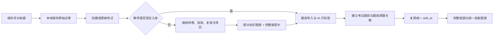

# 试卷入库、统一技能与知识图谱完整度设计

日期：2026-06-28

状态：方案已确认，待用户审阅书面规格

## 1. 背景与调查结论

当前系统已经具备统一技能目录、题库 AI 打标签、评分规则技能关联和训练推荐能力，但“试卷入题库”仍是评分依据保存阶段的一个临时复选框，没有成为考试批改生命周期中的可恢复步骤。

代码与当前数据库只读调查确认：

- `web_app.py` 已能调用 `copy_and_intake_uploaded_grading_paper()`，但入口只在刚生成评分依据时出现；
- 新建考试时执行题库同步，`selected_session_id` 仍为空，无法建立当前考试到题库原题的稳定关联；
- 创建考试后、批改中和批改结束后没有统一的补做入口，也没有持久化的同步状态；
- 当前跨考试知识图谱仍从批改数据库中的原始 `knowledge_id` / `knowledge_ids` 聚合；
- 训练推荐已通过 `DiagnosisProfileService` 和 `assessment_item_skills.skill_id` 使用统一技能身份；
- 当前题库有 240 道活跃题，238 道已有至少一个可用的 `measured` 技能；
- 当前共有 166 条开放冲突：163 条来自题库，3 条来自评分规则；
- 其中 153 条题库冲突和全部 3 条评分规则冲突所在来源已经有可用的 `measured` 技能；
- 真正完全没有可用技能的题库来源只有 2 道题，共包含 10 条原始标签冲突；
- 现有页面按“原始词条冲突行”计数，因此把非阻断的附属词条误呈现为上百个必办事项；
- 题库冲突来源同时存在 `question:<id>` 和纯数字 `<id>` 两种引用格式，后续重新打标签可能产生重复来源记录。

因此，本次问题包含两个层次：

1. 建立可在批改前、批改中或批改后补做的试卷入库与打标签闭环；
2. 把“整题没有可用技能”和“已有技能但某个附加词条未采用”分开，消除知识点整理页的虚假待办。

## 2. 已确认的产品决策

用户已确认：

1. 原始试卷在保存评分依据时自动保存在本机，但不自动入题库，也不自动调用 AI；
2. 入库与打标签是推荐步骤，不是批改、复核或导出的强制前置条件；
3. 用户可在批改前、批改中或批改结束后执行同一操作；
4. 未完成入库时，知识图谱继续展示已有可靠技能，但必须醒目标注“不完整”；
5. 知识图谱页面提供缺失原因和补做入口；
6. 入库完成后，知识图谱与题库通过统一 `skill_id` 对应，不重复提交 AI 做事后文本匹配；
7. 待处理问题按来源题目聚合，并区分必须处理、可选检查和历史记录；
8. 采用“完整闭环”方案，不采用只增加按钮的表面修补，也不采用自动强制入库。

## 3. 目标与非目标

### 3.1 目标

- 每场考试都能明确显示原卷是否已保存、是否已入库以及技能覆盖是否完整；
- 同一个入库动作可以安全重试，不重复创建试卷、题目或技能关联；
- 题库题、评分题和知识图谱使用同一套稳定具体技能身份；
- 知识图谱在部分数据可用时继续工作，同时准确说明缺失范围；
- 真正需要人工处理的数量按“缺少可用技能的来源题目”计算；
- 保留题库题与本次考试题目的来源关联，训练推荐可以排除原题；
- 不破坏已有评分结果、历史训练任务、原始标签或迁移证据。

### 3.2 非目标

- 不把题库入库改成强制步骤；
- 不要求教师逐个确认普通技能标签；
- 不重新建设可编辑知识图谱；
- 不删除现有开放冲突或历史标签；
- 不改变评分算法、人工复核规则、成绩计算和导出格式；
- 不把整道题的所有技能无条件复制给每个小问。

## 4. 方案比较

### 4.1 方案 A：只增加按钮和提醒

优点是修改范围小。缺点是没有持久状态、无法可靠后补、知识图谱仍读取原始知识点，上百条非阻断冲突也继续存在。该方案不能解决根因。

### 4.2 方案 B：完整闭环（采用）

保存原卷，持久化每场考试的入库状态，复用现有题库导入和统一技能服务，知识图谱切换到统一技能读取路径，并重新定义待处理口径。修改范围适中，可覆盖用户提出的前后补做和降级要求。

### 4.3 方案 C：保存评分依据后自动入库

操作最少，但会强制产生 AI 成本和等待时间，且与“非强制”要求冲突，不采用。

## 5. 总体架构

本次不新增顶层应用或外部依赖。新增一个面向考试生命周期的协调服务，复用现有领域服务：

- `grading_paper_intake_service`：保存并导入原始试卷、执行题库 AI 打标签；
- `SourceQuestionLinkService`：建立考试题目与题库原题关联；
- `SkillLinkService`：维护评分题和题库题的统一技能关联；
- `SkillCatalogService`：提供技能目录、冲突分级和覆盖统计；
- `DiagnosisProfileService`：按统一技能聚合学生诊断证据；
- `DBManager`：保存考试、原卷路径和流程状态。

建议新增 `GradingPaperSkillWorkflowService`。它属于业务协调层，负责：

1. 查询一场考试的原卷与入库完整度；
2. 执行幂等的入库、打标签、来源题关联和评分技能同步；
3. 根据实际数据库记录重新计算状态；
4. 返回页面可直接展示的中文状态、计数和错误摘要。

Streamlit 页面只调用该服务，不直接拼接跨数据库 SQL 或自行判断业务状态。



## 6. 原卷保存与考试绑定

### 6.1 保存时机

评分依据确认保存时，同时把用户上传的原始 `.docx` 或 `.pdf` 保存到受控的项目数据目录。该动作只进行本地文件保存和 SHA-256 计算，不调用题库导入或 AI。

保存路径必须通过 `PathManager` 生成，文件名必须经过现有安全归档逻辑处理，不能直接信任上传文件名。

### 6.2 尚未创建考试

评分依据保存后如果还没有考试 ID，则把以下待创建信息保存在现有持久配置状态中：

- 评分规则路径；
- 答案路径；
- 原始试卷路径；
- 原始试卷 SHA-256；
- 原始显示文件名。

创建考试时一次性把这些信息绑定到新考试，并清除待创建状态。不能依赖 Streamlit 的临时 `session_state` 作为唯一来源。

### 6.3 已存在考试

更新已有考试的评分依据时，新的原始试卷立即绑定到该考试。若文件指纹变化，则原有题库同步状态失效并回到 `未处理`；已有评分结果和旧题库数据不删除。

### 6.4 旧考试兼容

已有考试没有原卷路径时显示“未保存原始试卷”，允许用户补充上传。补充上传只保存文件；是否立即入库仍由用户决定。

## 7. 持久状态模型

每场考试需要保存原始试卷路径、文件指纹及题库同步状态。状态值为：

- `not_started`：原卷已保存，尚未入库；
- `running`：正在解析、打标签或建立关联；
- `ready`：所有纳入范围的来源题都有确认的题库关联，题库题和有效评分题均至少有一个可用 `measured` 技能；
- `partial`：已经产生可用结果，但仍有题目缺少来源关联或可用技能；
- `failed`：本次运行没有形成可用闭环，允许重试。

页面中文分别显示“未处理”“处理中”“已完成”“部分完成”“失败”。

状态记录还应包含：

- 最近运行时间；
- 导入题目数；
- 已打标签题目数；
- 已确认来源关联数；
- 缺少可用技能的题库题数；
- 缺少可用技能的评分题数；
- 最近错误摘要。

`ready` 不能仅由某次函数返回成功决定。每次页面读取和运行结束后，都应从题库题、`grading_question_links`、`question_skill_links` 和 `assessment_item_skills` 的实际记录重新计算。`running` 在程序异常退出后若没有活动任务，应显示为可重试的中断状态，不能永久锁死。

## 8. 入库与题目关联流程

### 8.1 执行顺序

1. 校验考试、原卷路径、文件指纹和评分规则文件；
2. 把状态更新为 `running`；
3. 使用现有原卷归档和题库导入流程处理文件；
4. 以文件指纹和现有导入结果复用同一题库试卷；
5. 只对未完整标注或明确要求重跑的题目执行 AI 打标签；
6. 保存 `question_skill_links`；
7. 建立考试题目到本次导入题库题目的来源关联；
8. 同步或复核 `assessment_item_skills`；
9. 从实际记录重新计算 `ready`、`partial` 或 `failed`；
10. 页面刷新并显示完整度。

### 8.2 确定性来源关联

本次导入已经知道目标题库试卷，因此不能再优先在全库做文本相似匹配。关联顺序为：

1. 评分规则中的显式 `bank_question_id`；
2. 本次导入试卷范围内唯一的规范化题号；
3. 本次导入试卷范围内唯一的规范化题干；
4. 仅在前三者失败时，在本次导入试卷范围内计算文本相似度并保存为建议关联。

建议关联不计入 `ready`，除非后续由确定性规则或人工确认。来源关联使用现有 `grading_question_links`，不另建重复关系表。

### 8.3 原题排除

训练推荐生成候选题时，继续使用 `grading_question_links` 中已确认的 `bank_question_id` 排除本次考试原题。若仍有未确认关联，页面明确提示原题排除可能不完整，不能静默声称已经全部排除。

## 9. 统一技能复用规则

统一技能目录仍是唯一跨系统知识身份。原始题库标签、`G7_XX`、`KP_*` 和自由文本只作为证据，不直接成为知识图谱节点身份。

### 9.1 题库题

题库 AI 打标签输出明确的 `measured_skills` 和 `supporting_skills`。只有已解析为稳定 `skill_id` 的 `measured` 关联才满足题库覆盖要求。

### 9.2 评分题与小问

`assessment_item_skills` 仍是学生诊断的直接身份来源：

- 整题与题库题一一对应且题库技能已经确认时，可以复用题库题的 `measured` 技能；
- 评分规则存在小问级知识点时，继续保留小问自己的具体技能；
- 小问标签优先使用编号、名称和别名进行确定性目录解析；
- 不把整道题的全部技能无条件复制到每个小问；
- 已有人工确认关联不能被低置信度自动结果覆盖；
- 无法确定的小问进入部分覆盖，不为生成图谱再次自动提交 AI。

题库打标签是主要 AI 识别过程。知识图谱只读取已经保存的 `skill_id`，不执行事后 AI 文本匹配。

## 10. 知识图谱读取与降级

### 10.1 读取路径

跨考试知识图谱改为复用 `DiagnosisProfileService` 的统一技能诊断结果，不再直接把 `DBManager.get_active_global_weak_points()` 返回的原始知识编号当作图谱身份。

聚合键使用 `skill_id`，显示名称使用技能目录中的中文 `skill_name` 和 `topic_name`。得分、扣分原因和题目详情仍来自批改数据库，二者通过 `session_id + source_question_id` 关联。

### 10.2 部分展示

对用户选中的考试范围计算：

- 有效评分题总数；
- 已有可用 `measured` 技能的评分题数；
- 缺少技能的评分题数；
- 原卷未入库、部分完成或失败的考试列表。

只要存在已确认技能，就继续展示这些技能的图谱。页面顶部显示例如：

```text
知识图谱完整度：16 / 18 道评分题
“0609”尚未完成题库入库与标签整理，当前图谱缺少 2 道题。
```

缺失提示使用黄色状态，不伪装成完整结果。完全没有可用技能时显示空状态、原因和补做入口，而不是空白图表。

### 10.3 多考试范围

全局图谱选择多场考试时，逐场显示状态摘要。页面不自动批量调用 AI；用户选择某一场考试后启动同一个入库流程。其他考试和现有图谱继续可用。

### 10.4 详情追溯

点击技能节点后，使用诊断结果保存的 `source_question_refs` 查回原考试、学生和评分题详情。不能再假设一个显示用技能名称等于原始 `knowledge_id`。

## 11. 待处理问题分级与计数

### 11.1 按来源题目聚合

知识点整理页不再把每条 `skill_resolution_conflicts` 直接当成一个待办。服务层先把来源引用规范化：

- 题库题统一解析为题目 ID，兼容现有 `<id>` 和 `question:<id>`；
- 评分题统一解析为 `grading_session_id + source_question_id`；
- 同一来源的多个原始冲突合并成一张题目卡片。

### 11.2 三类状态

#### 必须处理

来源题目没有任何状态为 `resolved`、角色为 `measured` 的技能关联。该来源会造成题库推荐或知识图谱缺失，并计入主待办数字。

#### 可选检查

来源题目已有至少一个可用 `measured` 技能，但仍有其他原始词条无法唯一解析。它不阻断完整状态，默认折叠显示，管理员可在需要提高多技能精度时处理。

#### 历史记录

来源题目或考试已经删除、归档或被新一轮结果替代。记录继续保留用于审计，但不进入当前覆盖率和待办数字。

### 11.3 覆盖率口径

题库和评分规则分别按唯一来源题目计算：

- `总数`：当前有效来源题目数；
- `已覆盖`：至少有一个可用 `measured` 技能的来源题目数；
- `必须处理`：没有可用 `measured` 技能的来源题目数；
- `可选检查`：已有覆盖但仍存在附加冲突的来源题目数。

四个数字必须以来源题目去重，`已覆盖 + 必须处理 = 总数`。可选检查是已覆盖集合的子集，不能再被加进总数。

`DiagnosisProfileService` 的未解决警告也只统计“必须处理”的评分题来源，不能因已覆盖题目的附加词条继续显示图谱缺失。

## 12. 页面设计

### 12.1 评分依据与考试批改页

- 保存评分依据后显示“原始试卷已保存”；
- 创建考试后显示题库同步状态卡；
- 主操作为“入库并打标签”；
- 次要说明明确“可稍后处理，不影响批改”；
- 原有创建考试前的隐藏复选框不再承担完整流程，避免在没有考试 ID 时执行无法关联的同步。

### 12.2 批改进度页

- 在批改操作上方或相邻状态区域显示轻量提醒；
- 未处理时提供同一按钮；
- 不遮挡、不禁用“开始批改”和重试按钮；
- 处理中显示阶段进度，防止重复启动。

### 12.3 知识图谱页

- 显示所选考试范围的完整度；
- 部分完成时继续显示已有技能图谱；
- 缺失提示列出考试、缺失题目数和原因；
- 每场未完成考试提供补做入口；
- 入库完成后刷新当前图谱，不要求用户重新进入页面。

### 12.4 技能目录与待处理问题页

- 主标题显示“必须处理 · N 道题”；
- 每张卡片展示题号、题干摘要、原始词条和候选技能；
- “可选检查”单独折叠并显示来源题数；
- “历史记录”只读查看；
- 技术详情仍可查看原始冲突 ID 和证据，但默认不暴露内部编号。

## 13. 错误处理与一致性

系统使用两个 SQLite 数据库，不能伪装成具有跨数据库原子事务。协调服务采用分阶段、幂等和可恢复策略：

- 原卷保存成功后不因题库失败而删除；
- 导入成功但部分 AI 标签失败时状态为 `partial`；
- 已保存的题目和技能关联不因后续单题失败回滚；
- 每次重试先查询现有试卷、题目、标签和来源关联，只补缺失部分；
- 写入结束后重新计算实际状态，修正过期标记；
- 数据库不可用时显示具体错误，不吞异常；
- AI 不可用时保留确定性匹配结果和原始标签；
- 失败日志不记录 API Key、完整学生信息或其他敏感数据；
- 文件路径必须防止路径穿越，上传大小和类型继续使用现有边界校验。

## 14. 数据兼容与迁移

- grading 数据库新增字段必须使用现有兼容式 schema 初始化方式，并提供默认值；
- 旧考试默认显示“未保存原始试卷”或“未处理”，不推测它已经入库；
- 现有 `question_skill_links`、`assessment_item_skills` 和 `grading_question_links` 不重建；
- 现有冲突不删除，只通过新的服务查询分成必须处理、可选检查和历史记录；
- 现有人工确认技能和来源题关联优先级高于自动结果；
- 历史训练任务继续读取固定快照；
- 如实施引入数据库字段和运行流程变化，必须同步更新 `ARCHITECTURE.md`。

## 15. 测试策略

### 15.1 单元测试

- 原卷文件名清理、保存和 SHA-256 稳定性；
- 状态从实际关联记录计算，而不是信任缓存；
- `ready`、`partial`、`failed` 和中断 `running` 判定；
- 题目来源引用 `<id>` 与 `question:<id>` 归一；
- 必须处理、可选检查和历史记录分级；
- 覆盖率按唯一来源题目计数；
- 评分小问不被整题技能无条件覆盖。

### 15.2 集成测试

- 保存评分依据后重新打开应用，原卷仍可用于后补；
- 创建考试后再入库能建立有效 `grading_question_links`；
- 同一原卷重复执行不增加试卷、题目或技能关联；
- 导入中部分 AI 失败后重试只处理缺失题目；
- 确认来源题能从训练推荐中排除；
- 修改评分规则后覆盖状态重新计算；
- 更换原卷后同步状态失效但旧数据不删除。

### 15.3 端到端测试

- 批改前入库 → 批改 → 完整知识图谱；
- 不入库 → 正常批改 → 部分知识图谱与黄色提醒；
- 批改后补入库 → 图谱刷新且历史评分结果不变；
- 多考试图谱中只有缺失考试显示补做入口；
- 题库或 AI 暂时不可用时批改、复核和导出仍可继续。

### 15.4 页面验证

- 空状态、处理中、部分完成、失败和已完成状态；
- 按钮防重复点击和失败重试；
- 长考试名、长错误信息和多考试列表；
- 键盘焦点、按钮可访问名称和颜色对比度；
- 1366×768、1440×900、1920×1080 三种桌面尺寸；
- 真实浏览器验证，不仅依赖源代码断言。

## 16. 验收标准

1. 用户不执行入库时仍能完成批改、复核和导出；
2. 原始试卷在评分依据保存后跨页面刷新和应用重启仍可找到；
3. 同一考试可在批改前、批改中或批改后执行同一入库流程；
4. 重复执行不产生重复试卷、题目或关系；
5. 已确认技能直接进入知识图谱，不再次调用 AI；
6. 未覆盖题目不会被静默填充，知识图谱显示真实完整度；
7. 已覆盖来源的附加词条不计入主待办数量；
8. 当前有效来源按题目计数，待办数不再按冲突行数膨胀；
9. 来源关联完成后，训练推荐能够排除本次考试原题；
10. 旧考试、旧标签、旧评分结果和历史训练任务保持可读；
11. 定向测试、完整核心测试和真实浏览器验证通过；
12. 数据结构或运行视图发生变化时，`ARCHITECTURE.md` 与实际实现同步。

## 17. 实施边界与顺序建议

建议按以下可独立验证的顺序实施：

1. 原卷持久保存与考试绑定；
2. 入库状态模型和协调服务；
3. 本次导入范围内的确定性来源题关联；
4. 待处理问题按来源分级聚合；
5. 知识图谱切换到统一技能诊断读取路径；
6. 三个页面入口和状态提示；
7. 旧考试兼容、失败恢复、完整回归和架构文档更新。

每一步都应先写失败测试，再进行最小实现，并保持现有公共接口兼容。
