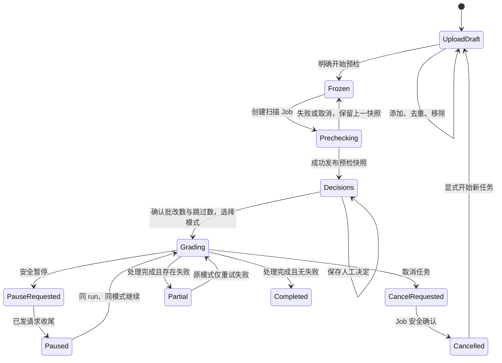

# P2-11 扫描预检、批改进度与失败恢复设计

**日期：** 2026-07-16  
**状态：** 用户方向已确认，允许进入实现  
**范围：** P2-11；不含 P2-12 下载、不切换生产 UI

## 1. 页面任务与边界

具体对象是 Windows 工作机上的任课教师；页面唯一任务是把“本场考试的扫描答卷”安全推进到“可暂停、可恢复、有清晰剩余量的批改运行”。它不是配置页、结果复核页或分析大屏。

必须保持的业务结果：

- 扫描文件属于明确考试，不能由浏览器指定服务器路径；
- 预检使用已确认模板和学生名单，输出自动匹配、异常卷、预计缺考、警告和页数；
- 低可信自动匹配可以改为明确学生，异常卷可以匹配、标无效或暂不处理；
- 未处理异常不交给 AI，但在教师看到跳过数量并确认后不阻塞其他答卷；
- 整卷与混合批改并列，二者算法和结果语义不变；
- 暂停停止派发新答卷，保存已发出请求结果，未开始项留待同一 run 恢复；
- 取消终结当前 Job，保留已完成结果，未完成项不计失败；取消后的同 run 不再从 Vue/API 恢复；
- 失败重试只处理失败项，并沿用产生这些失败的原模式；
- 刷新、浏览器关闭和进程重启后，页面从服务器记录恢复真实状态，不把“完成但有失败卷”显示为全成功。

不实现：扫描匹配算法调整、评分算法调整、批改模式重构、任意本机目录输入、数据库 Schema 迁移、报告/原卷下载、生产入口切换。

## 2. 业务能力与 UX 设计溯源表

| 业务能力 | 现有业务来源 | 必须保持 | 允许重新设计 | 本次 UX 方案 | 安全/失败边界 | 验证 |
|---|---|---|---|---|---|---|
| 多文件答卷接收 | `web_app.py::_save_uploaded_exam_files`、Scanner 输入测试 | PDF/JPG/JPEG/PNG，多文件属于当前考试 | 不复制旧 file uploader 即写磁盘的时机 | 可分批添加的上传队列，内容去重，预检前可移除/清空 | 不接收本机路径；大小、类型、摘要和会话复核；临时文件原子发布 | API + 浏览器临时目录 |
| PDF 标准页 | `scanner.render_pdf_to_standard_pages`、标准页测试 | PDF 成功后由标准页供后续扫描 | 渲染时机可由 Job 管理 | 上传保留受控源文件，预检 Job 内按现有规则渲染；冻结后输入不变 | 渲染失败保留队列与上一快照；不误删其他批次 | service/job 回归 |
| 上传批次冻结 | 用户 2026-07-16 决定、P2-10 不可变版本经验 | 预检使用固定内容集合 | 状态外观和阶段入口 | “待整理 → 已冻结”单向转换；新文件需要显式开始新队列 | 冻结后添加/删除/清空均 409；冻结摘要含文件数和总字节 | API 冲突 + 页面停写 |
| 扫描预检 | `backend/jobs/scan_analysis.py`、Scanner、旧 Streamlit | 模板/学生前置，自动匹配、异常、缺考、警告、页数 | 不复刻四指标加多个 expander | 当前阶段顶部给出可批改/需处理/预计缺考/总页数，下面按“需确认匹配/异常卷/已确认”分区 | Job 取消不覆盖上一成功快照；公开响应无路径 | Job/API/浏览器 |
| 低可信匹配纠正 | 旧 `_render_scan_precheck_panel`、`ScanAnalysis` | 教师可把低可信 group 重新绑定学生 | 选择控件和列表组织 | 高密度表格行内选择；改动进入人工决定草稿 | 学生必须属于当前学生库；revision 冲突不覆盖 | API + Vue store |
| 异常卷决定 | 旧 `_render_scan_precheck_panel`、`_apply_manual_decisions` | match / invalid / pending；缺反面匹配仍不进入批改 | 不逐卷用大 expander | 异常列表左侧证据缩略图、右侧决定；当前行展开查看受控正反面 | pending 不交 AI；invalid 明确跳过；受控媒体拒绝路径伪造 | API/media/browser |
| 启动前确认 | 用户 2026-07-16 决定、旧 UI 先预检后启动 | 教师知道正常数与跳过数 | 可改成单个确认摘要 | 模式卡片动作打开同一确认层：可批改、未处理异常、无效、缺反面、预计缺考 | 冻结 revision 或决定 revision 变化时 409，必须重新确认 | API + 浏览器 |
| 两种批改模式 | 旧 `render_grading_tab`、`GradingRunRequest`、用户决定 | full_paper / hybrid_batch 并列，语义不变 | 文案与布局 | 两个同宽模式区，同等层级，各有“开始”和有失败时“仅重试本模式失败” | 不能静默换模式；已有活动 run 时拒绝第二个 | API + view |
| 运行进度 | `GradingRunStore`、DB progress、Job progress | 已完成、在途、待处理、跳过、失败、冲突与阶段详情 | 不照搬旧日志大文本框 | 右侧持久运行账本 + 主区当前阶段；状态和计数同时表达 | Job 是执行状态，run ledger 是答卷进度真相；二者不一致时保守显示“中断，可处理” | service/API/browser |
| 安全暂停/恢复 | `GradingRunStore.request_pause/resume`、GradingService 测试 | 停止新派发，保存已发出结果，pending 留待恢复 | 控件位置、状态文案 | 运行中主操作为“安全暂停”；pause_requested 禁止重复；paused 显示同模式“继续批改” | 配置指纹或模式改变则不能恢复；失败不伪造已暂停 | API + restart simulation |
| 取消 | P1-11 Job 取消、GradingService cancellation、用户决定 | running 只在 handler 安全确认后 cancelled；已完成保留 | 可增加解释确认 | 二次确认明确“结束本次任务；以后创建新任务” | 记录该 run 已由 P2-11 取消；同 run 不再开放 resume；未完成恢复 pending 而非 failed | API + service + browser |
| 失败重试 | `failed_only`、`list_failed_papers*`、用户决定 | 只处理失败项、保留成功项 | 入口可按模式归组 | 失败摘要归到原 run 模式，只在对应模式区显示重试 | 服务端重核失败项与原模式，不信任浏览器传入模式 | API + retry regression |
| 刷新/重启恢复 | JobStore、restart E2E、run ledger | 浏览器不在时任务仍可恢复 | 不依赖仅浏览器 localStorage 的 Job id | 页面加载一个会话工作区投影，返回上传、预检、决定、Job、run 和建议动作 | 旧响应按 session/generation 丢弃；重启遗留 running 显示中断而非运行 | store + restart browser |

## 3. 根因与模块边界

### 3.1 深模块：`ScanGradingWorkspaceService`

新增一个面向 P2-11 的编排服务，隐藏磁盘 manifest、现有工作目录、ScanAnalysis 内部路径、Job 查询和 GradingRunStore 差异。路由只调用公开方法：

- `get_workspace(session_id)`
- `add_upload(session_id, filename, content_type, sha256, stream)`
- `remove_upload(session_id, upload_id)` / `clear_uploads(session_id)`
- `freeze_uploads(session_id, expected_revision)`
- `get_preflight(session_id)` / `save_decisions(session_id, expected_revision, decisions)`
- `grading_summary(session_id)` / `mark_cancelled_run(session_id, run_id, job_id)`

它不调用 LLM；长任务仍由 Job handlers 调用现有 scanner/grading service。

### 3.2 持久状态

不新增数据库 Schema。会话工作目录保存原子 JSON 投影：

- `scan_upload_batch.json`：`batch_id/revision/state/files/frozen_at`；文件项只保存内部相对资源 id、原始展示名、大小、MIME 和 SHA-256。
- `scan_analysis_latest.json`：沿用 Scanner 权威结果，内部可含 Path 字符串；绝不直接作为 API 响应。
- `scan_manual_decisions_latest.json`：沿用 Grading Job 输入列表。
- `scan_decisions_state.json`：`revision/analysis_identity/decisions/updated_at`，用于冲突和恢复。
- `grading_control_state.json`：只记录 P2-11 取消关联 `run_id/job_id/cancelled_at`，用于阻止把已取消 run 当成普通 paused 恢复；实际答卷计数仍来自数据库账本。

所有 manifest 使用同目录临时文件、flush 后 `os.replace`。上传字节先写随机 staging 文件，边写边计算 SHA-256、检查上限，再原子改名为内容寻址文件。失败清理 staging，不影响已发布队列。

### 3.3 真相优先级

1. 数据库 `grading_runs/grading_run_items`：答卷运行与明细进度。
2. JobStore：执行器是否 queued/running/failed/cancelled，以及安全取消是否已确认。
3. P2-11 控制投影：该 paused run 是否因教师“取消”而禁止继续。
4. 浏览器 Store：仅是当前会话视图，不证明服务器状态。

当 Job 与 run 不一致时：

- Job running + run running/pause_requested：显示实际运行；
- Job cancelled + run paused + P2-11 取消标记匹配：显示“已取消”，不提供继续；
- Job failed + run running/pause_requested：启动恢复清理后显示“任务中断”，保留账本计数，允许创建恢复动作；
- run paused 且无取消标记：显示“已暂停”，仅允许同 run、同配置指纹、同模式继续；
- run completed 但 failed > 0：显示“已处理，存在失败”，绝不显示全成功。

## 4. HTTP 契约草案

接口名称在首个 API RED 固定；请求都先 `_require_session`，写请求不自动重放。

### 4.1 工作区与上传

- `GET /api/sessions/{session_id}/grading-workspace`
  - 返回 readiness、upload batch、preflight summary、decision summary、active/recent Job、run summary、allowed actions。
- `POST /api/sessions/{session_id}/scan-uploads`
  - `application/octet-stream`；必需请求头：安全显示文件名、内容类型、SHA-256。
  - 201 新增；200 同内容已存在；413 超限；415 类型/魔数不符；409 已冻结。
- `DELETE /api/sessions/{session_id}/scan-uploads/{upload_id}`
- `DELETE /api/sessions/{session_id}/scan-uploads`
- `POST /api/sessions/{session_id}/scan-uploads/freeze`，body 携带 `expected_revision`。

公开文件项：`id/name/media_type/size_bytes/sha256_prefix/added_at`。不返回相对或绝对存储路径。

### 4.2 预检与决定

- `POST /api/sessions/{session_id}/scan/analyze`：沿用现有 URL，但 P2-11 请求不再接受 `exams_dir`；服务端只使用冻结批次目录，并在 Job payload 内部注入。
- `GET /api/sessions/{session_id}/scan/preflight`
- `PUT /api/sessions/{session_id}/scan/preflight/decisions`
  - `expected_revision` + 完整决定集合；服务端校验 issue/group id 和 student id。
- `GET /api/sessions/{session_id}/scan/preflight/media/{media_id}`
  - `media_id` 只能来自当前成功快照投影，响应 `Cache-Control: no-store`。

公开 group 只含 `id/source_label/detected_name/student_id/student_name/match_method/match_score/front_media_url/back_media_url`；issue 只含安全 id、类型、净化消息、建议学生和受控媒体 URL。缺考只含学生 id、姓名、学号、班级等现有公开学生字段。

### 4.3 批改运行

- `POST /api/sessions/{session_id}/grading/run`
  - 移除浏览器可用的 `exams_dir`；增加 `preflight_revision/decision_revision/confirm_pending_issues`。
  - 普通启动允许 `grading_mode`；`failed_only=true` 时浏览器不传模式，服务端从目标失败 run 决定原模式。
- `POST /api/sessions/{session_id}/grading/runs/{run_id}/pause`
- `POST /api/sessions/{session_id}/grading/runs/{run_id}/resume`
- 取消继续调用 `POST /api/jobs/{job_id}/cancel`，随后工作区投影只在 Job 确认 cancelled 后把关联 run 归类为取消；若写响应丢失，刷新可由 Job 终态补记。

运行摘要：`run_id/job_id/mode/state/progress/counts/started_at/updated_at/allowed_actions/recovery_reason`。`counts` 包含 `graded/grading/pending/skipped/failed/conflict/total`；状态集合是面向教师的投影，不直接暴露两个内部状态机的全部枚举。

## 5. 状态与动作



“开始新任务”不删除旧结果或旧账本，只建立新上传批次/预检身份；若复用同一冻结文件集合，需要显式复制为新批次身份，不能把取消的 run 偷换成恢复。

## 6. 页面信息架构

### 6.1 视觉第一稿

- 颜色：完全复用 `STYLE.md` 的应用灰、纸面白、边框灰、主蓝和语义绿/黄/红，不新增品牌色。
- 字体：复用 Inter + 中文系统无衬线；运行数字使用同字体的 tabular numerals，不引入装饰字体。
- 布局：左侧 176px 阶段轨，中间弹性主工作区，批改阶段右侧 300px 运行账本。
- 签名元素：“装订边运行轨”——像一叠待批答卷左侧的装订边，用四个真实阶段、数量和状态标记表达流程，不做装饰编号。

```text
┌ 批改执行 · 当前考试 ──────────────────────────────────────────┐
│ [考试切换/返回配置]  当前输入与恢复说明                         │
├──────────────┬──────────────────────────────┬───────────────┤
│ ● 上传  36   │ 当前阶段主区                  │ 运行账本       │
│ ● 预检  完成 │ 上传队列 / 预检列表 /          │ 模式、状态      │
│ ● 异常   4   │ 异常证据与决定 / 双模式启动    │ 计数、剩余      │
│ ○ 批改  待启 │                              │ 安全动作       │
└──────────────┴──────────────────────────────┴───────────────┘
```

### 6.2 自我批评与修订

第一稿若全程固定右侧账本，会在上传和预检阶段制造空白辅助栏，也会在 1024px 下压缩异常证据；这不是当前任务需要。修订为：

- 上传/预检/异常阶段采用“窄阶段轨 + 单一主区”；
- 只有存在 run 时才显示运行账本；1366px 以上为右栏，1024/1280px 置于主区顶部的紧凑条并可展开；
- 不用四张大卡表现阶段，阶段轨使用细分隔、文字和数量；
- 双模式区只在启动阶段出现，两块同宽、同层级，避免某模式因视觉主次被误认为推荐；
- 唯一审美风险保留在装订边运行轨：用轻微纸张分层线和稳定状态刻度建立阅卷语境，其余区域保持克制。

该修订避免常见“指标卡 + 渐变 + 大 Hero”模板，也没有借用 P2-08 固定三栏。

## 7. 交互细节

- 页面加载保留骨架结构，不整页闪空；各请求有 session generation，切换考试会取消旧请求。
- 上传逐文件显示校验、进度、成功/重复/失败；一个文件失败不回滚已成功文件。
- 冻结是普通确认，不使用危险红色；清空和取消任务使用二次确认。
- 预检列表默认先显示需要决定的行；“已确认”折叠但数量常驻。
- 异常决定未保存时离开页面提示；保存失败保留本地决定；409 停写并要求刷新比较。
- 启动确认不提供键盘快捷提交；两个模式各自按钮保持一致文案：“开始整卷批改”“开始混合批改”。
- `pause_requested` 文案为“正在安全暂停，等待已发出的请求返回”；此时不能继续或重复暂停。
- `cancel_requested` 不提前显示“已取消”；只有 Job 终态 confirmed 后显示。
- 所有状态有文字，颜色仅辅助；焦点环、原生表单、`prefers-reduced-motion` 和五档视口沿用视觉规范。

## 8. 错误与恢复文案原则

错误说明“发生了什么 + 当前数据是否保留 + 下一步”：

- 上传校验失败：“这个文件未加入队列；其他已上传文件不受影响。”
- 预检失败：“本次预检未发布；上一次成功结果仍保留。”
- 决定冲突：“另一页面已经更新异常处理；你的未保存选择仍保留，请刷新比较。”
- Job 状态暂时不可用：“无法更新任务状态；当前页面保留上次成功记录并继续重试。”
- 进程重启：“上次任务已中断；已完成答卷仍保留，可从剩余答卷继续处理。”
- 部分失败：“已处理 N 份，其中 M 份失败；成功结果已保留，可按原模式仅重试失败答卷。”

公开错误不包含路径、模型原始响应、学生答卷正文或内部异常堆栈。

## 9. 验证矩阵

| 场景 | API/服务 | Vue | 浏览器 |
|---|---:|---:|---:|
| 分批添加、内容去重、删除、清空、冻结 | 必测 | 必测 | 必测 |
| 非法类型/大小/摘要/路径、冻结后写入 | 必测 | 解码/提示 | 关键场景 |
| 预检正常、取消、失败保留上一快照 | 必测 | 必测 | 必测 |
| 低可信改绑、异常 match/invalid/pending、revision 冲突 | 必测 | 必测 | 必测 |
| 未处理异常启动确认与跳过 | 必测 | 必测 | 必测 |
| 两种模式并列启动 | 必测 | 必测 | 必测 |
| 暂停请求、暂停、同 run 恢复 | 必测 | 必测 | 必测 |
| 取消请求与确认终态、已完成保留 | 必测 | 必测 | 必测 |
| 部分失败、原模式重试、完成有失败不冒充成功 | 必测 | 必测 | 必测 |
| 刷新、浏览器关闭、进程重启模拟 | 必测 | 必测 | 必测 |
| 路径与敏感信息脱敏、媒体越界 | 必测 | 解码拒绝 | 必测 |
| 五档 Windows 桌面视口、键盘焦点、减少动效 | — | 组件 | 必测 |

所有写测试显式注入临时数据根、临时数据库和假 OCR/LLM；不读取或复制真实 `user_data/`，不调用真实模型。

## 10. 回退与停止

- 撤销 P2-11 功能提交即可恢复到旧 Streamlit 批改页；旧页、Scanner、GradingService 和已有数据继续存在。
- 回退不删除 P2-11 已上传文件、预检快照、运行账本或评分结果；需要清理由后续明确的受保护操作处理。
- 若无需数据库迁移不能可靠表达用户确认的取消语义，先停止并报告，不在本包偷偷改变 Schema。
- 若现有评分/匹配算法与已确认 UX 发生业务冲突，按业务来源优先并停止请求用户决定。
